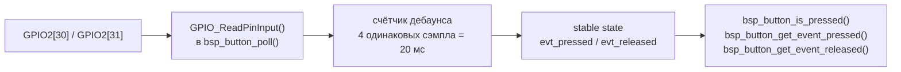

# bsp_button — тактовые кнопки (SWT6x6)

Чтение двух тактовых кнопок с программным дебаунсом. Предоставляет мгновенное
сырое чтение, стабильное состояние и одноразовые события нажатия/отпускания.

---

## Аппаратура

| Идентификатор  | Сигнал   | Пин MCU    | Корпус | GPIO      | Нажатие |
| -------------- | -------- | ---------- | ------ | --------- | ------- |
| `BSP_BUTTON_1` | TactBut1 | GPIO_B1_14 | C14    | GPIO2[30] | LOW     |
| `BSP_BUTTON_2` | TactBut2 | GPIO_B1_15 | B14    | GPIO2[31] | LOW     |

Пины настроены в `BOARD_InitPins()` как INPUT с гистерезисом, без внутренней
подтяжки (`0x0100B0`) — внешний pull-up к 3V3. `bsp_button_init()` не трогает
GPIO — только сбрасывает внутреннее состояние модуля.

---

## Архитектура



- **Polling** — `bsp_button_poll()` вызывается каждые 5 мс. Без прерываний.
- **Дебаунс** — 4 одинаковых сэмпла подряд (`BUTTON_DEBOUNCE_SAMPLES = 4`,
  4 × 5 мс = 20 мс). Глитч сбрасывает счётчик.
- **События** — одноразовые флаги `evt_pressed`/`evt_released`, сбрасываются
  при первом обращении через `get_event_*()`.

---

## API

```c
void bsp_button_init(void);
void bsp_button_poll(void);                          /* вызывать каждые 5 мс */

bool bsp_button_read(bsp_button_t btn);              /* сырое чтение без дебаунса */
bool bsp_button_is_pressed(bsp_button_t btn);        /* стабильное состояние */
bool bsp_button_get_event_pressed(bsp_button_t btn); /* одноразовое, сбрасывается при чтении */
bool bsp_button_get_event_released(bsp_button_t btn);
```

---

## Быстрый старт

```c
#include "bsp/button.h"

/* После board_hw_init(): */
bsp_button_init();

/* bare-metal — вызывать каждые 5 мс из tick-коллбэка: */
bsp_button_poll();

/* В main loop: */
if (bsp_button_get_event_pressed(BSP_BUTTON_1)) {
    /* однократное срабатывание по нажатию */
}

if (bsp_button_is_pressed(BSP_BUTTON_2)) {
    /* кнопка удерживается */
}
```

**Startup check (bootloader) — сырое чтение до инициализации:**

```c
/* До bsp_button_init(), сразу после board_hw_init(): */
if (bsp_button_read(BSP_BUTTON_1)) {
    /* удерживается при старте → режим обновления */
}
```

---

## Тестирование

### Host unit-тесты

Категория **B** — `button.c` вызывает `GPIO_ReadPinInput()` из `fsl_gpio.h`.
SDK-функция мокируется через fff. Stub `fsl_gpio.h` в `tests/host/mocks/`.

```bash
just build::test-host   # покрытие: init, дебаунс нажатия/отпускания,
                        # потребление событий, сброс при глитче, независимость кнопок
```

### HIL-тест (интерактивный)

Оператор нажимает кнопки вручную по подсказкам. Не входит в `hil-run`.

```bash
just host::hil-button
```

C-прошивка: `tests/target/hil_button/` — CLI через `bsp_uart_host`.
pytest: `tools/hil/04_test_button.py` — помечен `@pytest.mark.interactive`.

| Команда         | Ответ     | Описание                              |
| --------------- | --------- | ------------------------------------- |
| `PING`          | `PONG`    | Проверка канала                       |
| `READ <idx>`    | `1` / `0` | Сырое состояние без дебаунса          |
| `STATE <idx>`   | `1` / `0` | Стабильное состояние после дебаунса   |
| `EVENT_P <idx>` | `1` / `0` | `get_event_pressed`, сбрасывает флаг  |
| `EVENT_R <idx>` | `1` / `0` | `get_event_released`, сбрасывает флаг |

---

## Интеграция

```c
/* FreeRTOS — из задачи: */
vTaskDelay(pdMS_TO_TICKS(5));
bsp_button_poll();
if (bsp_button_get_event_pressed(BSP_BUTTON_1)) {
    xQueueSend(btn_queue, &btn_event, 0);
}
```

Логика длинного/короткого нажатия намеренно не реализована в BSP —
это зона ответственности `button_handler` в `tft_app`:

```bash
bsp_button → button_handler → app (меню, навигация)
```

`button_handler` хранит `press_start_ms`, вызывает коллбэк с типом
`SHORT_PRESS` / `LONG_PRESS` / `REPEAT`. Не зависит от железа — тестируется
на хосте как категория A.

---

## CMake

```cmake
target_link_libraries(firmware_test PRIVATE
    bsp_board
    bsp_tick
    bsp_button
)
```

**Зависимости модуля:**

| Зависимость  | Тип     | Описание                                     |
| ------------ | ------- | -------------------------------------------- |
| `bsp_status` | PUBLIC  | `bsp_status_t` в публичном API               |
| `bsp_board`  | PRIVATE | Транзитивно: `pin_mux.h`, clock, SDK headers |
| `sdk_gpio`   | PRIVATE | `fsl_gpio.h` — `GPIO_ReadPinInput()`         |
