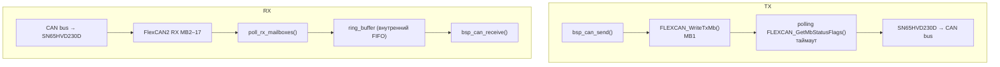

# bsp_can — FlexCAN2 (CAN 2.0)

Приём и передача CAN 2.0 фреймов через FlexCAN2 (трансивер SN65HVD230D,
разъём P1 контакты 3–4). Применяется для обмена с управляющими модулями
по CAN-шине: приём команд, отправка откликов.

---

## Аппаратура

| Сигнал  | Пин MCU       | Корпус | Интерфейс   | Примечание                  |
| ------- | ------------- | ------ | ----------- | --------------------------- |
| CAN2_TX | GPIO_AD_B0_14 | H14    | FlexCAN2 TX | Трансивер SN65HVD230D, P1/3 |
| CAN2_RX | GPIO_AD_B0_15 | L10    | FlexCAN2 RX | Трансивер SN65HVD230D, P1/4 |

Пины настроены в `BOARD_InitPins()` (`generated/pin_mux.c`).

**Распределение Message Buffers:**

| MB   | Назначение                                         |
| ---- | -------------------------------------------------- |
| 0    | Зарезервирован (ERR005829 workaround: inactive TX) |
| 1    | TX — отправка фреймов                              |
| 2–17 | RX — до 16 индивидуальных фильтров                 |

ERR005829 — errata FlexCAN на i.MX RT1050/1052: при гонке TX/RX арбитража
MB 0 может зависнуть. Workaround: MB 0 всегда `kFLEXCAN_TxMbInactive`.

---

## Архитектура



- **TX** — blocking polling с таймаутом. Worst case при 500 kbit/s — ~260 мкс на фрейм.
- **RX** — polling без прерываний. `bsp_can_receive()` опрашивает все активные
  RX MB, складывает фреймы в ring buffer, возвращает первый доступный.
- **Singleton** — один экземпляр, одна CAN-шина.

---

## API

```c
bsp_status_t bsp_can_init(const bsp_can_config_t *p_cfg);

bsp_status_t bsp_can_send(const bsp_can_frame_t *p_frame, uint32_t timeout_ms);
bsp_status_t bsp_can_receive(bsp_can_frame_t *p_frame, uint32_t timeout_ms);

bsp_status_t bsp_can_set_filter(uint8_t idx, uint32_t id,
                                uint32_t mask, bool is_extended);
bsp_status_t bsp_can_accept_all(void);

bsp_status_t bsp_can_register_rx_callback(bsp_can_rx_callback_t cb, void *p_ctx);
```

**Коды возврата `bsp_can_send()`:**

| Код               | Условие                          |
| ----------------- | -------------------------------- |
| `BSP_OK`          | Фрейм успешно отправлен          |
| `BSP_ERR_BUSY`    | TX MB занят предыдущей передачей |
| `BSP_ERR_TIMEOUT` | Истёк `timeout_ms`               |
| `BSP_ERR_PARAM`   | Невалидные параметры             |

**Коды возврата `bsp_can_receive()`:**

| Код               | Условие              |
| ----------------- | -------------------- |
| `BSP_OK`          | Фрейм получен        |
| `BSP_ERR_TIMEOUT` | Истёк `timeout_ms`   |
| `BSP_ERR_PARAM`   | Невалидные параметры |

`bsp_can_register_rx_callback()` в текущей версии возвращает
`BSP_ERR_NOT_SUPPORTED` — API заложен для будущей интеграции с FreeRTOS
(ISR → `xQueueSendFromISR`).

---

## Быстрый старт

```c
#include "bsp/can.h"

/* После board_hw_init() + bsp_tick_init(): */
bsp_can_config_t cfg = { .bitrate = 500000U };
bsp_can_init(&cfg);

/* Принимать все фреймы */
bsp_can_accept_all();

/* TX — blocking, таймаут 500 мс */
bsp_can_frame_t tx = {
    .id = 0x123, .dlc = 4, .is_extended = false,
    .data = {0xDE, 0xAD, 0xBE, 0xEF}
};
bsp_can_send(&tx, 500);

/* RX — polling, таймаут 100 мс */
bsp_can_frame_t rx;
if (bsp_can_receive(&rx, 100) == BSP_OK) {
    /* обработать rx.id, rx.data[0..rx.dlc-1] */
}
```

**Фильтрация:**

```c
/* STD ID 0x200 — точное совпадение */
bsp_can_set_filter(0, 0x200, 0x7FF, false);

/* STD ID 0x300–0x30F */
bsp_can_set_filter(1, 0x300, 0x7F0, false);

/* EXT ID 0x1ABCDEF0 */
bsp_can_set_filter(2, 0x1ABCDEF0, 0x1FFFFFFF, true);
```

Каждый фильтр занимает один RX MB. Максимум 16 фильтров (`BSP_CAN_FILTER_MAX`).
`bsp_can_accept_all()` настраивает два MB (STD + EXT с маской 0),
деактивирует остальные.

---

## Тестирование

### Host unit-тесты

Категория **B** — `bsp_can.c` вызывает `fsl_flexcan.h`. SDK-функции мокируются
через fff. Stub `fsl_flexcan.h` в `tests/host/mocks/`.

```cmake
add_host_test(
    NAME    test_bsp_can
    SOURCES can/test_bsp_can.c
            ${PROJECT_SOURCE_DIR}/bsp/can/src/can.c
            ${PROJECT_SOURCE_DIR}/utils/ring_buffer/ring_buffer.c
    INCLUDES
            ${PROJECT_SOURCE_DIR}/bsp/can/include
            ${PROJECT_SOURCE_DIR}/bsp/common/include
            ${PROJECT_SOURCE_DIR}/utils/ring_buffer
    MOCKS   ${BSP_MOCKS_DIR}
)
```

**Humble Object** — fff-заглушки для потребителей в `bsp/can/mocks/`:

```c
#include "can_mocks.h"

void setUp(void) { CAN_MOCK_RESET_ALL(); }

void test_protocol_sends_response(void) {
    bsp_can_send_fake.return_val = BSP_OK;
    /* ... */
    TEST_ASSERT_EQUAL(1, bsp_can_send_fake.call_count);
}
```

### HIL-тесты

C-прошивка: `tests/target/hil_can/` — CLI через `bsp_uart_host`.
pytest: `tools/hil/03_test_can.py` — CAN-адаптер на M5Stack с CAN-модулем.

```bash
just host::hil-can
```

---

## Интеграция

Модуль работает в обоих контекстах без изменений:

| Контекст                      | TX                           | RX                                    |
| ----------------------------- | ---------------------------- | ------------------------------------- |
| bare-metal (`firmware/test`)  | `bsp_can_send()` — blocking  | `bsp_can_receive()` — polling         |
| FreeRTOS (`firmware/tft_app`) | `bsp_can_send()` — из задачи | `bsp_can_receive()` из задачи с yield |

Для FreeRTOS с минимальной латентностью — будущий callback + `xQueueSendFromISR()`.

---

## CMake

```cmake
# firmware/test/CMakeLists.txt
target_link_libraries(firmware_test PRIVATE
    bsp_board
    bsp_tick
    bsp_can
)
```

**Зависимости модуля:**

| Зависимость    | Тип     | Описание                               |
| -------------- | ------- | -------------------------------------- |
| `bsp_status`   | PUBLIC  | `bsp_status_t` в публичном API         |
| `bsp_tick`     | PRIVATE | `bsp_tick_get_ms()` для таймаутов      |
| `ring_buffer`  | PRIVATE | Внутренний RX FIFO                     |
| `sdk_flexcan`  | PRIVATE | `fsl_flexcan.h` — FlexCAN2 SDK драйвер |
| `clock_config` | PRIVATE | `BOARD_BOOTCLOCKRUN_CAN_CLK_ROOT`      |
