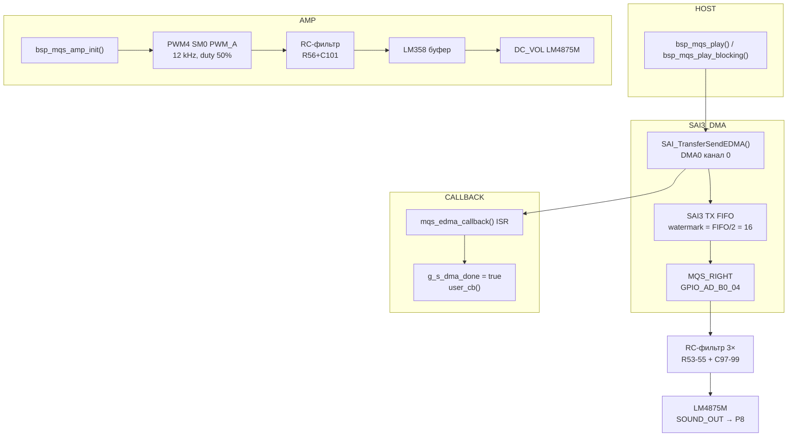

# bsp_mqs — MQS аудио-выход (SAI3 + eDMA + LM4875M)

Воспроизведение PCM16 аудио через MQS-периферию MIMXRT1052CVJ5B.
Физический выход — один канал (`MQS_RIGHT`, `GPIO_AD_B0_04`); SAI3 требует
стерео-буфер — оба канала буфера всегда идентичны.
Управление коэффициентом усиления — FlexPWM4 SM0 PWM_A (`GPIO_AD_B1_08`)
через RC-фильтр и буферный ОУ LM358 на вход `DC_VOL` усилителя LM4875M.

---

## Аппаратура

### MQS / SAI3

| Сигнал    | Пин MCU       | Корпус | Интерфейс | Примечание                                            |
| --------- | ------------- | ------ | --------- | ----------------------------------------------------- |
| MQS_RIGHT | GPIO_AD_B0_04 | F11    | MQS RIGHT | Выход SAI3 TX, мультиплексирован в `BOARD_InitPins()` |

### Усилитель LM4875M

| Сигнал        | Пин MCU       | Корпус | Интерфейс   | Примечание                                 |
| ------------- | ------------- | ------ | ----------- | ------------------------------------------ |
| VolumeControl | GPIO_AD_B1_08 | H13    | PWM4 A, SM0 | Управление DC_VOL усилителя через ОУ LM358 |

**Сигнальный тракт:**

```bash
MQS_RIGHT → R53+C97 → R54+C98 → R55+C99 → SOUND_OUT → C100 → LM4875M -Vin
GPIO_AD_B1_08 (PWM4_A) → R56 (1K) → LM358 +IN1 → R57 (1K) → LM4875M DC_VOL
```

RC-фильтр на сигнальном пути: три каскада R=2.4 кОм, C=0.1 мкФ (τ = 240 мкс каждый).
RC-фильтр на DC_VOL: R56 (1 кОм) + C101 (1 мкФ), τ = 1 мс.
`HP_SEN` LM4875M подтянут к GND — усилитель включается автоматически при
наличии сигнала на входе.

---

## Тактирование

### SAI3 / MQS

```bash
Audio PLL = 24 MHz × (30 + 66/625) = 722.534 MHz
SAI3_CLK_ROOT = Audio PLL / 8 / 8 = 11 289 600 Hz
                (kCLOCK_Sai3Mux=2, Sai3PreDiv=7, Sai3Div=7)

BCLK  = 44100 × 16 бит × 2 канала = 1 411 200 Hz
Делитель MCLK = 11 289 600 / 1 411 200 = 8 (точно)

MQS_MCLK = SAI3_CLK_ROOT / 64 / (3+1) = 11 289 600 / 256 = 44 100 Hz
            (Oversample=64, CLK_DIV=3, выставляется в bsp_mqs_init())
```

### FlexPWM4 (усилитель)

```bash
IPG clock = AHB / 4 = 600 / 4 = 150 MHz
PWM clock = IPG / 16 = 9.375 MHz        (Prescale_Divide_16)
Fpwm      = 9 375 000 / 586 / 2 = 12 000 Hz  (SignedCenterAligned)
```

Тактирование настраивается в `BOARD_BootClockRUN()` (`generated/clock_config.c`).
`bsp_mqs_init()` и `bsp_mqs_amp_init()` только открывают clock gates —
PLL и делители не трогают.

---

## Архитектура



- **TX** — `SAI_TransferSendEDMA()`. DMA0 канал 0 зарезервирован за `bsp_mqs`.
- **Blocking** — polling флага `g_s_dma_done` (взводится из ISR).
- **Async** — колбэк `bsp_mqs_done_cb_t` из ISR-контекста.
- **Singleton** — один экземпляр, один DMA-канал.

---

## API

```c
/* SAI3 + eDMA + MQS */
bsp_status_t bsp_mqs_init(void);
void         bsp_mqs_deinit(void);

bsp_status_t bsp_mqs_play(const int16_t *p_buf, size_t n_frames,
                           bsp_mqs_done_cb_t cb, void *p_user);
bsp_status_t bsp_mqs_play_blocking(const int16_t *p_buf, size_t n_frames);

void bsp_mqs_stop(void);
bool bsp_mqs_is_busy(void);

/* Усилитель LM4875M (PWM4) */
bsp_status_t bsp_mqs_amp_init(void);
void         bsp_mqs_amp_set_volume(uint8_t percent);
void         bsp_mqs_amp_deinit(void);
```

**Коды возврата `bsp_mqs_play()` / `bsp_mqs_play_blocking()`:**

| Код               | Условие                                |
| ----------------- | -------------------------------------- |
| `BSP_OK`          | Передача запущена / завершена          |
| `BSP_ERR_BUSY`    | Предыдущая передача ещё не завершена   |
| `BSP_ERR_INVALID` | `p_buf == NULL` или `n_frames == 0`    |
| `BSP_ERR_HW`      | `SAI_TransferSendEDMA()` вернул ошибку |

**Коды возврата `bsp_mqs_amp_init()`:**

| Код          | Условие                                         |
| ------------ | ----------------------------------------------- |
| `BSP_OK`     | PWM4 настроен и запущен                         |
| `BSP_ERR_HW` | `PWM_Init()` или `PWM_SetupPwm()` вернул ошибку |

---

## Параметры аудио-потока

| Параметр              | Значение               |
| --------------------- | ---------------------- |
| Частота дискретизации | 44 100 Гц              |
| Разрядность           | 16 бит (signed PCM)    |
| Каналы в буфере       | 2 (stereo interleaved) |
| Байт на фрейм         | 4 (L + R, по 2 байта)  |
| DMA канал             | DMA0 канал 0           |
| DMAMUX source         | `kDmaRequestMuxSai3Tx` |
| FIFO watermark        | 16 слов (FIFO/2)       |

---

## Быстрый старт

```c
#include "bsp/mqs.h"

/* Буфер — в некэшируемой памяти, выровнен по 4 байтам */
#define N_FRAMES (44100U)   /* 1 секунда стерео */
static AT_NONCACHEABLE_SECTION_ALIGN(int16_t buf[N_FRAMES * BSP_MQS_CHANNELS], 4U);

/* После board_hw_init() + bsp_tick_init(): */

/* 1. Усилитель — первым, до MQS */
bsp_mqs_amp_init();
bsp_delay(300);            /* дать C103/C105 LM4875M зарядиться */

/* 2. SAI3 + DMA + MQS */
bsp_mqs_init();

/* 3. Заполнить буфер */
for (size_t i = 0; i < N_FRAMES; i++) {
    int16_t s = /* ваш сэмпл */;
    buf[i * 2 + 0] = s;   /* L */
    buf[i * 2 + 1] = s;   /* R */
}

/* 4a. Синхронное воспроизведение (firmware_test) */
bsp_mqs_play_blocking(buf, N_FRAMES);

/* 4b. Асинхронное воспроизведение (tft_app) */
static volatile bool done;
static void on_done(void *p) { done = true; }
done = false;
bsp_mqs_play(buf, N_FRAMES, on_done, NULL);
while (!done) { /* keepalive */ }

/* Регулировка громкости: 0–100% */
bsp_mqs_amp_set_volume(75U);
```

**Формат буфера:**

```bash
buf[0] = L0, buf[1] = R0,   /* фрейм 0 */
buf[2] = L1, buf[3] = R1,   /* фрейм 1 */
...
```

Физически выводится только `MQS_RIGHT` — левый и правый каналы должны
быть идентичны.

---

## Ограничения и требования

- Буфер обязан находиться в **некэшируемой памяти** (`AT_NONCACHEABLE_SECTION_ALIGN`)
  или кэш должен быть явно вычищен перед вызовом `bsp_mqs_play()`.
- Одновременно может воспроизводиться **только один буфер**. Повторный вызов
  до завершения вернёт `BSP_ERR_BUSY`.
- `bsp_mqs_amp_init()` вызывать **до** `bsp_mqs_init()` и до первого `bsp_mqs_play()`.
- Поле `pwmchannelenable = true` в `pwm_signal_param_t` **обязательно** для
  новых версий NXP SDK — без него `PWM_SetupPwm()` не устанавливает `OUTEN`
  и ШИМ не выходит на пин.
- `bsp_mqs_play_blocking()` крутит polling-цикл. Не вызывать из ISR.
- В длинных тест-функциях вызывать `bsp_usb_cdc_poll()` каждые ~4 KB
  для поддержания USB живым.
- DMA0 канал 0 зарезервирован за `bsp_mqs`. Остальные модули — каналы 1+.

---

## Известные особенности SDK

**`pwmchannelenable` (критично):** в NXP SDK начиная с версии 2.13+ структура
`pwm_signal_param_t` содержит поле `pwmchannelenable`. При инициализации
через designated initializers без явного указания этого поля оно равно `false`,
и `PWM_SetupPwm()` не устанавливает бит `OUTEN` → ШИМ не выходит на пин.
После отладочной сессии ошибка маскируется: отладчик оставляет `OUTEN`
установленным от предыдущего сеанса, и при software reset PWM работает.
Воспроизводится только при cold reset (power cycle).

**Fault disable mapping:** без явного вызова `PWM_SetupFaultDisableMap()`
регистр `DISA` после cold reset равен `0x0000`, и PWM может быть заблокирован
неинициализированными Fault1/2/3 входами. `bsp_mqs_amp_init()` явно вызывает
`PWM_SetupFaultDisableMap()` для всех четырёх fault-входов.

---

## CMake

```cmake
# firmware/test/CMakeLists.txt
target_link_libraries(firmware_test PRIVATE bsp_mqs)
```

**Зависимости модуля:**

| Зависимость    | Тип     | Описание                                    |
| -------------- | ------- | ------------------------------------------- |
| `bsp_status`   | PUBLIC  | `bsp_status_t` в публичном API              |
| `bsp_board`    | PUBLIC  | Транзитивно: `BOARD_*`, IOMUXC, clock gates |
| `sdk_sai_edma` | PRIVATE | `fsl_sai_edma.h` — SAI TX через eDMA        |
| `sdk_edma`     | PRIVATE | `fsl_edma.h` — DMA0 handle                  |
| `sdk_dmamux`   | PRIVATE | `fsl_dmamux.h` — маршрутизация DMA-запросов |
| `sdk_clock`    | PRIVATE | `fsl_clock.h` — clock gates                 |
| `sdk_pwm`      | PRIVATE | `fsl_pwm.h` — FlexPWM4 SM0 (усилитель)      |
| `sdk_xbara`    | PRIVATE | `fsl_xbara.h` — XBARA                       |

