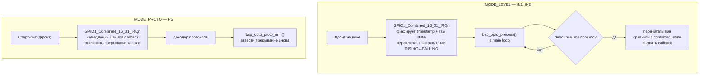

# bsp_opto — оптоизолированные входы (PS2801-4)

Три оптоизолированных входа на базе PS2801-4. Два канала (`IN1`, `IN2`)
предназначены для детектирования уровня с дебаунсом; третий (`RS`) —
для захвата старт-бита бинарного протокола с минимальной задержкой.

---

## Аппаратура

| Канал             | Сигнал | Пин MCU       | Корпус | GPIO      | Логика      |
| ----------------- | ------ | ------------- | ------ | --------- | ----------- |
| `BSP_OPTO_CH_IN1` | ExtIn1 | GPIO_AD_B1_06 | J12    | GPIO1[22] | active-HIGH |
| `BSP_OPTO_CH_IN2` | ExtIn2 | GPIO_AD_B1_05 | K12    | GPIO1[21] | active-HIGH |
| `BSP_OPTO_CH_RS`  | RsRx   | GPIO_AD_B1_07 | K10    | GPIO1[23] | active-HIGH |

PS2801-4 неинвертирующие: пин HIGH (ток есть) → `BSP_OPTO_STATE_ACTIVE`.

Все три пина принадлежат GPIO1[16..31] → один IRQ: `GPIO1_Combined_16_31_IRQn`.

`BSP_OPTO_CH_RS` — двойное назначение пина K10:

| Режим      | Функция       | pin_mux               |
| ---------- | ------------- | --------------------- |
| GPIO input | `bsp_opto`    | `BOARD_InitRS_GPIO()` |
| LPUART3 RX | `bsp_uart_rs` | `BOARD_InitRS_UART()` |

Одновременное использование невозможно. `rs_as_gpio = true` в конфигурации
активирует канал RS; `false` — пин остаётся под LPUART3.

---

## Архитектура



- **MODE_LEVEL**: callback вызывается из контекста **main loop** — после подтверждения дебаунсом.
- **MODE_PROTO**: callback вызывается **прямо из ISR** — только атомарные операции.
- После срабатывания канал RS автоматически отключается; повторный вызов
  `bsp_opto_proto_arm()` обязателен, иначе канал остаётся неактивным.

---

## API

```c
bsp_status_t     bsp_opto_init(const bsp_opto_config_t *p_cfg);
void             bsp_opto_process(void);   /* вызывать из main loop */
bsp_opto_state_t bsp_opto_read(bsp_opto_ch_t ch);
bsp_status_t     bsp_opto_proto_arm(bsp_opto_ch_t ch);
bsp_opto_state_t bsp_opto_force_read(bsp_opto_ch_t ch);
```

- `bsp_opto_read()` всегда возвращает `BSP_OPTO_STATE_INACTIVE` для каналов
в `MODE_PROTO` — используй `GPIO_PinRead` напрямую при побитовом сэмплировании.
- `bsp_opto_force_read()` синхронно читает пин напрямую, обновляет
`confirmed_state` и сбрасывает `pending`. Используется в тестах после
гарантированной стабилизации сигнала — когда дебаунс уже отработал,
но `confirmed_state` мог не обновиться из-за чётного числа ISR при дребезге реле.

---

## Быстрый старт

### MODE_LEVEL (IN1, IN2)

```c
#include "bsp/opto.h"

static void on_level_change(bsp_opto_ch_t ch, bsp_opto_state_t state)
{
    if (ch == BSP_OPTO_CH_IN1 && state == BSP_OPTO_STATE_ACTIVE) { /* ... */ }
}

bsp_opto_config_t cfg = {
    .callbacks   = { on_level_change, on_level_change, NULL },
    .modes       = { BSP_OPTO_MODE_LEVEL, BSP_OPTO_MODE_LEVEL, BSP_OPTO_MODE_LEVEL },
    .edges       = { BSP_OPTO_EDGE_RISING, BSP_OPTO_EDGE_RISING, BSP_OPTO_EDGE_RISING },
    .rs_as_gpio  = false,
    .debounce_ms = 10U,
};
bsp_opto_init(&cfg);

for (;;) {
    bsp_opto_process();
}
```

### MODE_PROTO (RS) совместно с MODE_LEVEL (IN1, IN2)

```c
static volatile bool s_start_bit = false;

/* Вызывается из ISR — только volatile-запись */
static void on_rs_start_bit(bsp_opto_ch_t ch, bsp_opto_state_t state)
{
    s_start_bit = true;
}

bsp_opto_config_t cfg = {
    .callbacks   = { on_level_change, on_level_change, on_rs_start_bit },
    .modes       = { BSP_OPTO_MODE_LEVEL, BSP_OPTO_MODE_LEVEL, BSP_OPTO_MODE_PROTO },
    .edges       = { BSP_OPTO_EDGE_RISING, BSP_OPTO_EDGE_RISING, BSP_OPTO_EDGE_RISING },
    .rs_as_gpio  = true,
    .debounce_ms = 10U,
};
bsp_opto_init(&cfg);

for (;;) {
    bsp_opto_process();

    if (s_start_bit) {
        s_start_bit = false;
        /* запустить декодер... */
        bsp_opto_proto_arm(BSP_OPTO_CH_RS);  /* взвести для следующего старт-бита */
    }
}
```

---

## Тестирование

### Host unit-тесты

Категория **B** — `bsp_opto.c` вызывает `fsl_gpio.h`. SDK-функции мокируются
через fff. Stub `fsl_gpio.h` в `tests/host/mocks/`.

```bash
just build::test-host   # покрытие: init, MODE_LEVEL debounce, MODE_PROTO arm/disarm
```

### HIL-тесты

C-прошивка: `tests/target/hil_opto/` — CLI через `bsp_uart_host`.
pytest: `tools/hil/02_test_opto.py` — управление входами через M5StampPLC RLY2–4.

```bash
just host::hil-opto
```

---

## CMake

```cmake
target_link_libraries(firmware_test PRIVATE
    bsp_board
    bsp_tick
    bsp_opto
)
```

**Зависимости модуля:**

| Зависимость  | Тип     | Описание                                     |
| ------------ | ------- | -------------------------------------------- |
| `bsp_status` | PUBLIC  | `bsp_status_t` в публичном API               |
| `bsp_tick`   | PRIVATE | `bsp_tick_get_ms()` для дебаунс-таймаута     |
| `bsp_board`  | PRIVATE | Транзитивно: `pin_mux.h`, clock, SDK headers |
| `sdk_gpio`   | PRIVATE | `fsl_gpio.h` — GPIO IRQ, `GPIO_PinRead()`    |
