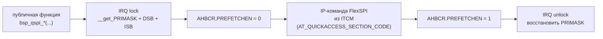

# bsp_qspi_flash — QSPI Flash W25Q64/128/256/512

Драйвер QSPI Flash на FlexSPI1 с поддержкой четырёх чипов Winbond.
XIP-безопасен: все функции, трогающие FlexSPI IP-регистры, размещены в ITCM
и выполняются под IRQ lock.

---

## Аппаратура

| Параметр      | Значение          |
| ------------- | ----------------- |
| Интерфейс MCU | FlexSPI1, порт A1 |

**Поддерживаемые чипы:**

| Чип     | JEDEC mfr | JEDEC cap | Размер | Адресация |
| ------- | --------- | --------- | ------ | --------- |
| W25Q64  | `0xEF`    | `0x17`    | 8 MB   | 3-byte    |
| W25Q128 | `0xEF`    | `0x18`    | 16 MB  | 3-byte    |
| W25Q256 | `0xEF`    | `0x19`    | 32 MB  | 4-byte    |
| W25Q512 | `0xEF`    | `0x20`    | 64 MB  | 4-byte    |

---

## Архитектура

### XIP-безопасность

Прошивка исполняется XIP из Flash по AHB. Любая IP-команда FlexSPI блокирует
AHB-путь — если в этот момент CPU фетчит инструкцию из Flash, происходит
**HardFault**.

Решение — два уровня защиты:



**ITCM** (`0x00000000`) подключён к CPU по выделенной шине — фетч инструкций
не конкурирует с AHB. **IRQ lock** гарантирует, что прерывание не застанет
FlexSPI в середине IP-транзакции; `PRIMASK` восстанавливается, не сбрасывается
безусловно — вызов из уже заблокированного контекста корректен.

**Обязательный дефайн в CMakeLists потребителя:**

```cmake
target_compile_definitions(firmware_test PRIVATE
    __STARTUP_INITIALIZE_RAMFUNCTION   # ← без этого ITCM содержит нули → HardFault
    __STARTUP_CLEAR_BSS
)
```

### Адресация W25Q256/512

Вместо `Enter 4-Byte Mode (0xB7)` используются dedicated 4-byte opcodes — XIP-слот 0
(24-bit адресация) не изменяется:

| Операция         | W25Q64/128 | W25Q256/512 |
| ---------------- | ---------- | ----------- |
| Sector Erase 4KB | `0x20`     | `0x21`      |
| Block Erase 32KB | `0x52`     | `0x5C`      |
| Block Erase 64KB | `0xD8`     | `0xDC`      |
| Quad Page Prog   | `0x32`     | `0x34`      |
| IP Quad Out Read | `0x6B`     | `0x6C`      |

---

## API

```c
/* Инициализация — вызвать до bsp_tick_init() */
bsp_status_t bsp_qspi_init(void);

/* Идентификация */
bsp_status_t bsp_qspi_read_jedec_id(bsp_qspi_jedec_t *p_jedec);
uint32_t     bsp_qspi_flash_size(void);   /* доступно после init() */

/* Стирание */
bsp_status_t bsp_qspi_erase_sector(uint32_t addr);      /* 4 KB,  ~45 мс  */
bsp_status_t bsp_qspi_erase_block_32k(uint32_t addr);   /* 32 KB, ~120 мс */
bsp_status_t bsp_qspi_erase_block_64k(uint32_t addr);   /* 64 KB, ~150 мс */

/* Запись одной страницы (256 байт, адрес выровнен на BSP_QSPI_PAGE_SIZE) */
bsp_status_t bsp_qspi_write_page(uint32_t addr, const uint8_t *p_data);  /* ~3 мс */

/* Чтение через IP-команду (не AHB/XIP) */
bsp_status_t bsp_qspi_read(uint32_t addr, uint8_t *p_buf, size_t size);
```

Все функции возвращают `BSP_OK` или `BSP_ERR_HW`.

**Выбор операции стирания:**

| Объём        | Рекомендация       | Время          |
| ------------ | ------------------ | -------------- |
| < 32 KB      | `erase_sector` 4KB | ~45 мс × N     |
| 32 KB – 1 MB | `erase_block_32k`  | ~120 мс / 32KB |
| > 1 MB       | `erase_block_64k`  | ~150 мс / 64KB |

Пример: 4 MB через 64KB = 64 × 150 мс ≈ **9.6 с** против 46 с через 4KB.

---

## Быстрый старт

```c
#include "bsp/qspi_flash.h"

/* main.c — порядок инициализации: */
board_hw_init();
bsp_qspi_init();    /* ← до bsp_tick_init() */
bsp_tick_init();

/* Идентификация чипа */
bsp_qspi_jedec_t jedec;
bsp_qspi_read_jedec_id(&jedec);

/* Стереть сектор и записать страницу */
bsp_qspi_erase_sector(0x00010000);
uint8_t page[256] = { /* ... */ };
bsp_qspi_write_page(0x00010000, page);

/* Прочитать обратно */
uint8_t buf[256];
bsp_qspi_read(0x00010000, buf, sizeof(buf));
```

---

## CMake

```cmake
target_link_libraries(firmware_test PRIVATE bsp_qspi_flash)

target_compile_definitions(firmware_test PRIVATE
    __STARTUP_INITIALIZE_RAMFUNCTION
    __STARTUP_CLEAR_BSS
)
```

**Зависимости модуля:**

| Зависимость   | Тип     | Описание                             |
| ------------- | ------- | ------------------------------------ |
| `bsp_status`  | PUBLIC  | `bsp_status_t` в публичном API       |
| `bsp_board`   | PRIVATE | Транзитивно: clock, SDK headers      |
| `sdk_flexspi` | PRIVATE | `fsl_flexspi.h` — FlexSPI IP-команды |
