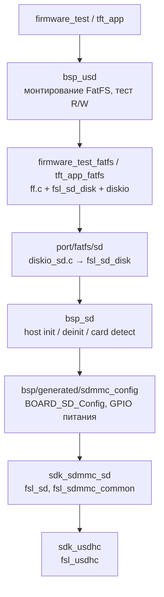

# bsp_sd — SD host-контроллер (USDHC1)

Инициализация SD host-контроллера и детект карты. Файловой системой не
занимается — это ответственность слоя `bsp_usd` / `port_fatfs_sd` поверх.

---

## Аппаратура

| Сигнал | Пин MCU       | Корпус | Конфигурация                                  |
| ------ | ------------- | ------ | --------------------------------------------- |
| CLK    | GPIO_SD_B0_01 | J3     | USDHC1_CLK, периферийный режим                |
| CMD    | GPIO_SD_B0_00 | J4     | USDHC1_CMD, периферийный режим                |
| D0     | GPIO_SD_B0_02 | J1     | USDHC1_DATA0, периферийный режим              |
| D1     | GPIO_SD_B0_03 | K1     | USDHC1_DATA1, периферийный режим              |
| D2     | GPIO_SD_B0_04 | H2     | USDHC1_DATA2, периферийный режим              |
| D3     | GPIO_SD_B0_05 | J2     | USDHC1_DATA3, периферийный режим              |
| CD_B   | GPIO_B1_12    | D13    | USDHC1_CD_B — детект через периферийный режим |
| SdPwr  | GPIO_AD_B1_03 | M12    | GPIO1[19], active-low                         |

**CD_B** подключён как периферийный сигнал USDHC1 — детект читается через
`USDHC_GetPresentStatusFlags` → `kUSDHC_CardInsertedFlag`. GPIO-прерывание
не используется (`kSD_DetectCardByHostCD`).

**SdPwr** инициализируется в `BOARD_SD_Config()` как GPIO-выход, выключен
при старте. SDK включает питание автоматически в `SD_HostInit()` через callback.

---

## Архитектура



**Почему `ff.c` и `fsl_sd_disk.c` не собираются как общая библиотека:**
оба включают `ffconf.h`, который разный для `firmware_test` (`FF_FS_REENTRANT=0`)
и `tft_app` (`FF_FS_REENTRANT=1`). Общий только `port_fatfs_sd` — он `ff.h`
напрямую не включает.

---

## API

```c
bsp_status_t bsp_sd_init(void);
bsp_status_t bsp_sd_deinit(void);
bool         bsp_sd_is_inserted(void);
```

**`bsp_sd_init()`** — конфигурирует SDMMC host однократно (`BOARD_SD_Config`)
и запускает host-контроллер (`SD_HostInit`). Повторный вызов без `deinit` — no-op,
возвращает `BSP_OK`.

**`bsp_sd_is_inserted()`** — читает регистр `USDHC1 PRSSTAT`. Не требует
предварительного `bsp_sd_init()` — включает тактирование через `CLOCK_EnableClock`.
Читает аппаратный регистр без дебаунса — добавляй дебаунс в вызывающем коде
при механическом детекте.

**Коды возврата:**

| Функция         | Код            | Условие                     |
| --------------- | -------------- | --------------------------- |
| `bsp_sd_init`   | `BSP_OK`       | Host готов к работе         |
| `bsp_sd_init`   | `BSP_ERR_INIT` | `SD_HostInit` вернул ошибку |
| `bsp_sd_deinit` | `BSP_OK`       | Всегда                      |

---

## Быстрый старт

```c
#include "bsp/sd.h"

if (!bsp_sd_is_inserted()) {
    /* карта отсутствует */
}

if (bsp_sd_init() != BSP_OK) {
    /* host не инициализирован */
}

/* работа с картой через FatFS... */

bsp_sd_deinit();
```

---

## CMake

```cmake
target_link_libraries(firmware_test PRIVATE bsp_sd)
```

**Зависимости модуля:**

| Зависимость        | Тип     | Описание                                        |
| ------------------ | ------- | ----------------------------------------------- |
| `bsp_status`       | PUBLIC  | `bsp_status_t` в публичном API                  |
| `bsp_sdmmc_config` | PRIVATE | `BOARD_SD_Config`, sdmmc_config.h, sdk_sdmmc_sd |

`sdk_sdmmc_sd` и `sdk_usdhc` — транзитивно через `bsp_sdmmc_config`.
