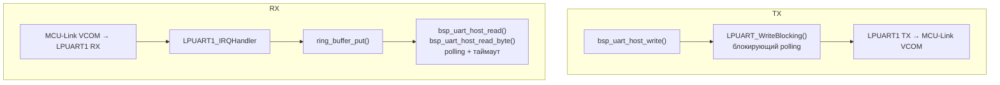

# bsp_uart_host — LPUART1 (MCU-Link VCOM)

Коммуникационный канал с хост-машиной через LPUART1 (разъём J2, MCU-Link VCOM).
Используется для HIL-тестов (pytest + pyserial), отладочного вывода и резервного
канала связи.

---

## Аппаратура

| Сигнал     | Пин MCU       | Корпус | Интерфейс  | Назначение     |
| ---------- | ------------- | ------ | ---------- | -------------- |
| LPUART1_TX | GPIO_AD_B0_12 | K14    | LPUART1 TX | MCU → MCU-Link |
| LPUART1_RX | GPIO_AD_B0_13 | L14    | LPUART1 RX | MCU-Link → MCU |

Пины настроены в `BOARD_InitPins()` (`generated/pin_mux.c`).

---

## Архитектура



- **TX** — `LPUART_WriteBlocking`. Пакеты короткие, задержка 1–2 мс приемлема.
- **RX** — ISR пишет в ring buffer; main loop читает с таймаутом.
- **ISR** — `LPUART1_IRQHandler` определён в модуле, владеет прерыванием целиком.
- **Singleton** — один экземпляр, один физический UART.

---

## API

```c
bsp_status_t bsp_uart_host_init(uint32_t baud);
void         bsp_uart_host_deinit(void);

bsp_status_t bsp_uart_host_write(const uint8_t *p_data, size_t len);
bsp_status_t bsp_uart_host_write_str(const char *p_str);

size_t  bsp_uart_host_read(uint8_t *p_buf, size_t len, uint32_t timeout_ms);
int32_t bsp_uart_host_read_byte(uint32_t timeout_ms);

size_t  bsp_uart_host_rx_available(void);   /* байт в RX-буфере прямо сейчас */
void    bsp_uart_host_rx_flush(void);       /* сбросить содержимое RX-буфера */
```

`bsp_uart_host_read()` возвращает фактически прочитанное количество байт —
частичное чтение при таймауте не является ошибкой.

```c
/* Неблокирующий опрос */
bsp_uart_host_read(buf, len, 0);

/* Ждать с таймаутом */
bsp_uart_host_read(buf, len, 100);

/* Ждать вечно */
bsp_uart_host_read(buf, len, BSP_UART_HOST_WAIT_FOREVER);
```

---

## Быстрый старт

```c
#include "bsp/uart_host.h"

/* После board_hw_init(): */
bsp_uart_host_init(115200);

/* TX */
bsp_uart_host_write_str("hello\r\n");

/* RX — ждать байт до 100 мс */
int32_t byte = bsp_uart_host_read_byte(100);
if (byte < 0) { /* таймаут */ }

/* RX — прочитать пакет */
uint8_t buf[64];
size_t n = bsp_uart_host_read(buf, sizeof(buf), 500);
```

---

## Тестирование

### Host unit-тесты (Humble Object)

Модуль предоставляет fff-заглушки в `bsp/uart_host/mocks/`. В тестовой сборке
вместо `uart_host.c` линкуется `mocks/uart_host_mock.c`.

```cmake
add_host_test(
    NAME    uart_host_mock_example
    SOURCES uart_host/test_uart_host.c
            ${CMAKE_SOURCE_DIR}/bsp/uart_host/mocks/uart_host_mock.c
    INCLUDES
            ${CMAKE_SOURCE_DIR}/bsp/uart_host/include
            ${CMAKE_SOURCE_DIR}/bsp/uart_host/mocks
            ${CMAKE_SOURCE_DIR}/bsp/common/include
)
```

```c
#include "bsp/uart_host_mock.h"

void setUp(void) { UART_HOST_MOCK_RESET_ALL(); }

void test_something(void) {
    bsp_uart_host_write_fake.return_val = BSP_OK;
    /* ... */
    TEST_ASSERT_EQUAL(1, bsp_uart_host_write_fake.call_count);
}
```

### HIL-тесты

C-прошивка: `tests/target/host_uart/` — CLI через LPUART1.
pytest: `tools/hil/01_test_uart.py` — PING/ECHO/BUF_SIZE через pyserial.

```bash
just host::hil-uart
```

---

## Интеграция

| Контекст   | TX                    | RX                             |
| ---------- | --------------------- | ------------------------------ |
| bare-metal | `write()` — blocking  | `read()` — polling с таймаутом |
| FreeRTOS   | `write()` — из задачи | `read()` — из задачи с yield   |

В FreeRTOS-режиме (`BSP_TICK_FREERTOS_MODE`) цикл ожидания добавляет
`vTaskDelay(1)` вместо busy-wait. `BSP_UART_HOST_IRQ_PRIORITY` должен быть
выше `configMAX_SYSCALL_INTERRUPT_PRIORITY` (числовое значение ниже).

---

## CMake

```cmake
target_link_libraries(firmware_test PRIVATE
    bsp_board
    bsp_tick
    bsp_uart_host
)
```

Конфигурация задаётся в CMakeLists.txt **потребителя**, не модуля:

```cmake
target_compile_definitions(firmware_test PRIVATE
    BSP_UART_HOST_RX_BUFFER_SIZE=256   # степень двойки
    BSP_UART_HOST_SRC_CLOCK_HZ=24000000
    BSP_UART_HOST_IRQ_PRIORITY=5
)
```

**Зависимости модуля:**

| Зависимость           | Тип     | Описание                          |
| --------------------- | ------- | --------------------------------- |
| `bsp_status`          | PUBLIC  | `bsp_status_t` в публичном API    |
| `bsp_tick`            | PRIVATE | `bsp_tick_get_ms()` для таймаутов |
| `utils` (ring_buffer) | PRIVATE | RX ring buffer                    |
| `sdk_lpuart`          | PRIVATE | `fsl_lpuart.h`, `fsl_clock.h`     |
