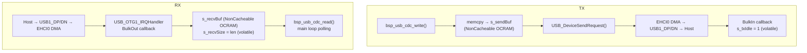

# bsp_usb_cdc — USB CDC ACM (Virtual COM Port)

USB CDC ACM device на USB1 (EHCI0). Хост видит устройство как виртуальный
COM-порт (`/dev/ttyACM*` на Linux/macOS, `COMx` на Windows). Используется
для передачи данных между платой и ПК: CLI команды, отладочные лог-каналы.
Работает параллельно с `bsp_uart_host` (LPUART1) — два независимых канала.

---

## Аппаратура

| Сигнал        | Пин MCU       | Назначение  |
| ------------- | ------------- | ----------- |
| USB_OTG1_DN   | USB_OTG1_DN   | USB1 Data−  |
| USB_OTG1_DP   | USB_OTG1_DP   | USB1 Data+  |
| USB_OTG1_VBUS | USB_OTG1_VBUS | VBUS detect |

Встроенный HS PHY (480 MHz PLL). Контроллер: EHCI0 (`kUSB_ControllerEhci0`).
Скорость: High-Speed (480 Mbit/s), fallback Full-Speed (12 Mbit/s).
PHY калибровка: `D_CAL=0x0C`, `TXCAL45DP=0x06`, `TXCAL45DM=0x06`.

**VID/PID**: `0x1996` / `0x00AD` (`usb_device_descriptor.h`) — тот же
идентификатор, что `tools/production/` (service-tui) использует для
детекта CDC-порта firmware_test (`SERVICE_CDC_VID`/`SERVICE_CDC_PID`).

---

## Архитектура



Все DMA-буферы размещены в секции `NonCacheable` (OCRAM `0x20200000`).
MPU region 9 настраивает эту область как Normal non-cacheable — записи CPU
видны DMA без `SCB_CleanDCache()`.

**Lite stack** — сознательное решение вместо full NXP class framework:

| Аспект          | Full stack            | Lite stack (наш выбор) |
| --------------- | --------------------- | ---------------------- |
| Class framework | `usb_device_class.h`  | Отсутствует            |
| Размер кода     | ~12 KB                | ~6 KB                  |
| Гибкость        | Multi-class composite | Один CDC ACM           |

Переход на full stack понадобится только при добавлении composite device (CDC + MSC).

---

## API

```c
bsp_status_t bsp_usb_cdc_init(void);
bool         bsp_usb_cdc_is_ready(void);
bool         bsp_usb_cdc_write_ready(void);

bsp_status_t bsp_usb_cdc_write(const uint8_t *p_data, size_t len);
size_t       bsp_usb_cdc_read(uint8_t *p_buf, size_t max_len);
void         bsp_usb_cdc_poll(void);   /* зарезервировано */
```

**`bsp_usb_cdc_is_ready()`** — `true` когда enumeration завершён **и** хост
открыл COM-порт (DTR установлен через `SET_CONTROL_LINE_STATE`).

**Коды возврата `bsp_usb_cdc_write()`:**

| Код                 | Условие                                    |
| ------------------- | ------------------------------------------ |
| `BSP_OK`            | Transfer поставлен в очередь               |
| `BSP_ERR_BUSY`      | Предыдущий transfer не завершён            |
| `BSP_ERR_NOT_READY` | Хост не подключён                          |
| `BSP_ERR_INVALID`   | `data == NULL`, `len == 0` или `len > 512` |

---

## Быстрый старт

```c
#include "bsp/usb_cdc.h"

/* После board_hw_init() + bsp_tick_init(): */
bsp_usb_cdc_init();

while (!bsp_usb_cdc_is_ready()) { /* ждём enumeration */ }

/* TX — неблокирующая отправка */
const char *msg = "Hello\r\n";
bsp_usb_cdc_write((const uint8_t *)msg, strlen(msg));

/* RX — polling в main loop */
uint8_t buf[64];
size_t n = bsp_usb_cdc_read(buf, sizeof(buf));
if (n > 0) { /* обработать buf[0..n-1] */ }
```

---

## Тестирование

### HIL-тест

USB CDC появляется как второй COM-порт (помимо MCU-Link VCOM).
C-прошивка: `tests/target/hil_usb_cdc/` — CLI через USB CDC.
pytest: `tools/hil/05_test_usb_cdc.py` — через pyserial (`HIL_USB_CDC_PORT`).

```bash
just host::hil-usb-cdc
```

| Команда       | Ответ    | Описание        |
| ------------- | -------- | --------------- |
| `PING`        | `PONG`   | Проверка канала |
| `ECHO <data>` | `<data>` | Echo-back       |

Host unit-тесты не применяются — модуль полностью завязан на USB hardware.

---

## Интеграция

| Контекст   | TX                                           | RX                             |
| ---------- | -------------------------------------------- | ------------------------------ |
| bare-metal | `write()` — non-blocking                     | `read()` — polling в main loop |
| FreeRTOS   | `write_ready()` + `write()` + `vTaskDelay()` | `read()` из задачи с yield     |

`USB_DEVICE_INTERRUPT_PRIORITY = 3` должен быть ниже
`configMAX_SYSCALL_INTERRUPT_PRIORITY` при использовании FreeRTOS API из ISR.

---

## CMake

```cmake
target_link_libraries(firmware_test PRIVATE
    bsp_board
    bsp_tick
    bsp_usb_cdc
)
```

**Зависимости модуля:**

| Зависимость           | Тип                   | Описание                                                |
| --------------------- | --------------------- | ------------------------------------------------------- |
| `bsp_status`          | PUBLIC                | `bsp_status_t` в публичном API                          |
| `bsp_board`           | PRIVATE               | Транзитивно: `clock_config.h`, `pin_mux.h`, SDK headers |
| `sdk_usb_device_ehci` | PRIVATE               | EHCI контроллер + DCI абстракция                        |
| `sdk_usb_phy`         | PRIVATE               | USB PHY инициализация (480 MHz PLL)                     |
| `sdk_osa_bm`          | PRIVATE               | OS Abstraction Layer (bare-metal)                       |
| `sdk_usb_config`      | PRIVATE (транзитивно) | INTERFACE: проброс конфиг-хедеров в SDK                 |
