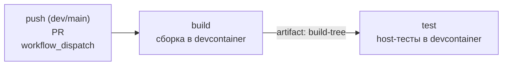
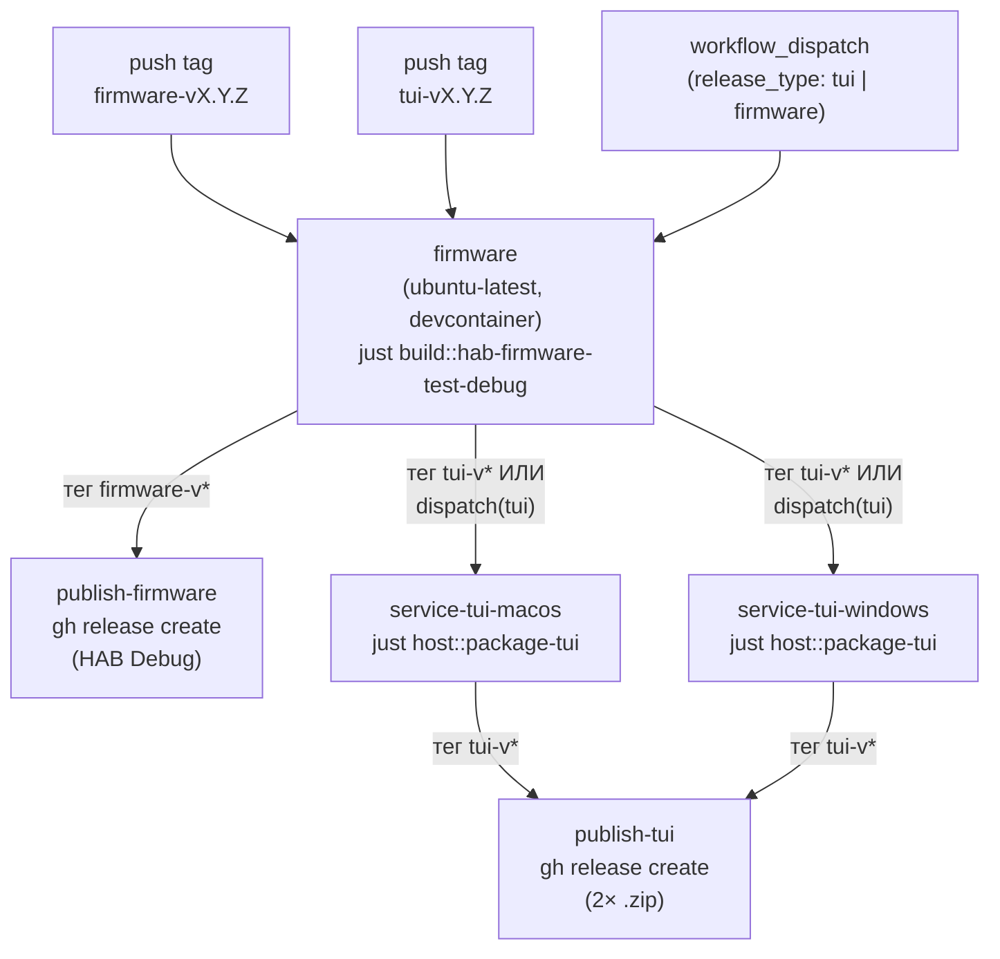

# CI/CD: устройство GitHub Actions workflow

> Проект: TFT Firmware (MIMXRT1052CVJ5B)
> Документ описывает схему и принцип работы двух GitHub Actions workflow в
> репозитории: `ci.yml` (обычный PR/push-цикл) и `release.yml` (публикация
> релизных бинарников по тегу). Для истории решений и roadmap развития
> `ci.yml` — см. `just/ci_workflow.md`; этот документ — техническая справка
> «как оно работает сейчас», а не хронология.

---

## 1. Два workflow, два разных назначения

| | `ci.yml` | `release.yml` |
| --- | --- | --- |
| Когда запускается | `push` в `dev`/`main`, любой `pull_request`, `workflow_dispatch` | `push` тега `tui-v*` / `firmware-v*`, `workflow_dispatch` |
| Что проверяет | Собирается ли проект и проходят ли host-тесты | Собираются ли и публикуются ли релизные бинарники |
| Публикует что-то наружу? | Нет — только артефакты прогона (для отладки) | Да — GitHub Release с реальными asset'ами (только по тегу) |
| Раннеры | `ubuntu-latest` (оба job'а) | `ubuntu-latest` + `macos-latest` + `windows-latest` |

Они намеренно не смешаны в один файл (см. `just/ci_workflow.md`, «Шаг 3 —
выделить release workflow»): PR-цикл должен оставаться быстрым и не зависеть
от кросс-платформенной упаковки `service-tui`, а релизная публикация не
должна гонять host-тесты повторно на каждый push в PR.

---

## 2. `ci.yml` — обычный PR/push-цикл



Оба job'а выполняются на `ubuntu-latest`, внутри одного и того же
devcontainer-образа (`.devcontainer/Dockerfile`) — то же окружение, что и у
разработчика локально (ARM toolchain, cmake, ninja, `just`, `uv`), не
отдельно собранное под раннер. Образ пересобирается в каждом job'е, но
кэшируется через `docker/build-push-action@v7` (`cache-from`/`cache-to:
type=gha, scope=tft-devcontainer`) — повторные прогоны переиспользуют слои,
не пересобирают с нуля.

- **`build`** — checkout, поднять devcontainer, `tools/host && uv sync`,
  `just ci::build` (→ `just build::build-all-release`, все три firmware-
  проекта), выгрузить `build/` как артефакт `build-tree`.
- **`test`** — зависит от `build` (`needs: build`), скачивает `build-tree`,
  поднимает тот же образ (тот же кэш), `just ci::test` (→
  `just build::test-host-release`, Unity/fff host-тесты), выгружает логи +
  `build/` как `test-artifacts`.

Команды внутри контейнера запускаются `docker run --user root -v
"$GITHUB_WORKSPACE":/workspace -w /workspace tft-devcontainer-ci:latest
bash -lc '...'` — `--user root` обязателен, иначе non-root пользователь в
контейнере не может писать в bind-mounted `$GITHUB_WORKSPACE` (ломало
`uv sync`/создание `.venv`).

Чего `ci.yml` **не делает**: lint (заглушка в `just ci::lint`), coverage,
сборку/упаковку `service-tui`, HIL-тесты (нужно физическое железо —
самостоятельная задача для self-hosted раннера). См. `just/ci_workflow.md`
для планов по каждому из этих пунктов.

---

## 3. `release.yml` — публикация релиза

### 3.1 Схема тегов

Firmware (`firmware_test`) и `service-tui` версионируются и релизятся
**независимо** (`FIRST_RELEASE_PLAN.md`, Шаг 2.1) — два разных паттерна
тега запускают два разных сценария внутри одного workflow-файла:



Ключевое архитектурное решение: **HAB-образ `firmware_test`, который
вшивается внутрь TUI-бандла, всегда собирается заново из текущего HEAD**
джобой `firmware` — а не скачивается из последнего опубликованного
`firmware-v*` релиза. Поэтому job `firmware` выполняется **при любом
триггере**, без условия — она нужна и для отдельного firmware-релиза, и
как зависимость для упаковки TUI.

### 3.2 Триггеры

```yaml
on:
  push:
    tags: ["tui-v*", "firmware-v*"]
  workflow_dispatch:
    inputs:
      release_type: {type: choice, options: [tui, firmware], default: tui}
```

`workflow_dispatch` — «сухой прогон» без публикации: собирает всё
(включая упаковку TUI под выбранный `release_type`), выгружает скачиваемые
артефакты, но **не** создаёт GitHub Release — джобы `publish-*` гейтятся
условием `if: startsWith(github.ref, 'refs/tags/...')`, которое на ручном
запуске всегда ложно (`github.ref` в этом случае — ветка, не тег).

Важный нюанс реализации: условие для `service-tui-macos`/`-windows`
проверяет `release_type` через `github.event.inputs.release_type`, не
через голый контекст `inputs.release_type` — последний рассчитан прежде
всего на reusable workflows (`workflow_call`) и не даёт предсказуемого
результата в job-level `if:` для прямого `workflow_dispatch`. На первом
реальном прогоне (`inputs.release_type`) джобы `service-tui-*` молча
скипались даже при выбранном `release_type=tui` — потребовалась замена на
`github.event.inputs.*`, если снова понадобится ссылаться на inputs в
job-level `if:`, использовать именно эту форму.

### 3.3 Джобы

| Job | Раннер | Когда выполняется | Что делает |
| --- | --- | --- | --- |
| `firmware` | `ubuntu-latest`, devcontainer (тот же подход и кэш, что в `ci.yml`) | всегда | сверяет тег `firmware-v*` с `VERSION` в `firmware/test/CMakeLists.txt` (если применимо); `just build::hab-firmware-test-debug`; артефакт `firmware-hab-debug` |
| `publish-firmware` | `ubuntu-latest` | только push тега `firmware-v*` | скачивает `firmware-hab-debug`; `gh release create firmware-vX.Y.Z firmware_test_hab.bin` — standalone-релиз для `tools/host/flash_usb.py`, без TUI |
| `service-tui-macos` / `service-tui-windows` | `macos-latest` / `windows-latest` | push тега `tui-v*` ИЛИ `workflow_dispatch` с `release_type=tui` | `astral-sh/setup-uv` + `extractions/setup-just` (на раннерах нет `uv`/`just` из коробки); скачивает `firmware-hab-debug` в `build/Debug/`; сверяет тег `tui-v*` с `version` в `pyproject.toml` (если применимо); `just host::service-setup` + `just host::package-tui`; архивирует `dist/service-tui-vX.Y.Z-<os>/` в zip (`zip -r` на macOS, `Compress-Archive` на Windows); артефакт `service-tui-macos`/`service-tui-windows` |
| `publish-tui` | `ubuntu-latest`, `needs: [service-tui-macos, service-tui-windows]` | только push тега `tui-v*` | скачивает оба zip; `gh release create tui-vX.Y.Z *.zip` |

**Только Debug HAB** идёт в релиз (`FIRST_RELEASE_PLAN.md`, Шаг 1.5) —
Release-сборка `firmware_test` нестабильна (FCB/clock), поэтому `firmware`
джоба собирает только `hab-firmware-test-debug`, не полный
`hab-all-release`.

**Сверка версии тег↔файл** — маленький, но важный guard в обеих ветках
(`firmware`/`service-tui-*`): если версия в теге не совпадает с версией в
`CMakeLists.txt`/`pyproject.toml`, job падает с понятной ошибкой вместо
того, чтобы молча опубликовать релиз с несовпадающим номером версии внутри
файлов (забытый version bump перед тегом).

**Windows-раннер и bash** — корневой `Justfile` требует `bash` (`set shell
:= ["bash", ...]`); `windows-latest` образ GitHub Actions включает Git for
Windows (даёт `bash.exe` в PATH из коробки) — дополнительной настройки
shell не требуется, `just`-рецепты выполняются так же, как и локально под
Git Bash на Windows.

### 3.4 Как проверить без публикации

```bash
gh workflow run release.yml --ref dev -f release_type=tui
gh workflow run release.yml --ref dev -f release_type=firmware
```

или через веб-интерфейс: Actions → **Release** → **Run workflow** → выбрать
branch и `release_type`. Джобы `publish-*` в этом сценарии показываются как
**Skipped**, не **Failed** — это ожидаемое поведение, не баг.

---

## 4. Общее между `ci.yml` и `release.yml`

- **Один и тот же devcontainer-подход** для всего, что требует ARM
  toolchain (сборка firmware) — job `firmware` в `release.yml` использует
  дословно тот же паттерн `docker/build-push-action@v7` +
  `docker run --user root ...`, что и `build`/`test` в `ci.yml`.
- **Общий GHA layer-кэш** — оба workflow используют `scope:
  tft-devcontainer` в `cache-from`/`cache-to`, поэтому кэш переиспользуется
  между обычными PR-прогонами и релизными сборками, а не живёт отдельно.
- **`workflow_dispatch` есть у обоих** — в `ci.yml` это просто способ
  перезапустить pipeline вручную без нового коммита; в `release.yml` — это
  единственный способ протестировать сборку без реальной публикации.

---

## 5. Чего пока нет

- **Self-hosted HIL-раннер.** Ни один из двух workflow не может
  задетектировать SDP на живой плате или прогнать деструктивные сценарии
  (обрыв USB) — GitHub-hosted раннеры не видят реальное железо. Это ручной
  шаг перед каждым релизом (`FIRST_RELEASE_PLAN.md`, Шаг 4), пока не
  поднят self-hosted lane (`just/ci_workflow.md`, «Шаг 5»).
- **`lint`/`coverage`** не подключены ни в `ci.yml`, ни в `release.yml` —
  см. `just/ci_workflow.md`, «Рекомендуемые следующие шаги» (Шаги 1–2).
- **Публикация devcontainer image в GHCR** — образ пересобирается в каждой
  job'е каждого workflow (пусть и с layer-кэшем); заранее опубликованный
  образ сократил бы время старта ещё сильнее (`just/ci_workflow.md`, «Шаг 4»).
