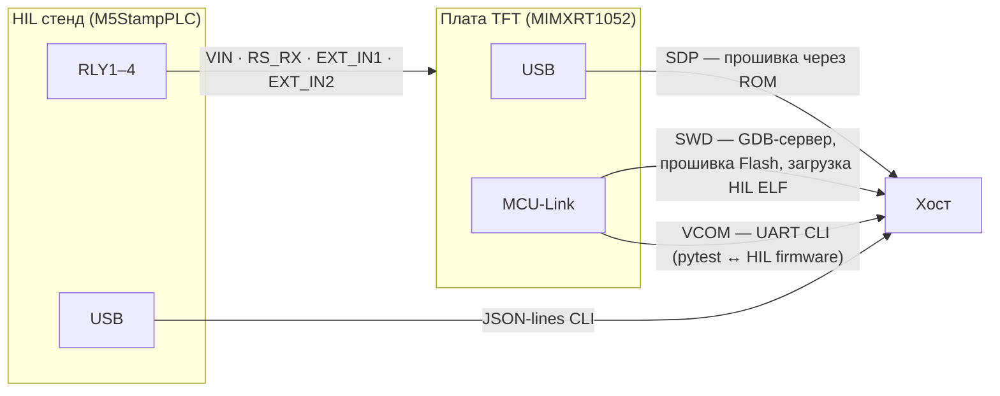
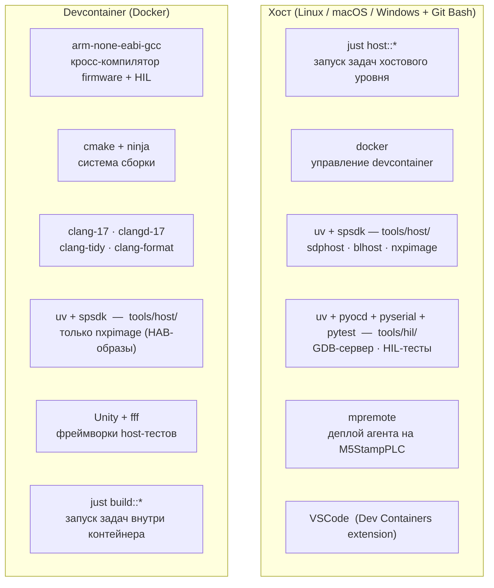
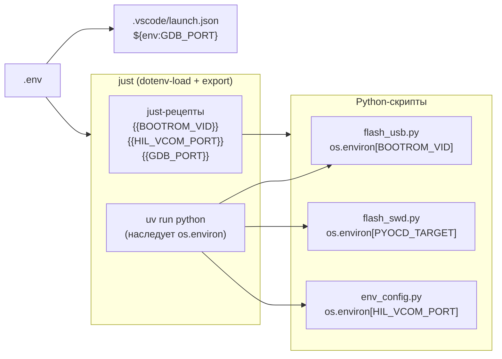
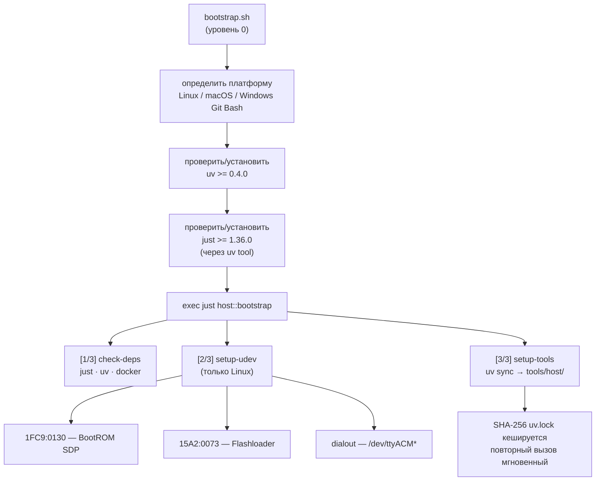
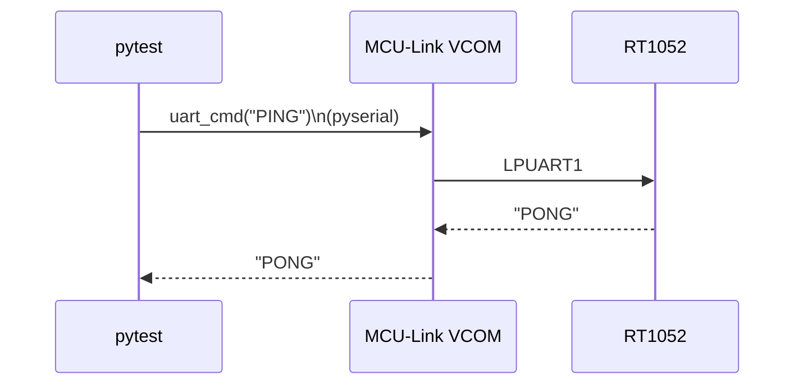
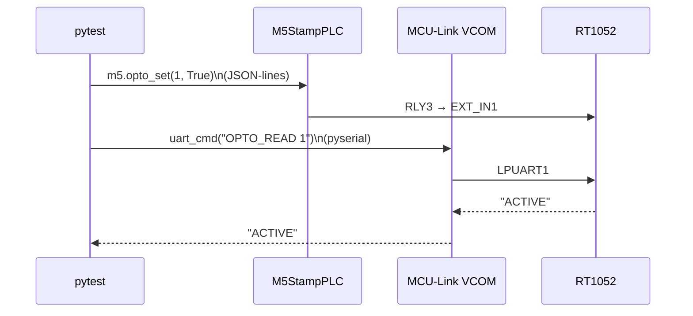
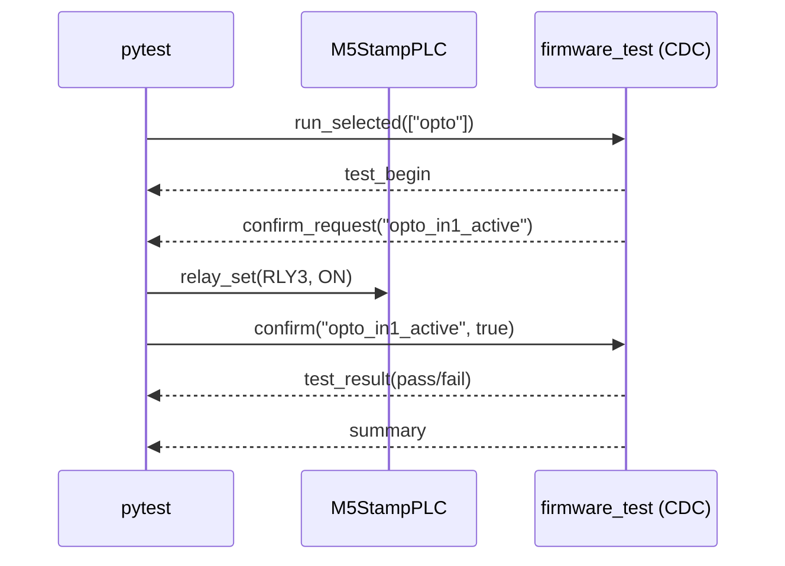
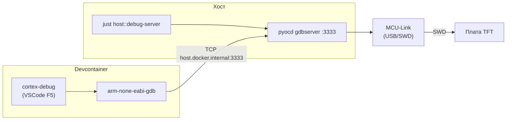
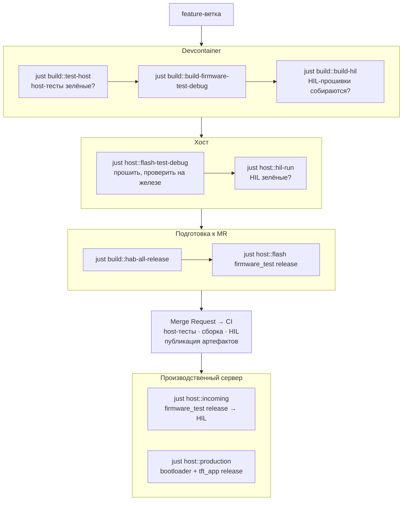

# Архитектура рабочего окружения разработчика

> Проект: TFT Firmware (MIMXRT1052CVJ5B)
> Документ описывает рабочий процесс разработчиков: разворачивание окружения,
> сборка, тестирование (host + HIL), отладка и прошивка платы.

---

## 1. Концепция

Рабочее окружение разделено на два контекста с чёткой границей:

**Devcontainer** — всё что касается кода: сборка, статический анализ,
форматирование, host-тесты, сборка HIL target-прошивок, подготовка HAB-образов.
Управляется через VSCode tasks и модуль `just build::`.

**Хост** — всё что касается железа: прошивка платы через USB или SWD,
HIL-тесты через pyOCD + pytest, GDB-сервер для отладки.
Управляется через модуль `just host::`.

---

## 2. Компоненты окружения

### Физические связи



### Состав инструментов



---

## 3. Что устанавливается и где

| Инструмент                          | Хост            | Devcontainer    |
| ----------------------------------- | --------------- | --------------- |
| `just`                              | ✅               | ✅ Dockerfile    |
| `docker`                            | ✅               | —               |
| `uv`                                | ✅               | ✅ Dockerfile    |
| `spsdk` (sdphost, blhost, nxpimage) | ✅ `tools/host/` | ✅ `tools/host/` |
| `pyocd` + `pyserial` + `pytest`     | ✅ `tools/hil/`  | —               |
| `mpremote`                          | ✅ `tools/hil/`  | —               |
| ARM GCC toolchain                   | —               | ✅               |
| `cmake` / `ninja`                   | —               | ✅               |
| `clang` / `clangd` / `clang-tidy`   | —               | ✅               |
| Unity / fff                         | —               | ✅ vendored      |

`spsdk` и `pyocd` — отдельные uv-проекты с разными ролями:

- `tools/host/` — `spsdk`: `nxpimage` + `sdphost` + `blhost` — прошивка через USB ROM и HAB-образы
- `tools/hil/` — `pyocd` + `pyserial` + `pytest` + `mpremote` — GDB-сервер, HIL-тесты, деплой M5 агента

---

## 3.1 Конфигурация проекта — `.env`

`.env` в корне репозитория — единый источник конфигурации для всего стека.
`.env.example` — шаблон без значений, коммитится в репозиторий.

```ini
# Hardware
BOARD=MIMXRT1052

# USB VID:PID (NXP ROM + Flashloader)
BOOTROM_VID=1fc9
BOOTROM_PID=0130
FLASHLOADER_VID=15a2
FLASHLOADER_PID=0073

# Debug / SWD
GDB_PORT=3333
GDB_EXECUTABLE=arm-none-eabi-gdb
PYOCD_TARGET=mimxrt1050_quadspi
PYOCD_FREQUENCY=4000000
FCB_PATH=tools/host/dcd/w25q128_fdcb.bin

# HIL — аппаратный стенд
HIL_PYOCD_FREQUENCY=1000000
HIL_BUILD_DIR=build/target-debug
HIL_TARGET_POWER_SETTLE_S=1.5        # задержка после включения питания (POR + стабилизация)

# VCOM на программаторе NXP MCU-Link
HIL_VCOM_PORT=/dev/cu.usbmodemXXXX   # macOS: cu.usbmodem*, Linux: ttyACM*
HIL_VCOM_BAUD=115200
HIL_READY_TIMEOUT=5.0

# M5Stack StamPLC (промежуточная платформа для HIL)
HIL_M5_PORT=/dev/cu.usbmodemYYYY     # M5StampPLC USB CDC
HIL_M5_BAUD=115200
HIL_M5_TIMEOUT=3.0

# VCOM на плате таргета (USB CDC, появляется после загрузки ELF)
HIL_USB_CDC_PORT=/dev/cu.usbmodemZZZZ
HIL_USB_CDC_BAUD=115200
HIL_USB_CDC_TIMEOUT=5.0
```

**Как значения попадают в инструменты:**



---

## 4. Структура automation-части репозитория

```bash
/
├── justfile                      ← корневой оркестратор; модули: build, host, ci
├── bootstrap.sh                  ← уровень 0: устанавливает just + uv → just host::bootstrap
├── pyocd.yaml                    ← конфигурация pyOCD (HIL RAM-режим)
├── pyocd_debug.yaml              ← конфигурация pyOCD (GDB-сервер отладки)
├── .env / .env.example
│
├── just/
│   ├── build.just                ← devcontainer: сборка firmware, host-тесты,
│   │                                HAB-образы, HIL target-прошивки
│   ├── host.just                 ← хост: прошивка (USB + SWD), HIL-тесты,
│   │                                GDB-сервер, M5StampPLC, bootstrap
│   └── ci.just
│
├── .devcontainer/
│   ├── Dockerfile
│   └── devcontainer.json
│
├── .vscode/
│   ├── launch.json               ← cortex-debug конфигурации (firmware_test, bootloader, tft_app)
│   └── tasks.json                ← UI для just build::* (внутри devcontainer)
│
├── tools/
│   ├── host/                     ← spsdk-окружение (прошивка через USB ROM)
│   │   ├── flash_usb.py          ← USB SDP: sdphost + blhost
│   │   ├── flash_swd.py          ← SWD: FCB + HAB → pyOCD Flash
│   │   ├── hab/                  ← HAB yaml-конфиги (nxpimage)
│   │   ├── dcd/                  ← w25q128_fdcb.bin, ivt_flashloader.bin
│   │   └── uv.lock
│   │
│   └── hil/                      ← HIL pytest-окружение
│       ├── conftest.py           ← фикстуры: m5, loaded_<n>, uart_<n>
│       ├── pyocd_utils.py        ← FLEXRAM init, ELF loader, run_from_vectors
│       ├── env_config.py         ← конфигурация из os.environ / .env
│       ├── load_and_run.py       ← CLI-утилита загрузки ELF в RAM вручную
│       ├── 01_test_uart.py       ← HIL тест bsp_uart_host (без M5)
│       ├── 02_test_opto.py       ← HIL тест bsp_opto (через M5StampPLC)
│       ├── 03_test_can.py        ← HIL тест bsp_can
│       ├── 05_test_usb_cdc.py    ← HIL тест USB CDC (bsp_usb_cdc, UART CLI)
│       ├── 06_test_firmware_opto.py ← HIL тест opto через firmware_test CDC
│       ├── 06_test_firmware_can.py  ← HIL тест CAN через firmware_test CDC
│       ├── m5/
│       └── uv.lock
│
├── CMakePresets.json             ← Debug · Release · host-debug · target-debug
│
├── tests/
│   ├── host/                     ← host unit-тесты (Unity + fff)
│   │   ├── mocks/                ← stub-хедеры NXP SDK для компиляции на хосте
│   │   ├── button/
│   │   ├── can/
│   │   ├── cli/
│   │   ├── led/
│   │   ├── log/
│   │   ├── opto/
│   │   ├── prio_queue/
│   │   ├── protocol/
│   │   ├── ring_buffer/
│   │   ├── runner/
│   │   ├── timeout/
│   │   └── uart_host/
│   └── target/                   ← HIL target-прошивки (RAM, pyOCD)
│       ├── host_uart/            ← CLI для тестирования bsp_uart_host
│       ├── hil_button/           ← CLI для тестирования bsp_button
│       ├── hil_can/              ← CLI для тестирования bsp_can
│       ├── hil_opto/             ← CLI для тестирования bsp_opto
│       └── hil_usb_cdc/          ← CLI для тестирования USB CDC
│
└── docs/
    ├── DEV_ARCH.md               ← этот документ
    ├── HOW_TO_FLASH.md           ← прошивка (USB SDP + SWD)
    ├── HOW_TO_DEBUG.md           ← отладка (GDB + RTT + FreeRTOS)
    ├── hardware/                 ← схемы, datasheet платы
    ├── mimxrt1052/               ← MCU: BOOT_FLAGS, reference manual
    └── testing/
        ├── hil/
        │   ├── HIL_HOW_TO.md     ← как проводить HIL-тесты
        │   ├── HIL_BENCH.md      ← стенд: оборудование, подключение
        │   └── HIL_CREATE_TEST.md ← как добавить новый HIL-тест
        └── host/
            └── HOST_CREATE_TEST.md ← как добавить host unit-тест
```

---

## 5. Первый запуск: разворачивание окружения

### 5.1 Предварительные требования

| Платформа | Что нужно до bootstrap                         |
| --------- | ---------------------------------------------- |
| Linux     | `docker`, `git`, `curl`                        |
| macOS     | Docker Desktop, `git` (Xcode CLT)              |
| Windows   | Docker Desktop, Git for Windows → **Git Bash** |

### 5.2 Единственная команда

```bash
git clone <repo-url> && cd <repo>
./bootstrap.sh
```

### 5.3 Что делает bootstrap



### 5.4 После bootstrap

```bash
# Открыть VSCode → "Reopen in Container"
# postCreateCommand выполняется автоматически:
#   uv sync (tools/host) + cmake --preset host-debug + cmake --preset Debug

# Настроить .env (один раз):
cp .env.example .env
# Заполнить HIL_VCOM_PORT и HIL_M5_PORT под свои порты

# Задеплоить агент на M5StampPLC (один раз, и каждый раз после изменений в agent.py):
just host::m5-deploy
```

---

## 6. Прошивки, boot-стратегии и матрица сборки

### 6.1 Четыре типа сборки

| Пресет                        | Toolchain    | Назначение                         | Линкер-скрипт    |
| ----------------------------- | ------------ | ---------------------------------- | ---------------- |
| `Debug` / `Release`           | ARM GCC      | firmware_test, bootloader, tft_app | `flexspi_nor.ld` |
| `host-debug` / `host-release` | clang (хост) | Unity + fff тесты                  | —                |
| `target-debug`                | ARM GCC      | HIL target-прошивки                | `ram.ld`         |

### 6.2 CMake пресеты

```bash
configurePresets:
  Debug · Release              ← firmware (XIP из Flash)
  host-debug · host-release    ← host unit-тесты
  target-debug                 ← HIL target-прошивки (RAM)

buildPresets (ARM firmware):
  firmware-test-debug / release
  bootloader-debug / release
  app-debug / release
  all-debug / all-release

buildPresets (host-тесты):
  host-debug-build:   test_bsp_led, test_log, test_bsp_opto, test_bsp_button,
                      test_bsp_can, test_cli, test_protocol, test_firmware_runner,
                      test_prio_queue, uart_host_mock_example, test_ring_buffer,
                      test_timeout_pattern
  host-release-build: то же

buildPresets (HIL):
  target-debug-build: test_host_uart, test_hil_button, test_hil_can,
                      test_hil_usb_cdc, test_hil_opto

Источник истины по списку целей — CMakePresets.json.
```

### 6.3 Boot-стратегии

| Прошивка                     | Стратегия                          | Инструмент загрузки |
| ---------------------------- | ---------------------------------- | ------------------- |
| `firmware_test`              | XIP из Flash (`flexspi_nor.ld`)    | SPSDK → Flash       |
| `bootloader`                 | Копирование в ITCM                 | SPSDK → Flash       |
| `tft_app`                    | XIP + буферы в SDRAM               | SPSDK → Flash       |
| HIL target (`tests/target/`) | Исполнение из ITCM/DTCM (`ram.ld`) | pyOCD → RAM         |

**HIL boot-стратегия:** pyOCD настраивает FLEXRAM (128 KB ITCM + 128 KB DTCM + 256 KB OCRAM), записывает PT_LOAD сегменты ELF по физическим адресам, устанавливает SP/PC из таблицы векторов и запускает выполнение. Flash не используется — прошивка исчезает при отключении питания.

---

## 7. Рабочий процесс разработчика

### 7.1 Карта задач по контекстам

| Задача                                 | Где                        |
| -------------------------------------- | -------------------------- |
| Написание кода, clangd, форматирование | devcontainer               |
| Статический анализ (clang-tidy)        | devcontainer               |
| Host unit-тесты (Unity + fff)          | devcontainer               |
| Сборка ARM firmware (ELF)              | devcontainer               |
| Сборка HIL target-прошивок             | devcontainer               |
| Подготовка HAB-образов (nxpimage)      | devcontainer               |
| Прошивка платы через USB ROM           | хост                       |
| Прошивка платы через SWD               | хост                       |
| HIL-тесты (pyOCD + pytest + M5)        | хост                       |
| Отладка — GDB-сервер (pyOCD)           | хост                       |
| Отладка — GDB-клиент (cortex-debug)    | devcontainer → хост по TCP |

### 7.2 Типичная сессия разработки

```bash
# ── Devcontainer (терминал VSCode) ──────────────────────────────────────────

just build::test-host                    # host unit-тесты — зелёные?
just build::build-firmware-test-debug    # ELF собирается?
just build::hab-firmware-test-debug      # HAB-образ для прошивки

# ── Хостовый терминал — прошивка ─────────────────────────────────────────────

just host::flash-test-debug              # прошить через USB SDP
# или
just host::flash-swd-test-debug          # прошить через SWD (power cycle после)

# ── Хостовый терминал — HIL ──────────────────────────────────────────────────

just build::build-hil                    # (devcontainer) собрать HIL ELF
just host::hil-run                       # загрузить ELF → запустить все тесты
just host::hil-uart                      # только UART тесты
just host::hil-opto                      # только opto тесты (нужен стенд M5)

# ── Отладка ───────────────────────────────────────────────────────────────────

just host::debug-server                  # запустить pyOCD GDB-сервер на хосте
# F5 в VSCode → 🐛 Debug: firmware_test
```

### 7.3 VSCode Tasks (внутри devcontainer)

| Таск                      | Команда                              |
| ------------------------- | ------------------------------------ |
| 🔨 Build                   | `just build::build-<project>-<type>` |
| 🧪 Host Tests (Debug)      | `just build::test-host`              |
| 🧪 Host Tests (Release)    | `just build::test-host-release`      |
| 🎯 Build HIL Target Tests  | `just build::build-hil`              |
| 📦 HAB Image               | `just build::hab-<project>-<type>`   |
| 📦 HAB All (Debug/Release) | `just build::hab-all-debug/release`  |
| 🗑️ Clean                   | `just build::clean`                  |

---

## 8. Прошивка платы (хост)

Подробно — [docs/HOW_TO_FLASH.md](HOW_TO_FLASH.md). Краткая сводка:

### USB SDP (Serial Download Protocol)

Требует перевода платы в SDP-режим (`BOOT_MOD_1 → 3V3 → Reset`).

```bash
just host::flash-test-debug       # firmware_test Debug → Flash
just host::flash-test-release     # firmware_test Release → Flash
just host::flash-production       # bootloader + tft_app Release (с подтверждением)
```

### SWD (через MCU-Link, без смены режима загрузки)

```bash
just host::flash-swd-test-debug
just host::flash-swd-test-release
# После любого flash-swd — обязательный power cycle платы
```

---

## 9. HIL-тесты (хост)

HIL-тесты проверяют периферию на реальном железе. Два типа:

### Базовые (без стенда) — `01_test_uart.py`

Только MCU-Link: SWD загружает ELF в RAM, VCOM обеспечивает UART CLI.



### С M5StampPLC — `02_test_opto.py` и другие

`M5StampPLC` управляет входными сигналами таргета через реле. pytest оркестрирует оба канала одновременно.



### Через firmware_test CDC — `06_test_firmware_*.py`

Новый класс HIL-тестов: firmware_test прошит во Flash (не загружается pyOCD),
общение идёт по USB CDC ACM через `FirmwareCdcClient`. M5StampPLC управляет
сигналами, TUI/pytest оркестрирует `confirm_request` автоматически.



Фикстура `firmware_cdc` не ждёт `session_start` (одноразовое событие, может быть
пропущено при подключении) — проверяет живость через `ping → pong`.

Перед каждой тест-сессией фикстура `m5` автоматически включает питание таргета (RLY1), ждёт стабилизации, затем `loaded_<n>` загружает ELF через pyOCD.

### Команды

```bash
just build::build-hil        # (devcontainer) собрать HIL ELF
just host::hil-run           # прогнать все HIL тесты
just host::hil-uart          # только 01_test_uart.py
just host::hil-opto          # только 02_test_opto.py
```

Подробно — [docs/testing/hil/HIL_HOW_TO.md](testing/hil/HIL_HOW_TO.md).
Добавление нового теста — [docs/testing/hil/HIL_CREATE_TEST.md](testing/hil/HIL_CREATE_TEST.md).
Стенд и подключение — [docs/testing/hil/HIL_BENCH.md](testing/hil/HIL_BENCH.md).

---

## 10. Тестирование

### 10.1 Host unit-тесты

```bash
Фреймворк:  Unity + fff
Пресеты:    host-debug / host-release
Компилятор: clang-17 (не ARM GCC)
Запуск:     just build::test-host   (внутри devcontainer)
```

BSP-модули тестируются через fff-фейки и stub-хедеры в `tests/host/mocks/`.
`BUILD_TESTS_HOST=ON` отключает ARM-специфику и SDK-заголовки.

Покрытие: `bsp_led`, `bsp_opto`, `bsp_button`, `bsp_can`, `bsp_uart_host`,
`cli`, `protocol`, `firmware_runner`, `prio_queue`, `ring_buffer`, `log`,
timeout-паттерн.
Гайд — [testing/host/HOST_CREATE_TEST.md](testing/host/HOST_CREATE_TEST.md).

### 10.2 HIL target-тесты

Два класса HIL-тестов с разными транспортами:

**Класс A — ELF-in-RAM (UART CLI):** pyOCD загружает прошивку в RAM, общение через
LPUART1 (MCU-Link VCOM). Тесты BSP-уровня, независимы от firmware_test.

```bash
Инструменты: pyOCD (SWD) + pyserial (UART) + pytest + M5StampPLC (реле)
Пресет:      target-debug → ram.ld → ITCM/DTCM
Запуск:      just host::hil-run
```

Тесты: `01_test_uart.py` (PING/ECHO/BUF_SIZE), `02_test_opto.py`
(оптовходы IN1/IN2/RS), `03_test_can.py` (CAN-шина), `04_test_button.py`
(кнопки), `05_test_usb_cdc.py` (USB CDC ACM).

**Класс B — firmware_test во Flash (CDC):** firmware_test прошит штатно,
общение через USB CDC ACM (`FirmwareCdcClient`). M5StampPLC оркестрирует
`confirm_request` автоматически без участия оператора.

```bash
Инструменты: pyserial (CDC) + pytest + M5StampPLC (реле)
firmware_test: прошит в Flash через USB SDP заранее
Запуск:      just host::hil-firmware-opto / hil-firmware-can
```

Тесты: `06_test_firmware_opto.py` (opto IN1/IN2/RS, 6 шагов),
`06_test_firmware_can.py` (CAN RX + TX).

---

## 11. Отладка

Подробно — [docs/HOW_TO_DEBUG.md](HOW_TO_DEBUG.md). Краткая схема:



Три конфигурации в `.vscode/launch.json`:

- `🐛 Debug: firmware_test` — bare-metal, входной контроль
- `🐛 Debug: bootloader` — bare-metal, A/B обновление
- `🐛 Debug: tft_app (FreeRTOS)` — FreeRTOS task view

RTT-логи доступны в Debug-сборках (`SEGGER_RTT_ENABLED=ON`); подробности — в
[docs/HOW_TO_DEBUG.md](HOW_TO_DEBUG.md).

---

## 12. Жизненный цикл изменений



---

## 13. Производственный сервер

Сервер работает только с готовыми проверенными артефактами. Никакой сборки.

```bash
Сценарий входного контроля:
  just host::incoming
    └── flash firmware_test release → HIL-тесты

Финальная прошивка:
  just host::production
    ├── flash bootloader release
    └── flash tft_app release

Установлено:     just · uv + spsdk · uv + pyocd/pytest · git
НЕ установлено:  docker · cmake · компилятор · ARM toolchain
```
