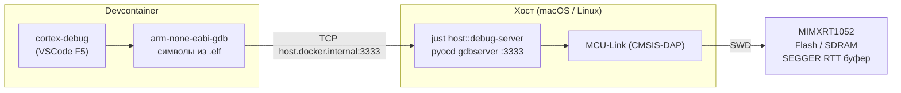

# Отладка прошивок через SWD + GDB

## Обзор архитектуры

Отладка построена на пробросе GDB-сервера с хоста в devcontainer по TCP. Это
позволяет держать весь инструментарий сборки и языковой сервер внутри контейнера,
не проводя USB-пробник внутрь Docker.



**Ключевой принцип:** `pyocd gdbserver` слушает на `0.0.0.0:3333`. Из контейнера
GDB подключается через `host.docker.internal:3333` — специальный DNS-алиас Docker,
резолвится в IP хост-машины.

---

## Компоненты

### На хосте

| Компонент                         | Роль                            | Источник                   |
| --------------------------------- | ------------------------------- | -------------------------- |
| `pyocd`                           | GDB-сервер + flash-программатор | `tools/hil/uv.lock`        |
| `MCU-Link`                        | CMSIS-DAP v2 пробник            | USB к плате                |
| `just host::debug-server`         | Запуск GDB-сервера              | `just/host.just`           |
| `just host::flash-swd-*`          | Прошивка через SWD              | `just/host.just`           |
| `tools/host/flash_swd.py`         | Сборка FCB+HAB образа и запись  | `tools/host/`              |
| `tools/host/dcd/w25q128_fdcb.bin` | FCB для W25Q128 (Quad SPI)      | NXP SecureProvisioningTool |

### В devcontainer

| Компонент                              | Роль                                           |
| -------------------------------------- | ---------------------------------------------- |
| `arm-none-eabi-gdb`                    | GDB клиент, подключается к серверу на хосте    |
| `cortex-debug` (VSCode extension)      | UI для GDB: брейкпоинты, стек, регистры        |
| `.vscode/launch.json`                  | Конфигурации запуска отладки                   |
| `.vscode/tasks.json`                   | `preLaunchTask` — пересборка ELF перед стартом |
| `build/Debug/*.elf`                    | Символы для GDB (DWARF debug info)             |
| `bsp/generated/startup/MIMXRT1052.xml` | SVD — описание регистров периферии             |

### Конфигурация

Параметры отладки задаются в `.env`:

```bash
GDB_PORT=3333
PYOCD_TARGET=mimxrt1050_quadspi
PYOCD_FREQUENCY=4000000
FCB_PATH=tools/host/dcd/w25q128_fdcb.bin
```

---

## Поддерживаемые прошивки

| Конфигурация VSCode           | ELF                             | Особенности                  |
| ----------------------------- | ------------------------------- | ---------------------------- |
| `🐛 Debug: firmware_test`      | `build/Debug/firmware_test.elf` | Bare-metal, входной контроль |
| `🐛 Debug: bootloader`         | `build/Debug/bootloader.elf`    | Bare-metal, A/B обновление   |
| `🐛 Debug: tft_app (FreeRTOS)` | `build/Debug/app.elf`           | FreeRTOS, task view          |

Все три — XIP-прошивки, исполняются из QuadSPI NOR Flash (`0x60000000`).

---

## Режимы запуска отладки

### Режим А — прошивка уже в Flash

```bash
# 1. Хост — запустить GDB-сервер (оставить в отдельном терминале)
just host::debug-server

# 2. DevContainer — VSCode
#    Run & Debug (Ctrl+Shift+D) → выбрать конфигурацию → F5
```

GDB сбрасывает MCU, загружает символы из ELF и останавливается на входе
в `main`. Flash не перезаписывается.

### Режим Б — прошить через SWD, затем отладить

```bash
# 1. DevContainer
just build::hab-firmware-test-debug

# 2. Хост
just host::flash-swd-test-debug

# 3. ⚡ Power cycle платы (обязательно)

# 4. Хост
just host::debug-server

# 5. DevContainer — VSCode → 🐛 Debug: firmware_test → F5
```

### Режим В — прошить через USB SDP, затем отладить

```bash
# 1. DevContainer
just build::build-firmware-test-debug

# 2. Хост — перевести плату в SDP-режим, затем:
just host::flash-test-debug

# 3. Хост
just host::debug-server

# 4. DevContainer — VSCode → 🐛 Debug: firmware_test → F5
```

---

## Почему flash через SWD требует FCB

При USB SDP ROM-загрузчик инициализирует FlexSPI по DCD из HAB-образа — FCB
не нужен. При SWD flash-алгоритм pyOCD пишет в NOR Flash напрямую. При
cold-start Boot ROM сначала читает FCB по адресу `0x60000000`, конфигурирует
FlexSPI, и только потом ищет IVT. Без FCB бутлоадер не стартует.

`flash_swd.py` решает это, собирая образ перед записью:

```bash
0x60000000  w25q128_fdcb.bin  (512 байт)  — FCB
0x60000200  0xFF × 3584 байт             — padding
0x60001000  firmware_test_hab.bin         — IVT + DCD + код
```

Весь диапазон `0x60000000–0x6000FFFF` — один 64KB сектор: стирается и
записывается за одну транзакцию.

---

## RTT-логи

SEGGER RTT включён только в Debug-сборках (`SEGGER_RTT_ENABLED=ON`).
После старта отладки вкладка `TERMINAL → RTT` принимает вывод канала 0.
`cortex-debug` находит адрес буфера по символу `_SEGGER_RTT` из ELF.

```c
#include "SEGGER_RTT.h"
SEGGER_RTT_printf(0, "value = %d\n", value);
```

---

## FreeRTOS task view

Конфигурация `🐛 Debug: tft_app (FreeRTOS)` включает `"rtos": "FreeRTOS"` —
cortex-debug разбирает структуры планировщика и показывает вкладку `RTOS`
с таблицей задач: имя, состояние, использование стека, приоритет.

---

## Просмотр регистров периферии

Вкладка `Peripherals` показывает все блоки MIMXRT1052 по SVD-файлу
`bsp/generated/startup/MIMXRT1052.xml`. Значения обновляются при каждой паузе.

---

## Ограничения

**MCU-Link монопольный ресурс.** `debug-server` и `flash-swd` не могут
работать одновременно. Перед `flash-swd` остановите сервер (Ctrl+C).

**HIL-тесты vs отладка.** pyOCD также используется для HIL. Перед
`just host::hil-run` остановите GDB-сервер.

**Power cycle после flash-swd обязателен.** VECTRESET не реинициализирует
FlexSPI — только полное отключение питания гарантирует корректный cold-start.

**Только Debug-сборки.** Release компилируется с `-O2` без DWARF-символов.

---

## Быстрый старт (первый запуск)

```bash
# 1. Убедиться что в .devcontainer/devcontainer.json есть (для Linux):
#    "runArgs": ["--add-host=host.docker.internal:host-gateway"]

# 2. Залить прошивку
just host::flash-test-debug

# 3. Хост — запустить GDB-сервер
just host::debug-server

# 4. DevContainer — VSCode
#    Ctrl+Shift+D → 🐛 Debug: firmware_test → F5
```

---

## Дерево файлов отладки

```bash
.
├── .env                                  # GDB_PORT, PYOCD_TARGET, PYOCD_FREQUENCY, FCB_PATH
├── .vscode/
│   ├── launch.json                       # cortex-debug конфигурации (3 проекта)
│   └── tasks.json                        # preLaunchTask: build:*-debug
├── bsp/generated/startup/
│   └── MIMXRT1052.xml                    # SVD — регистры периферии
├── just/
│   └── host.just                         # debug-server, flash-swd-*
└── tools/
    ├── hil/                              # uv-проект с pyocd
    └── host/
        ├── flash_swd.py                  # FCB + HAB → Flash через pyOCD
        └── dcd/
            └── w25q128_fdcb.bin          # FCB для W25Q128 Quad SPI
```
