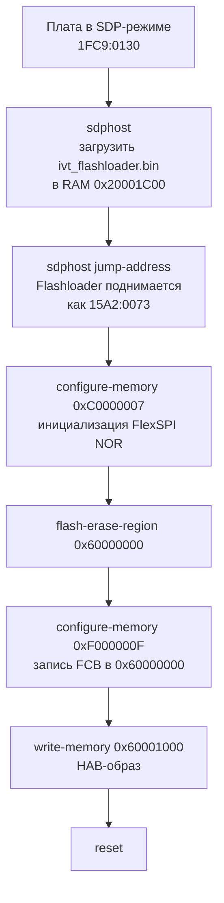

# HOW TO FLASH

Поддерживаются два независимых способа прошивки:

| Способ      | Интерфейс            | Требование                         | Инструмент                 |
| ----------- | -------------------- | ---------------------------------- | -------------------------- |
| **USB SDP** | USB ↔ ROM-загрузчик  | BOOT_MODE = 01 (Serial Downloader) | `spsdk` (sdphost + blhost) |
| **SWD**     | MCU-Link ↔ CMSIS-DAP | Плата в любом режиме загрузки      | `pyocd`                    |

---

## Способ 1 — USB SDP (Serial Download Protocol)

Стандартный производственный способ. ROM-загрузчик принимает образ по USB и
записывает его во Flash через Flashloader. Требует физического переключения
пина `BOOT_MOD_1`.

### 1.1 Перевести плату в SDP-режим

```bash
1. BOOT_MOD_1 → 3V3
2. Reset
3. Подключить USB к хосту
   → плата определяется как VID:PID 1FC9:0130
```

После прошивки — вернуть в нормальный режим:

```bash
BOOT_MOD_1 → GND → Reset
```

### 1.2 Подготовить HAB-образ (внутри devcontainer)

```bash
just build::hab-firmware-test-debug    # → build/Debug/firmware_test_hab.bin
just build::hab-firmware-test-release  # → build/Release/firmware_test_hab.bin
just build::hab-bootloader-release     # → build/Release/bootloader_hab.bin
just build::hab-app-release            # → build/Release/app_hab.bin
just build::hab-all-release            # все три Release за один раз
```

### 1.3 Прошить (хостовый терминал)

```bash
# Запись во Flash
just host::flash firmware_test debug
just host::flash firmware_test release
just host::flash bootloader release
just host::flash app release

# Загрузка в RAM (без записи во Flash — быстро, не изнашивает Flash)
just host::flash-ram firmware_test debug

# Быстрые алиасы
just host::flash-test-debug      # firmware_test debug → Flash
just host::flash-test-release    # firmware_test release → Flash
just host::flash-production      # bootloader release + app release (с подтверждением)
```

### 1.4 Что происходит при прошивке через USB SDP



ROM-загрузчик сам конфигурирует FlexSPI через DCD из HAB-образа, поэтому FCB
в образе не нужен — его пишет Flashloader отдельно. Это верно для W25Q128
(текущая плата) — auto-config Flashloader для неё проверен на практике.
Для плат с другой памятью (W25Q256/512, 4-байтная адресация) надёжность
auto-config не подтверждена — см. 1.5.

### 1.5 Нестандартная память (W25Q256/512) и сторонние бинарники

`service-tui` (`tools/production/`) умеет прошивать бинарники, собранные не
в этом репозитории (например, старые платы с W25Q512), тем же способом
(USB SDP), но с двумя отличиями от штатного пути. Это **отдельная
реализация**, не связанная с `flash_usb.py`/`nxpimage` CLI — TUI прошивает
in-process через Python API `spsdk` (`app/flash_backend.py`: `HabImage`,
`McuBoot`, `SDP`), без единого subprocess:

- HAB-образ (IVT + опционально DCD) собирается из **сырого** бинарника на
  лету через `HabImage` (spsdk), а не заранее через `just build::hab-*`
- FCB пишется **явно** (`mboot.write_memory()` с готовым блобом
  `tools/host/dcd/w25qXXX_fdcb.bin`, буквальная запись вместо
  `configure-memory 0xF000000F`) — auto-config для 4-байтной адресации не
  проверялся, решили на него не полагаться

Подробности конвейера — в [tools/production/docs/DEV_ARCH.md](../tools/production/docs/DEV_ARCH.md),
§8. Штатный путь (`--firmware`, три сборки этого репозитория, что через
`just host::flash`, что через `service-tui`) не меняется и по-прежнему
использует auto-config Flashloader, как описано в 1.4.

---

## Способ 2 — SWD через MCU-Link

Прошивка через отладочный пробник (MCU-Link, CMSIS-DAP). Плата остаётся
в нормальном режиме загрузки — переключать `BOOT_MOD_1` не нужно. Удобно
при итеративной разработке когда плата закреплена в стенде.

**Ограничения:**

- После записи обязателен **power cycle** (не reset) — VECTRESET не
  реинициализирует FlexSPI, Boot ROM не стартует
- MCU-Link используется монопольно: нельзя запускать одновременно с
  `debug-server` или HIL-тестами

### 2.1 Подготовить HAB-образ (внутри devcontainer)

```bash
just build::hab-firmware-test-debug
just build::hab-bootloader-debug
just build::hab-app-debug
```

### 2.2 Прошить (хостовый терминал)

```bash
just host::flash-swd-test-debug
just host::flash-swd-test-release
just host::flash-swd-bootloader-debug
just host::flash-swd-bootloader-release
just host::flash-swd-app-debug
just host::flash-swd-app-release

# После любого flash-swd — обязательно:
# ⚡ Отключить и подключить питание платы
```

### 2.3 Что происходит при прошивке через SWD

`flash_swd.py` собирает итоговый образ из двух частей перед записью:

```bash
0x60000000  w25q128_fdcb.bin  (512 байт)  — FCB: параметры W25Q128, Quad SPI
0x60000200  0xFF × 3584 байт             — padding (значение стёртой ячейки)
0x60001000  *_hab.bin                     — IVT + DCD + код (ivtOffset = 0x1000)
```

Весь диапазон умещается в один 64 KB сектор Flash — стирается и записывается
за одну транзакцию. FCB нужен потому что при cold-start Boot ROM читает его
первым, конфигурирует по нему FlexSPI, и только потом ищет IVT. При USB SDP
этим занимается ROM-загрузчик по DCD, FCB ему не нужен.

### 2.4 Зависимости

| Файл                              | Назначение                          |
| --------------------------------- | ----------------------------------- |
| `tools/host/flash_swd.py`         | Скрипт сборки образа и вызова pyOCD |
| `tools/host/dcd/w25q128_fdcb.bin` | FCB для W25Q128 в режиме Quad SPI   |
| `tools/hil/` (uv-проект)          | pyocd, вызывается через `uv run`    |

FCB-бинарник (`w25q128_fdcb.bin`) генерируется в NXP SecureProvisioningTool
и хранится в репозитории — пересоздавать не нужно.

---

## Сравнение способов

|                           | USB SDP                 | SWD                  |
| ------------------------- | ----------------------- | -------------------- |
| Переключение BOOT_MODE    | Нужно                   | Не нужно             |
| Power cycle после записи  | Не нужен                | **Обязателен**       |
| FCB в образе              | Не нужен для W25Q128*   | **Обязателен**       |
| Скорость записи           | ~50–100 kB/s            | ~8–10 kB/s           |
| Совместимость с отладкой  | Раздельно               | MCU-Link монопольный |
| Производственный сценарий | ✓                       | —                    |
| Итеративная разработка    | Неудобно (смена режима) | ✓                    |

\* Flashloader пишет FCB сам через auto-config — проверено для W25Q128.
Для сторонних бинарников с другой памятью `service-tui` пишет FCB явно,
см. 1.5.

---

## Диагностика

```bash
just host::scan               # найти подключённые NXP USB-устройства
just host::sdp-status         # проверить связь с BootROM (плата в SDP-режиме)
just host::flashloader-status # проверить Flashloader (после jump-address)
just host::debug-list-targets # проверить что pyOCD видит mimxrt1050_quadspi
just host::check-deps         # проверить версии just / uv / docker
```

---

## Производственный сценарий

```bash
just host::incoming     # firmware_test release → Flash → HIL-тесты периферии
just host::production   # bootloader release + app release
```
