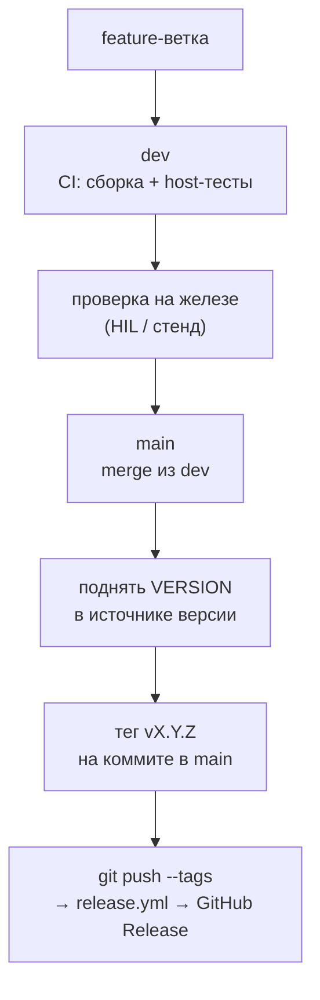

# Порядок выпуска релизов

---

## 1. Что релизится независимо

Три артефакта, три схемы тегов, три источника версии. Один тег запускает
**один** сценарий — общего «релиза всего» нет.

| Артефакт        | Тег                 | Версия берётся из                                | Что публикуется                                       |
| --------------- | ------------------- | ------------------------------------------------ | ----------------------------------------------------- |
| `firmware_test` | `firmware-vX.Y.Z`   | `firmware/test/CMakeLists.txt` (`VERSION`)       | `firmware_test_hab.bin` (HAB **Debug**)               |
| `bootloader`    | `bootloader-vX.Y.Z` | `firmware/bootloader/CMakeLists.txt` (`VERSION`) | `bootloader_hab.bin` (HAB **Release**, тестовый ключ) |
| `service-tui`   | `tui-vX.Y.Z`        | `tools/service_tui/pyproject.toml` (`version`)   | 2 × `.zip` (macOS, Windows)                           |

Две несимметричности, которые легко забыть:

- **`firmware_test` — Debug, `bootloader` — Release.** Не опечатка:
  Release-сборка `firmware_test` нестабильна, а production-путь
  загрузчика жёстко требует подписанный Release. Подробности — CI_WORKFLOW.md §3.3.
- **HAB-подпись загрузчика — тестовым ключом**. Это явно
  указано в notes релиза; церемония боевой подписи — отдельно, см.
  [tools/host/hab/keys/SIGNING_CEREMONY.md](../tools/host/hab/keys/SIGNING_CEREMONY.md).

---

## 2. Порядок выпуска



### Шаг 1. Довести изменения до `dev`

Feature-ветка → `dev`. CI (`ci.yml`) на каждый push в `dev` собирает всё и
гоняет host-тесты. Зелёный CI — необходимое, но не достаточное условие: HIL и
стенд он не запускает.

### Шаг 2. Проверить на железе

CI не проверяет ничего физического. Перед релизом — прогон на стенде под то,
что менялось. Если правка платформенная (память, тактирование, MPU, линкер) —
проверять **все** затронутые образы, а не только тот, ради которого делалось.

### Шаг 3. Смержить `dev` → `main`

Релизы режутся **с `main`**. Тег на коммите не из `main` технически сработает
(`release.yml` триггерится на паттерн тега, ветку не проверяет), но тогда
опубликованный бинарник не будет соответствовать ни одной ветке — не делать так.

### Шаг 4. Поднять версию

Версия правится **до** тега, в источнике из таблицы §1, и коммитится в `main`.
Джоба `firmware` **сверяет тег с VERSION** и падает при расхождении — это
защита от «тег есть, версия в бинарнике старая».

Semver по смыслу изменения: patch — исправления, minor — новая
функциональность с обратной совместимостью, major — ломающие изменения
(формат образа, протокол, раскладка флеша).

### Шаг 5. Поставить тег и запушить

```bash
git checkout main && git pull
git tag bootloader-v1.0.1
git push origin bootloader-v1.0.1
```

Push тега запускает `release.yml`. Тег и `VERSION` должны совпадать до цифры.

### Шаг 6. Проверить результат

- [ ] Workflow отработал зелёным
- [ ] GitHub Release создан, asset'ы на месте и ненулевого размера
- [ ] Для `bootloader` — в notes есть предупреждение про тестовый ключ HAB
- [ ] Скачанный бинарник прошивается и работает

---

## 3. Сухой прогон без публикации

`workflow_dispatch` с выбором `release_type` собирает всё и выкладывает
скачиваемые артефакты, но **не создаёт Release** — джобы `publish-*` гейтятся
условием на префикс тега, которое при ручном запуске ложно.

Использовать, когда нужно проверить сборку релизного артефакта, не занимая
номер версии.

---

## 4. Зависимость TUI от firmware-образов

`service-tui` вшивает в бандл образы `firmware_test` и `bootloader`. Они
**всегда собираются заново из текущего HEAD** джобой `firmware`, а не берутся
из ранее опубликованных релизов.

Практическое следствие: **состояние `main` на момент тега `tui-v*` определяет,
какие образы уедут внутри TUI.** Если нужен TUI с конкретными версиями
firmware/bootloader — сначала довести их до `main`, потом тегать TUI.

Порядок при выпуске всего сразу:

1. `bootloader-vX.Y.Z` → проверить
2. `firmware-vX.Y.Z` → проверить
3. `tui-vX.Y.Z` — заберёт свежие образы из того же `main`

---

## 5. Если что-то пошло не так

**Workflow упал на сверке версии.** Тег не совпал с `VERSION`. Удалить тег
(`git tag -d`, `git push origin :refs/tags/<тег>`), поправить версию,
перетегировать.

**Релиз опубликован с ошибкой.** Не переиспользовать номер: удалить/пометить
релиз, выпустить следующий patch. Перезапись тега, который кто-то уже скачал,
— источник неотличимых друг от друга бинарников с одним номером.

**Нужно откатить.** Предыдущие релизы остаются на месте — откат это указание
ставить предыдущую версию, а не удаление новой.

---

## 6. Быстрая шпаргалка

| Хочу                            | Тег                 | Не забыть                                                                     |
| ------------------------------- | ------------------- | ----------------------------------------------------------------------------- |
| Выпустить `firmware_test`       | `firmware-vX.Y.Z`   | `VERSION` в `firmware/test/CMakeLists.txt`                                    |
| Выпустить `bootloader`          | `bootloader-vX.Y.Z` | `VERSION` в `firmware/bootloader/CMakeLists.txt`; HAB — тестовый ключ         |
| Выпустить `service-tui`         | `tui-vX.Y.Z`        | `version` в `tools/service_tui/pyproject.toml`; образы берутся из HEAD `main` |
| Проверить сборку без публикации | —                   | `workflow_dispatch` с `release_type`                                          |
