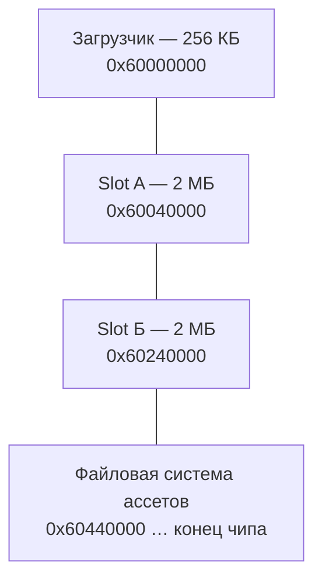
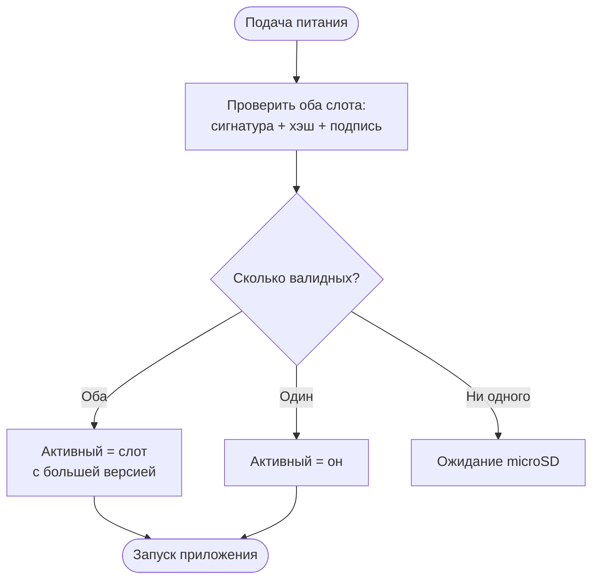
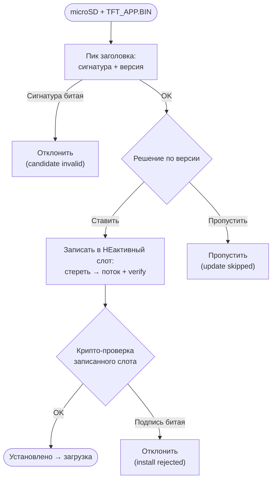
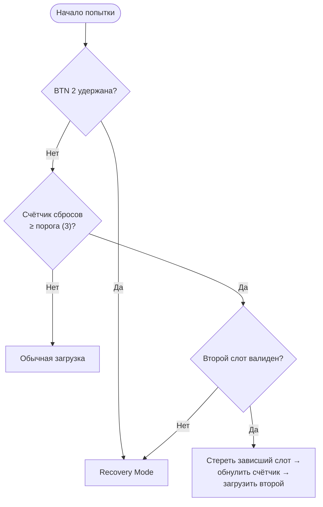
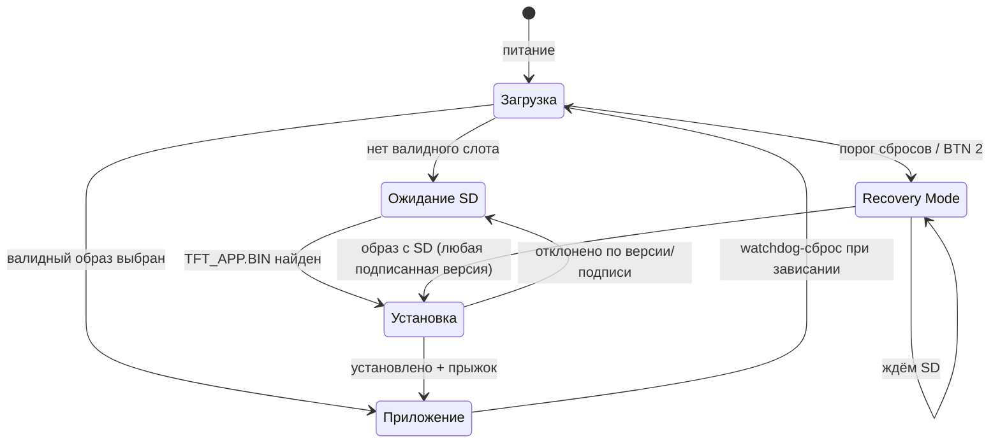

# Загрузчик TFT — принцип работы

Документ описывает поведение загрузчика: как устроена память, как выбирается и обновляется образ
приложения, правила версий, даунгрейд и режим восстановления. 

---

## 1. Карта памяти

Приложение хранится в QSPI NOR Flash в **двух слотах** — A и Б. Каждый слот содержит **полную,
самостоятельно валидную** копию приложения. Загрузчик занимает начало flash, за слотами идёт
отдельная область под ассеты (спрайты, звук), которая к процессу загрузки отношения не имеет.

| Область                  | Начало       | Размер        |
| ------------------------ | ------------ | ------------- |
| Загрузчик                | `0x60000000` | 256 КБ        |
| Slot A                   | `0x60040000` | 2 МБ          |
| Slot Б                   | `0x60240000` | 2 МБ          |
| Файловая система ассетов | `0x60440000` | до конца чипа |

**Приложение исполняется прямо из flash** (XIP) — из того слота, который выбрал
загрузчик, без копирования в ОЗУ. Из этого следует ключевое свойство: образ жёстко привязан к адресу
своего слота при сборке. Поэтому **релиз приложения — это два бинарника на одну версию**: один собран
под адрес Slot A, второй — под адрес Slot Б. Образ, физически положенный не в «свой» слот, пройдёт
проверку подписи, но не запустится.

Два слота нужны для безопасного обновления: пока приложение работает из одного слота, новый образ
пишется в другой. Рабочая копия никогда не затирается — на диске всегда есть чем загрузиться, даже
если обновление прервётся на середине.

---

## 2. Выбор образа при старте

На каждой подаче питания загрузчик решает, из какого слота запускать приложение.

**Слот считается кандидатом, только если он валиден целиком**: корректная сигнатура формата, целый
хэш содержимого и верная криптографическая подпись (ECDSA-P256). Битый или неподписанный слот
игнорируется.

Правила выбора:
- Оба слота валидны → активным становится слот с **большей версией**.
- Валиден только один → он и активен.
- Ни одного валидного → активного слота нет, загрузчик переходит в ожидание microSD.

**Защитная сеть от битого обновления.** Свежеустановленный образ считается «непроверенным», пока сам
не подтвердит своё здоровье в рантайме. Если непроверенный образ запустился, но так и не подтвердился
(например, завис на старте) — при следующей загрузке он трактуется как неудавшееся обновление и
**автоматически стирается**, а загрузчик откатывается на прежний слот. Приложение обязано подтвердить
себя один раз, доказав работоспособность.

---

## 3. Обновление через microSD

**Единственный полевой канал обновления — карта microSD.** Загрузчик ищет в корне карты файл
`TFT_APP.BIN` — подписанный образ приложения. Карта проверяется при старте и периодически (примерно
раз в 1.5 с), пока загрузчик находится в ожидании, — карту можно вставить уже после включения.

Приёмка кандидата — **двухступенчатая**:
1. **Проверка заголовка** (сигнатура формата + версия) прямо с карты, до касания flash — этого
   достаточно, чтобы решить «ставить или пропустить».
2. **Полная криптографическая проверка** — уже после записи в целевой слот. Если подпись битая,
   только что записанный слот просто не будет выбран при загрузке, и загрузчик останется на прежнем
   валидном образе.

Запись идёт **потоком по частям**, каждая записанная часть немедленно вычитывается обратно и
сверяется — битая страница ловится сразу.

**Целевой слот установки — всегда НЕ активный.** Работающий/загружаемый слот не перезаписывается
никогда. Если активного слота нет вообще (чистая плата) — по умолчанию Slot A.

**Заводской сценарий** — частный случай этой же логики: чистая плата с одним загрузчиком, оба слота
пусты. Загрузчик ждёт SD, при появлении `TFT_APP.BIN` ставит его в Slot A и загружается. Никакого
отдельного механизма первичной заливки нет.

---

## 4. Правила версий

Версия образа — **major.minor.revision**. Номер сборки (build) в сравнении **не участвует**: два
образа, отличающиеся только номером сборки, считаются равными.

Версия используется дважды:
- при **выборе** активного слота — побеждает бо́льшая версия;
- при **решении об установке** кандидата с SD.

Решение по кандидату (без удержания кнопки):

| Кандидат относительно активного | Действие                     |
| ------------------------------- | ---------------------------- |
| Строго новее                    | Установить в неактивный слот |
| Активного слота нет вообще      | Установить в Slot A          |
| Старше или равен                | Пропустить                   |

При штатном обновлении (кандидат новее) прежний активный слот **не стирается** — он естественным
образом проиграет сравнение версий при следующей загрузке, новый образ победит сам.

---

## 5. Даунгрейд

Установить образ **старее** уже стоящего можно только с помощью оператора: **удержать `BTN 1` в
момент подачи питания**. Кнопка считывается один раз на старте и действует всю сессию.

Ключевой момент: при обычном даунгрейде записать старый образ в свободный слот **недостаточно** —
прежний (более новый) активный слот остался бы валиден и снова победил бы по версии, и даунгрейд
физически лёг бы на flash, но не загрузился. Поэтому при форсированном даунгрейде прежний активный
слот **стирается** — но только **после** того, как новый образ уже записан и подтверждён валидным.
На диске никогда не бывает нуля рабочих слотов даже на середине операции.

| Условие                            | Действие                                              |
| ---------------------------------- | ----------------------------------------------------- |
| Кандидат старше + `BTN 1` удержана | Установить в свободный слот, стереть прежний активный |
| Кандидат равен активному + `BTN 1` | Пропустить (переустановку той же версии не форсируем) |

---

## 6. Режим восстановления (Recovery Mode)

Назначение — не дать полевой плате превратиться в «кирпич», если уже установленный образ зависает в
рантайме, и дать оператору ручной аварийный вход.

### Аппаратный сторож

Плата защищена аппаратным watchdog с таймаутом **10 секунд**. Если управление зависает где-либо
(включая рантайм приложения), через 10 с происходит аппаратный сброс. Watchdog взводится один раз и
до перезагрузки по питанию не выключается — он «переживает» переход в приложение, поэтому приложение
обязано периодически его «кормить». Зависание → гарантированный сброс, а не вечный локап.

### Счётчик и порог

Число **подряд идущих** watchdog-сбросов хранится в регистре, который переживает тёплый/watchdog-сброс
и обнуляется только при настоящей подаче питания (POR). Счётчик обнуляется также при успешной
установке нового образа и при откате на фолбэк. Порог срабатывания — **3** сброса подряд.

### Классификация отказов и их обработка

| Класс | Ситуация                                        | Что срабатывает                                       |
| ----- | ----------------------------------------------- | ----------------------------------------------------- |
| **A** | Новый образ завис, ещё не подтвердив себя       | Watchdog-сброс + автоматический откат на прежний слот |
| **B** | Уже подтверждённый образ завис в рантайме       | Счётчик сбросов достиг порога → фолбэк на второй слот |
| **C** | Откатываться некуда (единственный/оба зависают) | Recovery Mode                                         |
| **D** | Оператор хочет чистый старт вручную             | Recovery Mode по `BTN 2`                              |

Класс A — самый частый — закрыт полностью автоматически: откат непроверенного образа не требует ни
счётчика, ни вмешательства. Класс B ловит то, что откат не покрывает (образ-то подтверждён): после
порога зависший слот стирается, и загружается второй, если он валиден.

### Решение при старте

`BTN 2` проверяется **первым** — приоритет ручного входа выше и счётчика, и обычной загрузки, и
кнопки даунгрейда. Если `BTN 2` удержана, обычный путь загрузки не выполняется вообще, даже при
наличии валидного образа.

### Поведение в Recovery Mode

- **Прыжок в приложение подавлен** — это само по себе разрывает цикл зависаний.
- **Отдельная LED-индикация**: оба светодиода мигают синхронно, 100 мс включено / 100 мс выключено —
  явно отличается от heartbeat и рабочих паттернов приложения.
- **Статус по USB**: `recovery_mode`.
- **Ослабленный контроль версий**: принимается **любой** подписанный образ с SD — без сравнения
  версий и без кнопки. Проверка подписи при этом сохраняется всегда.
- При найденном валидном образе — **оба слота стираются**, образ ставится в Slot A, происходит
  автоматический прыжок. «Чистый борт» достигается ровно тогда, когда есть чем заменить.

### Семантика «на одну сессию»

Счётчик не сохраняется во flash. На подаче питания он обнуляется, поэтому зависший слот **пробуется
заново** — если зависание было случайным (транзиентным), плата получает новый шанс. Если зависание
детерминированное, оператор жмёт `BTN 2` и входит в recovery немедленно, не дожидаясь порога.

### Честная граница

Если образ стабильно работает, обнуляет счётчик (доказав здоровье), и лишь **потом** ловит редкий баг
(конкретный файл на SD, конкретное входное сообщение) — счётчик каждый раз обнуляется до зависания,
автопорог не накапливается, и цикл автоматически не ловится. Это принципиально: по таймеру не отличить
«здоров» от «здоров, но потом словил редкое». В таком случае плата видимо циклится (watchdog +
recovery-индикация это показывают), лечится SD-фиксом или `BTN 2`. Watchdog как минимум не даёт плате
зависнуть намертво.

---

## 7. Индикация и обратная связь

### Светодиоды

Полный словарь (установка, «железо не в порядке», ошибка образа, приоритет между ними) —
[LED_PATTERNS.md](LED_PATTERNS.md). Кратко:

| Состояние              | Паттерн                                          |
| ---------------------- | ------------------------------------------------ |
| Загрузчик жив, ждёт SD | Один LED: короткий импульс ~50 мс, пауза ~450 мс |
| Приложение работает    | Задаётся приложением                             |
| Recovery Mode          | Оба LED синхронно: 100 мс вкл / 100 мс выкл      |

### USB (виртуальный COM-порт)

Загрузчик поднимает USB-порт до обращения к SD, поэтому статусы видны, даже если оператор подключился
заранее. Обмен — текстовые JSON-строки.

Состояния (`status`):

| Значение         | Когда                                             |
| ---------------- | ------------------------------------------------- |
| `waiting_for_sd` | Нет валидного слота, ждём карту                   |
| `installing`     | Принято решение установить кандидата, идёт запись |
| `update_skipped` | Кандидат отклонён по версии                       |
| `recovery_mode`  | Плата в режиме восстановления                     |

Ошибки установки: `SD_CANDIDATE_INVALID` (битый заголовок), `SD_INSTALL_WRITE_FAILED` (сбой записи),
`SD_INSTALL_REJECTED` (записан, но подпись не прошла), `SD_DOWNGRADE_ERASE_FAILED`.

Статус сторожа (по запросу `wdog`): взведён ли watchdog, таймаут, был ли последний сброс по watchdog,
текущее значение счётчика сбросов и порог.

---

## 8. Полный жизненный цикл

---

## 9. Сводка сценариев

| Ситуация                                               | Поведение загрузчика                                                  |
| ------------------------------------------------------ | --------------------------------------------------------------------- |
| Оба слота валидны                                      | Загрузка слота с бо́льшей версией                                      |
| Валиден один слот                                      | Загрузка его                                                          |
| Чистая плата, оба слота пусты                          | Ожидание SD (бессрочно), heartbeat                                    |
| SD с образом новее активного                           | Установка в свободный слот → загрузка                                 |
| SD с образом старше/равным, кнопка не нажата           | Пропуск, загрузка прежнего                                            |
| SD с образом старше, `BTN 1` удержана                  | Даунгрейд: установка + стирание прежнего активного → загрузка старого |
| SD с битым заголовком / битой подписью                 | Отклонение, прежний валидный слот не тронут                           |
| Новый образ завис, не подтвердившись (Класс A)         | Watchdog-сброс → автоматический откат на прежний слот                 |
| Подтверждённый образ завис, есть второй слот (Класс B) | 3 сброса → стирание зависшего слота → загрузка второго                |
| Зависает, откатываться некуда (Класс C)                | Recovery Mode                                                         |
| Оператор удержал `BTN 2` при старте (Класс D)          | Recovery Mode немедленно, обычная загрузка подавлена                  |
| В recovery вставлена SD с подписанным образом          | Оба слота стёрты, образ в Slot A, автоматический прыжок               |
| POR после recovery без `BTN 2`                         | Счётчик обнулён, зависший слот пробуется заново                       |
