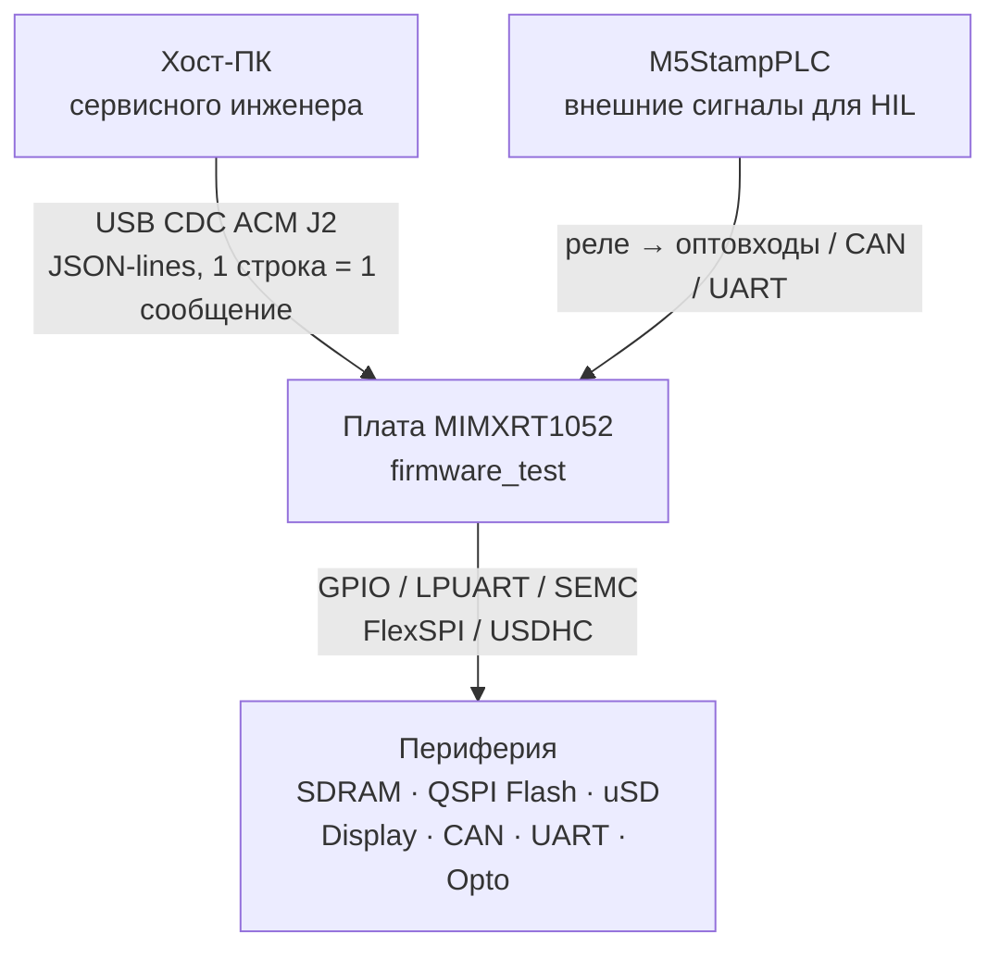
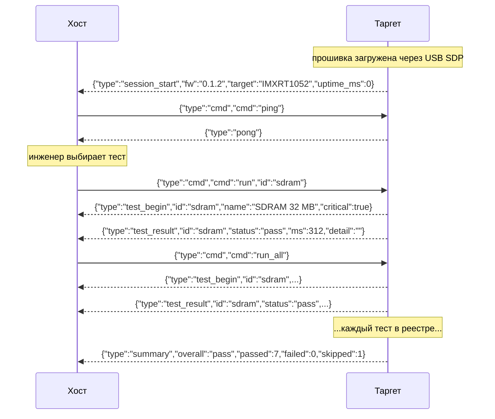
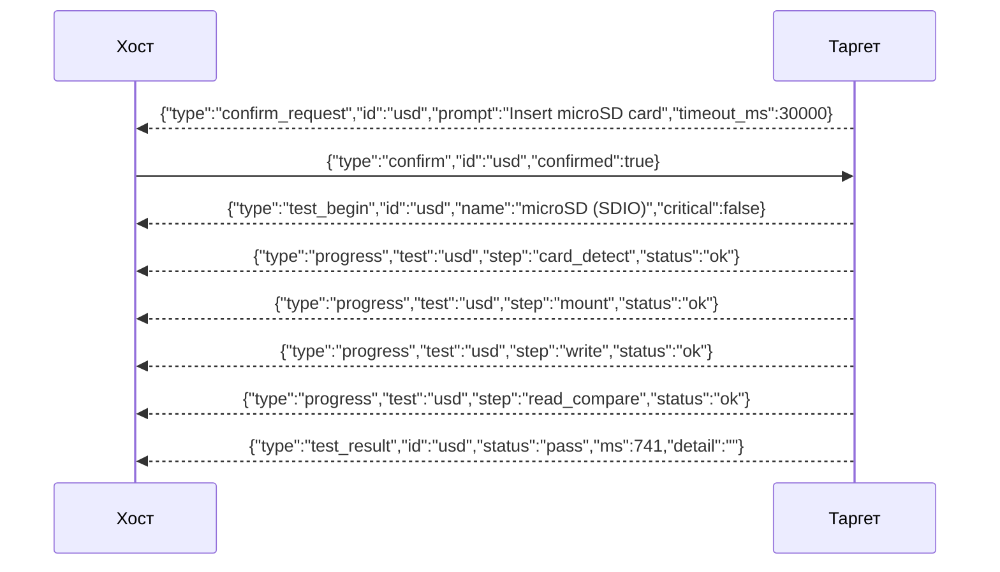
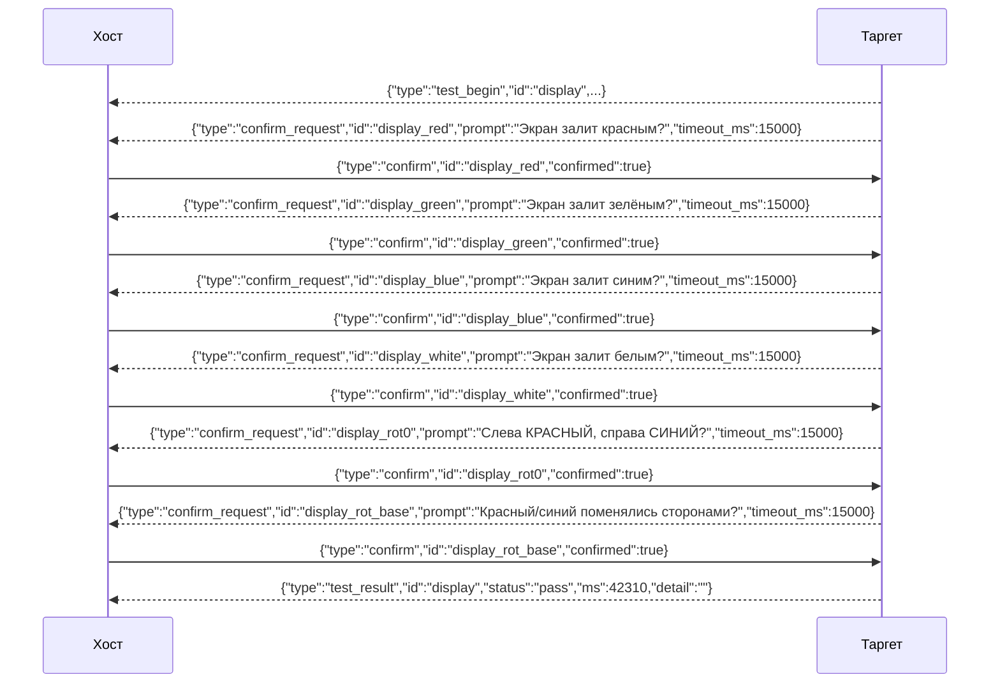
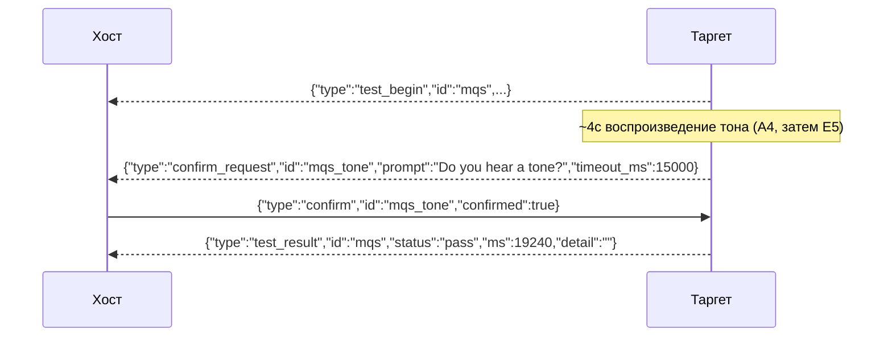
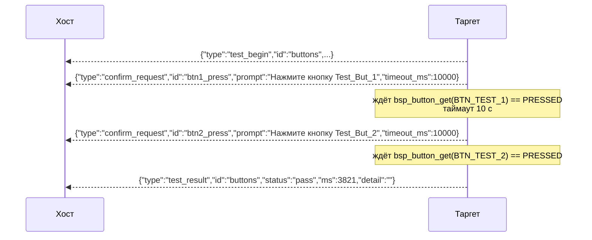
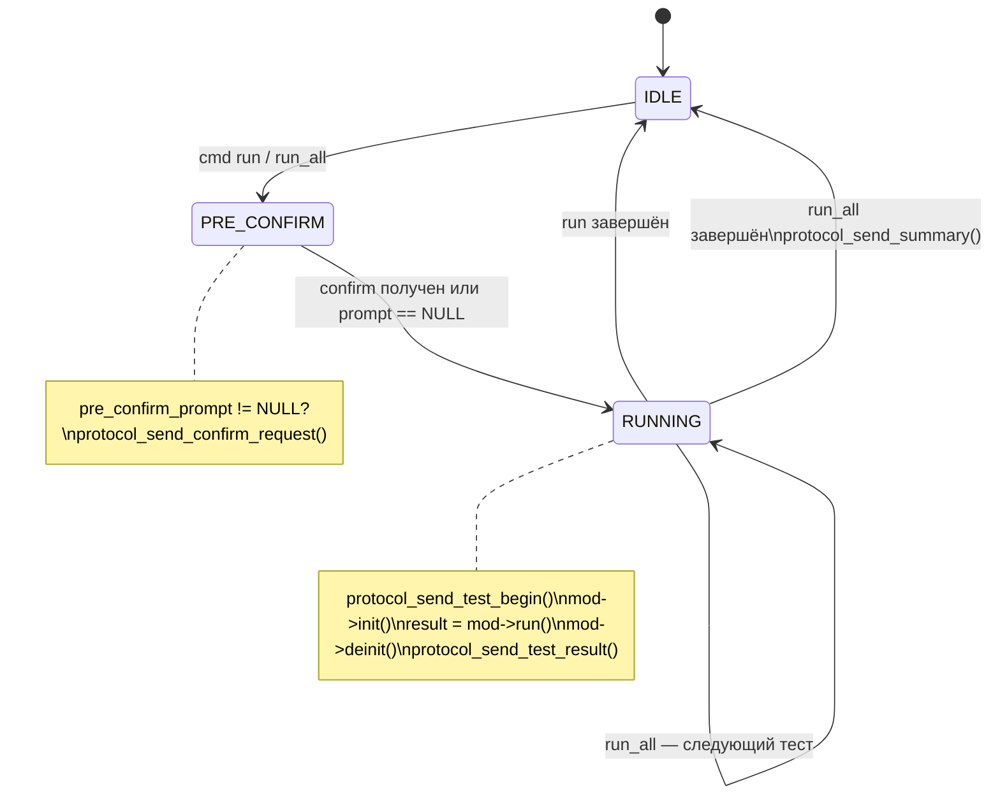

# firmware_test — Протокол диагностики v2

> **Расположение в репозитории:** `docs/testing/PROTOCOL.md`
>
> Документ описывает протокол обмена между диагностической прошивкой
> (`firmware_test`) и хостовым ПО сервисного инженера.
> Актуален для: `firmware_test v0.1.2+`, `protocol.h v2`.
>
> Полный справочник по каждому тесту (потоки, коды `detail`, таблица HIL
> реле) — в [firmware/test/README.md](../../firmware/test/README.md) и
> [firmware/test/src/tests/README.md](../../firmware/test/src/tests/README.md).
> Этот документ — сжатый протокольный обзор с точки зрения хостового ПО
> (TUI/pytest), а не полное описание тест-логики.

---

## Назначение и контекст

`firmware_test` — специализированная прошивка для диагностики плат
**MIMXRT1052CVJ5B**, вернувшихся по рекламации. Запускается сервисным
инженером через USB CDC ACM (разъём J2). Загружается через BootROM (USB SDP)
без предварительной прошивки загрузчика.



**Принцип работы:** вся тест-логика живёт на таргете (`test_runner.c`,
`tests/*.c`). Хост — тонкий клиент: отправляет команды, отображает события,
управляет интерактивными шагами. Инженер запускает тесты атомарно или все
подряд (`run_all`).

---

## Транспорт

| Параметр                  | Значение                                                     |
| ------------------------- | ------------------------------------------------------------ |
| Интерфейс                 | USB CDC ACM                                                  |
| Разъём                    | J2                                                           |
| Кодировка                 | UTF-8                                                        |
| Фреймирование             | JSON-lines: каждое сообщение — одна строка, завершается `\n` |
| Максимальная длина строки | 128 байт (включая `\n`)                                      |
| CR+LF                     | Принимается (таргет отбрасывает `\r` перед `\n`)             |
| Направление               | Двунаправленный, half-duplex по логике                       |

Нет хэндшейка, нет sequence number, нет подтверждений доставки.

---

## Формат сообщений

Все сообщения — JSON-объекты в одну строку (`\n` в конце). Поле `"type"`
определяет смысл сообщения:

```bash
Хост → Таргет:   "type": "cmd"       — команда
                 "type": "confirm"    — ответ оператора на интерактивный шаг

Таргет → Хост:   "type": "session_start"   — таргет готов
                 "type": "pong"             — ответ на ping
                 "type": "test_begin"       — тест стартовал
                 "type": "progress"         — промежуточный шаг теста
                 "type": "test_result"      — тест завершён
                 "type": "confirm_request"  — ожидание действия оператора
                 "type": "summary"          — итог run_all
                 "ok": false, "error": "…"  — ошибка протокола
```

---

## Жизненный цикл сессии



`session_start` отправляется автоматически при каждом старте таргета, до
получения первой команды.

---

## Команды хоста → таргет

### `ping`

```json
→ {"type":"cmd","cmd":"ping"}
← {"type":"pong"}
```

### `run` — запуск одного теста

```json
→ {"type":"cmd","cmd":"run","id":"sdram"}
← {"type":"test_begin","id":"sdram","name":"SDRAM 32 MB","critical":true}
← {"type":"test_result","id":"sdram","status":"pass","ms":312,"detail":""}
```

Если `id` не найден: `← {"ok":false,"error":"UNKNOWN_TEST"}`

### `run_all` — запуск всех тестов

Если тест помечен `"critical":true` и вернул `"fail"` — выполнение
прерывается, остальные получают `"skip"`.

```json
→ {"type":"cmd","cmd":"run_all"}
← {"type":"test_begin","id":"sdram",...}
← {"type":"test_result","id":"sdram","status":"pass",...}
← ... (каждый тест в реестре) ...
← {"type":"summary","passed":7,"failed":0,"skipped":1,"overall":"pass"}
```

### `list_tests` — получить список тестов

Таргет возвращает реестр тестов с метаданными. TUI строит список
динамически на основе этого ответа, не хардкодит тесты.

```json
→ {"type":"cmd","cmd":"list_tests"}
← {"type":"test_list","tests":[
     {"id":"sdram","name":"SDRAM 32 MB","critical":true,"requires_hil":false},
     {"id":"qspi","name":"QSPI Flash W25Qxx","critical":true,"requires_hil":false},
     {"id":"usd","name":"microSD (SDIO)","critical":false,"requires_hil":false},
     {"id":"display","name":"TFT Display RGB888","critical":false,"requires_hil":false},
     {"id":"buttons","name":"Test Buttons","critical":false,"requires_hil":false},
     {"id":"mqs","name":"MQS Audio Out","critical":false,"requires_hil":false},
     {"id":"can","name":"CAN loopback","critical":false,"requires_hil":true},
     {"id":"opto","name":"Opto Inputs","critical":false,"requires_hil":true}
   ]}
```

### `get_uid` — чтение уникального идентификатора чипа

Запрос UID из OCOTP. Может быть отправлен в любой момент когда runner не BUSY.

```json
→ {"type":"cmd","cmd":"get_uid"}
← {"type":"uid_response","uid":"AABBCCDDEEFF0011"}
```

`uid` — 16 hex-символов (8 байт big-endian): CFG1[63:32] + CFG0[31:0].

При ошибке чтения OCOTP:

```json
← {"ok":false,"error":"UID_READ_ERR"}
```

### `get_version` — чтение версии прошивки

```json
→ {"type":"cmd","cmd":"get_version"}
← {"type":"version_response","fw":"0.1.2"}
```

Дублирует значение `"fw"` из `session_start` — полезно, если хост
подключился уже после того, как `session_start` был отправлен (может быть
пропущен, это одноразовое событие сразу после старта).

### `run_selected` — запуск подмножества тестов

Запускает тесты по списку ID. Порядок выполнения — по реестру таргета,
не по порядку в запросе. Таргет не фильтрует по `requires_hil` —
ответственность за фильтрацию HIL-тестов лежит на TUI.

```json
→ {"type":"cmd","cmd":"run_selected","tests":["sdram","qspi","display"]}
← {"type":"test_begin","id":"sdram","name":"SDRAM 32 MB","critical":true}
← {"type":"test_result","id":"sdram","status":"pass","ms":312,"detail":""}
← {"type":"test_begin","id":"qspi",...}
← {"type":"test_result","id":"qspi",...}
← {"type":"test_begin","id":"display",...}
← {"type":"test_result","id":"display",...}
← {"type":"summary","passed":3,"failed":0,"skipped":0,"overall":"pass"}
```

Если хотя бы один ID не найден в реестре — ни один тест не запускается:

```json
← {"ok":false,"error":"UNKNOWN_TEST"}
```

---

## События таргета → хост

### `session_start`

```json
{"type":"session_start","fw":"0.1.2","target":"IMXRT1052","uptime_ms":0}
```

### `test_begin`

```json
{"type":"test_begin","id":"sdram","name":"SDRAM 32 MB","critical":true}
```

### `test_result`

```json
{"type":"test_result","id":"sdram","status":"pass","ms":312,"detail":""}
```

| `status` | Смысл                                                                   |
| -------- | ----------------------------------------------------------------------- |
| `"pass"` | Тест пройден                                                            |
| `"fail"` | Тест провален; `detail` содержит описание                               |
| `"skip"` | Пропущен (нет оборудования, таймаут оператора, прерван `critical` fail) |

`detail` — ASCII-строка до 95 символов. При `pass` — пустая.

### `test_list`

Ответ на `list_tests` — массив дескрипторов теста (`id`, `name`,
`critical`, `requires_hil`), см. пример в разделе `list_tests` выше.

### `progress`

```json
{"type":"progress","test":"usd","step":"mount","status":"ok"}
```

Промежуточные шаги внутри теста. Используется в `usd`.

### `uid_response` / `version_response`

Ответы на `get_uid`/`get_version` — см. описание соответствующих команд
выше.

### `confirm_request`

```json
{
  "type":       "confirm_request",
  "id":         "display_red",
  "prompt":     "Экран залит красным цветом?",
  "timeout_ms": 15000
}
```

Хост отображает `prompt` оператору. Авторитетный таймаут — на таргете;
если оператор не ответил за `timeout_ms` — таргет переходит в `SKIP`.

### `summary`

```json
{"type":"summary","passed":6,"failed":1,"skipped":0,"overall":"fail"}
```

`"overall": "fail"` если хотя бы один `critical` тест провален.

### `confirm` (хост → таргет)

```json
→ {"type":"confirm","id":"display_red","confirmed":true}
```

`"id"` должен совпадать с `id` из `confirm_request`. Ответ после `timeout_ms`
игнорируется.

### Ошибки протокола

| Код             | Причина                                                                    |
| --------------- | -------------------------------------------------------------------------- |
| `PARSE_ERR`     | Строка не является валидным JSON-lines запросом                            |
| `UNKNOWN_CMD`   | Поле `"cmd"` содержит неизвестное значение                                 |
| `UNKNOWN_TEST`  | Поле `"id"` в `run` или `"tests"` в `run_selected` содержит неизвестный ID |
| `LINE_TOO_LONG` | Входящая строка превысила 128 байт                                         |
| `BUSY`          | Таргет выполняет тест, новая команда отклонена                             |
| `UID_READ_ERR`  | `bsp_prov_read_uid()` вернул ошибку (ответ на `get_uid`)                    |

---

## Матрица тестов

Порядок — как в реестре `k_registry[]` (`test_runner.c`); полная версия с
кодами `detail` и HIL-таблицей реле — в
[firmware/test/README.md §Матрица тестов](../../firmware/test/README.md#матрица-тестов).

| ID        | Название            | Тип                | Critical | HIL (M5) | Интерактивный        |
| --------- | ------------------- | ------------------ | -------- | -------- | --------------------- |
| `sdram`   | SDRAM 32 MB         | self               | ✅        | ❌        | ❌                     |
| `qspi`    | QSPI Flash W25Qxx   | self               | ✅        | ❌        | ❌                     |
| `usd`     | microSD (SDIO)      | self + interactive | ❌        | ❌        | ✅ (вставить карту)     |
| `display` | TFT Display RGB888  | interactive        | ❌        | ❌        | ✅ (6 шагов, см. ниже)  |
| `buttons` | Test Buttons        | interactive        | ❌        | ❌        | ✅ (нажать кнопки)      |
| `opto`    | Opto Inputs         | HIL                | ❌        | ✅        | ❌ (авто, 6 шагов)      |
| `can`     | CAN loopback        | HIL                | ❌        | ✅        | ❌ (авто, 2 шага)       |
| `mqs`     | MQS Audio Out       | interactive        | ❌        | ❌        | ✅ (слышимость тона)    |

**Типы:** **self** — таргет тестирует периферию самостоятельно; **interactive** —
требует `confirm_request`, отвечает оператор; **HIL** — требует M5StampPLC,
confirm автоматический (без оператора).

---

## Интерактивные тесты — детальный поток

### uSD



При отказе (`"confirmed":false`) или таймауте:

```json
← {"type":"test_begin","id":"usd","name":"microSD (SDIO)","critical":false}
← {"type":"test_result","id":"usd","status":"skip","ms":0,"detail":"operator declined"}
```

### Display (RGB888)

Шесть шагов: Red → Green → Blue → White, затем два ротационных (диагностика
непропаянных LR/UD пинов на TFT7/8/10). Тест прерывается на **первом**
неподтверждённом шаге.



При отказе/таймауте на любом шаге: `status:"fail"`,
`detail:"<id> not confirmed"` (например, `"display_white not confirmed"`).

### MQS Audio Out

Таргет ~4с играет мелодию через MQS + усилитель, затем запрашивает
подтверждение слышимости — единственный тест с аудио-confirm:



Отказ/таймаут → `status:"fail"`, `detail:"operator: no sound"`.

### Кнопки



> **Важно:** для теста кнопок таргет **не ждёт** `{"type":"confirm",…}` от
> хоста. Нажатие детектируется прошивкой через `bsp_button`. Хост отображает
> `prompt` и ждёт следующего события от таргета.

---

## State machine test_runner



---

## Реализация на стороне таргета

```bash
firmware/test/src/
├── main.c           — инициализация, главный цикл, вызов cli_process()
├── cli.h / cli.c    — IO-слой: буферизация строк, диспатч по "type"
├── protocol.h / .c  — сериализация исходящих событий через cli_send()
├── test_module.h    — интерфейс тест-модуля (struct test_module_t)
├── test_runner.h/.c — реестр тестов, state machine, confirm механизм
└── tests/
    ├── test_sdram.c
    ├── test_qspi.c
    ├── test_usd.c
    ├── test_display.c
    ├── test_buttons.c
    ├── test_opto.c
    ├── test_can.c
    └── test_mqs.c
```

### Добавление нового теста

Пошаговый гайд с шаблонами (self-тест, интерактивный, pre-confirm) —
[firmware/test/README.md §Как добавить новый тест](../../firmware/test/README.md#как-добавить-новый-тест).

---

## Рекомендации для разработчика хостового ПО

**Открытие порта:** найти CDC ACM устройство → открыть порт → ждать
`"type":"session_start"` (таймаут 10 с) → при отсутствии переоткрыть порт.

**Чтение событий:** буферизировать до `'\n'`; одна строка = одно сообщение;
неизвестный `"type"` — игнорировать (forward-compatibility).

**Отправка команд:** завершать каждую строку `'\n'` (не `'\r\n'`); не
отправлять следующую команду до `test_result` или `error` от предыдущей.
Исключение: `"ping"` можно отправлять в любой момент, если таргет не BUSY.

**Обработка `confirm_request`:** отобразить `prompt` → ждать реакции
оператора → отправить `{"type":"confirm","id":"<тот же id>","confirmed":true/false}`.
Исключение — тест `buttons`: не отправлять `confirm`, просто ждать следующего
события от таргета.

---

## Версионирование протокола

Поле `"fw"` в `session_start` — версия прошивки. При несовместимых изменениях
протокола — bump `FIRMWARE_TEST_VERSION` в `protocol.h` с обновлением этого
документа. Хост должен проверять `"fw"` и предупреждать оператора при
несовпадении ожидаемой версии.
