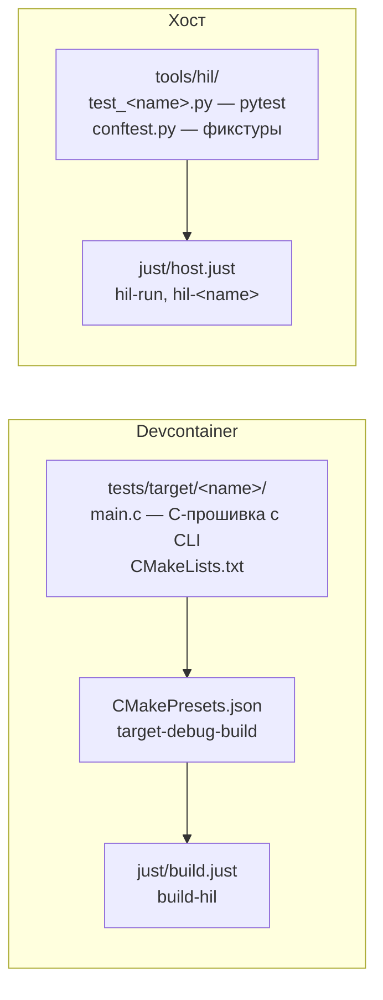
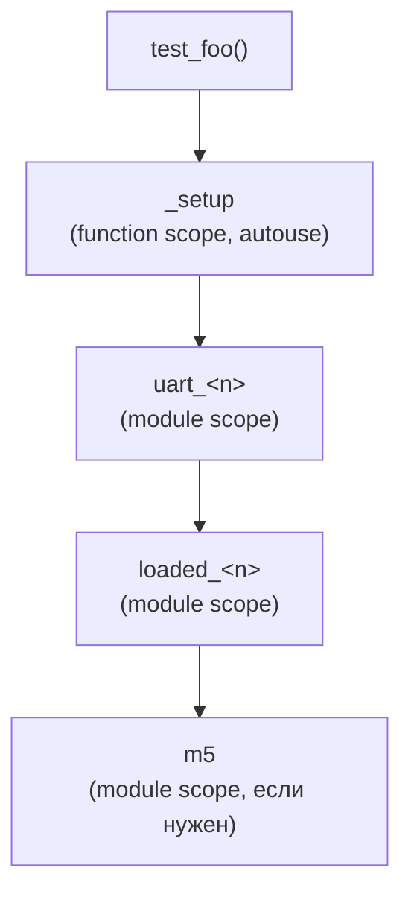

# Добавление нового HIL-теста

## Обзор стека



Три типа тестов:

| Тип               | Использует M5 | Запуск                | Когда применять                                       |
| ----------------- | ------------- | --------------------- | ----------------------------------------------------- |
| **Базовый**       | Нет           | `hil-run`             | UART CLI, алгоритмы, тайминги                         |
| **С M5**          | Да            | `hil-run`             | GPIO, оптовходы, реле, питание                        |
| **Интерактивный** | Нет / Да      | `hil-run-interactive` | Периферия требует действий оператора: кнопки, дисплей |

Интерактивные тесты помечаются `@pytest.mark.interactive` и **не входят в `hil-run`**.

---

## Шаг 1 — C-прошивка: `tests/target/<name>/`

### `main.c` — шаблон

```c
#include "board.h"
#include "bsp/led.h"
#include "bsp/tick.h"
#include "bsp/uart_host.h"
#include <string.h>

#define CLI_BAUD_RATE  115200U
#define CLI_LINE_MAX   128U
#define CLI_RX_TIMEOUT 100U

static size_t cli_read_line(uint8_t *p_buf, size_t max_len)
{
    size_t pos = 0U;
    while (pos < (max_len - 1U)) {
        int32_t byte = bsp_uart_host_read_byte(CLI_RX_TIMEOUT);
        if (byte < 0)           break;
        if ((char)byte == '\r') continue;
        if ((char)byte == '\n') break;
        p_buf[pos++] = (uint8_t)byte;
    }
    p_buf[pos] = '\0';
    return pos;
}

static void cli_process_line(const char *p_line)
{
    if (strncmp(p_line, "PING", 4U) == 0) {
        bsp_uart_host_write_str("PONG\r\n");
    }
    /* TODO: добавить команды */
    else if (p_line[0] != '\0') {
        bsp_uart_host_write_str("ERR_UNKNOWN\r\n");
    }
}

int main(void)
{
    board_hw_init();
    bsp_tick_init();
    bsp_led_init();
    bsp_uart_host_init(CLI_BAUD_RATE);
    bsp_led_on(LED_HEARTBEAT);

    while (bsp_uart_host_rx_available() == 0U) {
        bsp_uart_host_write_str("READY\r\n");
        bsp_delay(200U);
    }

    static uint8_t s_line_buf[CLI_LINE_MAX];
    for (;;) {
        size_t len = cli_read_line(s_line_buf, sizeof(s_line_buf));
        if (len > 0U) cli_process_line((const char *)s_line_buf);
    }
}
```

### `CMakeLists.txt`

```cmake
set(TARGET_NAME test_<name>)

add_executable(${TARGET_NAME}
    main.c
    ${BSP_GENERATED}/clock_config.c
    ${BSP_STARTUP_FILE}
    ${BSP_SYSCALLS_FILE}
)

target_link_options(${TARGET_NAME} PRIVATE
    -T${CMAKE_SOURCE_DIR}/cmake/linker/MIMXRT1052xxxxx_ram.ld
    -Wl,--gc-sections
    -Wl,--print-memory-usage
    -Wl,-Map=${CMAKE_CURRENT_BINARY_DIR}/${TARGET_NAME}.map
)

target_link_libraries(${TARGET_NAME} PRIVATE
    bsp_boot_ram
    bsp_board
    bsp_led
    bsp_tick
    bsp_uart_host
    # + bsp_opto / bsp_can / ... если нужно
)

add_custom_command(TARGET ${TARGET_NAME} POST_BUILD
    COMMAND ${CMAKE_SIZE} $<TARGET_FILE:${TARGET_NAME}>
    COMMENT "Size: ${TARGET_NAME}")
```

---

## Шаг 2 — Подключить в `tests/target/CMakeLists.txt`

```cmake
add_subdirectory(host_uart)
add_subdirectory(hil_opto)
add_subdirectory(<name>)   # ← добавить
```

---

## Шаг 3 — `CMakePresets.json`: добавить таргет

```json
{
    "name": "target-debug-build",
    "configurePreset": "target-debug",
    "targets": [
        "test_host_uart",
        "test_hil_opto",
        "test_<name>"
    ]
}
```

---

## Шаг 4 — Собрать

```bash
# В devcontainer:
just build::build-hil

# Проверить:
ls build/target-debug/tests/target/<name>/test_<name>.elf
```

---

## Шаг 5 — `conftest.py`: добавить фикстуры

### Любой тест — фикстура загрузки всегда зависит от `m5`

M5StampPLC управляет питанием таргета (RLY1 → VIN, см. `HIL_BENCH.md`), а
не только сигнальными реле — поэтому `loaded_<n>` зависит от `m5` **во всех
случаях**, даже если сам тест не использует реле для сигналов (например,
`01_test_uart.py`/`loaded_host_uart`). Без этой зависимости pyOCD попытается
подключиться к обесточенной плате.

```python
# 1. Фикстура загрузки — m5 гарантирует, что питание включено до pyOCD
@pytest.fixture(scope="module")
def loaded_<n>(request: pytest.FixtureRequest, m5: M5Agent) -> None:
    _load_elf(
        request,
        Path(cfg.BUILD_DIR) / "tests/target/<n>/test_<n>.elf",
    )

# 2. UART-фикстура — одна строка в словарь
_UART_FIXTURE_MAP = {
    ...
    "uart_<n>": "loaded_<n>",
}
```

Различие между «базовым» и «с M5» тестом — не в сигнатуре `loaded_<n>`
(она всегда одна и та же), а в том, использует ли сам **тест-кейс**
`m5.opto_set()`/`m5.relay_set()`/`m5.can_*()` для управления сигналами
помимо включения питания (см. пример «Тест с M5» в Шаге 6 ниже).

---

## Шаг 6 — `tools/hil/test_<name>.py`

### Базовый тест

```python
"""test_<name>.py — HIL тест <что тестируем>."""
import pytest
from conftest import uart_cmd


class Test<Name>:

    @pytest.fixture(autouse=True)
    def _setup(self, uart_<name>):
        self.ser = uart_<name>

    def test_ping(self):
        assert uart_cmd(self.ser, "PING") == "PONG"

    def test_something(self):
        assert uart_cmd(self.ser, "MY_CMD") == "EXPECTED"
```

### Тест с M5

```python
"""test_<name>.py — HIL тест через M5StampPLC."""
import time
import pytest
from conftest import uart_cmd

SETTLE_S = 0.15


class Test<Name>:

    @pytest.fixture(autouse=True)
    def _setup(self, uart_<name>, m5):
        self.ser = uart_<name>
        self.m5 = m5
        self.m5.opto_all_off()
        time.sleep(SETTLE_S)

    def test_ping(self):
        assert uart_cmd(self.ser, "PING") == "PONG"

    def test_something_with_relay(self):
        self.m5.opto_set(1, True)
        time.sleep(SETTLE_S)
        assert uart_cmd(self.ser, "READ_INPUT") == "ACTIVE"
```

Для критичных к скорости тестов — активное ожидание вместо фиксированного `sleep`:

```python
def wait_until(ser, cmd, expected, timeout_s=1.0):
    deadline = time.monotonic() + timeout_s
    while time.monotonic() < deadline:
        if uart_cmd(ser, cmd) == expected:
            return
        time.sleep(0.02)
    raise TimeoutError(f"Ожидали {expected!r} от '{cmd}'")
```

### Интерактивный тест

```python
"""test_<name>.py — интерактивный HIL-тест."""
import time
import pytest
from conftest import uart_cmd

SETTLE_S = 0.10


def _operator_prompt(msg: str) -> None:
    """Вывести подсказку и ждать Enter. Читает /dev/tty напрямую — работает
    независимо от захвата pytest."""
    with open("/dev/tty", "w") as tty_out:
        tty_out.write(f"\n  >>> {msg}\n      Нажмите Enter когда готово...\n")
        tty_out.flush()
    with open("/dev/tty", "r") as tty_in:
        tty_in.readline()
    time.sleep(SETTLE_S)


@pytest.mark.interactive
class Test<Name>:

    @pytest.fixture(autouse=True)
    def _setup(self, uart_<name>):
        self.ser = uart_<name>

    def test_ping(self):
        assert uart_cmd(self.ser, "PING") == "PONG"

    def test_something(self):
        _operator_prompt("Выполни действие X на плате")
        assert uart_cmd(self.ser, "MY_CMD") == "EXPECTED"
```

Запуск: `just host::hil-run-interactive` или `just host::hil-<name>` (с флагом `-s`).

---

## Шаг 7 — `just/host.just`: добавить рецепт (опционально)

```just
[doc('Запустить HIL-тест <name>')]
[group('hil')]
hil-<name>:
    HIL_BUILD_DIR={{ _hil_build }} \
        uv run --directory {{ HIL_DIR }} pytest test_<name>.py -v
```

Для интерактивных — добавить флаг `-s`:

```just
[doc('Запустить HIL-тест <n> (интерактивный, требует оператора)')]
[group('hil')]
hil-<n>:
    HIL_BUILD_DIR={{ _hil_build }} \
        uv run --directory {{ HIL_DIR }} pytest test_<n>.py -s -v
```

---

## Как работают фикстуры



`scope=module` — фикстура создаётся один раз на весь тест-файл. ELF грузится
один раз, порт открывается один раз.

**Порядок при нескольких файлах:** каждый файл — своя загрузка ELF, свой
UART-сеанс. MCU перезагружается между файлами.

---

## Чеклист

### Автоматический тест

```bash
[ ] tests/target/<n>/main.c              — C-прошивка с CLI + READY-паттерн
[ ] tests/target/<n>/CMakeLists.txt      — сборка с bsp_boot_ram
[ ] tests/target/CMakeLists.txt          — add_subdirectory(<n>)
[ ] CMakePresets.json                    — добавить test_<n> в targets
[ ] tools/hil/conftest.py                — loaded_<n> + строка в _UART_FIXTURE_MAP
[ ] tools/hil/test_<n>.py               — pytest-тесты
[ ] just/host.just                       — рецепт hil-<n> (опционально)
[ ] just build::build-hil                — зелёная сборка
[ ] just host::hil-<n>                  — зелёный прогон
```

### Дополнительно для интерактивного теста

```bash
[ ] @pytest.mark.interactive             — пометить класс в test_<n>.py
[ ] just/host.just                       — рецепт hil-<n> с флагом -s
[ ] just host::hil-run-interactive       — зелёный прогон
[ ] убедиться что just host::hil-run     — НЕ включает этот тест
```
