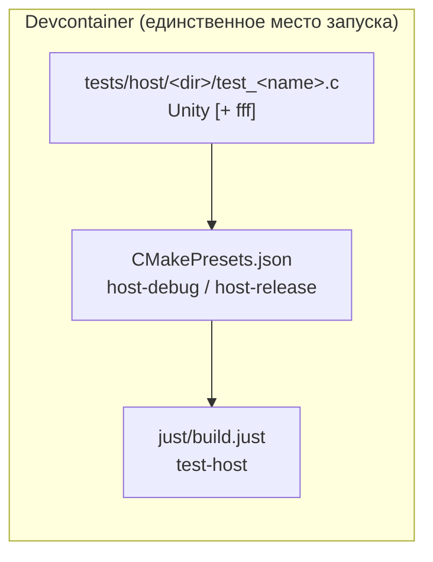

# Добавление нового host unit-теста

Пошаговый гайд для разработчика. Полный справочник по Unity/FFF API,
структуре stub-хедеров и типичным ловушкам — в
[tests/host/README.md](../../../tests/host/README.md). Этот документ —
только про шаги добавления нового теста в сборку.

---

## Обзор стека



Host-тесты компилируются `clang-17` **на хосте** (не ARM GCC), исполняются
как обычные нативные бинарники под `ctest`. Никакого железа не требуется —
в отличие от HIL-тестов (см. [../hil/HIL_CREATE_TEST.md](../hil/HIL_CREATE_TEST.md)).

---

## Шаг 0 — Определить категорию модуля

| Категория                                | Инструментарий    | Пример                             |
| ----------------------------------------- | ------------------ | ----------------------------------- |
| **A** — платформонезависимый             | Только Unity       | `protocol.c`, `test_runner.c`, `ring_buffer.c` |
| **B** — BSP-модуль (зависит от NXP SDK)  | Unity + fff + stub-хедеры | `bsp/led`, `bsp/opto`, `bsp/can`, `bsp/button` |

Полное объяснение разницы и структуры — в
[tests/host/README.md §1](../../../tests/host/README.md#1-две-категории-тестируемых-модулей).

---

## Шаг 1 — Создать тестовый файл

```bash
mkdir -p tests/host/<name>/
touch tests/host/<name>/test_<name>.c
```

### Шаблон — категория A (без моков)

```c
#include "unity.h"
#include "<модуль>.h"   /* тестируемый модуль */

void setUp(void)    { /* сброс состояния если нужен */ }
void tearDown(void) { }

void test_something(void)
{
    TEST_ASSERT_EQUAL(expected, actual);
}

int main(void)
{
    UNITY_BEGIN();
    RUN_TEST(test_something);
    return UNITY_END();
}
```

### Шаблон — категория B (с fff-фейками)

```c
#include "unity.h"
#include "fff.h"

DEFINE_FFF_GLOBALS; /* ровно один раз на файл */

/* 1. Stub-хедер с типами NXP SDK */
#include "fsl_gpio.h"

/* 2. Фейки для функций, которые вызывает тестируемый модуль */
FAKE_VOID_FUNC(GPIO_PinInit, GPIO_Type *, uint32_t, const gpio_pin_config_t *);
FAKE_VOID_FUNC(GPIO_PinWrite, GPIO_Type *, uint32_t, uint8_t);

/* 3. Тестируемый модуль — ПОСЛЕ фейков */
#include "bsp/<module>.h"

void setUp(void)
{
    RESET_FAKE(GPIO_PinInit);
    RESET_FAKE(GPIO_PinWrite);
    FFF_RESET_HISTORY();
}

void tearDown(void) { }

void test_something(void)
{
    TEST_ASSERT_EQUAL_UINT8(0U, GPIO_PinWrite_fake.arg2_val);
}

int main(void)
{
    UNITY_BEGIN();
    RUN_TEST(test_something);
    return UNITY_END();
}
```

Если тестируемому модулю не хватает stub-хедера (новый SDK-вызов) —
добавить минимальные типы/сигнатуры в `tests/host/mocks/` (только то, что
реально используется — не копировать весь SDK-хедер).

---

## Шаг 2 — Зарегистрировать в `tests/host/CMakeLists.txt`

```cmake
# категория A — платформонезависимый, без MOCKS
add_host_test(
  NAME    test_<name>
  SOURCES <name>/test_<name>.c
          ${PROJECT_SOURCE_DIR}/<путь-к-модулю>/<module>.c
  INCLUDES ${PROJECT_SOURCE_DIR}/<путь-к-инклюдам>
)

# категория B — BSP-модуль, нужны MOCKS
add_host_test(
  NAME    test_<name>
  SOURCES <name>/test_<name>.c
          ${PROJECT_SOURCE_DIR}/bsp/<name>/src/<name>.c
  INCLUDES ${PROJECT_SOURCE_DIR}/bsp/<name>/include
           ${PROJECT_SOURCE_DIR}/bsp/common/include
  MOCKS   ${BSP_MOCKS_DIR}
)
```

`add_host_test()` — вспомогательная CMake-функция, определённая в начале
того же файла (`NAME`/`SOURCES`/`INCLUDES`/`MOCKS`). Каждый тест — свой
исполняемый файл; `MOCKS` подключает `tests/host/mocks/` в include path
**раньше** реального SDK, `INCLUDES` — явные пути, специфичные для теста
(без скрытых глобальных путей). Если модуль использует `bsp_uart_host` через
готовый мок — смотри пример `uart_host_mock_example` в том же файле.

Если тест компилируется с seam-макросом (как `test_runner.c` с
`-DUNIT_TEST`, см. `firmware/test/README.md` §UNIT_TEST seam) — добавить:

```cmake
target_compile_definitions(test_<name> PRIVATE UNIT_TEST)
```

---

## Шаг 3 — Собрать и прогнать

```bash
# конфигурация (один раз или после изменения CMakeLists)
cmake --preset host-debug

# сборка + тесты одной командой
just build::test-host

# конкретный тест с полным выводом Unity
ctest --preset host-debug-test -R test_<name> -V

# напрямую — без обёртки CTest
./build/host-debug/tests/host/test_<name>
```

`just build::test-host` собирает под пресетом `host-debug` (`clang-17`,
без ARM-специфики) и прогоняет весь набор через CTest. `host-release`
собирает тот же набор с оптимизациями — используется в CI как
дополнительный гейт.

---

## Чеклист

```bash
[ ] tests/host/<name>/test_<name>.c   — тест-файл (категория A или B)
[ ] tests/host/mocks/*.h              — новый stub-хедер, если модуль
                                         использует ранее не замоканный SDK-вызов
[ ] tests/host/CMakeLists.txt         — add_host_test(...) для нового теста
[ ] just build::test-host             — зелёная сборка + прогон
```

---

## Справочник

Полный API Unity (assertion-макросы), fff (создание фейков, `custom_fake`,
проверка вызовов), работа со stub-хедерами и типичные ловушки (dangling
pointer из `arg_history`, `static`-функции, `ScopeMismatch`-аналоги для
host-тестов) — в [tests/host/README.md](../../../tests/host/README.md).
