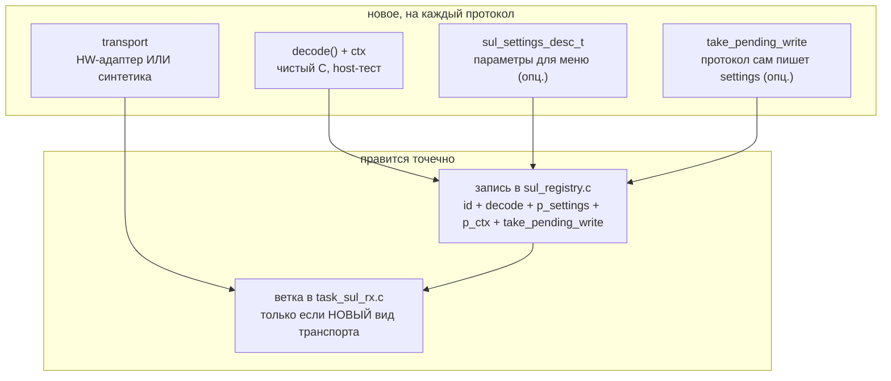

# tft-app — как добавить протокол СУЛ

Пошаговое руководство по добавлению нового протокола в реестр `sul` (ARCH.md §6, §8). Разбор —
на двух реальных драйверах: [nku_can](../../firmware/tft_app/src/domain/sul/nku_can/) (реальная
шина, CAN) и [demo](../../firmware/tft_app/src/domain/sul/demo/) (синтетический источник) —
ссылки на конкретные файлы вместо абстрактных описаний.

Проектная основа — [ARCH.md §6, §8](../../firmware/tft_app/ARCH.md); путь данных decode()→экран —
[DOMAIN_DATAFLOW.md](DOMAIN_DATAFLOW.md); меню/настройки — [MENU.md](MENU.md). Здесь — «что
конкретно создать и куда положить», по опыту Фазы 3.3 (первый протокол, добавленный ПОСЛЕ того,
как дескрипторный механизм и реестр перестали быть однопротокольными) и Фазы 3.5 (удалённая
адресация НКУ-CAN — первый случай, когда протокол сам инициирует запись в settings).

---

## 1. Что строим — 5 частей (2 опциональны)



| Часть | Обязательна? | НКУ-CAN | Демо |
| --- | --- | --- | --- |
| **decode() + ctx** | да, всегда | [nku_can.c](../../firmware/tft_app/src/domain/sul/nku_can/src/nku_can.c) | [demo.c](../../firmware/tft_app/src/domain/sul/demo/src/demo.c) |
| **connection_timeout_ms** | да, всегда (см. §5) — но может быть `DISABLED` | `3000` мс | `SUL_CONNECTION_TIMEOUT_DISABLED` |
| **sul_settings_desc_t** | нет — только если есть настраиваемый параметр в меню | адрес 0..15 (BYTE) | скорость (SELECT) |
| **take_pending_write** | нет — только если протокол сам инициирует запись (не через меню) | удалённая адресация (§3.5) | нет |
| **transport** | да, но может переиспользовать уже подключённый вид (см. §6) | `transport/can` — реальная шина | `transport/demo` — пустышка, кадр не несёт содержимого |
| **ветка в `task_sul_rx.c`** | только если transport — новый ВИД (не переиспользует уже подключённый) | уже была (Фаза 1) | добавлена в Фазе 3.3 |

**Важное разграничение** (легко перепутать): `sul_settings_desc_t` — это ПОЛЬЗОВАТЕЛЬ редактирует
значение в меню; `take_pending_write` — САМ ПРОТОКОЛ решает записать значение (по команде с шины,
без участия пользователя). Оба пишут в один и тот же `proto_slice[]` (§8), но с разных сторон.

**`connection_timeout_ms` — НЕ пользовательская настройка.** Реальный период отправки у станции
(раз в ~200 мс, раз в ~1 с — по семействам сильно разное) — знание протокола, оператор его не
знает и не должен настраивать; задаётся жёстко здесь, при регистрации. Если протокол шлёт кадры
ТОЛЬКО по изменению состояния на станции (event-driven, не периодически) — детекция обрыва по
тишине для него в принципе некорректна, ставить `SUL_CONNECTION_TIMEOUT_DISABLED` (0): таймаут в
`task_sul_rx.c` для этого протокола выключается целиком, «--» по тишине не появится никогда.

---

## 2. Шаг 1 — decode() + ctx (чистый C, домен)

Живёт в `domain/sul/<protocol>/`:
- `include/domain/sul/<protocol>.h` — публичный контракт: тип ctx, `<protocol>_init()`, decode(),
  и любые `<protocol>_set_xxx()` для параметров, которые двигает app-слой (см. §4, §7).
- `src/<protocol>.c` — реализация. **Ни одного HAL-вызова** — весь ввод только через
  `sul_frame_t*`, весь вывод только через `sul_result_t*`.

Контракт ([sul.h](../../firmware/tft_app/src/domain/sul/include/domain/sul.h)):

```c
typedef sul_status_t (*sul_decode_fn_t)(void *p_ctx, const sul_frame_t *p_frame, sul_result_t *p_out);
```

- `p_ctx` — состояние протокола между кадрами (напр. позиция, накапливаемая между пакетами у
  НКУ-CAN). **Владеет caller** — в итоге `sul_registry.c` (см. §4), decode() его не создаёт и не
  освобождает.
- Возврат: `SUL_STATUS_OK` (кадр распознан, `*p_out` = полная накопленная `sul_result_t`, НЕ
  дельта) / `SUL_STATUS_IGNORED` (кадр не для этого протокола) / `SUL_STATUS_ERR` (ID совпал, но
  кадр малформирован).
- Протокол может быть **decode-less** (нет настоящего кадра, как демо) — `p_frame` тогда можно
  игнорировать целиком; сам факт вызова decode() трактуется как «тик» (см.
  [demo.c](../../firmware/tft_app/src/domain/sul/demo/src/demo.c) — темп ведёт счётчик в ctx, а
  не содержимое кадра).
- Если у протокола есть сколько-нибудь большая ТАБЛИЦА-ДАННЫЕ (карта символов, скриптованный
  маршрут и т.п.) — выносить в свой файл рядом (напр. `demo_route.h/.c`), не смешивать с
  decode()-логикой: правка данных не должна требовать вычитывать логику декодера.

**Host-тест обязателен** — golden-векторы кадров → ожидаемый `sul_result_t`
(`tests/host/tft_app_sul_<protocol>/`), по образцу `test_sul_nku_can.c`/`test_sul_demo.c`.

---

## 3. Шаг 2 — sul_settings_desc_t (только если есть параметр в меню)

Нужен, если у протокола есть значение, редактируемое ПОЛЬЗОВАТЕЛЕМ в меню (адрес, скорость,
канал…). Живёт **в `sul_registry.c`**, не в модуле протокола — реестр уже знает про меню-факинг
метаданные (`p_name` там же):

```c
static const sul_settings_entry_t K_<PROTO>_SETTINGS_ENTRIES[] = {
    { .p_label = "...", .type = SUL_SETTINGS_BYTE /* | _SELECT | _BOOL */,
      .slice_offset = 0U, .min = ..., .max = ..., .p_options = NULL /* или массив меток */ },
};
static const sul_settings_desc_t K_<PROTO>_SETTINGS = {
    .p_entries = K_<PROTO>_SETTINGS_ENTRIES,
    .count     = sizeof(K_<PROTO>_SETTINGS_ENTRIES) / sizeof(K_<PROTO>_SETTINGS_ENTRIES[0]),
};
```

- `slice_offset` — смещение ВНУТРИ `settings_t.user.proto_slice[]` (0..`SETTINGS_PROTO_SLICE_LEN`-1
  из `settings_store.h`), НЕ внутри всего `settings_t` — домен (реестр) не включает
  `settings_store.h`; реальный `offsetof()` считает `menu/menu_tree.c` (единственный слой, знающий
  оба типа).
- **Сейчас движок меню рассчитан ровно на 1 параметр на протокол** (`menu_tree.c`,
  `T_PROTO_PARAM` — один зарезервированный слот). `count > 1` пока физически не отрисуется —
  используется только `p_entries[0]`. Протоколу с несколькими параметрами понадобится сначала
  расширить `menu_tree.c` (несколько слотов + скрытие неиспользуемых для протоколов с меньшим
  числом параметров) — сознательно не сделано заранее (YAGNI, см. PLAN.md Фаза 3.3).
- Нет ни одного параметра — не создавать дескриптор, оставить `.p_settings = NULL` у драйвера.

---

## 4. Шаг 3 — take_pending_write (только если протокол сам пишет settings)

Нужен, если протокол получает команду **с шины** (не от пользователя через меню), которая должна
записать значение в его же `proto_slice[]` — напр. удалённая установка адреса у НКУ-CAN (§3.5,
станция объявляет адрес кадром `0x4X1` + командой `0x5XB`, см.
[nku_can.c](../../firmware/tft_app/src/domain/sul/nku_can/src/nku_can.c)).

**Правило, ради которого этот механизм вообще существует:** decode() и логика распознавания
команды — чистые, **не трогают `settings_store` напрямую** (домен не пишет настройки, ARCH §1).
Вместо прямой записи — отдельный generic-канал:

```c
/* sul.h */
typedef struct { uint8_t slice_offset; uint8_t value; } sul_slice_write_t;
typedef bool (*sul_take_pending_write_fn_t)(void *p_ctx, sul_slice_write_t *p_out);
```

Реализация в модуле протокола — чистая функция, читает НАКОПЛЕННОЕ состояние ctx после последнего
decode(), настройки не трогает вообще:

```c
bool <protocol>_take_pending_write(void *p_ctx, sul_slice_write_t *p_out)
{
    const <protocol>_ctx_t *p_state = (const <protocol>_ctx_t *) p_ctx;
    if (/* нет запроса в этом ctx */) { return false; }
    p_out->slice_offset = ...;
    p_out->value        = ...;
    return true;
}
```

Регистрируется как поле `sul_driver_t.take_pending_write` (§5) — `NULL`, если протокол никогда
этого не делает (подавляющее большинство). **`task_sul_rx.c` полностью generic** — ветки по
id/протоколу для этого НЕТ, только `if (p_driver->take_pending_write != NULL)`. Идемпотентность
(писать только если значение реально отличается от сохранённого) — тоже generic, живёт в
`task_sul_rx.c`, а не в каждом протоколе отдельно: протокол просто говорит «вот что нужно
записать», сравнение с текущим — не его забота.

**Как отличить от `sul_settings_desc_t` (§3):** дескриптор — это ЧТО МОЖНО отредактировать в
меню; `take_pending_write` — это протокол САМ РЕШИЛ записать (пользователь не участвует). У
НКУ-CAN есть оба одновременно на **один и тот же** `proto_slice[0]` (адрес можно и вручную в
меню, и удалённо с шины) — это два независимых входа в одно и то же поле, не конфликт.

---

## 5. Шаг 4 — реестр (`sul_registry.c`)

Правки в одном файле:

1. `#include "domain/sul/<protocol>.h"`.
2. Добавить id в `enum` ([sul.h](../../firmware/tft_app/src/domain/sul/include/domain/sul.h)) —
   **стабильный, не переиспользовать** уже выданные значения.
3. Статический ctx + запись в `s_registry[]`:

```c
static <protocol>_ctx_t s_<protocol>_ctx;

static const sul_driver_t s_registry[] = {
    /* ...существующие... */
    {
        .id                    = SUL_PROTOCOL_<PROTO>,
        .p_name                = "<как в меню>",
        .decode                = <protocol>_decode,
        .p_settings            = &K_<PROTO>_SETTINGS,       /* или не указывать = NULL */
        .p_ctx                 = &s_<protocol>_ctx,
        .take_pending_write    = <protocol>_take_pending_write, /* или не указывать = NULL */
        .connection_timeout_ms = <мс> /* или SUL_CONNECTION_TIMEOUT_DISABLED — ОБЯЗАТЕЛЬНО, не забыть! */,
    },
};
```

`connection_timeout_ms` легко забыть — designated-initializer молча зануляет пропущенное поле в
`SUL_CONNECTION_TIMEOUT_DISABLED` (0), т.е. протокол ТИХО никогда не покажет «--» при обрыве
связи вместо явной ошибки сборки. Сверяйтесь с этим полем при код-ревью нового протокола.

4. `sul_registry_init()` — добавить `<protocol>_init(&s_<protocol>_ctx);`.

**Ctx живёт постоянно**, не пересоздаётся при переключении активного протокола (`sul_registry_
set_active()` только меняет, какая запись реестра активна — все ctx проинициализированы заранее).

Дальше **само меню не трогается**: `menu_tree_refresh_protocol_section()` подхватывает новый
протокол из реестра автоматически (имя в списке выбора, диапазон, параметр из дескриптора) —
см. [MENU.md §4](MENU.md).

---

## 6. Шаг 5 — transport (только если новый вид шины)

**Архитектурное решение, найденное на демо-протоколе (Фаза 3.3):** transport **не входит** в
`sul_driver_t`/реестр. Если бы входил, `tft_app_sul` пришлось бы линковать `bsp_can`/`bsp_uart` и
т.п., ломая host-тестируемость реестра без железа (реестр и декодеры — чистый C, транспорт —
HW/HIL). Transport остаётся **wiring'ом app-слоя** (`task_sul_rx.c`) — тонкий HW-адаптер
`sul_frame_t` живёт в `domain/sul/transport/<bus>/` (собственная CMake-библиотека, не
host-тестируется), но **вызывается только из `task_sul_rx.c`**, не из `sul_registry.c`.

Отсюда развилка:
- **Протокол на уже подключённом виде шины** (напр. второй CAN-протокол) — новый transport не
  нужен; `task_sul_rx.c` может не тронуться вообще, если оба протокола используют один и тот же
  `sul_transport_can_receive()`. Если конкретному протоколу всё же нужна другая
  инициализация/фильтры — по образцу ветки НКУ-CAN (реаппликация параметров внутри существующей
  ветки, см. §7).
- **Протокол на новом виде шины** (напр. первый UART-протокол Фазы 8 — УИМ/SD7/УЭЛ/УКЛ,
  большинство из них не CAN, см. ARCH §14) — создать `domain/sul/transport/<bus>/` (по образцу
  `transport/can`/`transport/demo`) **и** добавить ветку в `task_sul_rx.c` (§7). Второй и
  последующие протоколы на ТОМ ЖЕ новом виде шины эту ветку уже не трогают.

**Готча: HW-фильтры — слепая зона host-тестов** (боевая, Фаза 3.5). Если decode() должен видеть
кадры ВНЕ основного набора ID протокола (широковещательные команды, кадры с чужим адресом — как
удалённая адресация НКУ-CAN, `0x4X1`/`0x5XB` с любым X), под них нужны СВОИ фильтры в транспорте
(wildcard-маска / отдельные MB — см. [can_transport.c](../../firmware/tft_app/src/domain/sul/transport/can/src/can_transport.c),
MB 5/6). Точные фильтры под «свои» ID отбрасывают такие кадры аппаратно, и **host-тесты декодера
этого не поймают** — они кормят decode() напрямую, мимо HW-фильтров: всё зелёное, на железе —
ноль реакции. Проверяйте соответствие «какие кадры decode() ОЖИДАЕТ увидеть» ↔ «какие кадры
фильтры транспорта ПРОПУСКАЮТ» глазами, при код-ревью транспорта.

---

## 7. Шаг 6 — диспетчеризация в `task_sul_rx.c`

Только если шаг 6 завёл новый вид транспорта. Это **единственное** оставшееся место, которое
знает про конкретные протоколы/транспорты — везде остальное протокол-агностично (в т.ч.
`take_pending_write`, §4 — тот генерик, ветки по id для него уже НЕТ):

```c
const sul_driver_t *p_driver = sul_registry_active();

sul_frame_t frame;
bsp_status_t rx_rc;
if (p_driver->id == SUL_PROTOCOL_NKU_CAN)
{
    /* существующая ветка: адрес из настроек -> ctx И CAN-фильтры, sul_transport_can_receive() */
}
else if (p_driver->id == SUL_PROTOCOL_<НОВЫЙ>)
{
    /* реаппликация параметров протокола (если есть, из proto_slice[0]) + приём с нового transport */
}
else /* демо и т.д. — оставшиеся протоколы без своей ветки */
{
    rx_rc = sul_transport_demo_receive(CAN_RX_TIMEOUT_MS, &frame);
}

if (rx_rc == BSP_OK)
{
    if (p_driver->decode(p_driver->p_ctx, &frame, &decoded) == SUL_STATUS_OK) { /* ... */ }

    /* Generic, без ветки по id — см. §4. */
    if (p_driver->take_pending_write != NULL)
    {
        sul_slice_write_t write;
        if (p_driver->take_pending_write(p_driver->p_ctx, &write)) { /* ...идемпотентная запись... */ }
    }
}
```

`p_driver->p_ctx` уже правильного типа для активного протокола — просто скастовать
(`(‹protocol›_ctx_t *) p_driver->p_ctx`), диспетчеризация по типу ctx отдельно писать не нужно.

---

## 8. Шаг 7 — CMake

- `domain/sul/<protocol>/CMakeLists.txt` — `add_library(tft_app_sul_<protocol> STATIC src/<protocol>.c ...)`,
  линкует `tft_app_elevator_model` + `tft_app_sul_headers` (**не** `tft_app_sul` — реестр сам
  линкует протокол, обратная зависимость была бы циклической).
- `domain/sul/CMakeLists.txt` — `add_subdirectory(<protocol>)`, линкует `tft_app_sul_<protocol>` в
  `tft_app_sul`.
- Если завели новый transport (§6) — свой `domain/sul/transport/<bus>/CMakeLists.txt`
  (`tft_app_sul_transport_<bus>`, линкует `tft_app_sul_headers` + нужный `bsp_*`/`bsp_status`), и
  явная зависимость `app` → `tft_app_sul_transport_<bus>` в `firmware/tft_app/CMakeLists.txt`
  (транспорт НЕ идёт транзитивно через `tft_app_sul`, см. §6).

---

## 9. Шаг 8 — тесты

- **Декодер** — `tests/host/tft_app_sul_<protocol>/test_sul_<protocol>.c`, golden-векторы (+ тесты
  на `take_pending_write()`, если есть, §4). Зарегистрировать `add_host_test(...)` в
  `tests/host/CMakeLists.txt` **и** добавить имя таргета в список `targets` ОБОИХ build-пресетов
  `host-debug-build`/`host-release-build` в `CMakePresets.json` — иначе `ctest` не найдёт
  исполняемый файл (`Not Run`, а не `FAIL`, легко пропустить); наступили на эти грабли в Фазе 3.3
  (см. PLAN.md).
- **Реестр** — расширить `tests/host/tft_app_sul_registry/test_sul_registry.c`: новый протокол
  находится по id, `sul_registry_count()` вырос, дескриптор (если есть) присутствует и содержит
  ожидаемое, `take_pending_write` — `NULL`/не-`NULL` как задумано.
- **Меню** — обычно ничего менять не нужно в `test_tft_app_menu_tree.c` (он уже проверяет
  протокол-агностичность механизма); добавить кейс только если новый протокол — интересный
  крайний случай (напр. 0 параметров, ещё не встречалось ни у одного зарегистрированного
  протокола).

---

## 10. Чего НЕ нужно трогать

Это и есть проверка того, что дескрипторный принцип (ARCH §8) реально работает, а не только на
бумаге:

- **Меню** (`menu_tree.c`, `menu.c`) — секция «Протокол» строится из дескриптора автоматически.
- **Controller / mode_priority** — работают с каноническим `sul_result_t`, протокол им не виден
  вообще (см. [MODE_PRIORITY.md §5](MODE_PRIORITY.md)).
- **UI/fallback, render_task** — читают `indication_task_t`, о протоколах не знают.
- **Settings store** — `proto_slice[]` уже общий, под любой протокол (по одному активному за раз).
- **`task_sul_rx.c` для `take_pending_write`** (§4/§7) — generic, ветка по id нужна ТОЛЬКО для
  транспорта (§6/§7), не для записи settings.

Если правка одного из этих слоёв кажется необходимой для нового протокола — вероятно, протокол
пытается пронести через `sul_result_t` что-то непротокольное (см. ARCH §6 — «провиженинг-концепты
типа `cop_mode`/`display_id` — это настройки устройства, не данные СУЛ»).

---

## 11. Референсы

| Хочу... | Смотреть |
| --- | --- |
| Протокол на реальной шине, с параметром | [nku_can/](../../firmware/tft_app/src/domain/sul/nku_can/), [transport/can/](../../firmware/tft_app/src/domain/sul/transport/can/) |
| Синтетический / decode-less протокол | [demo/](../../firmware/tft_app/src/domain/sul/demo/), [transport/demo/](../../firmware/tft_app/src/domain/sul/transport/demo/) |
| Данные декодера отдельно от логики | [demo_route.h/.c](../../firmware/tft_app/src/domain/sul/demo/src/) |
| Протокол сам пишет settings (без меню) | [nku_can_take_pending_write()](../../firmware/tft_app/src/domain/sul/nku_can/src/nku_can.c) — удалённая адресация, §4 выше |
| Полная связка настройки → меню → протокол | [MENU.md §4](MENU.md), [SETTINGS.md](SETTINGS.md) |
| Пошагово: как добавить НЕпротокольную настройку | [ADDING_SETTING.md](ADDING_SETTING.md) |
