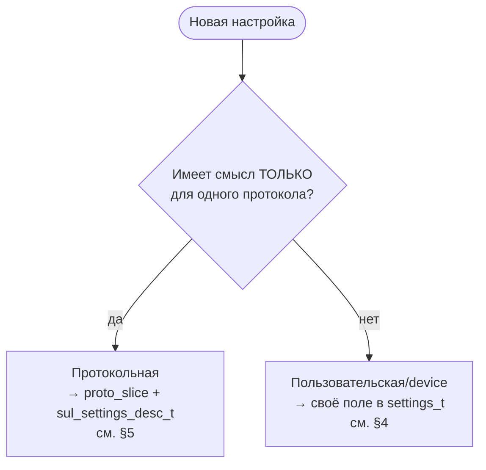
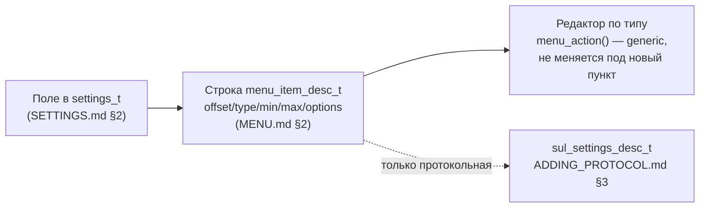

# tft-app — как добавить настройку

Пошаговое руководство по добавлению нового поля в `settings_t` и пункта меню под него (ARCH.md
§8). Не про протоколы как таковые — это [ADDING_PROTOCOL.md](ADDING_PROTOCOL.md); не про то, что
такое `settings_t`/ярусы/QSPI — это [SETTINGS.md](SETTINGS.md); не про движок меню как таковой —
это [MENU.md](MENU.md). Здесь — практическая связка «хочу новый пункт в меню» → «что конкретно
трогать», с одной реальной сквозной сверкой (тумблер логов, §7).

---

## 1. Первая развилка — пользовательская или протокольная



| | Пользовательская/device | Протокольная |
| --- | --- | --- |
| Где хранится | своё именованное поле `settings_t.user`/`.device` | общий `proto_slice[]`, трактует активный протокол |
| Кто описывает пункт меню | статическая строка в `menu_tree.c` (руками, один раз) | `sul_settings_desc_t` протокола (реестр строит пункт САМ при каждом переключении) |
| Видна в меню | всегда | только когда этот протокол активен |
| Пример | тумблер логов (§7), выбор протокола | адрес НКУ-CAN, скорость демо |
| Документ с деталями | этот, §4 | [ADDING_PROTOCOL.md §3](ADDING_PROTOCOL.md) |

Признак протокольной — значение теряет смысл, если сменить протокол (адрес станции НКУ-CAN не
значит ничего для демо-протокола). Если значение осмысленно всегда и для всех — пользовательская,
даже если физически лежит в `settings_device_t` (пример — `log_enabled`: «device» по имени поля,
но полноценный пункт меню уже сегодня).

---

## 2. Три слоя, которые всегда участвуют



Пользовательская настройка трогает ТОЛЬКО первые два слоя (поле + строка дерева) — движок
редактирования (`menu.c`) и рендер (`menu_view.c`) уже generic, под конкретный пункт не меняются.
Протокольная добавляет третий слой (дескриптор), а строку дерева `T_PROTO_PARAM` строит
`menu_tree_refresh_protocol_section()` за вас — руками её не пишете.

---

## 3. Форматы значений — что есть сейчас, что заготовка

Движок хранит любое editable-значение как **один `uint8`** по `value_offset`, редактируется
ОДНИМ generic-механизмом — инкремент с заворотом `min→max→min`
([menu.c](../../firmware/tft_app/src/menu/src/menu.c), `cycle_value()`):

| `menu_item_type_t` | Реализован? | Чем отличается от соседей | Пример |
| --- | --- | --- | --- |
| `MENU_BYTE` | ✅ | `options = NULL` → рендер числом | адрес НКУ-CAN 0..15 |
| `MENU_SELECT` | ✅ | `options[value]` → рендер меткой | протокол, скорость демо |
| `MENU_BOOL` | ✅ | `min=0, max=1`, `options` — 2 метки (обычно Вкл/Выкл) | тумблер логов |
| `MENU_SUBMENU` / `MENU_BACK` | ✅ | навигация, не значение (`value_offset` игнорируется) | «Настройки», «Выход» |
| `ARRAY` / `SERIAL` / `YEAR` / `PERCENT` / `BOOL_ARRAY` | ⬜ **нет** | под многобайтовые/составные значения (серийник, набор битов, год с иной раскладкой…) | — Фазы 5/6 |

**Разрывный диапазон** (`gap_from`/`gap_to`) — не отдельный тип, а модификатор
любого из трёх реализованных: значения `gap_from..gap_to` внутри `[min..max]`
пропускаются при редактировании. Появился под адрес индикатора УИМ-6100
(1..40 ∪ 46..50, где 41..45 — резерв протокола). Ключевое свойство: **хранимое
значение остаётся НАСТОЯЩИМ значением параметра** (адресом), а не индексом —
поэтому `decode()`, HW-фильтры и всё остальное дескриптор не читают вообще.
`gap_from == 0` означает «разрыва нет», так что у протоколов с непрерывным
диапазоном поля просто не указываются. Альтернатива через `SELECT` с 45
метками потребовала бы трансляции индекс↔адрес во всех потребителях — отвергнута.

**Важный вывод:** `MENU_BYTE`/`MENU_SELECT`/`MENU_BOOL` — механически ОДНО И ТО ЖЕ (один uint8,
инкремент с заворотом); разница только презентационная — есть ли `options[]` и какой смысл у
диапазона. Если ваша настройка укладывается в «одно число 0..N» — **новый код в движке не нужен
вообще**, только строка дерева (§4). Настоящая новая работа начинается, только если нужен ТИП из
нижней строки таблицы (⬜) — тогда это не «добавить настройку», а «добавить редактор»: новое
значение в `menu_item_type_t`, ветка в `menu_action()` (menu.c) и в рендере (`menu_view.c`) —
двигатель спроектирован под расширение (см. докстрок `menu.h`), но пока ни разу не расширялся.

`sul_settings_desc_t` (протокольные, [sul.h](../../firmware/tft_app/src/domain/sul/include/domain/sul.h))
использует СВОЙ `sul_settings_type_t` — подмножество ровно из трёх реализованных
(`SUL_SETTINGS_BYTE/_SELECT/_BOOL`), без `SUBMENU`/`BACK` (протокольный параметр никогда не
подменю) и без незаведённых типов. `menu_type_from_sul()` в `menu_tree.c` — единственное место
перевода между двумя enum'ами.

---

## 4. Шаг за шагом — пользовательская/device настройка

1. **Поле** — [settings_store.h](../../firmware/tft_app/src/services/settings_store/include/services/settings_store.h):
   добавить `uint8_t`/`uint16_t` в `settings_user_t` (ярус A — общее для всех) или
   `settings_device_t` (провиженинг/то, что не про конкретного пользователя-оператора). Прокомментировать
   ярус и диапазон, как соседние поля. Значение ДОЛЖНО умещаться в `uint8_t`, если пойдёт в меню
   через `value_offset` (движок читает/пишет ровно один байт, см. §3) — `max_load_kg` (`uint16_t`)
   поэтому и не редактируется до появления типа `ARRAY`/составного редактора.
2. **Дефолт** — `K_DEFAULTS` в [settings_codec.c](../../firmware/tft_app/src/services/settings_store/src/settings_codec.c).
   Паттерн «0 = не задано/скрыто» уже используется (`max_load_kg`, `year_production`) — держитесь
   его для новых необязательных полей, чтобы UI мог единообразно решать «показывать ли».
3. **Пункт дерева** — [menu_tree.c](../../firmware/tft_app/src/menu/src/menu_tree.c):
   - новое имя в `enum { T_ROOT, T_PROTO, ..., T_EXIT, T_COUNT }` — вставить ГДЕ УГОДНО между
     текущими первым и последним пунктом уровня (порядок в enum = физическая позиция в плоском
     массиве `s_tree[]` = порядок в списке на экране); `.first_child`/`.last_child` родителя
     (`T_ROOT`) ссылаются на ИМЕНА констант, не на числа — перенумеровывать соседей руками не
     нужно, если новый пункт не становится НОВЫМ первым/последним (обычный случай — вставить перед
     `T_EXIT`, чтобы «Выход» остался последним, как сейчас);
   - строка в `s_tree[]`:
     ```c
     [T_NEW] = { .label        = "...",
                 .type         = MENU_BYTE /* | _SELECT | _BOOL */,
                 .value_offset = offsetof(settings_t, user.<поле> /* или device.<поле> */),
                 .min          = ...,
                 .max          = ...,
                 .parent       = MENU_ROOT_INDEX,
                 .options      = NULL /* или массив меток, как K_BOOL_LABELS */ },
     ```
   - `options` — только для `SELECT`/`BOOL`, длиной ровно `max - min + 1`, иначе `menu_view.c`
     прочитает `options[value]` за границей массива (та же готча, что клампится для протокольных
     значений при смене протокола, см. [SETTINGS.md §4](SETTINGS.md) — здесь она НЕ актуальна:
     диапазон статический, не переключается рантаймом, поэтому клампить нечего);
   - `gap_from`/`gap_to` — только если допустимые значения не непрерывны (см. §3); опустить,
     если разрыва нет.

   > **Инициализаторы — только ИМЕНОВАННЫЕ.** `menu_item_desc_t` растёт по мере появления
   > редакторов; позиционная форма молча разъезжается при вставке поля в середину структуры.
   > Наступили на это при добавлении `gap_from`/`gap_to`: `tests/host/tft_app_menu/test_menu.c`
   > использовал позиционную инициализацию, и 9 тестов посыпались со сдвигом `parent`/
   > `first_child` — компилятор не сказал ничего.
4. **Если настройка должна на что-то влиять** — это отдельный шаг, не автоматический, см. §6.
5. **Host-тест** — `tests/host/tft_app_menu/test_menu_tree.c`: по образцу
   `test_protocol_param_edits_correct_settings_field` (init/open/next/action/assert) — открыть
   меню, дойти до нового пункта (`menu_next()` до совпадения `label`, не хардкодить числовой
   индекс — тот же приём, что `proto_index()` в этом файле), `menu_action()`, проверить, что
   изменилось именно то поле `settings_t`, которое назвал `value_offset`.
6. **При необходимости** — `tests/host/tft_app_settings_store/test_settings_codec.c`:
   строка в `test_defaults_sane` (если дефолт важен) и/или в `test_roundtrip_preserves_fields`
   (сериализация копирует `settings_t` целиком, новое поле переживёт round-trip и без явной
   проверки — строка в тесте нужна для регрессионной сигнализации, не потому что иначе сломается).

**Вложенные подменю.** Дерево сейчас **плоское** — все пункты (`T_PROTO`, `T_PROTO_PARAM`, `T_LOG`,
`T_EXIT`) на одном уровне, дети `MENU_ROOT_INDEX`. Движок поддерживает `MENU_SUBMENU`
(свой `first_child..last_child`, см. `menu.h`) — если пунктов станет много и захочется сгруппировать
(«Диагностика», «Звук»…), группировка возможна уже сегодня, просто пока не понадобилась.

---

## 5. Шаг за шагом — протокольная настройка

Не дублируется здесь — полностью [ADDING_PROTOCOL.md §3](ADDING_PROTOCOL.md) («Шаг 2 —
sul_settings_desc_t»). Коротко: дескриптор живёт в `sul_registry.c` (не в модуле протокола),
`slice_offset` считается ВНУТРИ `proto_slice[]`, реальный `offsetof(settings_t, ...)` считает
`menu_tree_refresh_protocol_section()` — руками строку `s_tree[T_PROTO_PARAM]` не пишете.

**Ограничение, актуальное сегодня** (SETTINGS.md §4): движок меню рассчитан РОВНО на один параметр
на протокол (`T_PROTO_PARAM` — один слот). Если новому протоколу нужно больше одного —
сначала расширяется `menu_tree.c` (несколько слотов + скрытие лишних у протоколов с меньшим
числом параметров), это отдельная, более крупная задача, не «добавить настройку».

---

## 6. Если настройка должна на что-то влиять — эффект (отдельно от хранения)

Поле в `settings_t` само по себе ничего не делает — это только хранение. Если нужен рантайм-эффект
(не просто «лежит и переживает перезагрузку»), пишете обработчик и вызываете его в ДВУХ местах —
паттерн уже дважды использован (`protocol_id`, `log_enabled`):

```c
/* task_bringup.c — один раз при старте, из загруженных настроек */
log_set_enabled(settings_store_get()->device.log_enabled != 0U);

/* task_menu.c — после КАЖДОГО menu_action(), тем же вызовом */
log_set_enabled(g_menu.settings->device.log_enabled != 0U);
```

Почему в обоих местах: `task_bringup.c` — эффект должен быть виден с самого старта (не только
после первого захода в меню); `task_menu.c` — эффект должен быть виден СРАЗУ в этом же сеансе
меню, не только после `settings_store_save()` (пользователь может листать значения долго, прежде
чем выйти-с-сохранением, или вообще не сохранить, а эффект уже должен сработать — см. TASKS.md про
`sul_registry_set_active()`, тот же приём).

Если эффекта не нужно (настройка просто хранится, как весь ярус A сейчас, см.
[SETTINGS.md §9](SETTINGS.md)) — это ОК, легитимное промежуточное состояние (Фазы 5/6 добавят
эффект отдельно, без переделки хранения/меню).

---

## 7. Пример — тумблер логов (эталон пользовательской BOOL-настройки)

| Шаг | Файл | Что именно |
| --- | --- | --- |
| Поле | [settings_store.h](../../firmware/tft_app/src/services/settings_store/include/services/settings_store.h) | `settings_device_t.log_enabled` (`uint8_t`) |
| Дефолт | [settings_codec.c](../../firmware/tft_app/src/services/settings_store/src/settings_codec.c) | `.log_enabled = 1U` — логи включены из коробки |
| Пункт дерева | [menu_tree.c](../../firmware/tft_app/src/menu/src/menu_tree.c) | `T_LOG`: `MENU_BOOL`, `offsetof(settings_t, device.log_enabled)`, `min=0/max=1`, `options=K_BOOL_LABELS` |
| Эффект | [log.h](../../utils/log/log.h)/[log.c](../../utils/log/log.c) | `log_set_enabled()` — рантайм-гейт ПОВЕРХ компайл-тайм `LOG_LEVEL`, первая проверка в `log_write()` |
| Вызов эффекта | `task_bringup.c` + `task_menu.c` | оба места, см. §6 |
| Host-тест хранения | `tests/host/log/test_log.c` | вкл/выкл по умолчанию, гейт реально давит вывод, повторное включение восстанавливает |
| Host-тест меню | — | пункт `T_LOG` статический (не из дескриптора) — отдельного edit-теста нет, при желании — по образцу §4 п.5 |

Полная деталь и история (почему бит, а не пер-тег гейт) — PLAN.md, Фаза 3.6.

---

## 8. Референсы

| Хочу... | Смотреть |
| --- | --- |
| Состав `settings_t`, ярусы, QSPI | [SETTINGS.md](SETTINGS.md) |
| Механика offset/движок меню/навигация | [MENU.md](MENU.md) |
| Протокольный параметр (адрес, скорость…) | [ADDING_PROTOCOL.md §3](ADDING_PROTOCOL.md) |
| Протокол сам пишет settings без меню | [ADDING_PROTOCOL.md §4](ADDING_PROTOCOL.md) (`take_pending_write`) |
| Готовый пример BOOL-настройки | §7 выше (тумблер логов) |
| Готовый пример SELECT/BYTE | адрес НКУ-CAN / скорость демо, [sul_registry.c](../../firmware/tft_app/src/domain/sul/src/sul_registry.c) |
