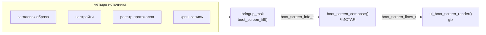

# tft-app — загрузочный экран

Что за устройство перед тобой, без UART-кабеля. Реализация —
[ui/boot_screen/](../../firmware/tft_app/src/ui/boot_screen/), фаза показа — в
[task_render.c](../../firmware/tft_app/src/app/task_render.c), сборка данных —
`boot_screen_fill()` в [task_bringup.c](../../firmware/tft_app/src/app/task_bringup.c).
Статус и история решений — [PLAN.md §3.10](../../firmware/tft_app/PLAN.md).

---

## 1. Зачем

Диагностика, построенная в §3.7–3.9 — причина сброса, активный протокол, его
адрес — видна только через UART: надо открыть шкаф и подключить MCU-Link. Для
монтажника на объекте этого канала нет.

Загрузочный экран показывает то же самое любому, кто просто подал питание.

```
Версия: 0.1.0
Загрузчик: н/д
Панель: TFT8
Протокол: НКУ-CAN, Адрес 1
ID: 0011AABB CCDDEEFF
```

---

## 2. Состав и откуда что берётся

| Строка | Источник | Примечание |
| --- | --- | --- |
| `Версия` | заголовок MCUboot СВОЕГО слота (`ih_ver`) | то, чем подписан образ, и то, по чему загрузчик выбирает слот |
| `Загрузчик` | — | **всегда «н/д»**, см. §5 |
| `Панель` | `settings_device_t.panel_type` | до Фазы 9 всегда `TFT8` — провижининга нет |
| `Протокол` | `sul_registry_active()` + `proto_slice[0]` | параметр в той же строке |
| `ID` | `bsp_prov_read_uid()` — OCOTP | двумя группами, чтобы диктовать по телефону |
| `Сброс` / `Место` | крэш-запись `.noinit` | **только при нештатном сбросе**, красным |
| `Стиль` | — | слот Фаз 4/5 |
| (кастомная) | — | слот Фазы 5 (Trademark клиента) |

**Адрес рядом с протоколом не случайно.** Неверный адрес — отказ №1 в поле:
плата живая, экран пустой, потому что HW-фильтры CAN режут чужие кадры до
всякого софта (найдено на реальной станции, см. PLAN.md, Фаза 2).

**Причина сброса выводится ТОЛЬКО когда она есть.** При штатном старте строки
нет вовсе: на каждом включении она была бы шумом, а так само её присутствие —
сигнал.

**Пустые слоты — работающий контракт, а не «TODO».** `NULL` в поле означает
«строки нет»; Фазам 4/5 останется подставить значение, не трогая ни рендер, ни
компоновщик.

---

## 3. Устройство: две части



- **`boot_screen_compose()`** — структура → массив готовых строк. Ни gfx, ни
  bsp, поэтому «какие строки появляются и как форматируются» проверяется на
  хосте (`tests/host/tft_app_boot_screen`, 17 тестов).
- **`ui_boot_screen_render()`** — рисование. Как `menu_view`, на хосте не
  проверяется.
- **Экран ничего не добывает сам** — данные приходят структурой. Заполняет её
  app-слой, потому что они тянутся из четырёх независимых мест: это композиция,
  а не презентация (ARCH §4). Тот же контракт, что у
  `ui_fallback_render(sul_result_t*)`.

### Тревожную строку помечает компоновщик

`boot_screen_lines_t.alert_line` — индекс строки, которую рендер красит.
Ставит его **компоновщик**, а не рендер.

Первая версия опознавала строку по префиксу UTF-8 — и красила заодно `Стиль:`,
потому что обе начинаются с «С» (`D0 A1`). Признак обязан идти от того, кто
знает смысл, а не от того, кто видит байты.

---

## 4. Механика показа

Выдержка живёт в **ожидании**, а не в задержке. `render_task` и так блокируется
на `ulTaskNotifyTake()`; пока экран активен, тот же вызов получает конечный
таймаут вместо `portMAX_DELAY`.

> ⚠️ Почему не `vTaskDelay()`: у `render_task` порог супервизора `guard_ms` =
> 2000 мс ([WATCHDOG.md §4.2](WATCHDOG.md)), и трёхсекундный показ внутри
> `heartbeat_enter/leave` уронил бы плату. Этим приёмом на проверке §3.7
> намеренно вызывался сброс. При схеме с таймаутом ожидание попадает в ПРОСТОЙ
> задачи, а он для event-driven задачи свеж по определению.

Правила на время показа:

- **приём СУЛ не задерживается вообще** — экран задерживает только
  отображение; `sul_rx_task` всё это время принимает и декодирует;
- уведомления **потребляются**, свежее состояние копится в `last`, но не
  рисуется — по истечении показа индикация появляется сразу актуальной, а не с
  «--»;
- **открытие меню снимает экран немедленно** — оператор не должен ждать.

### Длительность

`settings_device_t.boot_screen_secs`, дефолт 3 c. **Пункта меню нет намеренно**
— уровень провижининга, рядового оператора не касается. `0` = не показывать:
для объектов, где важна мгновенная индикация.

---

## 5. Версия загрузчика — почему «н/д»

Загрузчик не MCUboot-образ (первичный, HAB-подписанный) — заголовка с версией
у него нет. `BOOTLOADER_VERSION` это компайл-тайм `#define`, используемый ровно
в одном месте: JSON-ответ по CLI хосту. До приложения он не доходит никак.

Показать его можно только если загрузчик начнёт версию **публиковать**, а это
правка выпущенного 1.0.0 и новый цикл верификации. Та же развилка, что с
источником сброса в §3.8 — обе сведены в одну будущую правку, см.
[PLAN.md §3.10](../../firmware/tft_app/PLAN.md).

До тех пор экран честно пишет «н/д». Экран, уверенно показывающий неверную
версию, хуже экрана, который признаётся, что не знает.

---

## 6. Метрики и ограничение по ширине

Шрифт — `SystemFont` (**JBMono24**), тот же, что в меню: экран читают с
расстояния и второпях. Окно 480×272 в левом верхнем углу, как у меню —
одинаково на всех панелях.

| Параметр | Значение |
| --- | --- |
| глиф | 14 × 31 px (моноширинный) |
| шаг строк | 32 px, отступ сверху 12 |
| полезная ширина | 480 − 16 = 464 px = **33 символа** |
| помещается строк | 8 (нижний край восьмой = 12 + 7×32 + 31 = 267) |

> ⚠️ **33 символа — жёсткий потолок.** Строка
> `Сброс: TASK STALL (render:menu-open)` — 36 символов, и она уезжала за правый
> край, обрезая ровно хвост крошки, то есть различающую часть (та же ошибка,
> что ловили на `CRASH_WHERE_MAX` в §3.7). Поэтому причина и место разведены на
> ДВЕ строки. Самая длинная из возможных сейчас — `Протокол: УИМ-6100, Адрес 50`,
> 28 символов. **Добавляя строку, проверьте её длину**: обрезка молчаливая.

`BOOT_SCREEN_MAX_LINES` = 9, а помещается 8 — девятую рендер отбросит своим
guard'ом. Сегодня недостижимо: слоты «стиль»/«кастомная» пусты, максимум 7. К
моменту их заполнения экран поедет на layout-движок Фаз 4/5 — ради чего он и
сделан сейчас текстовым: он станет первым потребителем того механизма.

---

## 7. Как добавить строку

1. Поле в `boot_screen_info_t` ([boot_screen.h](../../firmware/tft_app/src/ui/boot_screen/include/ui/boot_screen.h))
   — указатель, `NULL` = строки нет.
2. Ветка в `boot_screen_compose()` — порядок строк фиксирован.
3. Заполнение в `boot_screen_fill()` (`task_bringup.c`).
4. Тест в `tests/host/tft_app_boot_screen/`.
5. **Проверить длину** — см. §6.

Рендер трогать не нужно.
