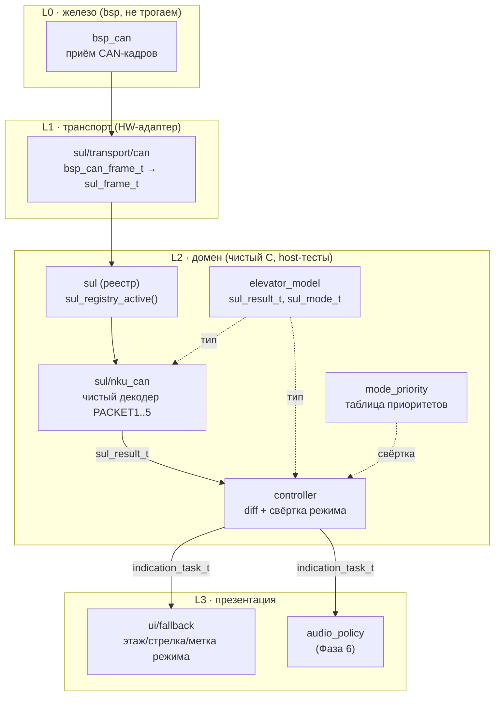
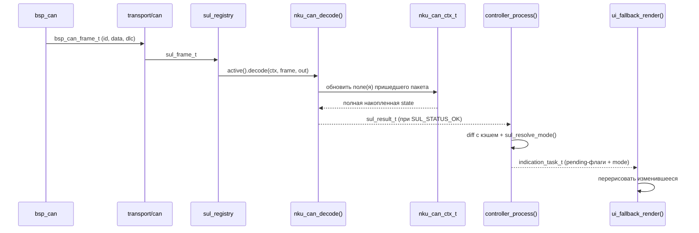
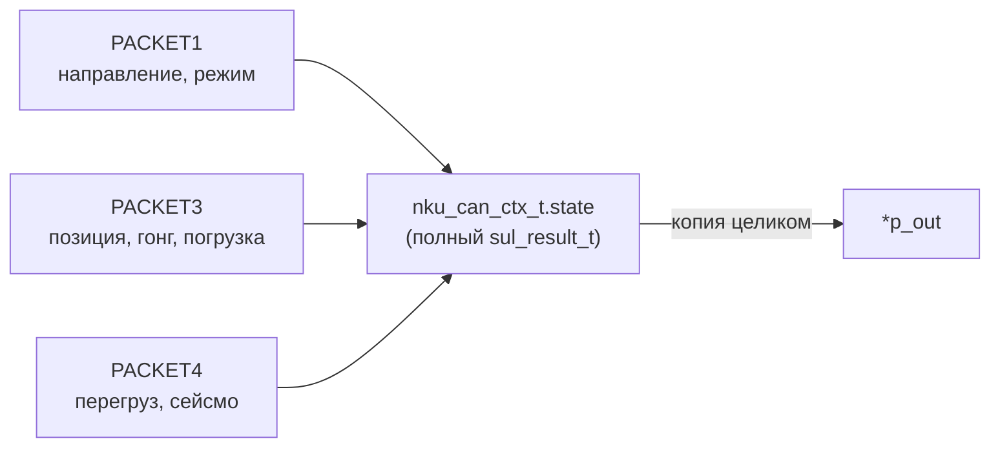
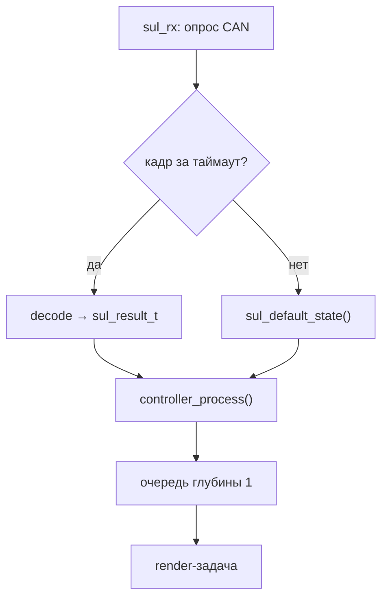

# tft-app — путь данных домена (транспорт → экран)

Документ описывает **реализованный** доменный слой (Фазы 1–2): как кадр от СУЛ проходит
от шины до презентации, какие модули за что отвечают и каков контракт между ними. Проектное
обоснование слоёв — в [ARCH.md](../../firmware/tft_app/ARCH.md); статус фаз —
в [PLAN.md](../../firmware/tft_app/PLAN.md). Здесь — «как это работает в коде сейчас».

Сейчас реализован один протокол — **НКУ-CAN**. Архитектура рассчитана на много протоколов
(УЭЛ/УКЛ/SD7/УИМ — Фаза 8): добавление протокола = новый декодер + запись в реестр, без правок
остальных слоёв.

---

## 1. Обзор слоёв

Каждый слой — отдельная статическая библиотека CMake. **Домен — чистый C без единого
HAL-вызова** (host-тестируется), железо изолировано в `bsp/*` и тонком транспорт-адаптере.



Ключевой инвариант: **декодер не знает про шрифт/экран, презентация не знает про биты
протокола**. Единственная валюта между ними — канонический `sul_result_t`
([elevator_model.h](../../firmware/tft_app/src/domain/elevator_model/include/domain/elevator_model.h)).

---

## 2. Путь одного кадра

`sul_rx_task` опрашивает CAN, прогоняет кадр через активный декодер и передаёт результат
контроллеру; `render_task` применяет diff. **Данные** между ними — очередь глубины 1
(`xQueueOverwrite`: важно только последнее состояние, не история); **пробуждение** —
`xTaskNotifyGive` (render_task — event-driven, не поллит). Пока открыто меню, `sul_rx_task`
находится в «мягкой паузе» (decode/controller/очередь пропускаются, WDOG кормится). Полная
картина задач — [TASKS.md](TASKS.md).



---

## 3. Контракт декодера

**Кадр транспортного уровня** — нейтрален к шине (CAN/UART/…); транспорт заполняет, декодер
только читает ([sul.h](../../firmware/tft_app/src/domain/sul/include/domain/sul.h)):

```c
typedef struct { uint32_t id; uint8_t bus; const uint8_t *p_data; uint16_t len; } sul_frame_t;
typedef sul_status_t (*sul_decode_fn)(void *p_ctx, const sul_frame_t *p_frame, sul_result_t *p_out);
```

**Три исхода** `decode()` (`sul_status_t`):

| Статус | Когда | Что с `*p_out` |
| --- | --- | --- |
| `SUL_STATUS_OK` | кадр распознан | заполнен полной накопленной `state` |
| `SUL_STATUS_IGNORED` | ID не этого протокола | **не тронут** |
| `SUL_STATUS_ERR` | ID совпал, но кадр малформирован (неверный DLC / код символа вне таблицы) | не тронут |

**Декодер stateful через ctx, но остаётся чистой функцией.** Разные пакеты несут разные поля
в разных кадрах — `decode()` обновляет только пришедшее и отдаёт наружу **полную** копию
накопленного `state`, а не дельту. Состояние держит caller в `nku_can_ctx_t` и передаёт
указатель на каждый вызов — декодер не владеет памятью/жизненным циклом.



---

## 4. НКУ-CAN: пакет → поля модели

Порт боевого декодера `OLD_PROJECT/source/main_programm.c` (`msg_receiver_task`) в чистую
функцию. Реализация — [nku_can.c](../../firmware/tft_app/src/domain/sul/nku_can/src/nku_can.c).

**Адрес станции — из настроек (Фаза 3), применяется на ОБА конца одновременно** (боевая
находка: правка только декодера бесполезна — HW-фильтры FlexCAN отбрасывают кадры чужого
адреса до всякого софта):

- декодер: `nku_can_set_address()` — ID пакетов сдвигаются на `group4 = addr<<4` (PACKET1..4,
  биты [7:4]) и `group6 = addr<<6` (PACKET5, биты [8:6], протокол отводит 3 бита);
- транспорт: `sul_transport_can_set_address()` — переконфигурация RX-фильтров Message
  Buffer'ов под те же ID (diff-защита: реальная переконфигурация только при смене адреса).

`sul_rx_task` вызывает оба на каждой итерации (дёшево) — правка адреса в меню подхватывается
без межзадачного сигнала. В таблице ниже ID приведены для адреса 0 (базовые).

| Пакет | ID (адрес 0) | Байты/маски → поля `sul_result_t` |
| --- | --- | --- |
| **PACKET1** | `0x506` | `d6[1:0]` → `direction` · `d6[3:2]` → `movement` · `d6[7:4]` код режима → `fire_alarm`/`maintenance`/`fireman`/погрузка-инстр. · `d3[5:0]` → уровень остановки (внутр., гейт PACKET5) |
| **PACKET2** | `0x408` | `d7&0x40` → перегруз (источник 1) |
| **PACKET3** | `0x508` | `d5/d6 &0x3F` → `pos`, `floor_num` · `d3&0x40==0` → `arrival` (гонг) · `d2&0x3F` сек + `d3&0x0F` мин → `lading_secs` |
| **PACKET4** | `0x50B` | `d5&0x40` → перегруз (источник 2) · `d0&0x80` → `seismic` |
| **PACKET5** | `0x606` | `d3/d4 &0x3F` → `next` (только пока едет ↑/↓ и назначение ≠ уровень; иначе `next=""`) |

**Мультиисточниковые поля.** Некоторые выходные поля кормятся несколькими пакетами. Они держатся
в `ctx` раздельными латчами и на выход идут как **OR** — иначе пакет-без-сигнала сбросил бы флаг,
выставленный другим пакетом (боевой баг-класс):

- `overload = overload_p2 || overload_p4` (PACKET2 и PACKET4 независимы);
- `lading = lading_instr || (lading_secs > 0)` (инструментальная из PACKET1, временная из PACKET3).

Режимными флагами, которыми владеет **один** пакет (fire/maintenance/fireman — PACKET1;
seismic — PACKET4), пакет-владелец распоряжается напрямую: сбрасывает в начале и выставляет по
условию, гася устаревший режим.

Удалённая установка адреса (кадры `0x4X1`/`0x5XB`) — **под-шаг 3.5** (см. PLAN.md). Сейчас эти
ID игнорируются (wildcard-фильтры под них ещё не настраиваются).

---

## 5. Контроллер: diff и таймаут

`controller_process()` — редьюсер: сравнивает новый `sul_result_t` с кэшем, выдаёт
`indication_task_t` (что перерисовать/озвучить) и обновляет кэш
([controller.c](../../firmware/tft_app/src/domain/controller/src/controller.c)).

| Поле `indication_task_t` | Условие | Потребитель |
| --- | --- | --- |
| `pos_pending` | изменилась строка позиции | презентация |
| `next_pending` | изменился следующий этаж | презентация (Фаза 5) |
| `direction_pending` | изменилось направление | презентация |
| `mode_pending` | сменился **разрешённый** режим (см. [MODE_PRIORITY.md](MODE_PRIORITY.md)) | презентация |
| `arrival_pending` | фронт `false→true` гонга | аудио (Фаза 6) |
| `movement_pending` | фронт `false→true` начала движения | аудио (Фаза 6) |
| `mode` | разрешённый режим нового результата | презентация читает при `mode_pending` |

**Таймаут связи — не отдельный API.** При пропадании кадров дольше таймаута `sul_rx`-задача
просто вызывает `controller_process()` с `sul_default_state()` — тем же путём, что и обычный кадр
(`pos="--"`, режимы сброшены). Diff корректно пометит изменения, презентация покажет «--».



---

## 6. Дальше — презентация

Как `indication_task_t` превращается в пиксели и звук:

- Свёртка сигналов в один экранный режим — [MODE_PRIORITY.md](MODE_PRIORITY.md).
- Безопасная (asset-free) отрисовка этажа/стрелки/режима — [FALLBACK.md](FALLBACK.md).
- Богатый layout со спрайтами и звук — Фазы 4–6 ([PLAN.md](../../firmware/tft_app/PLAN.md)).
