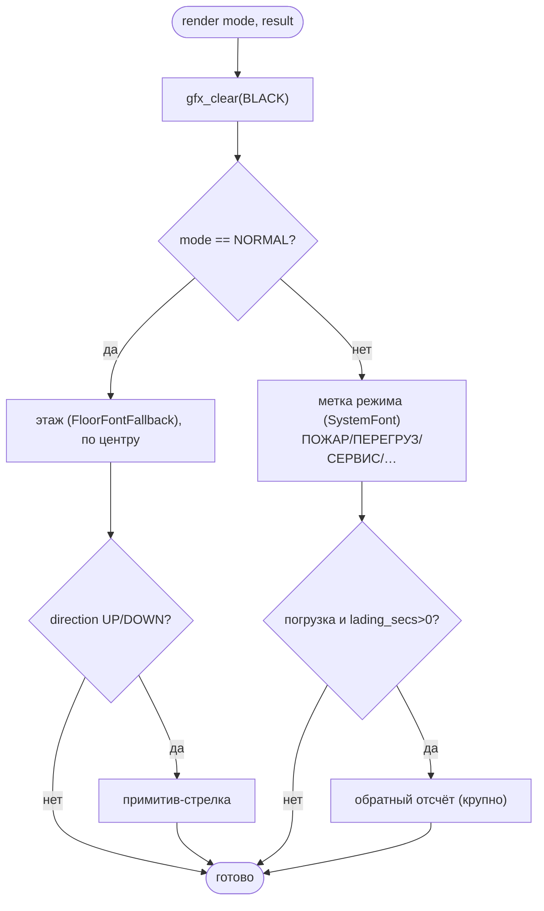
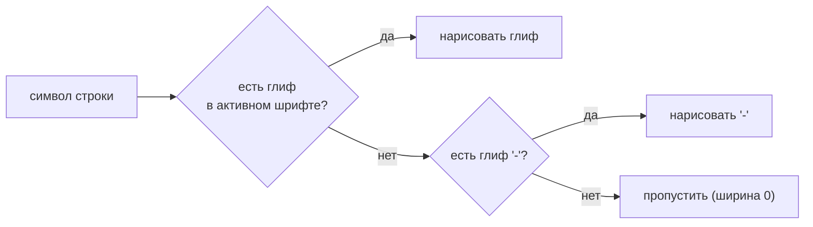

# tft-app — fallback-рендер (safe-mode)

«Аварийный» режим индикации: минимум зависимостей, никаких ассетов и файловой системы.
Это же — первый экран walking-skeleton (Фаза 1) и гарантированная деградация, когда ассеты/layout
недоступны. Проектная основа — [ARCH.md §11](../../firmware/tft_app/ARCH.md); реализация —
[fallback.c](../../firmware/tft_app/src/ui/fallback/src/fallback.c).

---

## 1. Что такое fallback

`default`-layout **asset-free и FS-free**: не монтирует QSPI-FAT/SD, не трогает TLV-ридер ассетов.
Зависимости — только `bsp_display` + `gfx` (framebuffer, вкомпилированные шрифты, примитив стрелки)
+ домен. Рисует на чёрном фоне, без звука. Устройство никогда не «гаснет»: даже при полностью
битых ассетах есть чем показать этаж.

Принцип degradation, а не отказа (ARCH §3): сбой ассетов/layout/связи ведёт к безопасному
**упрощению** индикации, а не к отказу.

---

## 2. Что рисуется

Презентация решает по разрешённому режиму (`indication_task_t.mode`, см.
[MODE_PRIORITY.md](MODE_PRIORITY.md)):

- **Обычный режим** — номер этажа (`FloorFontFallback`) + стрелка вверх/вниз (примитив, без
  спрайтов). Двойная стрелка (`SUL_DIR_DOUBLE`) в fallback не рисуется — это спрайтовая индикация
  Фазы 4/5.
- **Спецрежим** — короткая текстовая метка системным шрифтом (`SystemFont`). Это **safe-mode**
  индикация: богатая полноэкранная графика режимов (фон+спрайты) появится в Фазах 4–5. Для
  временной погрузки дополнительно рисуется обратный отсчёт (`lading_secs`).

Следующий этаж (`next`) в fallback **не** показывается — это элемент богатого layout (Фаза 5),
поэтому на `next_pending` перерисовки нет.

---

## 3. По-символьный fallback шрифта

Второй уровень деградации — на уровне отдельного символа. Активный шрифт может не покрывать
кодпойнт, который выдал декодер (напр. `FloorFontFallback` знает только `0–9`, `-`, пробел, а
позиция пришла кириллицей). `gfx_draw_string()` подставляет `-` вместо отсутствующего глифа —
по-символьно, не обрывая всю строку на первом неизвестном символе. Если даже `-` нет в шрифте —
символ пропускается (нулевая ширина).

Механизм есть с Фазы 1. Выделенная чистая функция проверки покрытия шрифта + её host-тест —
остаток Фазы 2 (см. [PLAN.md](../../firmware/tft_app/PLAN.md)).

---

## 4. Когда перерисовываем

`ui_fallback_render()` перерисовывает кадр целиком (без dirty-rect — `gfx` минимален) при
изменении того, что fallback реально показывает: **позиция, стрелка или режим**
(`pos_pending || direction_pending || mode_pending`). Иначе — no-op.

Первую отрисовку презентация делает **безусловно** один раз при старте
(`ui_fallback_render_initial()`): кэш контроллера засеян дефолтом, и если первый реальный кадр
совпадёт с дефолтом, diff придёт «ничего не изменилось» — без безусловного старта экран остался бы
пустым.

---

## 5. Известное ограничение — один framebuffer

Сейчас один буфер, без double buffering: `render()` пишет напрямую в буфер, который ELCDIF в этот
момент сканирует по DMA. Если перерисовка не укладывается в кадр развёртки, виден сам процесс
закраски (глиф «набирается» за несколько кадров) — **не** tearing и **не** порча пикселей (каждая
запись валидна), просто заметен процесс.

Фикс — double buffering (второй буфер + swap по `FRAME_DONE`), запланирован в **Фазе 4** вместе с
PXP-компоновщиком. Подробнее — [PLAN.md, Фаза 4](../../firmware/tft_app/PLAN.md).
