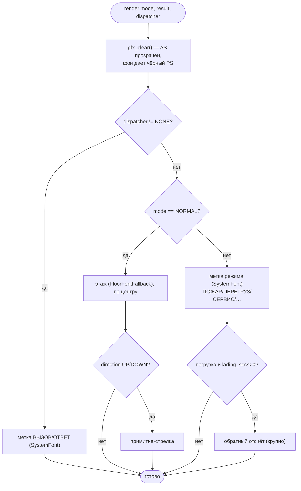
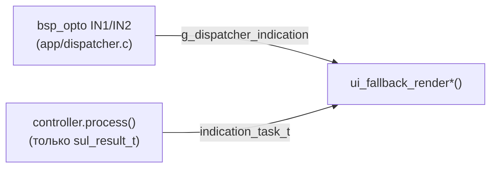
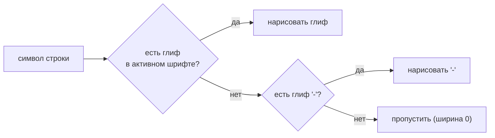

# tft-app — fallback-рендер (safe-mode)

«Аварийный» режим индикации: минимум зависимостей, никаких ассетов и файловой системы.
Это же — первый экран walking-skeleton (Фаза 1) и гарантированная деградация, когда ассеты/layout
недоступны. Проектная основа — [ARCH.md §11](../../firmware/tft_app/ARCH.md); реализация —
[fallback.c](../../firmware/tft_app/src/ui/fallback/src/fallback.c).

---

## 1. Что такое fallback

`default`-layout **asset-free и FS-free**: не монтирует QSPI-FAT/SD, не трогает TLV-ридер ассетов.
Зависимости — только `bsp_display` + `gfx` (framebuffer, вкомпилированные шрифты, примитив стрелки)
+ домен. Рисует на чёрном фоне, без звука. Устройство никогда не «гаснет»: даже при полностью
битых ассетах есть чем показать этаж.

Принцип degradation, а не отказа (ARCH §3): сбой ассетов/layout/связи ведёт к безопасному
**упрощению** индикации, а не к отказу.

---

## 2. Что рисуется

Презентация решает по разрешённому режиму (`indication_task_t.mode`, см.
[MODE_PRIORITY.md](MODE_PRIORITY.md)) — **и по диспетчерскому входу** (§2.1), который
проверяется первым и безусловно перекрывает всё остальное:

- **Обычный режим** — номер этажа (`FloorFontFallback`) + стрелка вверх/вниз (примитив, без
  спрайтов). Двойная стрелка (`SUL_DIR_DOUBLE`) в fallback не рисуется — это спрайтовая индикация
  Фазы 4/5.
- **Спецрежим** — короткая текстовая метка системным шрифтом (`SystemFont`). Это **safe-mode**
  индикация: богатая полноэкранная графика режимов (фон+спрайты) появится в Фазах 4–5. Для
  временной погрузки дополнительно рисуется обратный отсчёт (`lading_secs`).
- **Диспетчерский вход** (§3.4) — та же safe-mode текстовая метка (переиспользует слот режимов:
  `MODE_Y`/`SystemFont`), но проверяется ПЕРВЫМ, до `mode`. Слова временные, «ВЫЗОВ»/«ОТВЕТ».

Следующий этаж (`next`) в fallback **не** показывается — это элемент богатого layout (Фаза 5),
поэтому на `next_pending` перерисовки нет.

### 2.1 Диспетчерский вход — не данные СУЛ, отдельный вход в рендер

`opto` IN1 («вызов подан») / IN2 («вызов принят») — **локальный вход** (ARCH §8 п.3), не
`sul_result_t`: не идёт через `controller`/таблицу приоритетов режимов (эта таблица — только
для ортогональных сигналов СУЛ, см. [MODE_PRIORITY.md](MODE_PRIORITY.md)). Дизайн-диаграмма
ARCH §4 рисует его именно так — отдельным входом прямо в `ui.render(task, model, settings)`, не
через `controller`:

Приоритет — **высший из всех**, согласовано с пользователем: перекрывает обычную индикацию И
любой режим СУЛ (пожар/перегруз/…), работает даже без связи со станцией (dispatcher — независимое
оборудование, не станция). ОТВЕТ (IN2) перебивает ВЫЗОВ (IN1), если оба почему-то активны
одновременно. Референс поведения (не архитектуры) —
`OLD_PROJECT_TFT8_UKL/source/main_programm.c` (`tft_refresh_task`): там `icon_img_ptr`
перезаписывается диспетчерской проверкой ПОСЛЕДНЕЙ в каждом кадре, безусловно — тот же эффект,
что здесь достигается проверкой ПЕРВОЙ в `render()` с `return`.

---

## 3. По-символьный fallback шрифта

Второй уровень деградации — на уровне отдельного символа. Активный шрифт может не покрывать
кодпойнт, который выдал декодер (напр. `FloorFontFallback` знает только `0–9`, `-`, пробел, а
позиция пришла кириллицей). `gfx_draw_string()` подставляет `-` вместо отсутствующего глифа —
по-символьно, не обрывая всю строку на первом неизвестном символе. Если даже `-` нет в шрифте —
символ пропускается (нулевая ширина).

Механизм есть с Фазы 1. Выделенная чистая функция проверки покрытия шрифта + её host-тест —
остаток Фазы 2 (см. [PLAN.md](../../firmware/tft_app/PLAN.md)).

---

## 4. Когда перерисовываем

`ui_fallback_render()` перерисовывает кадр целиком (без dirty-rect — `gfx` минимален) при
изменении того, что fallback реально показывает: **позиция, стрелка или режим**
(`pos_pending || direction_pending || mode_pending`). Иначе — no-op. И этот путь, и
безусловный старт (ниже) принимают диспетчерский вход (§2.1) отдельным параметром — сам он
НЕ входит в `pos_pending`/`direction_pending`/`mode_pending` (это diff `sul_result_t`, opto —
локальный вход, другая природа изменения).

Первую отрисовку презентация делает **безусловно** один раз при старте
(`ui_fallback_render_initial()`): кэш контроллера засеян дефолтом, и если первый реальный кадр
совпадёт с дефолтом, diff придёт «ничего не изменилось» — без безусловного старта экран остался бы
пустым. Тот же безусловный вызов переиспользуется как ТРЕТЬЯ причина полной перерисовки (кроме
старта и закрытия меню) — смена диспетчерского входа САМА ПО СЕБЕ, без нового кадра СУЛ в
очереди: `render_task` (см. [TASKS.md §3](TASKS.md)) сравнивает текущее
`g_dispatcher_indication` с прошлым и, если отличается, зовёт `ui_fallback_render_initial()`
из последнего известного `sul_result_t` + нового диспетчерского значения.

---

## 5. Как кадр попадает на экран (Фаза 3.2.4 — фундамент рендера)

Ограничение одного framebuffer'а Фазы 1 **снято**. `render()` рисует off-screen в
альфа-поверхность **AS** (ARGB8888); показ — отдельным вызовом `gfx_present()` у владельца
дисплея ([task_render.c](../../firmware/tft_app/src/app/task_render.c)): PXP компонует AS над
чёрным фоном PS и пишет **RGB565** в задний framebuffer, затем tear-free свап синхронно с
ELCDIF (`FRAME_DONE`). Гибрид bpp: рисование и AA — в полных 8 битах (AS), 565 — только на
самом выходе (сплошные цвета/текст квантуются незаметно; проверено на панели).

Индикация всегда рендерится **полным кадром** (в отличие от меню, где после открытия
перекомпоновывается только окно — см. [MENU.md](MENU.md) §5). Подробности компоновщика и
разбивка по задачам — [TASKS.md](TASKS.md).
