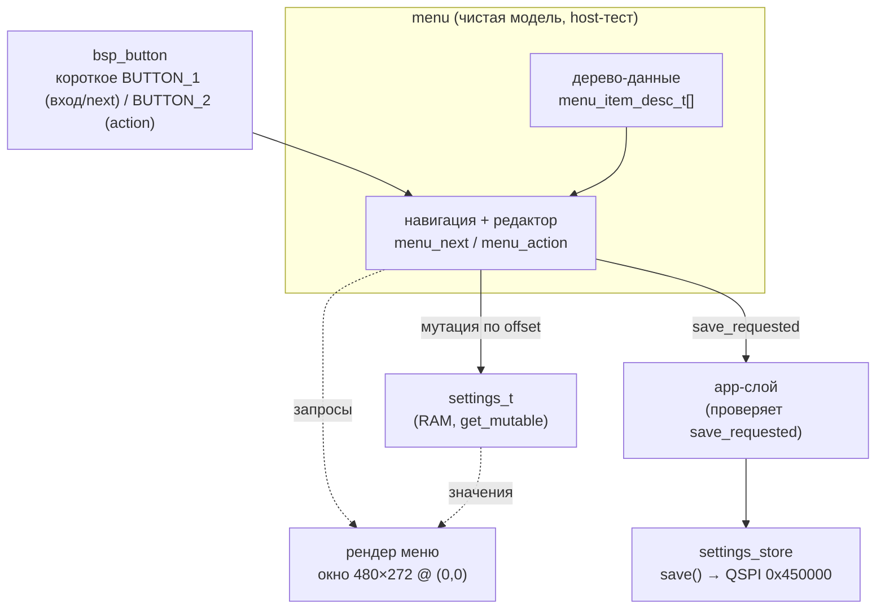
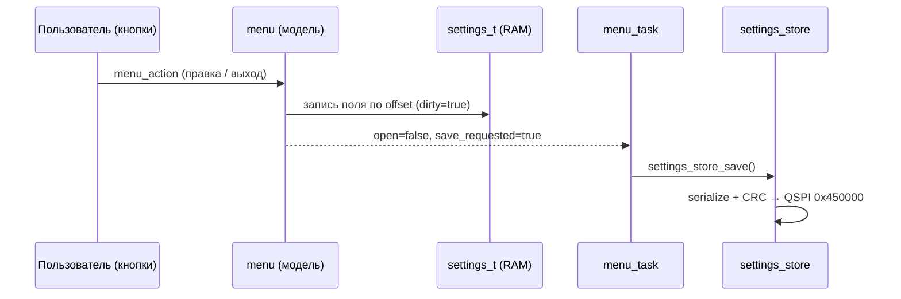
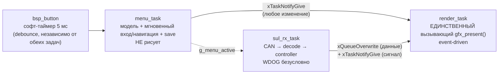

# tft-app — движок меню и связь с настройками

Документ описывает **реализованный** движок меню (Фаза 3.2.1: чистая модель; 3.2.2–3.2.4: рендер,
wiring, разделение на задачи) и его связь с модулем настроек `settings_store`. Проектная основа —
[ARCH.md §8](../../firmware/tft_app/ARCH.md); реализация —
[menu.c](../../firmware/tft_app/src/menu/src/menu.c),
[settings_store](../../firmware/tft_app/src/services/settings_store/).

Движущее требование (§8): клиент приносит уникальные настройки, и добавление их **не должно
требовать переписывания** движка. Отсюда два принципа: меню — **данные**, редакторы —
**подключаемые по типу**.

---

## 1. Разделение слоёв

Модель меню — чистый C (host-тест), отделена от рендера (HIL) и от записи на флеш.



Ключ: **модель сама не сохраняет и не рисует**. Она мутирует переданный `settings_t*` и на
выходе-с-сохранением выставляет `save_requested`; фактический `settings_store_save()` вызывает
app-слой. Это держит навигацию/редактирование host-тестируемыми без QSPI и без рендера.

---

## 2. Меню — данные

Пункт меню — строка-дескриптор ([menu.h](../../firmware/tft_app/src/menu/include/menu/menu.h)):

```c
typedef struct {
    const char      *label;
    menu_item_type_t type;         /* редактор: SUBMENU/BACK/SELECT/BYTE/BOOL */
    uint16_t         value_offset; /* offsetof(settings_t, <uint8-поле>)     */
    uint8_t          min, max;     /* диапазон для SELECT/BYTE/BOOL           */
    uint8_t          parent, first_child, last_child; /* дерево (плоский массив+индексы) */
} menu_item_desc_t;
```

Дерево — плоский массив; уровень = непрерывный диапазон детей `[first_child..last_child]` одного
родителя. `items[0]` — корневое `SUBMENU`, его дети — верхний уровень.

**Добавить пункт = добавить строку** массива (тот же принцип, что `k_mode_priority[]`). Добавить
причудливый редактор = добавить значение в `menu_item_type_t` + ветку в `menu_action` — движок
навигации не меняется. Фаза 3 использует `SELECT/BYTE/BOOL`; `ARRAY/SERIAL/YEAR/PERCENT/BOOL_ARRAY`
придут со своими фазами (5/6).

---

## 3. Навигация

Две кнопки, обе коротким нажатием (без удержания — раскладка `OLD_PROJECT_TFT8_UKL`): BUTTON_1 →
`menu_next` (следующий пункт уровня, с заворотом) когда меню открыто, **вход в меню** (app-слой,
`menu_open`) когда закрыто; BUTTON_2 → `menu_action` (по типу пункта) когда открыто, намеренный
no-op когда закрыто.


`dirty` взводится любой правкой; при выходе из корня `save_requested = dirty` (сохраняем только
если что-то менялось). Отдельного «отменить» нет — правки живут в RAM, на флеш попадают лишь при
выходе-с-сохранением.

---

## 4. Связь с настройками

Модель привязана к `settings_t` (ядро настроек, [SETTINGS](../../firmware/tft_app/src/services/settings_store/include/services/settings_store.h))
через **байтовый offset** — читает/пишет `uint8`-поле по `value_offset`:

| Ярус настройки | Пример пункта | Привязка |
| --- | --- | --- |
| **A** железобетонные | громкость, год | `offsetof(settings_t, user.<поле>)` |
| device/провиженинг | тумблер логов | `offsetof(settings_t, device.log_enabled)` |
| **B** протокольные | адрес НКУ | `offsetof(settings_t, user.proto_slice[0])` |

Ярус B (протокольные параметры) с Фазы 3.3 строится из дескриптора протокола
`sul_settings_desc_t` (§8), не хардкодом: `menu_tree_refresh_protocol_section()` читает
`sul_registry_active()->p_settings` и заполняет раздел «Настройки протокола» (label/тип/
диапазон/offset/options) из него — при смене активного протокола (и при bringup) секция
перестраивается. Подробности механизма и как добавить протокол — [ADDING_PROTOCOL.md](ADDING_PROTOCOL.md).
Пошаговое «как добавить настройку» (любую — пользовательскую или протокольную, форматы значений)
— [ADDING_SETTING.md](ADDING_SETTING.md); состав/ярусы/хранение самого `settings_t` —
[SETTINGS.md](SETTINGS.md).

**Поток сохранения** (`menu_task` связывает модель и flash — см. §5):



Адрес станции (`nku_can_set_address()`) `sul_rx_task` пере-применяет из настроек сам, на следующей
итерации — не требует отдельного сигнала (декодер читает `settings_store_get()` каждую итерацию).

---

## 5. Рендер и wiring (Фаза 3.2.2–3.2.4)

Рендер ([menu_view.c](../../firmware/tft_app/src/ui/menu/src/menu_view.c)) — отдельный слой, читает
модель запросами (`menu_current`, `menu_level_range`, `menu_read_value`) и рисует в **фиксированном
окне 480×272 @ логич.(0,0)** — одинаково на всех панелях (на больших — левый-верхний угол, остальное
чёрное). Логики навигации не содержит.

**Раскладка** (под реальные шрифты: `SystemFont`/JBMono24 h=31, `SystemFontSmall`/JBMono12 h=16):
заголовок 36 + 6 строк × 36 + футер 20 = **272**, обрамление — тонкая серая рамка 1 px по периметру.
Заголовок = подпись текущего уровня; строки «подпись слева / значение справа»; **курсор — сплошная
полоса-заливка** (`gfx_fill_rect`) + белый текст; футер — легенда кнопок + «N/M».

**Цвет — тинтингом** (`gfx_draw_string(..., color)` с альфа-блендингом): один белый шрифт рисуется
любым цветом со сглаживанием, и оно корректно ложится на полосу-курсор. Значения SELECT/BOOL — из
`options[]` дескриптора, BYTE — числом.

**Оконный рендер** (double-buffer + PXP + гибрид bpp, Фаза 3.2.4): `menu_view_render()` рисует
off-screen в альфа-поверхность AS (ARGB8888) **только окно** `MENU_VIEW_WIN_W×H` (windowed clear +
отрисовка); показ — у владельца дисплея ([task_render.c](../../firmware/tft_app/src/app/task_render.c)):

- **открытие меню** — полная очистка AS (стереть индикацию вне окна) + **два** полных
  `gfx_present()` подряд: из-за double buffering ОБА framebuffer'а обязаны получить корректный
  кадр вне окна (контракт `gfx_present_rect`, см. gfx.h);
- **навигация/правка** — `gfx_present_rect(0,0,окно)`: PXP перекомпоновывает только 480×272
  (~27% кадра) — пропорционально дешевле полного кадра.

Рисуем вне экрана, показываем атомарным свапом → tear-free. Компоновщик — `services/gfx`
(эталон `OLD_PROJECT_TFT8_UKL/source/display/`).

**Меню и рендер — РАЗНЫЕ задачи** ([task_menu.c](../../firmware/tft_app/src/app/task_menu.c) /
[task_render.c](../../firmware/tft_app/src/app/task_render.c)). Найдено на HW-верификации Фазы
3.2.4: в объединённой задаче (Фазы 3.2.1–3.2.3, один framebuffer, без ожиданий) блокировок не было,
разделение было безвредным упущением — но `gfx_present()` (double-buffer + PXP) внёс блокирующее
ожидание кадра, и в объединённой задаче это ожидание попутно блокировало вход в меню (ноль реакции
на кнопки). Эталон разделения — `OLD_PROJECT_TFT8_UKL`: `BUTTONS_TASK`/`menu_task` отдельно от
`REFRESH_TASK`/`tft_refresh_task`. Полная картина задач/приоритетов/взаимодействия —
[TASKS.md](TASKS.md).



**Связь — MPSC.** Два продюсера (`sul_rx_task`, `menu_task`), один консюмер (`render_task`).
Данные (какой этаж/диф) идут только по плечу `sul_rx_task`→`render_task` — однослотовая
`xQueueOverwrite`-очередь (важно только последнее). Пробуждение — `xTaskNotifyGive()`/
`ulTaskNotifyTake(pdTRUE, portMAX_DELAY)` от ОБОИХ продюсеров: `render_task` не поллит, спит между
изменениями; несколько notify схлопываются в одно пробуждение (та же семантика «важно только
последнее»). Приоритет «меню важнее индикации» не кодируется в уведомлении — `render_task`,
проснувшись, всегда СНАЧАЛА проверяет `menu_is_open()`.

**Мягкая пауза `sul_rx_task` на время меню.** Пока меню открыто, `menu_task` держит
`g_menu_active=true`; `sul_rx_task` под этим флагом пропускает decode/controller/запись в очередь —
но WDOG/heartbeat кормятся БЕЗУСЛОВНО (вне флага), задача не suspend'ится. При выходе из меню
`render_task` (по признаку «меню только что закрылось») сразу перерисовывает последнее известное
состояние индикации, не дожидаясь свежего CAN-кадра.

**Ввод.** Опрос кнопок — **софт-таймер** (`input_poll_cb`, 5 мс; демон таймеров на высшем приоритете
в системе → нажатия не теряются, пока заняты остальные задачи; в Фазе 3.4 туда же
`bsp_opto_process()`). Раскладка — как в `OLD_PROJECT_TFT8_UKL`, оба нажатия короткие, без
удержания: BUTTON_1 = вход в меню (закрыто) / следующий пункт (открыто); BUTTON_2 = выбор/инкремент
(открыто), намеренный no-op (закрыто).

**Приоритеты задач** (`app_tasks.h` — единая точка правды, `tskIDLE_PRIORITY`-относительно):
`bringup_task` (одноразовая, самый высокий из четырёх) → `menu_task` → `render_task` → `sul_rx_task`
(самый низкий). **Важно:** `render_task` НАМЕРЕННО выше `sul_rx_task`, не наоборот — `bsp_can_receive()`
busy-spin без yield (`bsp/can/src/can.c`) занимает CPU весь `CAN_RX_TIMEOUT_MS` (100 мс) при
отсутствии трафика, и `xTaskDelayUntil()` в этом случае не блокирует вовсе (дедлайн уже в прошлом —
см. `sdk/rtos/freertos/freertos-kernel/tasks.c`), т.е. `sul_rx_task` не отдаёт CPU добровольно.
Если `sul_rx_task` окажется выше `render_task`, последняя будет голодать всё время отсутствия
CAN-трафика (найдено на HW-верификации — экран не обновлялся при старте без связи и при обрыве
связи; см. PLAN.md, Фаза 3.2.4). `menu_task` по-прежнему выше `render_task` — её PXP busy-wait
(~60-100 мс) не должен придерживать ввод. Логгер (`utils/log`) под FreeRTOS — с мьютексом
(`port/log/src/log_mutex.c`, до Фазы 3.2.4 был `#if 0` и не собирался — гонка на общем static-буфере
логгера между несколькими пишущими задачами).
