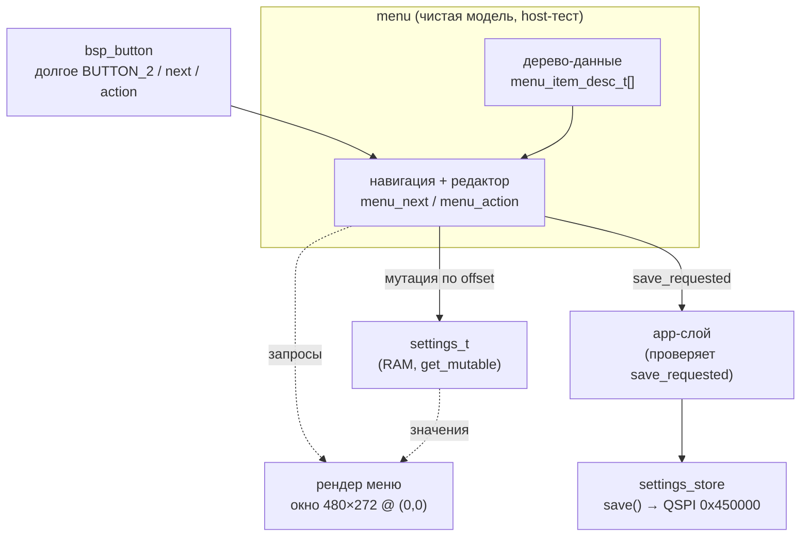
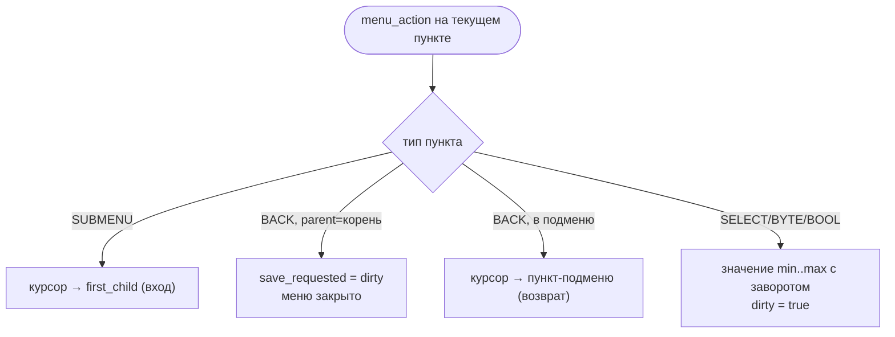
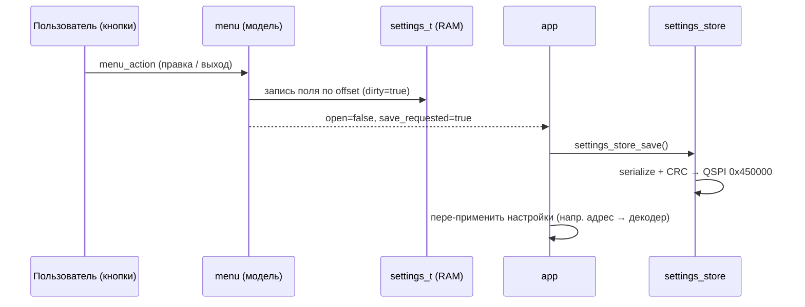

# tft-app — движок меню и связь с настройками

Документ описывает **реализованный** движок меню (Фаза 3.2.1: чистая модель) и его
связь с модулем настроек `settings_store`. Проектная основа — [ARCH.md §8](../../firmware/tft_app/ARCH.md);
реализация — [menu.c](../../firmware/tft_app/src/menu/src/menu.c),
[settings_store](../../firmware/tft_app/src/services/settings_store/).

Движущее требование (§8): клиент приносит уникальные настройки, и добавление их **не должно
требовать переписывания** движка. Отсюда два принципа: меню — **данные**, редакторы —
**подключаемые по типу**.

---

## 1. Разделение слоёв

Модель меню — чистый C (host-тест), отделена от рендера (HIL) и от записи на флеш.



Ключ: **модель сама не сохраняет и не рисует**. Она мутирует переданный `settings_t*` и на
выходе-с-сохранением выставляет `save_requested`; фактический `settings_store_save()` вызывает
app-слой. Это держит навигацию/редактирование host-тестируемыми без QSPI и без рендера.

---

## 2. Меню — данные

Пункт меню — строка-дескриптор ([menu.h](../../firmware/tft_app/src/menu/include/menu/menu.h)):

```c
typedef struct {
    const char      *label;
    menu_item_type_t type;         /* редактор: SUBMENU/BACK/SELECT/BYTE/BOOL */
    uint16_t         value_offset; /* offsetof(settings_t, <uint8-поле>)     */
    uint8_t          min, max;     /* диапазон для SELECT/BYTE/BOOL           */
    uint8_t          parent, first_child, last_child; /* дерево (плоский массив+индексы) */
} menu_item_desc_t;
```

Дерево — плоский массив; уровень = непрерывный диапазон детей `[first_child..last_child]` одного
родителя. `items[0]` — корневое `SUBMENU`, его дети — верхний уровень.

**Добавить пункт = добавить строку** массива (тот же принцип, что `k_mode_priority[]`). Добавить
причудливый редактор = добавить значение в `menu_item_type_t` + ветку в `menu_action` — движок
навигации не меняется. Фаза 3 использует `SELECT/BYTE/BOOL`; `ARRAY/SERIAL/YEAR/PERCENT/BOOL_ARRAY`
придут со своими фазами (5/6).

---

## 3. Навигация

Две кнопки: BUTTON_1 → `menu_next` (следующий пункт уровня, с заворотом); короткое BUTTON_2 →
`menu_action` (по типу пункта). Вход в меню — долгое BUTTON_2 (app-слой).



`dirty` взводится любой правкой; при выходе из корня `save_requested = dirty` (сохраняем только
если что-то менялось). Отдельного «отменить» нет — правки живут в RAM, на флеш попадают лишь при
выходе-с-сохранением.

---

## 4. Связь с настройками

Модель привязана к `settings_t` (ядро настроек, [SETTINGS](../../firmware/tft_app/src/services/settings_store/include/services/settings_store.h))
через **байтовый offset** — читает/пишет `uint8`-поле по `value_offset`:

| Ярус настройки | Пример пункта | Привязка |
| --- | --- | --- |
| **A** железобетонные | громкость, год | `offsetof(settings_t, user.<поле>)` |
| device/провиженинг | тумблер логов | `offsetof(settings_t, device.log_enabled)` |
| **B** протокольные | адрес НКУ | `offsetof(settings_t, user.proto_slice[0])` |

Ярус B (протокольные параметры) в 3.2 привязан прямым offset к `proto_slice`; в 3.3 это обобщается
на дескриптор протокола `sul_settings_desc_t` (§8) — меню строит раздел «Настройки протокола» из
дескриптора активного протокола, не хардкодом.

**Поток сохранения** (app-слой связывает модель и flash):



После сохранения app пере-применяет изменившиеся настройки к рантайму (например, новый адрес —
в `nku_can_set_address()`), т.к. декодер держит свою копию адреса.

---

## 5. Рендер (Фаза 3.2.2)

Рендер — отдельный слой, читает модель запросами (`menu_current`, `menu_level_range`,
`menu_read_value`) и рисует в **фиксированном окне 480×272 в логических (0,0)** — одинаково на всех
панелях (на больших — левый-верхний угол, остальное чёрное). Меню модально: пока `menu_is_open()`,
индикация под ним не рисуется. Детали — [PLAN.md, Фаза 3.2](../../firmware/tft_app/PLAN.md).
