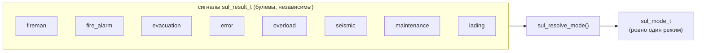
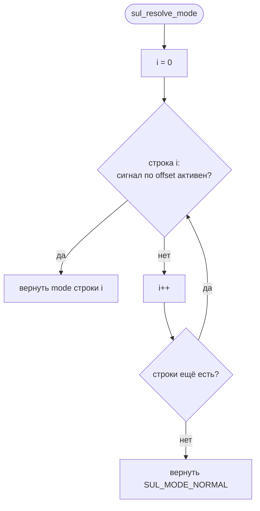

# tft-app — приоритеты режимов

Как множество одновременных сигналов от СУЛ сворачивается в **один** экранный режим.
Проектная основа — [ARCH.md §7](../../firmware/tft_app/ARCH.md); реализация —
[mode_priority.c](../../firmware/tft_app/src/domain/controller/src/mode_priority.c).

---

## 1. Задача

Сигналы в `sul_result_t` **ортогональны** — могут быть активны одновременно (перегруз во время
сервиса, пожар при погрузке и т.п.). Но экран показывает **один** режим. Нужно правило: какой
режим побеждает, когда активны несколько.



---

## 2. Таблица — это данные, а не код

Приоритет задан **порядком строк** таблицы-массива, а не значениями enum. Резолвер таблицу не
знает «в лицо» — читает булев сигнал по смещению поля (`offsetof`), что делает каждую строку
голыми данными:

```c
typedef struct { size_t flag_offset; sul_mode_t mode; } mode_rule_t;

static const mode_rule_t k_mode_priority[] = {
    {offsetof(sul_result_t, fireman),     SUL_MODE_FIREMAN},      // высший
    {offsetof(sul_result_t, fire_alarm),  SUL_MODE_FIRE_ALARM},
    {offsetof(sul_result_t, evacuation),  SUL_MODE_EVACUATION},
    {offsetof(sul_result_t, error),       SUL_MODE_ERROR},
    {offsetof(sul_result_t, overload),    SUL_MODE_OVERLOAD},
    {offsetof(sul_result_t, seismic),     SUL_MODE_SEISMIC},
    {offsetof(sul_result_t, maintenance), SUL_MODE_MAINTENANCE},
    {offsetof(sul_result_t, lading),      SUL_MODE_LADING},       // низший спецрежим
};
```

Согласованный порядок: **пожарный › пожар › эвакуация › авария › перегруз › сейсмо › сервис ›
погрузка**. Если ни одна строка не сработала — `SUL_MODE_NORMAL`.

Эвакуация и авария появились с УИМ-6100 (коды этажа 56 и 52/54/58). Обе — **выше перегруза**:
эвакуация это life-safety (вывоз людей), авария означает недоступность лифта, а перегруз временный
и разрешается сам. Позиция каждой — ровно одна строка: если у клиента иной регламент, переставить.

---

## 2.1 Что таблица упорядочивает, а что — НЕТ

Таблица отвечает на ОДИН вопрос: **какой из одновременно активных режимов станет
`indication_task_t.mode`**. Она НЕ означает «режим скрывает этаж».

Режим может выводиться **отдельным спрайтом одновременно с номером этажа и стрелкой** — это
решает layout (Фазы 4/5), у него на это свои слоты. Соответственно:

- **Декодер** не подавляет `direction`/`pos` из-за активного режима. В обоих legacy-проектах
  подавлял (`current_dir = MOVE_STOPPED_STATE`, `switch (arrow_code)` под
  `if (!SPECIAL_MODE_ENABLED)`) — но там режим и стрелка делили ОДИН слот вывода
  (`icon_img_ptr`), т.е. это было ограничение отрисовки, а не протокола. Здесь поля независимы,
  и решение «показывать ли стрелку в этом режиме» принадлежит презентации.
- **Safe-mode fallback** рисует вместо этажа текстовую метку режима — это его собственное
  упрощение (одна строка, без ассетов, см. [FALLBACK.md](FALLBACK.md)), не правило домена.
- **Гистерезис удержания режима** в УИМ-6100 остаётся, но по ПРОТОКОЛЬНОЙ причине: код этажа и
  код режима живут в одном байте `W_2`, станция чередует кадры, и без удержания флаг режима
  дёргался бы с частотой шины. У НКУ-CAN такого нет — под режим отведён свой нибль в каждом
  `PACKET1`, поэтому там per-frame защёлка. Подробности — `uim.c`/`nku_can.c`.

> ⚠️ Числовые значения `sul_mode_t` — **просто идентификаторы**, они не задают приоритет. Приоритет
> живёт только в порядке строк `k_mode_priority[]`.

---

## 3. Резолвер

Проход таблицы сверху вниз; первая строка с активным сигналом выигрывает.



Резолвер вызывается из `controller_process()` дважды за кадр (для прошлого и нового состояния) —
их сравнение даёт `mode_pending`. Смена **сырого** сигнала, не меняющая разрешённый режим (напр.
добавился перегруз при уже активном пожаре), `mode_pending` не поднимает.

---

## 4. Как менять

Всё — правки одного массива, резолвер не трогается:

- **Изменить приоритет** — переставить строки.
- **Добавить режим** — дописать строку: `offsetof` нового булева сигнала + его `sul_mode_t`
  (сам сигнал добавляется в `sul_result_t` и заполняется декодером).
- **Убрать режим** — удалить строку (сигнал в модели может остаться, просто не влияет на экран).

---

## 5. Развязка от протокола и клиентская кастомизация

Таблица оперирует **каноническими** сигналами `sul_result_t`, а не битами НКУ-CAN. Обзор боевых
декодеров (УИМ/УКЛ/УЭЛ/SD7) подтвердил: набор сигналов один на все протоколы — различаются лишь
битовые кодировки (живут в каждом декодере). Поэтому одна таблица работает для любого протокола.

Приоритеты «потенциально клиентские» (§7): клиентская кастомизация = подмена массива
`k_mode_priority[]` (в перспективе — загружаемая таблица рядом с layout/конфигом), **без правок
кода** резолвера или декодеров.

---

Куда встраивается результат: `mode` едет в `indication_task_t` и читается презентацией при
`mode_pending` — см. [DOMAIN_DATAFLOW.md §5](DOMAIN_DATAFLOW.md) и [FALLBACK.md](FALLBACK.md).
