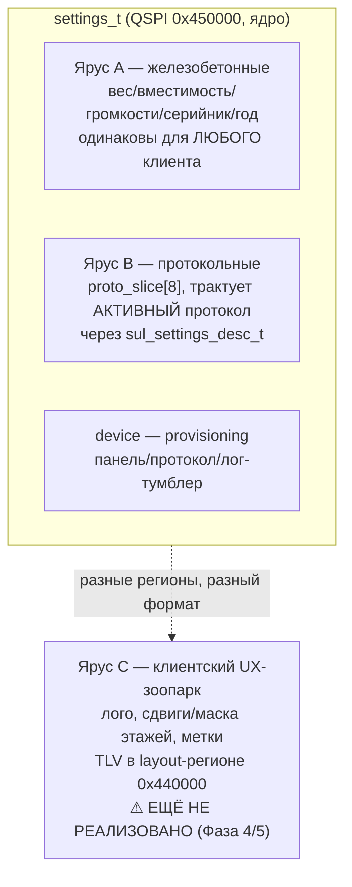
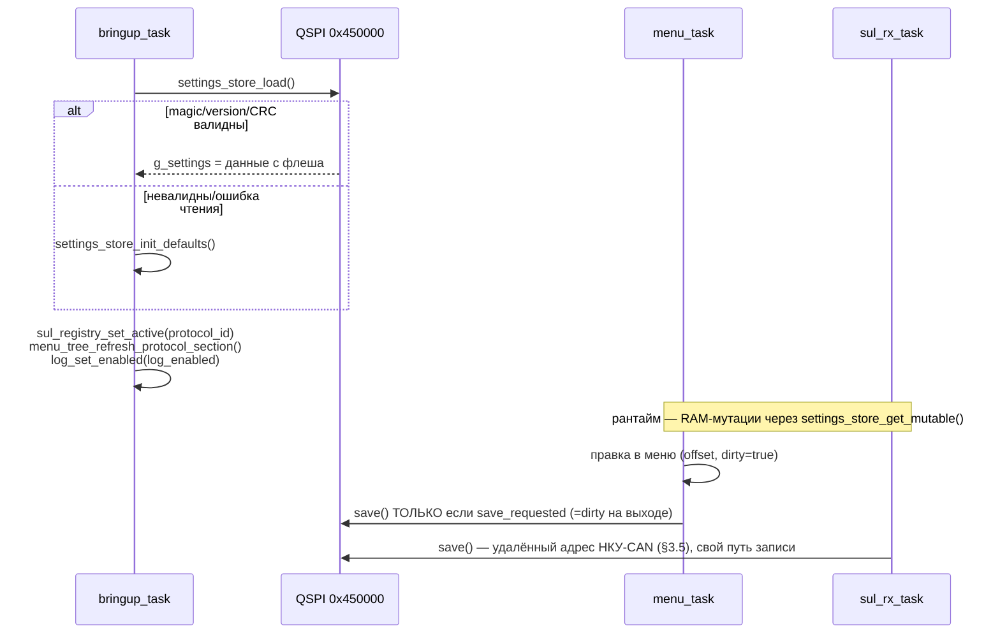

# tft-app — настройки: состав, ярусы, хранение

Документ описывает **реализованный** модуль `settings_store` — состав `settings_t`, ярусы A/B/C
и их взаимосвязь, гибридную модель хранения (ядро на QSPI + клиентский TLV) и карту QSPI. Проектная
основа — [ARCH.md §8](../../firmware/tft_app/ARCH.md) (настройки) и
[§10](../../firmware/tft_app/ARCH.md) (карта QSPI); реализация —
[settings_store.h](../../firmware/tft_app/src/services/settings_store/include/services/settings_store.h),
[settings_codec.c](../../firmware/tft_app/src/services/settings_store/src/settings_codec.c),
[partition.h](../../firmware/tft_app/src/services/partition/include/services/partition.h).

Не дублирует: механику дескрипторов протоколов ([ADDING_PROTOCOL.md](ADDING_PROTOCOL.md)) и связь
меню↔offset ([MENU.md](MENU.md) §4) — здесь только то, что уникально для самого модуля настроек:
что хранится, как устроены ярусы, как это лежит на флеше. Практическое «как добавить свою
настройку, шаг за шагом» — [ADDING_SETTING.md](ADDING_SETTING.md).

---

## 1. Три источника — settings сюда НЕ смешивает чужое

ARCH §8 разделяет три независимых источника данных приложения:

1. **`sul_result_t`** — только то, что прислала станция (см. [DOMAIN_DATAFLOW.md](DOMAIN_DATAFLOW.md)).
2. **`settings_t`** (этот документ) — конфиг устройства/пользователя, живёт на QSPI.
3. **Локальные входы** — opto (диспетчерский вызов/ответ), кнопки/меню — свои
   `volatile`-переменные в `app_tasks.h` (см. [TASKS.md](TASKS.md) §5), в `settings_t` не попадают
   вообще (это не конфигурация, а рантайм-состояние оборудования).

`settings_t` — ЕДИНСТВЕННЫЙ персистентный источник из трёх; два остальных живут только в RAM.

---

## 2. Состав `settings_t`

```c
typedef struct {
    settings_device_t device;              /* провиженинг, не в пользовательском меню */
    settings_user_t   user;                /* ярусы A + B                             */
    uint8_t           _reserved[8];        /* фикс размера — offset'ы полей стабильны  */
} settings_t;
```

| Поле | Тип/размер | Ярус | Диапазон/дефолт | Редактируется в меню сейчас? |
| --- | --- | --- | --- | --- |
| `device.panel_type` | `uint8_t` | provisioning | `2` (TFT8), Фаза 9 | нет — provisioning-параметр (ARCH §9), не пользовательский |
| `device.protocol_id` | `uint8_t` | provisioning/B | `0` (NKU_CAN) | да — пункт «Протокол» (`T_PROTO`) |
| `device.log_enabled` | `uint8_t` | provisioning | `1` (вкл.) | да — пункт «Логи» (`T_LOG`, Фаза 3.6) |
| `user.max_load_kg` | `uint16_t` | A | `0` = скрыто | **нет** — хранится и сериализуется, редактор — Фаза 5/6 |
| `user.max_cap_persons` | `uint8_t` | A | `0` = скрыто | **нет** — Фаза 5/6 |
| `user.sound_volume_idx` | `uint8_t` | A | `2` из 0..4 | **нет** — эффект (звук) только с Фазы 6 |
| `user.music_volume_idx` | `uint8_t` | A | `1` из 0..4 | **нет** — Фаза 6 |
| `user.year_production` | `uint8_t` | A | `0` = скрыто, иначе `2000+N` | **нет** — Фаза 5/6 |
| `user.serial[10]` | ASCII+`\0` | A | `""` | **нет** — Фаза 5/6 |
| `user.proto_slice[8]` | `uint8_t[8]` | B | зависит от протокола (§4) | да — единственный параметр активного протокола (`T_PROTO_PARAM`) |
| `_reserved[8]` | padding | — | `0xFF` при сохранении | не поле, задел |

Ярус A хранится/сериализуется/проходит CRC уже сейчас (см. `K_DEFAULTS` в `settings_codec.c`) —
это НЕ означает наличие UI: полей ещё нет ни в одном пункте `menu_tree.c` (проверяемо — grep по
`max_load_kg`/`serial`/… в дереве не находит ничего). Раздел 9 держит это явно, чтобы не решить
по коду наоборот.

---

## 3. Ярусы A/B/C — назначение и связь



- **A — железобетонные.** Одинаковый смысл для любого клиента/протокола: вес, вместимость,
  громкости, серийник, год выпуска. Не зависят от того, какая станция подключена.
- **B — протокольные.** `proto_slice[8]` — ОБЩИЙ буфер под параметры активного протокола;
  какой байт что значит, решает **дескриптор** протокола (`sul_settings_desc_t`, ARCH §8) —
  см. §4 ниже. Слайс один на всех — при смене протокола он **переинтерпретируется**, не
  расширяется (готча со staleness — тоже в §4).
- **device (provisioning).** Не входит ни в A, ни в B по смыслу ARCH §8, но физически хранится
  рядом (структура `settings_device_t`): панель — provisioning (Фаза 9, пишет `service_tui`,
  не пользователь), протокол и тумблер логов — фактически пользовательские пункты меню уже
  сейчас, несмотря на «device» в имени поля.
- **C — клиентский UX-зоопарк.** Логотип, сдвиги/маска номеров этажей, произвольные текстовые
  метки — то, что каждый клиент хочет по-своему. **НЕ входит в `settings_t` вообще** — ни
  структурно, ни по QSPI-региону (§6). Живёт как TLV в layout-регионе (`0x440000`), пишется
  `service_tui` (Model 2 «injected», ARCH §11), схема версионируется отдельно от ядра. На
  сегодня это **только дизайн** (ARCH §11) — ни кода, ни формата TLV ещё нет (Фазы 4–5).

**Почему C не влезает в ядро, а не потому что «забыли»:** ядро (A+B) — маленькое, с фиксированным
`offsetof`, редактируется **прошивкой** через меню, должно быть всегда валидно (magic/CRC + дефолт
на любую порчу, §7). Зоопарк C — открытый по составу (у каждого клиента свой набор виджетов),
редактируется **внешним инструментом** без пересборки прошивки, требует версионируемой схемы —
принципиально другой формат и жизненный цикл, поэтому и другой регион (§6).

---

## 4. `proto_slice` и дескрипторы протоколов (кратко — детали в ADDING_PROTOCOL.md)

Активный протокол описывает свои параметры дескриптором
([sul.h](../../firmware/tft_app/src/domain/sul/include/domain/sul.h)):

```c
typedef struct {
    const char *p_label; sul_settings_type_t type; /* BYTE / SELECT / BOOL */
    uint8_t slice_offset;                          /* смещение ВНУТРИ proto_slice[] */
    uint8_t min, max;
    const char *const *p_options;                  /* только для SELECT/BOOL */
} sul_settings_entry_t;
```

Два зарегистрированных сейчас протокола ([sul_registry.c](../../firmware/tft_app/src/domain/sul/src/sul_registry.c)):

| Протокол | `slice_offset` | Тип | Диапазон | Смысл |
| --- | --- | --- | --- | --- |
| НКУ-CAN | `proto_slice[0]` | BYTE | 0..15 | адрес станции |
| Демо | `proto_slice[0]` | SELECT | 0..2 | скорость скриптованного маршрута |

Домен не включает `settings_store.h` (ARCH §4, домен не знает презентацию/хранение) — `slice_offset`
считается ВНУТРИ `proto_slice[]`, а не внутри `settings_t`. Перевод в реальный
`offsetof(settings_t, user.proto_slice) + slice_offset` — единственная привилегия `menu/`
(`menu_tree_refresh_protocol_section()`, [MENU.md](MENU.md) §4) — только этот слой включает и
`domain/sul.h`, и `settings_store.h` одновременно.

**Готча (реальная, найдена и закрыта в Фазе 3.3, не гипотетическая).** Один и тот же байт
`proto_slice[0]` при переключении протокола в меню означает РАЗНОЕ (адрес 0..15 → скорость 0..2).
Без клампа «протухшее» значение (напр. адрес 15) читалось бы как `options[15]` за границей
2-элементного массива меток демо — мусорное чтение в рендере. `menu_tree_refresh_protocol_section()`
клампит значение под НОВЫЙ `max` в момент переключения (фикс в корне, не на каждом сайте чтения).
Практическое следствие: **у протокола с несколькими параметрами** второй/третий байт слайса будет
не инициализирован осмысленно при первом переключении на него — сейчас не актуально (у обоих
протоколов ровно один параметр), станет вопросом Фазы 8 (см. `ADDING_PROTOCOL.md` §3).

Как зарегистрировать параметр для НОВОГО протокола — пошагово в
[ADDING_PROTOCOL.md §3](ADDING_PROTOCOL.md).

---

## 5. Хранение — гибридная модель (ядро-struct + клиентский TLV)

| | Ядро (A + B + device) | Клиентский зоопарк (C) |
| --- | --- | --- |
| Формат | фикс. `struct` + magic/version/CRC32 | TLV, версионируемая схема |
| Регион QSPI | `0x450000`, 8 КБ (§6) | `0x440000`, 64 КБ (layout-регион, §6) |
| Кто пишет | прошивка (меню, `settings_store_save()`) | `service_tui` (внешний инструмент) |
| Когда меняется | в поле, через экранное меню | при заказе/переконфигурации клиента, без пересборки |
| Валидация | magic+version+CRC32, авто-дефолт при любой невалидности | схема+версия+CRC, на host (golden-render) |
| Реализовано | ✅ да (этот документ) | ⬜ нет — только дизайн ARCH §11, Фазы 4–5 |

Ядро сознательно маленькое и жёсткое (offset-стабильность нужна декодерам/меню прямо сейчас);
зоопарк сознательно гибкий и внешний (открытый список клиентских причуд, ARCH §2.2). Один
`settings_t` на оба смысла означал бы либо раздувать ядро под гипотетические виджеты (нарушает
YAGNI и offset-стабильность), либо тащить версионируемый TLV-парсер в код, который должен быть
простым и всегда-валидным. Два формата, два региона, две скорости изменения.

---

## 6. Карта QSPI (ARCH §10) — размер-независимая

| Регион | Смещение | Размер | Владелец |
| --- | --- | --- | --- |
| bootloader | `0x000000` | 256 КБ | bootloader |
| slot A (tft_app) | `0x040000` | 2 МБ | MCUboot |
| slot Б (tft_app) | `0x240000` | 2 МБ | MCUboot |
| **layout** (+ ярус C, TLV) | `0x440000` | 64 КБ | tft_app / `service_tui` |
| **settings** (ядро, этот документ) | `0x450000` | 8 КБ = 2 сектора × 4 КБ | tft_app |
| **assets** | `0x452000` | остаток до конца чипа | tft_app |

Все константы — [partition.h](../../firmware/tft_app/src/services/partition/include/services/partition.h),
общий источник для `app` и (в перспективе) генератора `service_tui`.

**Размер-независимость.** Прошивка работает на разных QSPI NOR (W25Q128/256/512 …). Все критичные
регионы — по ФИКСИРОВАННЫМ смещениям (компайл-тайм, без рантайм-детекта); размер-зависим ТОЛЬКО
регион ассетов — стартует с фикс-адреса и тянется до конца чипа
(`длина = bsp_qspi_flash_size() − 0x452000`). Больше флеш = больше места под ассеты, карта не
меняется.

**Settings — 2 сектора, сейчас используется ОДИН.** `TFT_APP_QSPI_SETTINGS_OFFSET` (сектор 0) —
рабочий, туда пишет `settings_store_save()`. Сектор 1 (`+0x1000`) — **зарезервирован под будущий
power-safe ping-pong** (erase+write не атомарен — обрыв питания посреди `save()` сейчас МОЖЕТ
испортить единственную копию; см. §9). Сектор 1 сегодня не читается и не пишется НИКЕМ — это
задел по карте, не реализованная защита.

---

## 7. Формат страницы (magic/version/CRC32)

Ровно один сектор QSPI (`BSP_QSPI_SECTOR_SIZE` = 4 КБ), проверяется статически
(`_Static_assert(sizeof(settings_page_t) == BSP_QSPI_SECTOR_SIZE)`):

```c
typedef struct {
    uint32_t      magic;      /* 0x54465453 'STFT' */
    uint8_t       version;    /* 1 */
    uint8_t       _pad[3];
    settings_t    data;
    uint8_t       _reserved[/* до конца сектора */];
    uint32_t      crc32;      /* по всей странице КРОМЕ этого поля */
} settings_page_t;
```

- **CRC32** — poly `0x04C11DB7`, MSB-first, init `0xFFFFFFFF`, без финального xor (как
  `style_updater` в OLD_PROJECT) — [`settings_crc32()`](../../firmware/tft_app/src/services/settings_store/src/settings_codec.c).
- **`_pad`/`_reserved` = `0xFF`** при сериализации — паттерн стёртого флеша, не нули (те же
  причины, что 0xFF-заполнение в других TLV этого репозитория).
- **Чтение — всегда успешно с точки зрения вызывающего.** `settings_deserialize()` возвращает
  `false` на любое несовпадение magic/version/CRC — `settings_store_load()` в этом случае просто
  подставляет `settings_defaults()`; настройки валидны ВСЕГДА после `load()`/`init_defaults()`,
  ошибка не пробрасывается выше как fatal (аналог поведения `default`-layout, ARCH §11 — деградация,
  не отказ).
- Сериализация/валидация — **чистые функции** в `settings_codec.c` (без единого обращения к QSPI),
  host-тестируются без железа; `settings_store.c` — тонкий flash-адаптер поверх них.

---

## 8. Жизненный цикл (bringup → меню → save)



- **Один экземпляр в RAM** (`static settings_t g_settings` в `settings_store.c`) — `get()`/
  `get_mutable()` возвращают указатель на него же, копий нет.
- **Сохранение — не на каждую правку.** `menu.c` взводит `dirty` любой правкой, `save_requested`
  выставляется РАВНЫМ `dirty` только на выходе из корня меню — если пользователь ничего не менял,
  `settings_store_save()` не вызывается вообще (нет лишних erase-циклов флеша).
- **Два независимых писателя `save()`** — `menu_task` (выход из меню) и `sul_rx_task` (удалённый
  адрес НКУ-CAN, §3.5) — защищены `g_save_mutex` (создаётся в `init_defaults()`/`load()`, оба
  вызываются один раз из `bringup_task` ДО создания остальных задач, гонки при создании нет по
  конструкции). Без мьютекса — два параллельных `erase+write` в один сектор, порча настроек
  (найдено при проектировании 3.5, не на стенде — см. PLAN.md).
- **Реаппликация — не только после `save()`.** Активный протокол/тумблер логов переприменяются
  СРАЗУ на каждое действие меню (`sul_registry_set_active()`, `menu_tree_refresh_protocol_section()`,
  `log_set_enabled()`) — эффект виден в том же сеансе, независимо от того, дойдёт ли пользователь
  до сохранения.

---

## 9. Что осознанно НЕ реализовано (честно)

- **Power-safe ping-pong** — сектор 1 занят под задел (§6), не используется. `save()` сегодня:
  erase → постраничная запись ОДНОГО сектора; обрыв питания между erase и завершением записи
  оставит страницу с невалидным CRC → следующий `load()` откатится на дефолты (не hardfault, но
  и не восстановит последнее сохранённое — пользовательские правки будут потеряны).
- **Ярус C / клиентский TLV** — ноль кода, только дизайн ARCH §11. Layout-регион (`0x440000`)
  сегодня не читается и не пишется вообще (нет layout-движка, Фазы 4–5).
- **`settings_store_reset_user_defaults()`** — функция объявлена и реализована, но НЕ вызывается
  ниоткуда в `app`-слое — нет пункта меню «сброс настроек». Задел под Фазу 5/6.
- **Ярус A без UI** — весь список из §2 («нет» в последней колонке) хранится/сериализуется/проходит
  CRC уже сейчас, но нет ни одного пункта меню, который бы это редактировал — только `device.protocol_id`
  и `device.log_enabled` (провиженинговые по имени поля) и `user.proto_slice` реально управляемы
  оператором сегодня.
- **`device.panel_type`** — provisioning-параметр (ARCH §9), пишется `service_tui`, а не
  пользовательским меню; сейчас хардкод-дефолт `BSP_DISPLAY_TFT8`, реальный provisioning-путь —
  Фаза 9.
