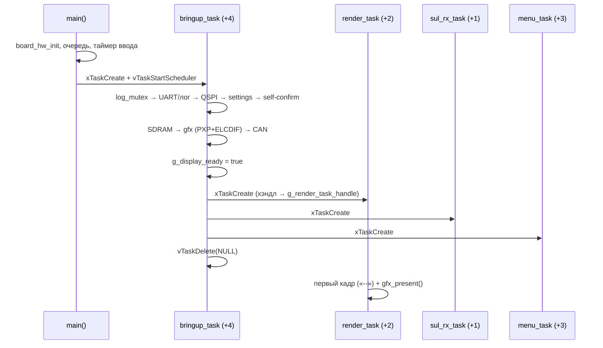
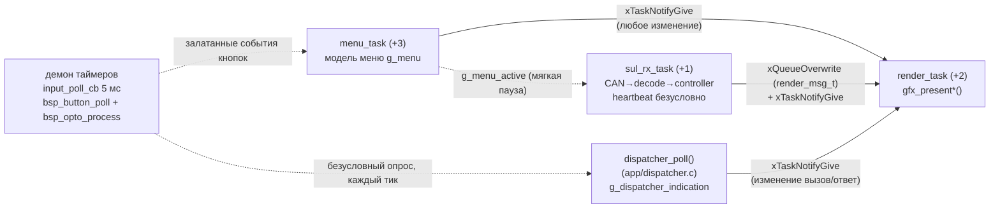

# tft-app — задачи FreeRTOS и их взаимодействие

Документ описывает **реализованную** (Фаза 3.2.4) многозадачную структуру `tft_app`: какие
задачи существуют, кто кого создаёт, как они обмениваются данными и почему приоритеты именно
такие. Контракт между задачами — [app_tasks.h](../../firmware/tft_app/src/app/app_tasks.h)
(единственный источник истины по приоритетам/разделяемому состоянию); тела задач —
`firmware/tft_app/src/app/task_*.c`.

Структура выстрадана на HW-верификации (два боевых регресса — см. PLAN.md, Фаза 3.2.4):
объединение меню и рендера в одну задачу блокировало ввод, а неверный относительный приоритет
`sul_rx`/`render` морозил экран при отсутствии CAN-трафика. Эталон разделения —
`OLD_PROJECT_TFT8_UKL` (`BUTTONS_TASK` отдельно от `REFRESH_TASK`).

---

## 1. Состав

| Задача | Файл | Приоритет (`app_tasks.h`) | Роль | Блокировки |
| --- | --- | --- | --- | --- |
| `bringup_task` | task_bringup.c | `+4` (высший, недолгоживущая) | одноразовая инициализация → создаёт три остальные → `vTaskDelete(NULL)` | QSPI/flash-операции |
| `menu_task` | task_menu.c | `+3` | модель меню: кнопки, вход/навигация/правка/сохранение. **НЕ рисует** | `settings_store_save()` (flash) на выходе из меню |
| `render_task` | task_render.c | `+2` | **единственный** владелец дисплея и вызывающий `gfx_present*()` | PXP busy-wait + ожидание FRAME_DONE |
| `sul_rx_task` | task_sul_rx.c | `+1` (низший) | приём CAN → decode → controller; heartbeat (§3.7) | busy-spin в `bsp_can_receive()` до 100 мс без трафика |
| — демон таймеров | (FreeRTOS) | `configTIMER_TASK_PRIORITY` (высший в системе) | `input_poll_cb` каждые 5 мс: `bsp_button_poll()` (debounce) → `bsp_opto_process()` (debounce IN1/IN2) → `dispatcher_poll()` (§3.4, `app/dispatcher.c` — безусловный опрос `bsp_opto_read()`, НЕ колбэк, см. PLAN.md про баг реактивной версии; пишет `g_dispatcher_indication` и будит `render_task` прямо отсюда при изменении) | нет (все три коротких) |

`main()` создаёт только очередь, софт-таймер ввода и `bringup_task` — остальное wiring делает
сам `bringup_task`.

---

## 2. Старт системы

Порядок создания (render первым) документирует зависимость: его хэндл нужен продюсерам для
`xTaskNotifyGive`. Формально гонки нет — `bringup_task` выше всех по приоритету и монополизирует
CPU, пока не создаст всех троих.

---

## 3. Взаимодействие (MPSC)

Три продюсера, один консюмер (третий — dispatcher opto, §3.4). **Данные** и **сигнал
пробуждения** разделены:

- **Очередь `g_render_queue`** (глубина 1, `xQueueOverwrite`) — только плечо
  `sul_rx→render`, несёт `render_msg_t` (diff + результат). Семантика «важно только
  последнее состояние»: рендер не обязан успевать за каждым кадром CAN. У dispatcher СВОЕЙ
  очереди нет — состояние (`g_dispatcher_indication`) не история, читается напрямую (как
  `g_menu`), очередь тут не нужна (сравнение с прошлым значением — внутри `render_task`).
- **`ulTaskNotifyTake(pdTRUE, portMAX_DELAY)`** в `render_task` — event-driven, без
  поллинга; несколько notify от ЛЮБОГО из трёх продюсеров схлопываются в одно пробуждение
  (та же семантика «важно только последнее»). `render_task` не различает, КТО его разбудил —
  каждую итерацию просто проверяет все три источника состояния заново.
- **Приоритет «меню важнее индикации» не кодируется в уведомлении**: проснувшись,
  `render_task` первым делом проверяет `menu_is_open(&g_menu)` — если меню открыто,
  очередь индикации и dispatcher даже не читаются (см. §3.1 ниже — dispatcher копится, не
  теряется).
- **Модель меню `g_menu`** мутирует только `menu_task`; `render_task` читает её для
  отрисовки после notify (happens-before через нотификацию — как у очереди).
- **`g_dispatcher_indication`** мутирует только `dispatcher_poll()` (`app/dispatcher.c`),
  вызываемый БЕЗУСЛОВНО каждый тик из контекста демона таймеров — приоритет ВЫШЕ
  `menu_task` (не реактивно на колбэк bsp_opto — см. PLAN.md §3.4 про баг первой,
  реактивной версии). `render_task` снимает копию в
  локальную переменную ОДИН раз за итерацию, а не перечитывает несколько раз (иначе
  возможна гонка того же класса, что чинили для курсора меню при быстрой навигации, см.
  PLAN.md, Фаза 3.2.4).

### 3.1 Диспетчерский вход и пауза меню (§3.4)

Приоритет диспетчерского сигнала («вызов»/«ответ») — **высший из всех режимов индикации**,
безусловно перекрывает и обычную позицию, и любой режим СУЛ; работает независимо от связи со
станцией (ARCH §8 п.3 — это «локальный вход», не данные СУЛ). Тем не менее, пока меню открыто,
`render_task` НЕ применяет его к экрану — как в `OLD_PROJECT_TFT8_UKL` (`tft_refresh_task`
целиком пропускает кадр, пока `in_menu_screen`), тот же принцип, что уже даёт мягкая пауза
`sul_rx_task`:

- **Debounce и опрос не паузятся** — `bsp_opto_process()` и `dispatcher_poll()` в
  `input_poll_cb` работают независимо от `g_menu_active`, дёшево (как и button).
- **Применение к экрану — только на закрытии меню.** Пока меню открыто, оконный композит
  перерисовывает ТОЛЬКО окно 480×272 (Фаза 3.2.4) — полный кадр индикации вне окна заморожен;
  применить смену диспетчера немедленно значило бы либо сломать оконную оптимизацию (полный
  редрав ради маленькой иконки), либо рисовать поверх окна меню. `g_dispatcher_indication`
  тем временем просто держит ПОСЛЕДНЕЕ значение — ничего не теряется, отражается сразу по
  закрытии меню тем же путём, что уже восстанавливает индикацию (`ui_fallback_render_initial()`).

### Мягкая пауза `sul_rx_task` на время меню

`menu_task` держит `g_menu_active=true`, пока меню открыто; `sul_rx_task` под этим флагом
пропускает CAN-работу (decode/controller/очередь), но **heartbeat отмечает безусловно** —
задача не suspend'ится, поэтому сторожевой таймер в безопасности по конструкции, что бы ни
происходило с меню. Флаг обновляется **до** `settings_store_save()` (flash-запись небыстрая —
иначе пауза держалась бы дольше нужного). На закрытие меню `render_task` немедленно
восстанавливает индикацию из последнего известного состояния, не дожидаясь свежего CAN-кадра.

---

## 4. Почему приоритеты именно такие

`menu (+3) > render (+2) > sul_rx (+1)` — оба соотношения выстраданы на железе:

1. **`render` ВЫШЕ `sul_rx`.** `bsp_can_receive()` — busy-spin без единого блокирующего
   FreeRTOS-вызова: без CAN-трафика `sul_rx_task` занимает CPU весь таймаут (100 мс) каждую
   итерацию, и `xTaskDelayUntil()` при просроченном дедлайне не блокирует вовсе — задача
   непрерывно READY. Более низкоприоритетный `render_task` в этой ситуации голодал:
   пустой экран при старте без связи, залипание индикации при обрыве. Обратный порядок
   приоритетов чинит это, не трогая общий bare-metal модуль `bsp_can`.
2. **`menu` ВЫШЕ `render`.** Блокировки рендера (PXP busy-wait + ожидание кадра) не должны
   придерживать обработку кнопок — то самое свойство, ради которого меню и рендер разведены
   по задачам (в объединённой задаче ввод был мёртв).
3. **`bringup` выше всех** — монополизирует CPU на время одноразовой инициализации.
4. **Демон таймеров — наивысший в системе** (`configTIMER_TASK_PRIORITY`): debounce-сэмплы
   не теряются, чем бы ни были заняты остальные. По этой же причине он — единственная
   точка кормления watchdog (см. ниже).

---

## 4.1. Кто кормит watchdog

Кормит **демон таймеров** (`supervise_watchdog()` в `input_poll_cb`), и только когда свежи
heartbeat'ы всех трёх наблюдаемых задач. Раньше `bsp_wdog_refresh()` стоял в `sul_rx_task`,
задаче с САМЫМ НИЗКИМ приоритетом: гарантия сводилась к «жив кормилец» и ничего не говорила
о живости остальных.

Что это значит для задач в этом документе:

- `sul_rx` и `menu` отмечаются раз за проход цикла (`heartbeat_mark()`);
- `render` — **не** отмечается периодически: она event-driven и законно спит на
  `ulTaskNotifyTake(portMAX_DELAY)`. Её живость судится по длительности участков
  `heartbeat_enter()`/`heartbeat_leave()`;
- мягкая пауза меню (§3) на живость не влияет — `sul_rx_task` продолжает крутить цикл
  и отмечаться.

Пороги, защёлка приговора, крэш-запись и диагнозы в логе — [WATCHDOG.md](WATCHDOG.md).

---

## 5. Разделяемое состояние (`app_tasks.h`)

| Объект | Пишет | Читает | Синхронизация |
| --- | --- | --- | --- |
| `g_render_queue` | sul_rx | render | FreeRTOS queue |
| `g_render_task_handle` | bringup (до создания продюсеров) | sul_rx, menu | создание-до-использования |
| `g_display_ready` | bringup | render, sul_rx | `volatile bool`, одно-writer |
| `g_menu_active` | menu | sul_rx | `volatile bool`, одно-writer |
| `g_menu` | menu | render | notify (happens-before) |
| `g_dispatcher_indication` | dispatcher_poll() (демон таймеров, каждый тик) | render | `volatile enum`, один writer; render снимает копию один раз за итерацию (см. §3) |
| лог-буфер `utils/log` | все задачи | — | мьютекс `port/log/src/log_mutex.c` (FreeRTOS strong-override; включён в сборку `app` — до Фазы 3.2.4 был `#if 0`, гонка) |

---

## 6. Кадр на экран (сводка)

Рендер-пайплайн (детали — [FALLBACK.md](FALLBACK.md) §5, [MENU.md](MENU.md) §5): CPU рисует в
AS (ARGB8888) → `gfx_present*()` в `render_task` = PXP-композит AS над чёрным PS → задний
framebuffer **RGB565** → tear-free свап по FRAME_DONE. Гибрид bpp держит сканаут ELCDIF на
половинной полосе SDRAM (63 МБ/с вместо 126). Индикация — всегда полный кадр (~31 мс PXP);
меню после открытия — только окно 480×272 (~8 мс расчётно).
