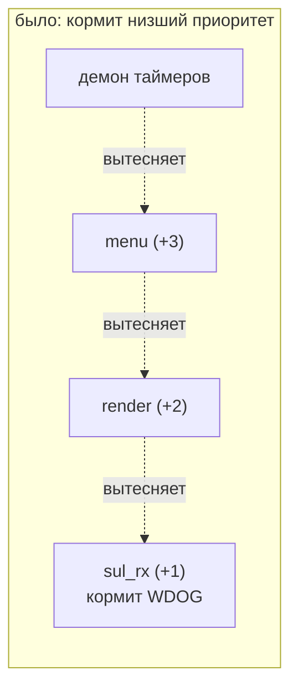
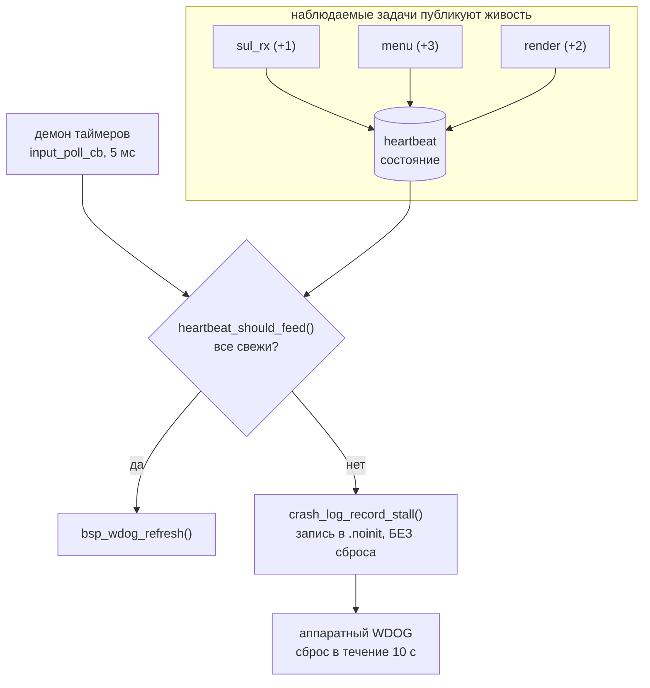
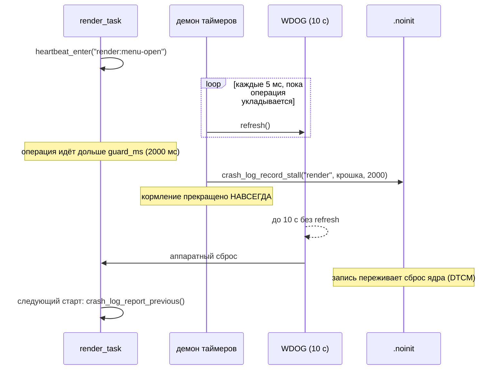

# tft-app — watchdog и супервизор живости задач

Кто и на каком основании кормит аппаратный watchdog, и что попадает в лог, когда
плата всё-таки перезагрузилась. Реализация — [heartbeat.h](../../firmware/tft_app/src/app/heartbeat.h) /
[heartbeat.c](../../firmware/tft_app/src/app/heartbeat.c),
[crash_log.c](../../firmware/tft_app/src/app/crash_log.c),
`supervise_watchdog()` в [task_menu.c](../../firmware/tft_app/src/app/task_menu.c).
Статус и история решений — [PLAN.md §3.7](../../firmware/tft_app/PLAN.md).

---

## 1. Расстановка сил

Watchdog взводит **загрузчик** — `bsp_wdog_init(10)` в
[bootloader/src/main.c](../../firmware/bootloader/src/main.c). Бит WDE аппаратно
**write-once**: выключить watchdog до следующего POR нельзя, и он остаётся
взведённым через прыжок в приложение. Приложение его не настраивает и не может
отключить — только кормит.

Отсюда жёсткое требование: **кто-то в `tft_app` обязан звать `bsp_wdog_refresh()`
чаще, чем раз в 10 с**, иначе reset-loop.

---

## 2. Почему одной точки кормления было мало

Раньше `bsp_wdog_refresh()` стоял в `sul_rx_task` — задаче с **самым низким**
приоритетом (`+1`). Формально требование выполнялось, но гарантия получалась
кривая: «жива задача-кормилец» и ничего про остальных.



Любой участок кода **выше** `+1`, удержавший CPU дольше 10 с, ронял плату — при
том, что «кормилец» был совершенно жив и просто не получал процессор. Хуже:
кормление продолжалось и тогда, когда `render_task` или `menu_task` намертво
залипали, — watchdog о них ничего не знал.

Это не гипотеза: класс отказа выстрелил на стенде, разбор —
[PERF_AND_HANG_INVESTIGATION.md](../PERF_AND_HANG_INVESTIGATION.md).

---

## 3. Принцип: кормит неубиваемый, но по основанию

Два независимых решения, вместе дающих нужное свойство:

1. **Кормит демон программных таймеров** (`supervise_watchdog()` внутри
   `input_poll_cb`, каденция 5 мс). У него `configTIMER_TASK_PRIORITY` —
   наивысший приоритет в системе, выголодать его практически нечем.
2. **Кормит не безусловно, а по основанию** — только если свежи heartbeat'ы
   **всех** наблюдаемых задач.



Гарантия меняется с «жив кормилец» на **«живы все наблюдаемые задачи»**.
Формально это ослабление в одном месте (кормит контекст, который почти
невозможно застопорить) и усиление в трёх других.

---

## 4. Две семантики живости

Ключевое место механизма. «Задача жива» значит **разное** для задач с
фиксированной каденцией и для event-driven задач.

| Семантика | Кому | Как отмечается | Что проверяется |
| --- | --- | --- | --- |
| **периодическая** | задачам с фиксированным циклом | `heartbeat_mark()` раз за проход | время с последней отметки < `period_ms` |
| **защищённая операция** | всем, у кого есть участки заметно длиннее их каденции | `heartbeat_enter()` / `heartbeat_leave()` вокруг участка | длительность ТЕКУЩЕЙ операции < `guard_ms` |

Обе применимы к одной задаче одновременно.

### 4.1. Ловушка event-driven задачи

`render_task` спит на `ulTaskNotifyTake(portMAX_DELAY)` и при отсутствии
событий может молчать **сколько угодно** — это штатное состояние, а не
зависание. Наивное «heartbeat = прошла итерация» уронило бы плату на простое.

Поэтому у неё `period_ms = 0` — «периодической отметки не требует», и живость
судится **только** по длительности участков между `enter`/`leave`. Вне скобок
она свежа по определению.

### 4.2. Таблица наблюдения — данные

Как `k_mode_priority[]` в домене: добавить задачу под наблюдение = дописать
строку и элемент в `hb_task_t`.

```c
static const hb_desc_t K_TASKS[HB_TASK_COUNT] = {
    [HB_TASK_SUL_RX] = { .p_name = "sul_rx", .period_ms = 2000U, .guard_ms = 2000U },
    [HB_TASK_MENU]   = { .p_name = "menu",   .period_ms = 1000U, .guard_ms = 3000U },
    [HB_TASK_RENDER] = { .p_name = "render", .period_ms =    0U, .guard_ms = 2000U },
};
```

| Задача | Реальная каденция | Порог | Почему такой |
| --- | --- | --- | --- |
| `sul_rx` | цикл 100 мс | 2000 мс | запас ×20: низший приоритет, задерживается легче прочих |
| `menu` | цикл 5 мс | 1000 мс | запас с большим избытком; `guard` 3000 — под запись сектора QSPI |
| `render` | event-driven | `guard` 2000 мс | полный кадр после фикса кэшируемого XIP — единицы-десятки мс |

Пороги — не «время цикла», а «время цикла с запасом ×10..×20»: задача может
законно задержаться под нагрузкой, **ложный сброс хуже позднего**.

### 4.3. Где расставлены скобки

| Крошка | Что защищает |
| --- | --- |
| `render:first-frame` | первый кадр индикации после bring-up |
| `render:menu-open` | очистка AS + два полных `gfx_present()` |
| `render:menu-nav` | перерисовка окна меню + `gfx_present_rect()` |
| `render:indication` | полный кадр индикации |
| `menu:settings-save` | `settings_store_save()` — стирание+запись сектора QSPI |

`heartbeat_leave()` засчитывается и как **признак прогресса**: иначе
периодическая задача (`menu`) оказывалась бы протухшей сразу по выходе из
длинной операции — при том, что только что доказала живость.

---

## 5. Приговор защёлкивается

`heartbeat_should_feed()`, один раз вернув `false`, возвращает `false` **всегда**.

Это не перестраховка, а условие работоспособности механизма. Порог свежести
(1–3 с) намного меньше таймаута watchdog (10 с) — у залипшей задачи есть
секунды, чтобы «отлипнуть». Без защёлки:

- кормление возобновилось бы, **сброса не произошло бы вовсе**;
- крэш-запись осталась бы висеть в `.noinit` и приписала бы себя следующему,
  ни при чём не виноватому сбросу (например, нажатию reset).

Задача, однажды просрочившая свой порог, доверия больше не заслуживает:
диагноз вынесен — сброс должен состояться.

Вместе с защёлкой **замораживаются обстоятельства** (задача, возраст, крошка):
крошка к следующему вызову уже сменилась бы на `"idle"`, и в запись попало бы
место, к залипанию отношения не имеющее.

---

## 6. Хронология отказа



Полное время от залипания до сброса — `guard_ms` + до 10 с. На стенде
(2026-08-11) это выглядело так: меню открыто на ~9,3 с → приговор ровно на
пороге 2000 мс → аппаратный сброс, последний лог перед ним — 20125 мс.

---

## 7. Что видно в логе

Первым делом после подъёма UART `bringup_task` зовёт
`crash_log_report_previous()`:

| Строка | Диагноз |
| --- | --- |
| `TASK STALL task='X' залипла в '<крошка>', молчала N мс [TOUT=1]` | задача X не уложилась в свой порог (§4) |
| `STACK OVERFLOW task='X' … [TOUT=0]` | переполнение стека задачи X |
| `HARDFAULT pc=0x… lr=0x… [TOUT=0]` | отказ в коде; адрес искать в `app.map` |
| `MALLOC FAILED … [TOUT=0]` | не хватило кучи FreeRTOS |
| `WATCHDOG, крэш-записи НЕТ` | отказ самого супервизора/демона таймеров, либо срыв до его старта |
| `предыдущий сброс: штатный (питание/кнопка/отладчик)` | ни записи, ни таймаута |

Реальная строка со стенда (2026-08-11):

```
[0][E][crash] ПРЕДЫДУЩИЙ СБРОС: TASK STALL task='render'
              залипла в 'render:menu-open', молчала 2000 мс
```

### 7.1. `TOUT` — зачем он рядом с причиной

`TOUT` — бит `WDOG1->WRSR`, единственный аппаратный свидетель, доступный
приложению. Он различает **два пути сброса, которые сама причина не
различает**:

- `TOUT=1` — плату добил аппаратный watchdog. Так выглядит залипание задачи
  (§5: супервизор перестал кормить);
- `TOUT=0` — сбросились мы сами через `NVIC_SystemReset()`. Так выглядит отказ
  в коде (HardFault, переполнение стека, malloc).

Расхождение с ожиданием — само по себе диагноз.

> **Чего в логе НЕТ и почему.** Полного источника сброса (питание / кнопка /
> отладчик / перегрев) приложение показать не может. `SRC->SRSR` — ресурс
> **однократного потребления**, и его забирает ЗАГРУЗЧИК:
> `bsp_boot_state_init()` читает бит POR для счётчика попыток recovery и
> очищает регистр целиком, задолго до `main()` приложения. Проверено на стенде
> (2026-08-11): `SRSR=0x00000000` даже после снятия питания.
>
> `WDOG1->WRSR` этой проблемы не имеет — он read-only и самоочищается на каждый
> сброс, потребления не требует и работает на любой стадии цепочки загрузки.
>
> Готовый разбор `SRSR` лежит в [bsp/reset](../../bsp/reset/README.md) и ждёт
> решения о передаче источника из загрузчика — см.
> [PLAN.md §3.8](../../firmware/tft_app/PLAN.md).

### 7.2. Два режима записи

| Функция | Когда | Кто сбрасывает |
| --- | --- | --- |
| `crash_log_record_and_reset()` | отказ В КОДЕ (HardFault, стек, malloc) — контекст враждебный, продолжать нельзя | сами, немедленно (`NVIC_SystemReset()`) |
| `crash_log_record_stall()` | задача не подаёт признаков жизни — система формально работоспособна | аппаратный watchdog, штатным путём |

Запись **идемпотентна**: побеждает первая причина. Супервизор зовёт её каждые
5 мс вплоть до сброса, и задачи, протухшие следом лавиной от того же залипания,
затёрли бы первичный диагноз.

### 7.3. Дисциплина раскладки записи

Запись живёт в `.noinit` (DTCM, 64 Б) и содержит магию версии раскладки:
`CRAH` → `CRA2` (появилось поле `where`) → `CRA3` (крошке выделен свой лимит
32 байта). **Магия бампается на каждое изменение раскладки** — иначе запись от
прежнего образа, оставшаяся после обновления прошивки БЕЗ снятия питания,
прошла бы проверку и была бы разобрана по новым полям.

Лимит крошки отдельный и больший не случайно: при общем лимите 16 в лог ушло
`'render:menu-ope'` — крошки соседних веток одной задачи различаются **в конце**
строки, и обрезка била ровно по различающей части.

---

## 8. Границы механизма

Честно о том, чего он **не** делает:

- **`.noinit` теряется при снятии питания.** После зависания перезапускать
  программно или кнопкой reset, не по питанию — иначе диагноз пропадёт.
- **Живость ≠ корректность.** Задача, которая исправно крутит цикл и
  отмечается, но делает не то, супервизору выглядит здоровой.
- **`bringup_task` не наблюдается** — одноразовая, монополизирует CPU до
  создания остальных и удаляет себя. Пока задача не отметилась ни разу, она
  считается незапущенной и свежести не требует, поэтому во время bring-up
  кормление идёт беспрепятственно. (Побочно это лучше прежней схемы: раньше в
  этом окне watchdog не кормил никто — `sul_rx_task` ещё не существовала.)
- **Отказ самого демона таймеров** супервизор поймать не может по построению.
  Его закрывает аппаратный watchdog: никто не кормит → сброс, крэш-записи нет —
  это и есть строка `WATCHDOG TIMEOUT (крэш-записи нет)`.
- **`enter`/`leave` не вкладываются.** `enter` перезаписывает текущую операцию,
  первый `leave` снимает её целиком. Вложенных участков в коде сейчас нет; если
  появятся — механизм придётся расширять осознанно.
- **Состояние `volatile`, но не атомарное.** Промах на одну итерацию допустим
  по построению: порог на порядок больше каденции отметок.

---

## 9. Как добавить задачу под наблюдение

1. Элемент в `hb_task_t` ([heartbeat.h](../../firmware/tft_app/src/app/heartbeat.h)).
2. Строка в `K_TASKS` — имя, `period_ms` (или `0` для event-driven), `guard_ms`.
3. В задаче: `heartbeat_mark(HB_TASK_X, app_now_ms())` раз за проход цикла
   и/или `heartbeat_enter()`/`heartbeat_leave()` вокруг длинных участков.
4. Порог — от реальной каденции с запасом ×10..×20, но заведомо меньше 10 с.
5. Дописать тест в `tests/host/tft_app_heartbeat/`.

Ничего в `supervise_watchdog()` и `crash_log` менять не нужно.

---

## 10. Тестирование

**Host** — `tests/host/tft_app_heartbeat` (22 теста). Модуль чистый C, время
приходит параметром, поэтому вся логика «кормить/не кормить» проверяется без
FreeRTOS и без железа: bring-up, пороги на задачу, простой event-driven задачи,
границы защищённых операций, `leave` как признак прогресса, приоритет `guard`
над `period` внутри операции, защёлка и заморозка обстоятельств, **переворот
счётчика времени** (без беззнаковой разности супервизор на ~49-е сутки
непрерывной работы разом счёл бы все задачи протухшими).

**Стенд** — разовый образ с искусственной задержкой внутри защищённого участка
(`vTaskDelay()`, а не busy-loop: CPU не удерживается, прочие задачи живы и
отмечаются, значит проверяется именно «задача не вышла из операции», а не
голодание). В рабочем дереве инструментации нет.

Отдельной стендовой проверки периодические задачи не требуют: если бы
`heartbeat_mark()` не был реально подключён в `sul_rx_task`/`menu_task`,
супервизор счёл бы их протухшими через 1–2 с и плата перезагружалась бы
непрерывно. Нормальная работа — положительное доказательство этой проводки.
