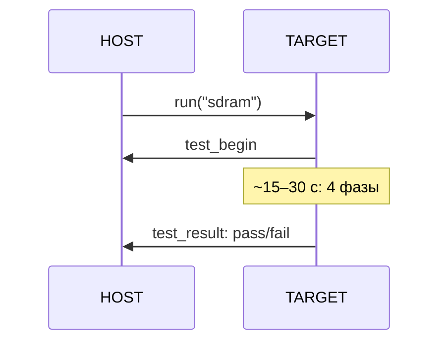
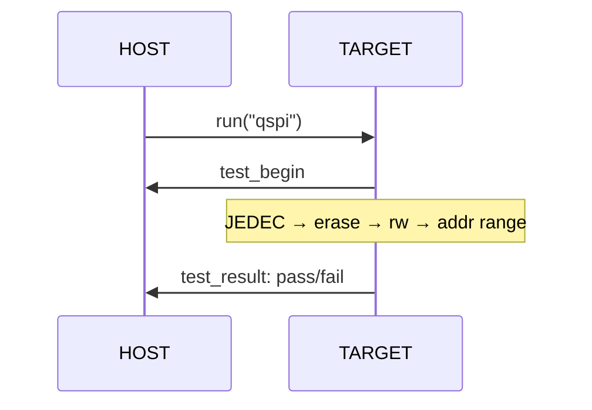
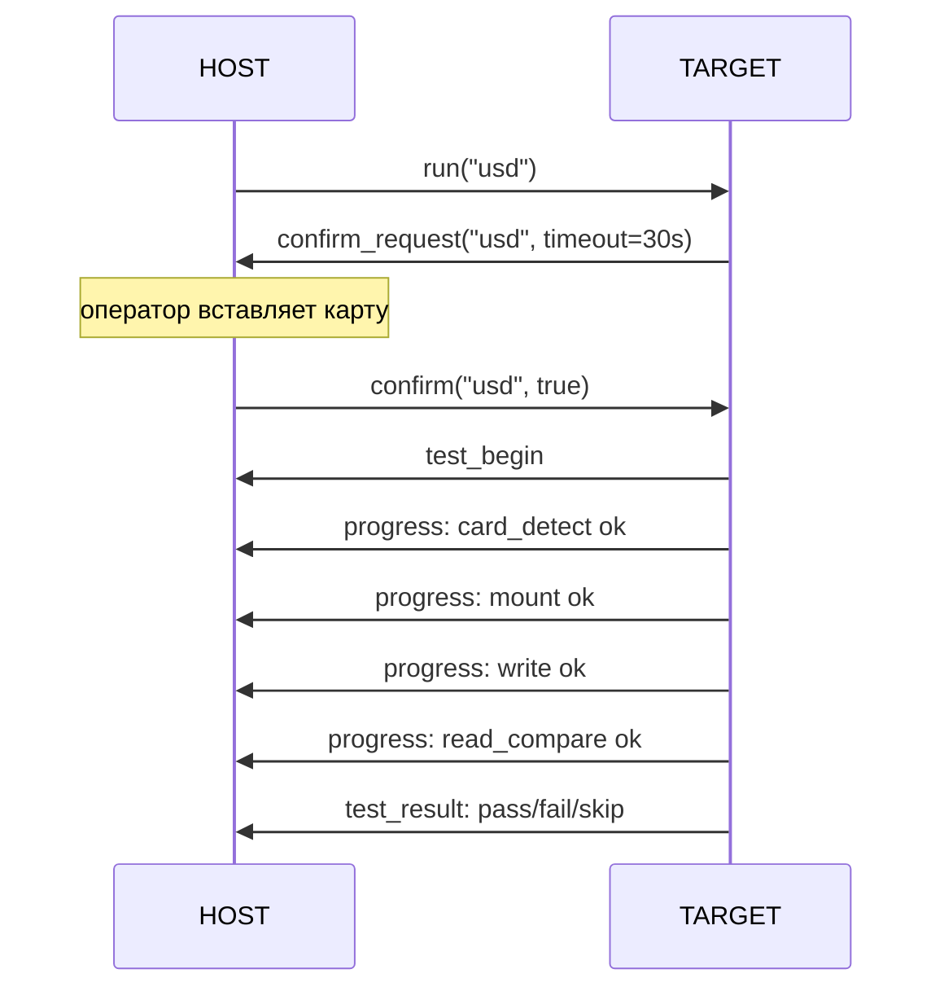
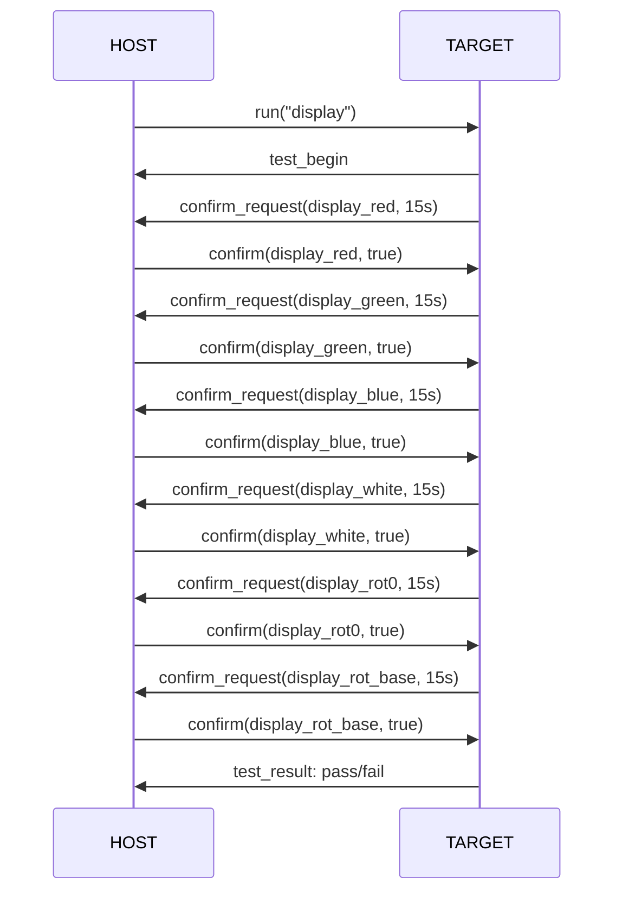
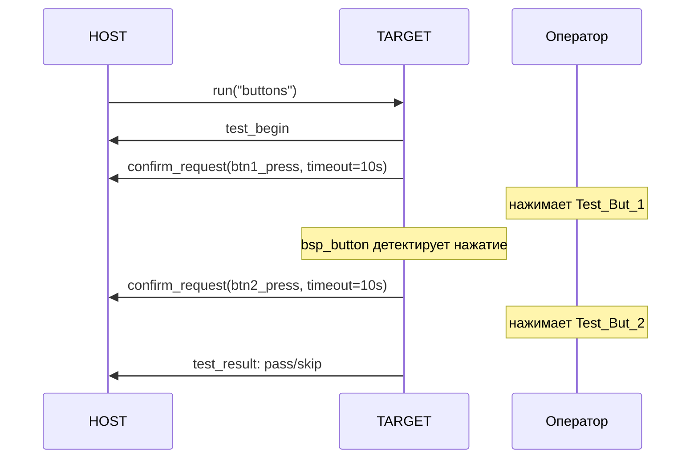

# firmware_test — Руководство по тестированию

Тестовая прошивка входного контроля платы MIMXRT1052CVJ5B.  
Транспорт: USB CDC ACM (J2). Протокол: JSON-lines v2, один JSON-объект на строку.  
Загружается в RAM через BootROM USB SDP — без предварительной прошивки загрузчика.

> Версия прошивки: `0.1.4` (`FIRMWARE_TEST_VERSION` в `protocol.h`)

---

## Протокол — справочник сообщений

### Входящие сообщения (host → target)

| Тип       | Пример                                                         | Описание                             |
| --------- | -------------------------------------------------------------- | ------------------------------------ |
| `cmd`     | `{"type":"cmd","cmd":"ping"}`                                  | Проверка канала                      |
| `cmd`     | `{"type":"cmd","cmd":"run","id":"sdram"}`                      | Запустить один тест по ID            |
| `cmd`     | `{"type":"cmd","cmd":"run_all"}`                               | Запустить все тесты реестра          |
| `cmd`     | `{"type":"cmd","cmd":"list_tests"}`                            | Получить реестр тестов с метаданными |
| `cmd`     | `{"type":"cmd","cmd":"run_selected","tests":["sdram","qspi"]}` | Запустить подмножество тестов        |
| `confirm` | `{"type":"confirm","id":"usd","confirmed":true}`               | Ответ оператора на запрос            |

### Исходящие события (target → host)

| Тип                          | Ключевые поля                                | Описание                        |
| ---------------------------- | -------------------------------------------- | ------------------------------- |
| `session_start`              | `fw`, `target`, `uptime_ms`                  | Прошивка готова к работе        |
| `test_list`                  | `tests[]` (id, name, critical, requires_hil) | Ответ на `list_tests`           |
| `test_begin`                 | `id`, `name`, `critical`                     | Тест запущен                    |
| `test_result`                | `id`, `status`, `ms`, `detail`               | Результат теста                 |
| `confirm_request`            | `id`, `prompt`, `timeout_ms`                 | Запрос оператору                |
| `progress`                   | `test`, `step`, `status`                     | Прогресс внутри теста           |
| `summary`                    | `passed`, `failed`, `skipped`, `overall`     | Итог `run_all` / `run_selected` |
| `pong`                       | —                                            | Ответ на `ping`                 |
| `{"ok":false,"error":"..."}` | `error`                                      | Ошибка протокола                |

**Возможные статусы `test_result`:** `pass` / `fail` / `skip`

**Коды ошибок в `error`:**

| Код            | Причина                                                         |
| -------------- | --------------------------------------------------------------- |
| `BUSY`         | Предыдущий тест ещё выполняется                                 |
| `UNKNOWN_TEST` | ID теста не найден в реестре                                    |
| `PARSE_ERR`    | Не удалось разобрать JSON (нет поля `type`, `cmd`, `id` и т.д.) |
| `UNKNOWN_CMD`  | Неизвестный тип сообщения или команда                           |

---

## Подключение и начало сессии

При старте прошивка ждёт CDC-подключение хоста (LED_HEARTBEAT мигает).
После подключения немедленно отправляет `session_start`:

```bash
← {"type":"session_start","fw":"0.1.4","target":"IMXRT1052","uptime_ms":1108}
```

### Проверка канала (ping)

```bash
→ {"type":"cmd","cmd":"ping"}
← {"type":"pong"}
```

---

## SDRAM — контроль оперативной памяти

| Параметр         | Значение                                      |
| ---------------- | --------------------------------------------- |
| ID               | `sdram`                                       |
| Критичный        | ✅ Да — при FAIL остальные тесты получают SKIP |
| HIL              | ❌ Нет                                         |
| Тип              | Self-test                                     |
| Время выполнения | ~15–30 с                                      |

Четыре фазы:

1. **Address bus** — проверка 24 адресных бит (2⁰…2²³ от `TEST_BASE`)
2. **Data bus** — walking ones + инверсия, 64 KB
3. **Sequential integrity** — address pattern + инверсия, 2 MB
4. **Retention** — 256 KB: запись → flush → 200 мс → верификация



**PASS:**

```bash
→ {"type":"cmd","cmd":"run","id":"sdram"}
← {"type":"test_begin","id":"sdram","name":"SDRAM 32 MB","critical":true}
← {"type":"test_result","id":"sdram","status":"pass","ms":15304,"detail":""}
```

**FAIL — пример адресной ошибки:**

```bash
← {"type":"test_result","id":"sdram","status":"fail","ms":1203,
   "detail":"addr=0x80200001 exp=0x02 got=0xFF"}
```

**FAIL — SEMC не инициализирован (DCD не отработал):**

```bash
← {"type":"test_result","id":"sdram","status":"fail","ms":0,
   "detail":"SEMC not ready — DCD failed?"}
```

---

## QSPI Flash — контроль внешней Flash-памяти

| Параметр         | Значение  |
| ---------------- | --------- |
| ID               | `qspi`    |
| Критичный        | ✅ Да      |
| HIL              | ❌ Нет     |
| Тип              | Self-test |
| Время выполнения | < 500 мс  |

Четыре шага:

1. **JEDEC ID** — производитель `0xEF` (Winbond), распознавание W25Q64/128/256/512
2. **Erase + Verify** — стирание последнего сектора, проверка (все байты `0xFF`)
3. **Write + Read + Compare** — 256 байт паттерна `i & 0xFF`
4. **Address range** — только W25Q256/512: проверка dedicated 4-byte opcodes



**PASS:**

```bash
→ {"type":"cmd","cmd":"run","id":"qspi"}
← {"type":"test_begin","id":"qspi","name":"QSPI Flash W25Qxx","critical":true}
← {"type":"test_result","id":"qspi","status":"pass","ms":86,"detail":""}
```

**FAIL — чип не отвечает:**

```bash
← {"type":"test_result","id":"qspi","status":"fail","ms":1,
   "detail":"JEDEC: mfr=0xFF exp=0xEF"}
```

**FAIL — адресное алиасирование (3-byte wrap на W25Q256/512):**

```bash
← {"type":"test_result","id":"qspi","status":"fail","ms":312,
   "detail":"addr alias: 0x1FFF000 mirrors 0x00FFF000 (3-byte wrap)"}
```

---

## microSD — контроль SDIO-интерфейса

| Параметр         | Значение                  |
| ---------------- | ------------------------- |
| ID               | `usd`                     |
| Критичный        | ❌ Нет                     |
| HIL              | ❌ Нет                     |
| Тип              | Interactive (pre-confirm) |
| Время выполнения | < 1 с после вставки карты |

Оператор вставляет карту по запросу. Тест запускается только после подтверждения.  
Отказ или таймаут 30 с → `SKIP`.

Пять шагов с `progress`-событиями: card detect → mount → write 4 KB → read/compare → unmount.



**PASS:**

```bash
→ {"type":"cmd","cmd":"run","id":"usd"}
← {"type":"confirm_request","id":"usd","prompt":"Insert microSD card and press OK","timeout_ms":30000}
→ {"type":"confirm","id":"usd","confirmed":true}
← {"type":"test_begin","id":"usd","name":"microSD (SDIO)","critical":false}
← {"type":"progress","test":"usd","step":"card_detect","status":"ok"}
← {"type":"progress","test":"usd","step":"mount","status":"ok"}
← {"type":"progress","test":"usd","step":"write","status":"ok"}
← {"type":"progress","test":"usd","step":"read_compare","status":"ok"}
← {"type":"test_result","id":"usd","status":"pass","ms":874,"detail":""}
```

**SKIP — оператор нажал Cancel:**

```
→ {"type":"confirm","id":"usd","confirmed":false}
← {"type":"test_result","id":"usd","status":"skip","ms":0,"detail":"operator declined"}
```

**SKIP — таймаут 30 с (карта не вставлена, confirm не получен):**

```bash
← {"type":"test_result","id":"usd","status":"skip","ms":0,"detail":"confirm timeout"}
```

**FAIL — карта не вставлена (confirmed:true, но карты нет в слоте):**

```bash
← {"type":"test_result","id":"usd","status":"fail","ms":5,"detail":"no card detected"}
```

---

## TFT-дисплей — визуальная проверка

| Параметр         | Значение                                    |
| ---------------- | ------------------------------------------- |
| ID               | `display`                                   |
| Критичный        | ❌ Нет                                       |
| HIL              | ❌ Нет                                       |
| Тип              | Interactive (in-run confirm)                |
| Время выполнения | ~1–2 мин (определяется скоростью оператора) |

**pre-confirm отсутствует** — `test_begin` отправляется сразу после `run`.

Два этапа, каждый шаг требует подтверждения оператора (таймаут 15 с → FAIL):

- **Этап 1 (все дисплеи):** Red → Green → Blue → White
- **Этап 2 (TFT7/8/10):** паттерн Red/Blue + горизонтальный флип — диагностика непропаянных LR/UD пинов



**PASS (TFT8 — 6 confirm-шагов):**

```bash
→ {"type":"cmd","cmd":"run","id":"display"}
← {"type":"test_begin","id":"display","name":"TFT Display RGB888","critical":false}
← {"type":"confirm_request","id":"display_red","prompt":"Screen is solid red?","timeout_ms":15000}
→ {"type":"confirm","id":"display_red","confirmed":true}
← {"type":"confirm_request","id":"display_green","prompt":"Screen is solid green?","timeout_ms":15000}
→ {"type":"confirm","id":"display_green","confirmed":true}
← {"type":"confirm_request","id":"display_blue","prompt":"Screen is solid blue?","timeout_ms":15000}
→ {"type":"confirm","id":"display_blue","confirmed":true}
← {"type":"confirm_request","id":"display_white","prompt":"Screen is solid white?","timeout_ms":15000}
→ {"type":"confirm","id":"display_white","confirmed":true}
← {"type":"confirm_request","id":"display_rot0","prompt":"Screen: left RED, right BLUE?","timeout_ms":15000}
→ {"type":"confirm","id":"display_rot0","confirmed":true}
← {"type":"confirm_request","id":"display_rot_base","prompt":"Left RED and right BLUE swapped sides?","timeout_ms":15000}
→ {"type":"confirm","id":"display_rot_base","confirmed":true}
← {"type":"test_result","id":"display","status":"pass","ms":42310,"detail":""}
```

**FAIL — синий экран не подтверждён или таймаут:**

```bash
← {"type":"test_result","id":"display","status":"fail","ms":15001,
   "detail":"display_blue not confirmed"}
```

---

## Тактовые кнопки — проверка GPIO

| Параметр         | Значение                         |
| ---------------- | -------------------------------- |
| ID               | `buttons`                        |
| Критичный        | ❌ Нет                            |
| HIL              | ❌ Нет                            |
| Тип              | Interactive (физическое нажатие) |
| Время выполнения | до 20 с (2 × 10 с таймаут)       |

| Кнопка     | Пин MCU    | GPIO      | Нажатие           |
| ---------- | ---------- | --------- | ----------------- |
| Test_But_1 | GPIO_B1_14 | GPIO2[30] | LOW (pull-up 3V3) |
| Test_But_2 | GPIO_B1_15 | GPIO2[31] | LOW (pull-up 3V3) |

**Ключевое отличие от других тестов:** хост **не** отправляет `{"type":"confirm",...}`.  
`confirm_request` — только UI-подсказка оператору. Прошивка детектирует нажатие
через `bsp_button_get_event_pressed()` с debounce 20 мс.  
Таймаут 10 с → `SKIP` (не FAIL).



> **Важно:** после `confirm_request(btn1_press)` от хоста ничего отправлять не нужно.
> Следующий `confirm_request(btn2_press)` придёт сразу после физического нажатия кнопки.

**PASS:**

```bash
→ {"type":"cmd","cmd":"run","id":"buttons"}
← {"type":"test_begin","id":"buttons","name":"Test Buttons","critical":false}
← {"type":"confirm_request","id":"btn1_press","prompt":"Press Test_But_1","timeout_ms":10000}
  ... оператор нажимает Test_But_1 ...
← {"type":"confirm_request","id":"btn2_press","prompt":"Press Test_But_2","timeout_ms":10000}
  ... оператор нажимает Test_But_2 ...
← {"type":"test_result","id":"buttons","status":"pass","ms":8516,"detail":""}
```

**SKIP — кнопка не нажата за 10 с:**

```bash
← {"type":"test_result","id":"buttons","status":"skip","ms":10001,
   "detail":"btn1_press timeout"}
```

**Типичная ошибка — неверный ID (`button` без `s`):**

```bash
→ {"type":"cmd","cmd":"run","id":"button"}
← {"ok":false,"error":"UNKNOWN_TEST"}
→ {"type":"cmd","cmd":"run","id":"buttons"}
← {"type":"test_begin","id":"buttons",...}
```

---

## Запуск всего набора (run_all)

Тесты запускаются строго в порядке реестра. При провале критичного теста
(`sdram` или `qspi`) все последующие тесты получают `SKIP` с `detail:"critical test failed"`.

```bash
→ {"type":"cmd","cmd":"run_all"}
← {"type":"test_begin","id":"sdram","name":"SDRAM 32 MB","critical":true}
← {"type":"test_result","id":"sdram","status":"pass","ms":15304,"detail":""}
← {"type":"test_begin","id":"qspi","name":"QSPI Flash W25Qxx","critical":true}
← {"type":"test_result","id":"qspi","status":"pass","ms":86,"detail":""}
← {"type":"confirm_request","id":"usd","prompt":"Insert microSD card and press OK","timeout_ms":30000}
  ... оператор вставляет карту и подтверждает ...
← {"type":"test_begin","id":"usd","name":"microSD (SDIO)","critical":false}
  ...progress events...
← {"type":"test_result","id":"usd","status":"pass","ms":874,"detail":""}
← {"type":"test_begin","id":"display","name":"TFT Display RGB888","critical":false}
  ...confirm цикл 6 шагов...
← {"type":"test_result","id":"display","status":"pass","ms":42310,"detail":""}
← {"type":"test_begin","id":"buttons","name":"Test Buttons","critical":false}
← {"type":"confirm_request","id":"btn1_press","prompt":"Press Test_But_1","timeout_ms":10000}
  ...
← {"type":"test_result","id":"buttons","status":"pass","ms":6200,"detail":""}
← {"type":"summary","passed":5,"failed":0,"skipped":0,"overall":"pass"}
```

**SKIP-каскад при critical fail:**

```bash
← {"type":"test_result","id":"sdram","status":"fail","ms":1203,"detail":"addr=0x80200001..."}
← {"type":"test_begin","id":"qspi",...}
← {"type":"test_result","id":"qspi","status":"skip","ms":0,"detail":"critical test failed"}
← {"type":"test_begin","id":"usd",...}
← {"type":"test_result","id":"usd","status":"skip","ms":0,"detail":"critical test failed"}
  ...
← {"type":"summary","passed":0,"failed":1,"skipped":4,"overall":"fail"}
```

---

## Реестр тестов — порядок выполнения

| №   | ID        | Название           | Critical | HIL | Тип                          |
| --- | --------- | ------------------ | -------- | --- | ---------------------------- |
| 1   | `sdram`   | SDRAM 32 MB        | ✅        | ❌   | Self-test                    |
| 2   | `qspi`    | QSPI Flash W25Qxx  | ✅        | ❌   | Self-test                    |
| 3   | `usd`     | microSD (SDIO)     | ❌        | ❌   | Interactive (pre-confirm)    |
| 4   | `display` | TFT Display RGB888 | ❌        | ❌   | Interactive (in-run confirm) |
| 5   | `buttons` | Test Buttons       | ❌        | ❌   | Interactive (physical)       |
| 6   | `opto`    | Opto Inputs        | ❌        | ✅   | HIL (M5StampPLC RLY2/3/4)    |
| 7   | `can`     | CAN loopback       | ❌        | ✅   | HIL (M5StampPLC CAN)         |

---

## Диагностика — строки detail

| Тест      | Значение `detail`                               | Диагноз                                     |
| --------- | ----------------------------------------------- | ------------------------------------------- |
| `sdram`   | `addr=0x... exp=0x.. got=0x..`                  | Сбой ячейки по адресу                       |
| `sdram`   | `SEMC not ready — DCD failed?`                  | DCD не инициализировал SEMC                 |
| `qspi`    | `JEDEC: mfr=0xFF exp=0xEF`                      | Чип не отвечает / не пропаян                |
| `qspi`    | `JEDEC: unknown cap=0x..`                       | Неизвестный тип чипа                        |
| `qspi`    | `erase verify failed at 0x...`                  | Сектор не стирается                         |
| `qspi`    | `rw mismatch at 0x... exp=0x.. got=0x..`        | Ошибка записи или чтения                    |
| `qspi`    | `addr alias: 0x... mirrors 0x... (3-byte wrap)` | Dedicated 4-byte opcodes не работают        |
| `usd`     | `no card detected`                              | Карта не вставлена в слот                   |
| `usd`     | `mount failed: <N>`                             | `f_mount()` вернул FRESULT N                |
| `usd`     | `write failed: <N>`                             | `f_write()` вернул FRESULT N                |
| `usd`     | `compare failed at offset <N>`                  | Данные после чтения не совпадают            |
| `display` | `display init failed`                           | `bsp_display_init()` вернул ошибку          |
| `display` | `<id> not confirmed`                            | Оператор не подтвердил / истёк таймаут 15 с |
| `buttons` | `btn1_press timeout`                            | Test_But_1 не нажата за 10 с                |
| `buttons` | `btn2_press timeout`                            | Test_But_2 не нажата за 10 с                |
| `opto`    | `<id> mismatch: expected ACTIVE got INACTIVE`   | Реле не переключило оптовход                |
| `can`     | `can_rx_ready: no frame received`               | M5 не отправил фрейм / CAN не подключён     |
| `can`     | `rx id mismatch: expected 0x100 got 0x...`      | Неверный ID принятого фрейма                |
| `can`     | `rx data mismatch: got XX XX XX XX`             | Данные фрейма не совпадают                  |
| `can`     | `tx failed: bsp_can_send returned <N>`          | TX timeout или шина недоступна              |
| `can`     | `can_tx_verify: M5 did not confirm tx frame`    | M5 не получил фрейм от таргета              |
| любой     | `confirm timeout`                               | pre-confirm не получен за 30 с              |
| любой     | `operator declined`                             | Получен `"confirmed":false`                 |
| любой     | `critical test failed`                          | Предшествующий критичный тест провалился    |

---

## list_tests — получить реестр тестов

```bash
→ {"type":"cmd","cmd":"list_tests"}
← {"type":"test_list","tests":[
     {"id":"sdram","name":"SDRAM 32 MB","critical":true,"requires_hil":false},
     {"id":"qspi","name":"QSPI Flash W25Qxx","critical":true,"requires_hil":false},
     {"id":"usd","name":"microSD (SDIO)","critical":false,"requires_hil":false},
     {"id":"display","name":"TFT Display RGB888","critical":false,"requires_hil":false},
     {"id":"buttons","name":"Test Buttons","critical":false,"requires_hil":false},
     {"id":"opto","name":"Opto Inputs","critical":false,"requires_hil":true},
     {"id":"can","name":"CAN loopback","critical":false,"requires_hil":true}
   ]}
```

TUI использует этот ответ для динамического построения списка тестов.
HIL-тесты (`requires_hil=true`) недоступны если M5StampPLC не подключён.

---

## run_selected — запустить подмножество тестов

```bash
→ {"type":"cmd","cmd":"run_selected","tests":["sdram","opto"]}
← {"type":"test_begin","id":"sdram","name":"SDRAM 32 MB","critical":true}
← {"type":"test_result","id":"sdram","status":"pass","ms":15304,"detail":""}
← {"type":"test_begin","id":"opto","name":"Opto Inputs","critical":false}
  ...confirm цикл 6 шагов (HIL)...
← {"type":"test_result","id":"opto","status":"pass","ms":3210,"detail":""}
← {"type":"summary","passed":2,"failed":0,"skipped":0,"overall":"pass"}
```

Порядок выполнения — как в реестре таргета, не как в запросе.
Если хотя бы один ID не найден — вся команда отклоняется:

```bash
→ {"type":"cmd","cmd":"run_selected","tests":["sdram","unknown_test"]}
← {"ok":false,"error":"UNKNOWN_TEST"}
```

---

## Оптоизолированные входы (HIL)

| Параметр         | Значение                         |
| ---------------- | -------------------------------- |
| ID               | `opto`                           |
| Критичный        | ❌ Нет                            |
| HIL              | ✅ Да — M5StampPLC RLY2/RLY3/RLY4 |
| Тип              | HIL (автоматический оркестратор) |
| Время выполнения | ~3–5 с (6 шагов)                 |

| Шаг | confirm_request id  | M5 действие | Проверка                      |
| --- | ------------------- | ----------- | ----------------------------- |
| 1   | `opto_in1_active`   | RLY3 ON     | `BSP_OPTO_CH_IN1 == ACTIVE`   |
| 2   | `opto_in1_inactive` | RLY3 OFF    | `BSP_OPTO_CH_IN1 == INACTIVE` |
| 3   | `opto_in2_active`   | RLY4 ON     | `BSP_OPTO_CH_IN2 == ACTIVE`   |
| 4   | `opto_in2_inactive` | RLY4 OFF    | `BSP_OPTO_CH_IN2 == INACTIVE` |
| 5   | `opto_rs_active`    | RLY2 ON     | `BSP_OPTO_CH_RS == ACTIVE`    |
| 6   | `opto_rs_inactive`  | RLY2 OFF    | `BSP_OPTO_CH_RS == INACTIVE`  |

HIL confirm полностью автоматический — TUI командует M5 и отправляет confirm
без участия оператора.

```bash
→ {"type":"cmd","cmd":"run","id":"opto"}
← {"type":"test_begin","id":"opto","name":"Opto Inputs","critical":false}
← {"type":"confirm_request","id":"opto_in1_active","prompt":"M5: RLY3 ON -> IN1 ACTIVE","timeout_ms":30000}
→ {"type":"confirm","id":"opto_in1_active","confirmed":true}
  ... 5 аналогичных шагов ...
← {"type":"test_result","id":"opto","status":"pass","ms":3210,"detail":""}
```

---

## CAN loopback (HIL)

| Параметр         | Значение                         |
| ---------------- | -------------------------------- |
| ID               | `can`                            |
| Критичный        | ❌ Нет                            |
| HIL              | ✅ Да — M5StampPLC CAN (SIT1044)  |
| Тип              | HIL (автоматический оркестратор) |
| Битрейт          | 125 kbit/s                       |
| Время выполнения | ~1–2 с (2 шага)                  |

**Шаг 1 — RX (M5 → таргет):** M5 отправляет фрейм `id=0x100 data=[DE AD BE EF]`
до `confirmed:true`. Таргет принимает через `bsp_can_receive()` и верифицирует id + data.

**Шаг 2 — TX (таргет → M5):** таргет отправляет `id=0x200 data=[CA FE BA BE]`
до `confirm_request`. M5 принимает и верифицирует. TUI отправляет `confirmed:true/false`.

```bash
→ {"type":"cmd","cmd":"run","id":"can"}
← {"type":"test_begin","id":"can","name":"CAN loopback","critical":false}
← {"type":"confirm_request","id":"can_rx_ready","prompt":"M5: can_send id=0x100 data=[DE AD BE EF]","timeout_ms":30000}
→ {"type":"confirm","id":"can_rx_ready","confirmed":true}
← {"type":"confirm_request","id":"can_tx_verify","prompt":"M5: verify can_recv id=0x200 data=[CA FE BA BE]","timeout_ms":30000}
→ {"type":"confirm","id":"can_tx_verify","confirmed":true}
← {"type":"test_result","id":"can","status":"pass","ms":1240,"detail":""}
```

---

## HIL pytest — автоматическая верификация через firmware_test CDC

Два файла тестируют `test_opto` и `test_can` через реальный CDC-протокол v2.
Оркестратор (`FirmwareCdc`) управляет M5 автоматически при каждом `confirm_request`.

| Файл                       | Тест   | Рецепт Just                    |
| -------------------------- | ------ | ------------------------------ |
| `06_test_firmware_opto.py` | `opto` | `just host::hil-firmware-opto` |
| `06_test_firmware_can.py`  | `can`  | `just host::hil-firmware-can`  |

Запуск обоих сразу:

```bash
just host::hil-firmware
```

**Предусловие:** `firmware_test` прошита в Flash и запущена. Порт задаётся
через `HIL_USB_CDC_PORT` в `.env`. Фикстура `firmware_cdc` проверяет живость
через `ping → pong` (не ждёт `session_start` — он отправляется при старте и
может быть пропущен к моменту подключения).

```bash
just host::hil-firmware-opto
# 06_test_firmware_opto.py::TestFirmwareOpto::test_ping        PASSED
# 06_test_firmware_opto.py::TestFirmwareOpto::test_opto_pass   PASSED
# 06_test_firmware_opto.py::TestFirmwareOpto::test_opto_in1_fail_on_inactive PASSED

just host::hil-firmware-can
# 06_test_firmware_can.py::TestFirmwareCan::test_ping              PASSED
# 06_test_firmware_can.py::TestFirmwareCan::test_can_pass          PASSED
# 06_test_firmware_can.py::TestFirmwareCan::test_can_rx_fail_no_frame PASSED
```
