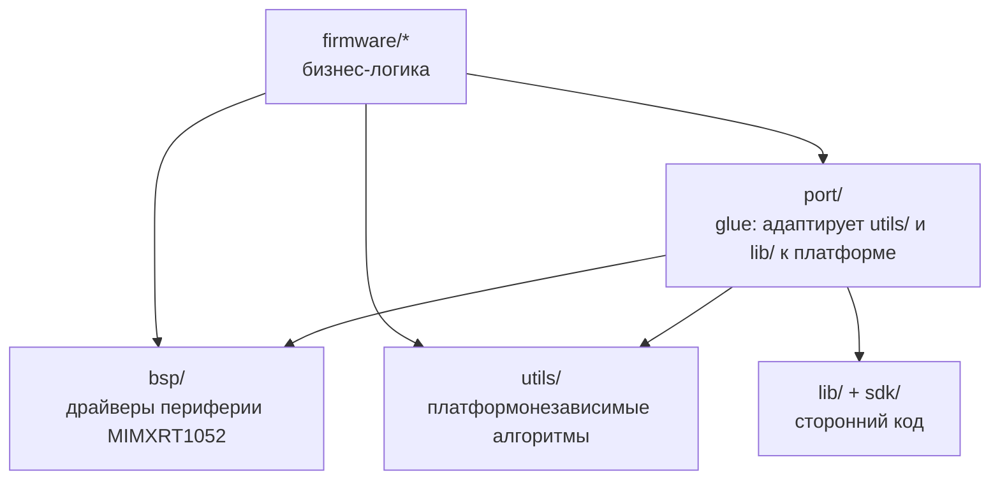

# port/ — porting layer

Glue-код между сторонними библиотеками (`lib/`, `utils/`) и платформой (`bsp/`).

---

## Концепция

В проекте четыре слоя с чёткими границами:



Код попадает в `port/` если выполняются оба условия:

1. Связывает платформонезависимую библиотеку / утилиту с конкретным BSP.
2. Сам по себе не является ни библиотекой, ни драйвером.

**Не попадает в `port/`:**

- Не зависит от `bsp/` → идёт в `utils/`
- Самостоятельный драйвер периферии → идёт в `bsp/`
- Сторонняя библиотека без изменений → идёт в `lib/`

---

## Структура

```bash
port/
├── CMakeLists.txt
├── README.md                  ← этот файл
├── log/                       ← UART-адаптер для utils/log
│   ├── CMakeLists.txt         # таргет port_log_uart
│   ├── README.md
│   ├── include/port/
│   │   └── log_uart.h
│   └── src/
│       └── log_uart.c
└── fatfs/                     ← diskio поверх bsp_sd (FatFS)
    ├── CMakeLists.txt         # таргет port_fatfs_sd (INTERFACE)
    └── sd/
        ├── CMakeLists.txt
        ├── include/port/fatfs/
        │   └── diskio_sd.h
        └── src/
            └── diskio_sd.c
```

**Планируется:** `port/freertos/` — `heap_4.c`, `configASSERT`,
`vApplicationHooks`.

---

## Таблица адаптеров

| Таргет CMake    | Что адаптирует | Куда            | Тип       |
| --------------- | -------------- | --------------- | --------- |
| `port_log_uart` | `utils/log`    | `bsp_uart_host` | STATIC    |
| `port_fatfs_sd` | FatFS diskio   | `bsp_sd`        | INTERFACE |

---

## Соглашения

**Именование таргетов:** `port_<что>_<транспорт>` — например `port_log_uart`,
`port_fatfs_sd`. Позволяет иметь несколько адаптеров для одной библиотеки.

**Include-путь:** публичные заголовки в `port/<модуль>/include/port/`,
подключение через `#include "port/<модуль>.h"`.

**Host-сборка:** `port/CMakeLists.txt` содержит ранний `return()` при
`BUILD_TESTS_HOST=ON` — `bsp/` недоступен на хосте.
