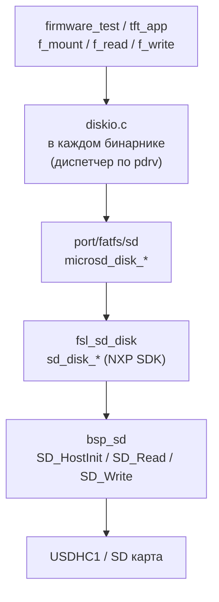

# port/fatfs — FatFS diskio поверх bsp_sd

Адаптирует FatFS diskio-интерфейс к `bsp_sd` через NXP `fsl_sd_disk`.
Предоставляет тонкую обёртку `microsd_disk_*` → `sd_disk_*` и изолирует
номер диска от вызывающего кода.

---

## Архитектура



**Почему `diskio_sd.c` не компилируется самим `port_fatfs_sd`:**
`diskio_sd.c` включает `diskio.h` → `ff.h` → `ffconf.h`. Этот файл
конфигурации разный у `firmware_test` (bare-metal, `FF_FS_REENTRANT=0`)
и `tft_app` (FreeRTOS, `FF_FS_REENTRANT=1`). Поэтому `port_fatfs_sd` —
INTERFACE-библиотека: предоставляет include path и зависимости, а каждый
бинарник компилирует `diskio_sd.c` в свой FatFS-таргет самостоятельно
через переменную `PORT_FATFS_SD_SRC`.

---

## Использование в бинарнике

```cmake
# firmware/test/CMakeLists.txt
add_library(firmware_test_fatfs STATIC
    fatfs/ff.c
    fatfs/diskio.c
    ${PORT_FATFS_SD_SRC}        # ← diskio_sd.c с правильным ffconf.h
)

target_link_libraries(firmware_test_fatfs
    PRIVATE port_fatfs_sd       # include path + bsp_sd + sdk_fatfs_headers
)
```

```c
#include "port/fatfs/diskio_sd.h"

/* diskio.c вызывает microsd_disk_* через диспетчер по pdrv: */
DSTATUS disk_initialize(BYTE pdrv)
{
    if (pdrv == SDDISK) return microsd_disk_initialize(pdrv);
    return STA_NOINIT;
}
```

---

## API (`microsd_disk_*`)

```c
DSTATUS microsd_disk_initialize(BYTE pdrv);
DSTATUS microsd_disk_status(BYTE pdrv);
DRESULT microsd_disk_read(BYTE pdrv, BYTE *buff, LBA_t sector, UINT count);
DRESULT microsd_disk_write(BYTE pdrv, const BYTE *buff, LBA_t sector, UINT count);
DRESULT microsd_disk_ioctl(BYTE pdrv, BYTE cmd, void *buff);
```

Функции — тонкие обёртки над `sd_disk_*` из NXP SDK. Не вызывать из
прикладного кода напрямую — только через диспетчер `diskio.c`.

---

## CMake

```cmake
# Получить путь к diskio_sd.c
target_link_libraries(<fatfs_target> PRIVATE port_fatfs_sd)
# PORT_FATFS_SD_SRC автоматически доступна после add_subdirectory(port)
```

**Зависимости модуля:**

| Зависимость         | Тип       | Описание                                   |
| ------------------- | --------- | ------------------------------------------ |
| `sdk_fatfs_headers` | INTERFACE | `ff.h`, `fsl_sd_disk.h`, `SDK_FATFS_*_SRC` |
| `bsp_sd`            | INTERFACE | `g_sd`, `bsp_sd_is_inserted()`             |
