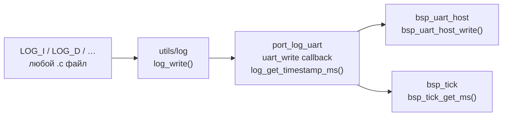

# port/log — UART-адаптер логгера

Подключает `utils/log` к `bsp_uart_host`. Является эталонной реализацией
транспортного адаптера — при добавлении нового транспорта (Flash, USB CDC)
создаётся аналогичный каталог `port/log_flash/` по той же схеме.

---

## Архитектура



`log_uart_init()` делает две вещи:

1. Регистрирует `bsp_uart_host_write()` как write callback через `log_init()`.
2. Предоставляет strong-реализацию weak-хука `log_get_timestamp_ms()` →
   `bsp_tick_get_ms()`.

---

## API

```c
void log_uart_init(void);
```

Предусловия: `bsp_uart_host_init()` и `bsp_tick_init()` уже вызваны.

---

## Быстрый старт

```c
#include "port/log_uart.h"
#include "log/log.h"

int main(void)
{
    board_hw_init();
    bsp_tick_init();
    bsp_uart_host_init(115200U);

    log_uart_init();        /* регистрирует транспорт и timestamp */

    LOG_I("BOOT", "Ready");
}
```

---

## Интеграция с FreeRTOS (`tft_app`)

Для потокобезопасности создать мьютекс **до** `log_uart_init()`:

```c
log_mutex_init();   /* создать FreeRTOS-семафор */
log_uart_init();    /* зарегистрировать транспорт */
```

Реализация мьютекса — в `firmware/tft_app/src/log_mutex.c`:

```c
#include "FreeRTOS.h"
#include "log/log.h"
#include "semphr.h"

static SemaphoreHandle_t s_log_mutex;

void log_mutex_init(void)   { s_log_mutex = xSemaphoreCreateMutex(); }
void log_mutex_lock(void)   { xSemaphoreTake(s_log_mutex, portMAX_DELAY); }
void log_mutex_unlock(void) { xSemaphoreGive(s_log_mutex); }
```

> `LOG_*` нельзя вызывать из ISR — `bsp_uart_host_write()` блокирующий.

---

## CMake

```cmake
target_link_libraries(<target> PRIVATE port_log_uart)
```

Транзитивно подтягивает `utils` (содержит `log.h` и `LOG_LEVEL`),
`bsp_uart_host` и `bsp_tick`.

**Зависимости модуля:**

| Зависимость     | Тип    | Описание                         |
| --------------- | ------ | -------------------------------- |
| `utils`         | PUBLIC | `log.h`, `LOG_LEVEL` транзитивно |
| `bsp_uart_host` | PUBLIC | write callback                   |
| `bsp_tick`      | PUBLIC | `log_get_timestamp_ms()`         |
