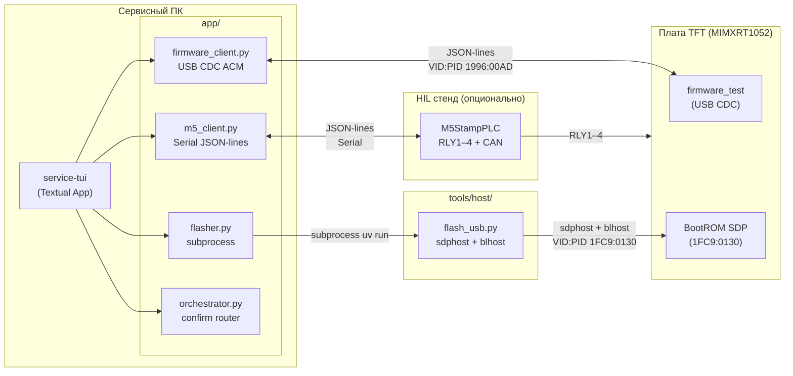
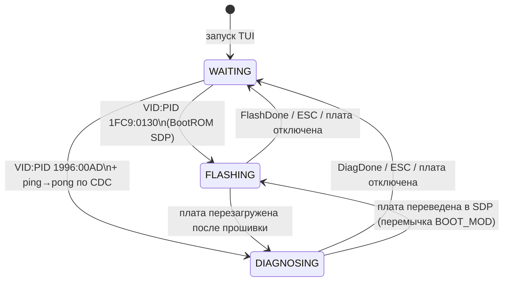
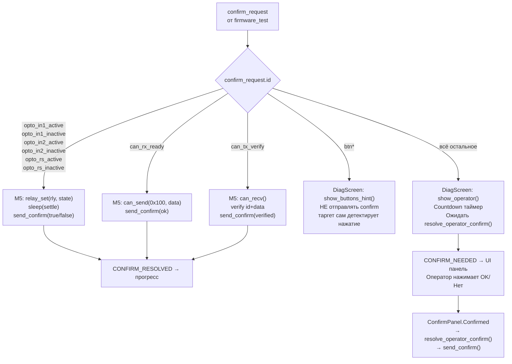
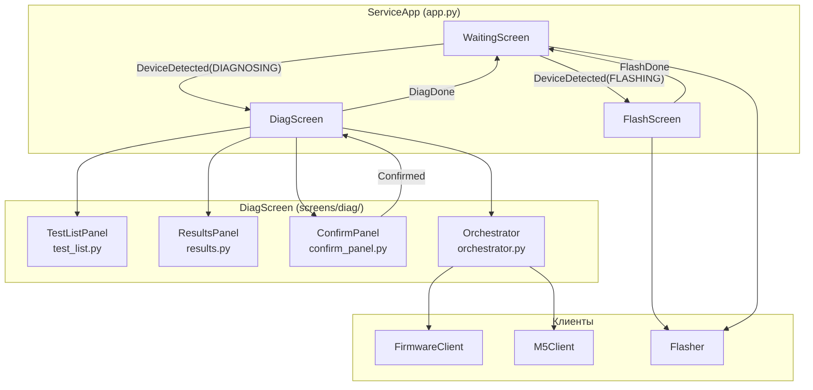
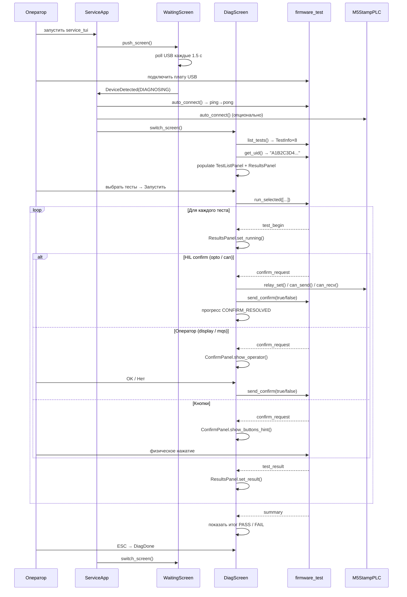

# service-tui — TUI сервисного инженера

TUI-приложение для диагностики и прошивки платы **MIMXRT1052CVJ5B** на сервисе.  
Написано на Python + [Textual](https://textual.textualize.io/). Работает на Linux, macOS, Windows.

---

## Структура проекта

```bash
tools/production/
├── main.py                              ← точка входа (10 строк)
├── pyproject.toml                       ← зависимости uv
├── uv.lock
└── app/
    ├── app.py                           ← ServiceApp — роутинг экранов, жизненный цикл клиентов
    ├── models.py                        ← все типы данных (dataclass/Enum)
    ├── firmware_client.py               ← async USB CDC клиент firmware_test
    ├── m5_client.py                     ← async M5StampPLC клиент (Serial JSON-lines)
    ├── flasher.py                       ← subprocess-обёртка над tools/host/flash_usb.py
    ├── orchestrator.py                  ← маршрутизация confirm_request
    └── screens/
        ├── __init__.py                  ← реэкспорт: WaitingScreen, FlashScreen, DiagScreen
        ├── waiting.py                   ← WaitingScreen — ожидание USB
        ├── flash.py                     ← FlashScreen — прошивка / chip erase
        └── diag/
            ├── __init__.py              ← DiagScreen — координатор диагностики
            ├── test_list.py             ← TestListPanel — чекбоксы тестов
            ├── results.py               ← ResultsPanel — строки результатов
            ├── confirm_panel.py         ← ConfirmPanel — prompt оператора + countdown
            └── styles/
                ├── waiting.tcss
                ├── flash.tcss
                └── diag.tcss
```

---

## Концепция



---

## Два режима работы

Режим определяется автодетектом USB и меняется динамически без перезапуска TUI.



### Режим A — Прошивка

Триггер: BootROM SDP `1FC9:0130` виден в `serial.tools.list_ports`.

```bash
┌─ Прошивка платы ─────────────────────────────────┐
│  ⚡ BootROM SDP обнаружен                          │
│                                                    │
│  Что прошить?                                      │
│  ◉ firmware_test  (диагностическая прошивка)       │
│  ○ Production     (bootloader + tft_app)           │
│  ○ Кастомный бинарь...                             │
│                                                    │
│  [ ▶ Прошить ]   [ ⚠ Chip Erase ]                 │
│                                                    │
│  ████████████░░░░░░  64%   blhost  64%             │
│  ┌────────────────────────────────────────────┐    │
│  │ ▶ Прошивка: firmware_test                  │    │
│  │ $ blhost -u 0x15A2,0x0073 -- write-memory… │    │
│  └────────────────────────────────────────────┘    │
└────────────────────────────────────────────────────┘
```

### Режим B — Диагностика

Триггер: CDC-порт `1996:00AD` виден + `ping→pong` прошёл.

```bash
┌─ Диагностика  fw:0.1.4  UID:A1B2C3D4E5F60011 ────────────────┐
│  M5: ✓ подключён                                               │
├────────────────────────────┬───────────────────────────────────┤
│  Тесты                     │  Результаты                       │
│  ☑ SDRAM 32 MB             │  sdram    ✓ PASS                  │
│  ☑ QSPI Flash              │  qspi     ✓ PASS                  │
│  ☑ microSD                 │  usd      ✗ FAIL  mount err: 5   │
│  ☑ TFT Display             │  display  ✓ PASS                  │
│  ☑ Кнопки                  │  buttons  ✓ PASS                  │
│  ☑ MQS Audio               │  mqs      ✓ PASS                  │
│  ☑ CAN loopback  [HIL]     │  can      … running               │
│  ☑ Оптовходы     [HIL]     │  opto     pending                 │
├────────────────────────────┴───────────────────────────────────┤
│  [ ▶ Запустить выбранные ]     [ ▶▶ Все тесты ]               │
│  ████████████████░░░░  80%  Тест: can                          │
├────────────────────────────────────────────────────────────────┤
│  ⚠  Экран залит красным цветом?                    28с         │
│  [ ✓ Да ]   [ ✗ Нет ]                                         │
└────────────────────────────────────────────────────────────────┘
```

HIL-тесты без M5StampPLC отображаются серыми и не выбираются автоматически.

---

## Диаграмма классов

```mermaid
classDiagram
    direction TB

    %% ── Точка входа ──────────────────────────────────────────
    class ServiceApp {
        -_fw: FirmwareClient
        -_m5: M5Client
        +on_mount()
        +_on_device_detected(event)
        +_on_flash_done(event)
        +_on_diag_done()
        +_connect_and_diagnose()
        +_disconnect()
    }

    %% ── Экраны ───────────────────────────────────────────────
    class WaitingScreen {
        -_spinner_idx: int
        -_detect_timer: Timer
        -_spin_timer: Timer
        +on_mount()
        +on_unmount()
        -_poll_usb()
        -_spin()
        -_stop_timers()
    }
    class WaitingScreen.DeviceDetected {
        +mode: AppMode
    }

    class FlashScreen {
        -_flasher: Flasher
        -_flashing: bool
        +compose()
        -_on_radio_changed(event)
        -_on_flash_pressed()
        -_on_erase_pressed()
        -_do_flash(target, bin_path)
        -_do_erase()
        -_resolve_target()
        -_on_progress(progress)
        -_set_busy(busy)
    }
    class FlashScreen.FlashDone {
        +success: bool
    }

    class DiagScreen {
        -_fw: FirmwareClient
        -_m5: M5Client
        -_orchestrator: Orchestrator
        -_session: SessionState
        -_running: bool
        +on_mount()
        -_init_session()
        -_update_header()
        -_on_run_selected()
        -_on_run_all()
        -_on_confirmed(event)
        -_start_run(test_ids)
        -_run_worker(test_ids)
        -_handle_event(event, total, done)
        -_on_summary(summary)
    }
    class DiagScreen.DiagDone

    %% ── Виджеты DiagScreen ───────────────────────────────────
    class TestListPanel {
        -_checkboxes: dict
        +populate(tests, m5_connected)
        +get_selected_ids() list
        +set_enabled(enabled)
    }

    class ResultsPanel {
        +populate(tests)
        +set_running(test_id)
        +set_result(result)
        +reset()
        -_update(test_id, status, detail)
    }

    class ConfirmPanel {
        -_timer: Timer
        -_remaining: int
        +show_operator(prompt, timeout_ms)
        +show_buttons_hint(prompt)
        +hide()
        -_tick()
        -_start_timer()
        -_stop_timer()
    }
    class ConfirmPanel.Confirmed {
        +confirmed: bool
    }

    %% ── Клиенты ──────────────────────────────────────────────
    class FirmwareClient {
        -_port: str
        -_ser: Serial
        -_lock: Lock
        +connect()
        +disconnect()
        +ping() bool
        +list_tests() list
        +run_selected(test_ids) AsyncGenerator
        +send_confirm(id, confirmed)
        +get_uid() str
        +auto_connect(vid, pid)$
        +find_port(vid, pid)$
    }

    class M5Client {
        -_port: str
        -_ser: Serial
        -_lock: Lock
        +connect()
        +disconnect()
        +ping() bool
        +relay_set(relay, state) bool
        +relay_get(relay) bool
        +can_send(id, data) bool
        +can_recv(timeout_ms) dict
        +auto_connect()$
        +find_port()$
    }

    class Flasher {
        -_proc: Process
        +detect_sdp()$  bool
        +detect_cdc()$  bool
        +flash(target, progress_cb, bin_path) bool
        +erase_chip(progress_cb) bool
        -_run_flash(firmware, build_type, cb)
        -_run_flash_bin(bin_path, cb)
        -_run_cmd(cmd, label, cb)
    }

    %% ── Оркестратор ──────────────────────────────────────────
    class Orchestrator {
        -_fw: FirmwareClient
        -_m5: M5Client
        -_operator_queue: Queue
        +run_tests(test_ids) AsyncGenerator
        +resolve_operator_confirm(confirmed)
        -_handle_confirm(confirm)
        -_handle_hil_opto(confirm)
        -_handle_hil_can_rx(confirm)
        -_handle_hil_can_tx(confirm)
        -_handle_operator_confirm(confirm)
    }

    %% ── Модели ───────────────────────────────────────────────
    class SessionState {
        +fw_version: str
        +chip_uid: str
        +m5_connected: bool
        +tests: list
        +results: dict
        +get_result(id)
        +set_result(result)
    }

    class OrchestratorEvent {
        +type: OrchestratorEventType
        +test_id: str
        +result: TestResult
        +confirm: ConfirmRequest
        +summary: dict
        +message: str
    }

    class TestInfo {
        +id: str
        +name: str
        +critical: bool
        +requires_hil: bool
    }

    class TestResult {
        +id: str
        +status: TestStatus
        +duration_ms: int
        +detail: str
    }

    class ConfirmRequest {
        +id: str
        +prompt: str
        +timeout_ms: int
    }

    class FlashProgress {
        +phase: str
        +percent: int
        +message: str
    }

    %% ── Enum ─────────────────────────────────────────────────
    class AppMode {
        <<enumeration>>
        WAITING
        FLASHING
        DIAGNOSING
    }

    class TestStatus {
        <<enumeration>>
        PENDING
        RUNNING
        PASS
        FAIL
        SKIP
    }

    class FlashTarget {
        <<enumeration>>
        FIRMWARE_TEST
        PRODUCTION
        CUSTOM
    }

    class OrchestratorEventType {
        <<enumeration>>
        TEST_BEGIN
        TEST_RESULT
        CONFIRM_NEEDED
        CONFIRM_RESOLVED
        BUTTONS_PROMPT
        SUMMARY
        ERROR
    }

    %% ── Связи ────────────────────────────────────────────────

    %% App → экраны
    ServiceApp --> WaitingScreen : push/switch
    ServiceApp --> FlashScreen   : switch
    ServiceApp --> DiagScreen    : switch
    ServiceApp --> FirmwareClient : создаёт
    ServiceApp --> M5Client       : создаёт

    %% Сообщения от экранов
    WaitingScreen ..> WaitingScreen.DeviceDetected : posts
    FlashScreen   ..> FlashScreen.FlashDone        : posts
    DiagScreen    ..> DiagScreen.DiagDone          : posts
    ConfirmPanel  ..> ConfirmPanel.Confirmed       : posts

    %% App слушает сообщения
    ServiceApp ..> WaitingScreen.DeviceDetected : on()
    ServiceApp ..> FlashScreen.FlashDone        : on()
    ServiceApp ..> DiagScreen.DiagDone          : on()

    %% Экраны → компоненты
    FlashScreen --> Flasher : использует
    DiagScreen  --> Orchestrator    : создаёт
    DiagScreen  --> TestListPanel   : монтирует
    DiagScreen  --> ResultsPanel    : монтирует
    DiagScreen  --> ConfirmPanel    : монтирует
    DiagScreen  --> SessionState    : владеет
    DiagScreen  ..> ConfirmPanel.Confirmed : on()

    %% Оркестратор
    Orchestrator --> FirmwareClient    : вызывает
    Orchestrator --> M5Client          : вызывает
    Orchestrator ..> OrchestratorEvent : yields

    %% Flasher детект
    WaitingScreen --> Flasher : detect_sdp/cdc

    %% Модели
    Flasher       --> FlashProgress
    Orchestrator  --> ConfirmRequest
    Orchestrator  --> TestResult
    DiagScreen    --> OrchestratorEvent
    SessionState  --> TestInfo
    SessionState  --> TestResult

    %% Enum использование
    ServiceApp    --> AppMode
    WaitingScreen.DeviceDetected --> AppMode
    TestResult    --> TestStatus
    Flasher       --> FlashTarget
    Orchestrator  --> OrchestratorEventType
    OrchestratorEvent --> OrchestratorEventType
```



---

## Обработка confirm_request

Маршрутизация реализована в `Orchestrator._handle_confirm()` по значению `confirm_request.id`:



| `confirm_request.id` | Кто отвечает | Действие TUI         | Реле M5    |
| -------------------- | ------------ | -------------------- | ---------- |
| `opto_in1_active`    | M5 авто      | прогресс             | RLY3 ON    |
| `opto_in1_inactive`  | M5 авто      | прогресс             | RLY3 OFF   |
| `opto_in2_active`    | M5 авто      | прогресс             | RLY4 ON    |
| `opto_in2_inactive`  | M5 авто      | прогресс             | RLY4 OFF   |
| `opto_rs_active`     | M5 авто      | прогресс             | RLY2 ON    |
| `opto_rs_inactive`   | M5 авто      | прогресс             | RLY2 OFF   |
| `can_rx_ready`       | M5 авто      | прогресс             | — (CAN TX) |
| `can_tx_verify`      | M5 авто      | прогресс             | — (CAN RX) |
| `btn*`               | физика       | инструкция оператору | —          |
| всё остальное        | оператор     | prompt + countdown   | —          |

---

## Архитектура экранов



---

## Жизненный цикл сессии



---

## Конфигурация (`.env`)

Файл `.env` в корне репозитория — единый источник. Загружается через `python-dotenv` в `main.py` до импорта app-модулей.

```ini
# USB VID:PID — BootROM SDP (константы NXP, не менять)
BOOTROM_VID=1fc9
BOOTROM_PID=0130

# USB VID:PID — Flashloader (константы NXP, не менять)
FLASHLOADER_VID=15a2
FLASHLOADER_PID=0073

# USB VID:PID — firmware_test CDC (наше устройство)
SERVICE_CDC_VID=1996
SERVICE_CDC_PID=00ad

# Опционально: путь к директории лога TUI
# SERVICE_LOG_DIR=/tmp
```

Пути к бинарям `flash_usb.py` вычисляет автоматически из `BUILD_DIR` (также из `.env`).

---

## Запуск

### Из монорепозитория (разработчик)

```bash
# Установить зависимости tools/production/
just host::service-setup

# Запустить TUI
just host::service-tui
```

### Standalone-бинарь (сервисник)

Скачать `service_tui` из [GitHub Releases](https://github.com/OSabuser/tft_manufacture_test/releases) и запустить двойным кликом — Python не требуется.

Для сборки из исходников:

```bash
just host::service-build
# → tools/production/dist/service_tui
```

> **Важно:** standalone-бинарь не включает `tools/host/`. Перед сборкой убедитесь что `tools/host/` инициализирован (`just host::setup-tools`) и доступен рядом с бинарём, либо измените `_FLASH_USB_SCRIPT` в `flasher.py` на абсолютный путь.

---

## Рабочие процессы сервисника

### Диагностика (firmware_test уже прошит)

```bash
1. BOOT_MOD_1 → GND, сбросить плату
2. Подключить USB к сервисному ПК
3. TUI: WaitingScreen → обнаружен CDC 1996:00AD → DiagScreen
4. Выбрать тесты (или Все тесты) → Запустить
5. Ответить на интерактивные запросы (display, mqs)
6. Получить итог PASS / FAIL
```

### Перепрошивка firmware_test

```bash
1. BOOT_MOD_1 → 3V3, сбросить плату
2. Подключить USB → TUI: FlashScreen
3. Выбрать firmware_test → Прошить
4. BOOT_MOD_1 → GND, сбросить плату
5. TUI автоматически переходит в DiagScreen
```

### Chip Erase (сброс Flash в FF)

```bash
1. Плата в SDP-режиме (BOOT_MOD_1 → 3V3)
2. FlashScreen → Chip Erase (~30 с)
3. После erase: BootROM не загрузит прошивку —
   необходимо перепрошить (пункт выше)
```

---

## Зависимости

| Пакет           | Версия | Назначение               |
| --------------- | ------ | ------------------------ |
| `textual`       | ≥ 0.80 | TUI фреймворк            |
| `pyserial`      | ≥ 3.5  | USB CDC ACM + M5 Serial  |
| `python-dotenv` | ≥ 1.0  | загрузка `.env`          |
| `pyinstaller`   | ≥ 6.0  | сборка standalone-бинаря |

**Runtime-зависимость (не в `pyproject.toml`):**
`flasher.py` вызывает `tools/host/flash_usb.py` через `uv run` — uv-окружение `tools/host/` должно быть инициализировано командой `just host::setup-tools`.

---

## Логирование

TUI логирует в файл (не в stdout — Textual захватывает терминал):

```bash
tools/production/service_tui.log   ← по умолчанию
$SERVICE_LOG_DIR/service_tui.log   ← если задан в .env
```

Уровень: `DEBUG` для всех модулей, `WARNING` для textual.  
При standalone-запуске лог создаётся рядом с исполняемым файлом.
