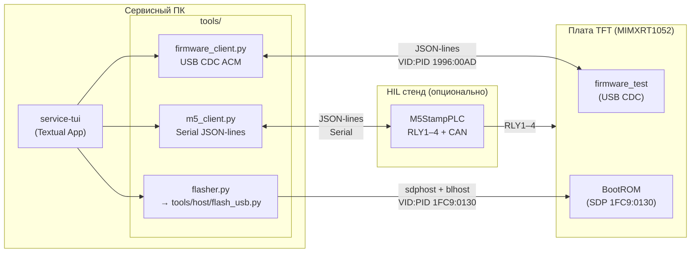
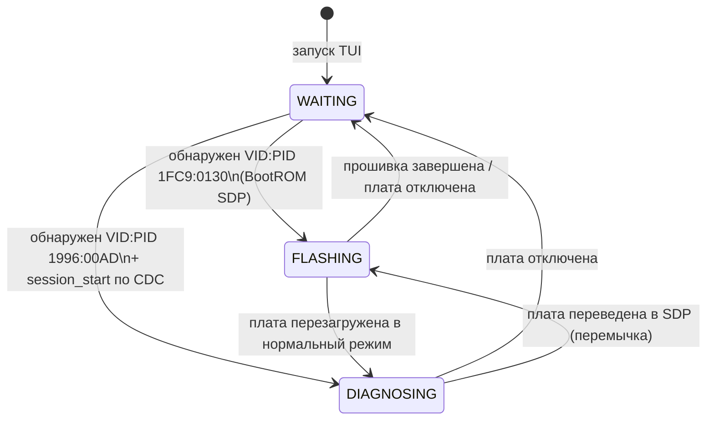
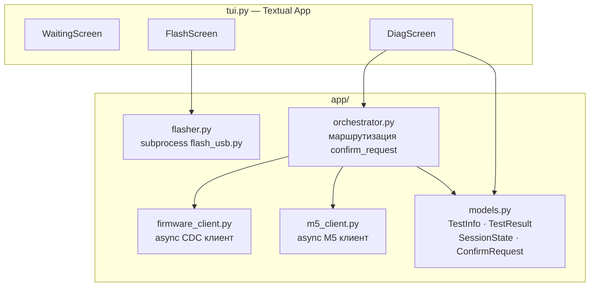
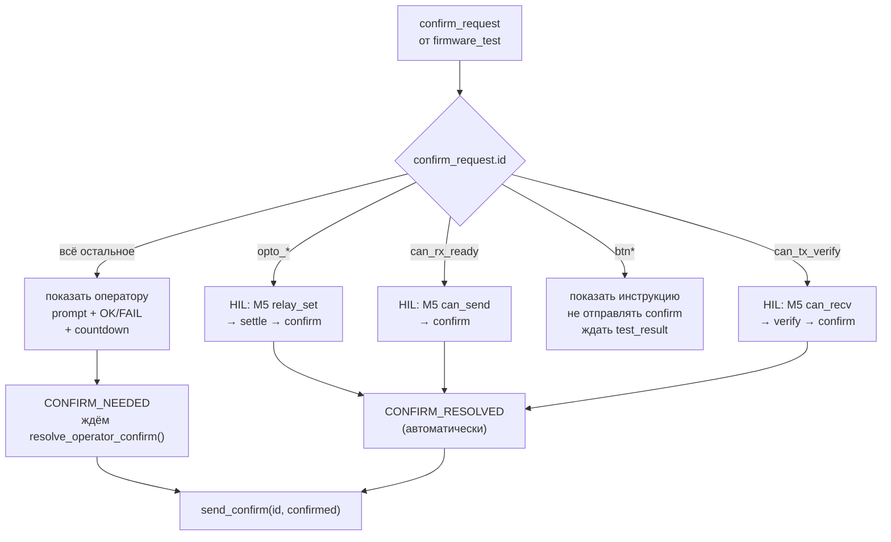
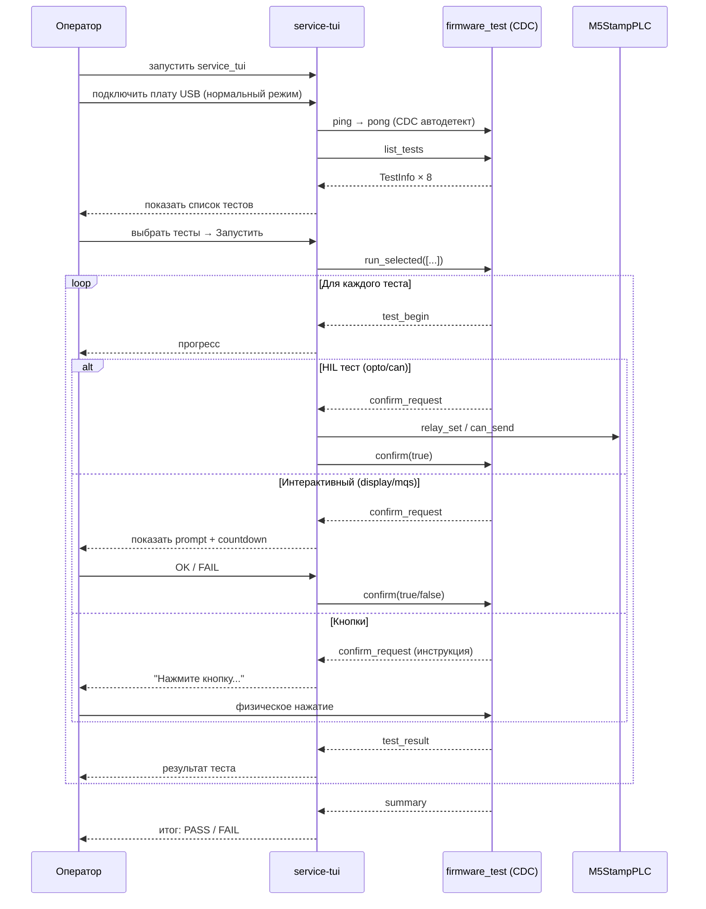

# service-tui — TUI сервисного инженера

TUI-приложение для диагностики и прошивки платы **MIMXRT1052CVJ5B** на сервисе.  
Написано на Python + [Textual](https://textual.textualize.io/). Работает на Linux, macOS, Windows.

---

## Концепция



---

## Два режима работы

Режим определяется автодетектом USB при старте и меняется динамически.



### Режим A — Прошивка

Триггер: обнаружен BootROM SDP (`1FC9:0130`).

```bash
┌─ Прошивка платы ─────────────────────────────────┐
│  Обнаружен BootROM (SDP режим)                     │
│                                                    │
│  Что прошить?                                      │
│  ◉ firmware_test  (диагностика)                    │
│  ○ Production     (bootloader + tft_app)           │
│                                                    │
│  ████████████░░░░░░  64%   Запись во Flash...      │
└────────────────────────────────────────────────────┘
```

### Режим B — Диагностика

Триггер: CDC-порт `1996:00AD` обнаружен и `ping→pong` прошёл.

```
┌─ Диагностика  fw:0.1.4  UID:A1B2C3D4E5F60011 ─────┐
│  M5StampPLC: ✓            │  Результаты:            │
├───────────────────────────┤  sdram    ✓ PASS        │
│  ☑ SDRAM 32 MB            │  qspi     ✓ PASS        │
│  ☑ QSPI Flash             │  usd      ✗ FAIL        │
│  ☑ microSD                │    mount failed: 5      │
│  ☑ TFT Display            │  display  ✓ PASS        │
│  ☑ Кнопки                 │  buttons  ✓ PASS        │
│  ☑ MQS Audio              │  mqs      ✓ PASS        │
│  ☑ CAN loopback  [HIL]    │  can      … running     │
│  ☑ Оптовходы     [HIL]    │  opto     ○ pending     │
├───────────────────────────┴─────────────────────────┤
│  [ Запустить выбранные ]      [ Все тесты ]         │
│  ████████████████░░░░  80%    Тест: can             │
├─────────────────────────────────────────────────────┤
│  ⚠ Экран залит красным цветом?                      │
│  [ ✓ Да ]   [ ✗ Нет ]                              │
└─────────────────────────────────────────────────────┘
```

---

## Архитектура приложения



---

## Обработка confirm_request

Маршрутизация определяется по `id` поля `confirm_request`:



| confirm id      | Кто отвечает | Действие TUI                           |
| --------------- | ------------ | -------------------------------------- |
| `opto_*`        | M5 авто      | показать прогресс                      |
| `can_rx_ready`  | M5 авто      | показать прогресс                      |
| `can_tx_verify` | M5 авто      | показать прогресс                      |
| `btn*`          | физика       | показать инструкцию, ждать test_result |
| всё остальное   | оператор     | prompt + OK/FAIL + countdown           |

---

## Структура

```bash
tools/production/
├── pyproject.toml          ← зависимости: textual, pyserial, python-dotenv, pyinstaller
├── uv.lock
├── main.py                 ← точка входа: asyncio + Textual App
├── app/
│   ├── tui.py              ← Textual App, экраны (WaitingScreen, FlashScreen, DiagScreen)
│   ├── firmware_client.py  ← async USB CDC клиент firmware_test
│   ├── m5_client.py        ← async M5StampPLC клиент
│   ├── flasher.py          ← subprocess → tools/host/flash_usb.py
│   ├── orchestrator.py     ← confirm_request маршрутизатор
│   └── models.py           ← AppMode, TestInfo, TestResult, SessionState, …
└── README.md               ← этот файл
```

---

## Конфигурация (`.env`)

Файл `.env` в корне репозитория — единый источник конфигурации.

```ini
# USB VID:PID — BootROM SDP (менять нельзя, NXP ROM)
BOOTROM_VID=1fc9
BOOTROM_PID=0130

# USB VID:PID — firmware_test CDC (наше устройство)
SERVICE_CDC_VID=1996
SERVICE_CDC_PID=00ad

# Пути к бинарям (опционально, TUI ищет в build/ автоматически)
FIRMWARE_TEST_BIN=build/Release/firmware_test_hab.bin
PRODUCTION_BIN_BOOT=build/Release/bootloader_hab.bin
PRODUCTION_BIN_APP=build/Release/tft_app_hab.bin
```

---

## Запуск

### Из монорепозитория (разработчик)

```bash
# Установить зависимости
just host::service-setup

# Запустить TUI
just host::service-tui
```

### Standalone-бинарь (сервисник)

Скачать `service_tui` из [GitHub Releases](https://github.com/OSabuser/tft_manufacture_test/releases) и запустить двойным кликом.  
Для сборки из исходников:

```bash
just host::service-build
# → tools/production/dist/service_tui
```

---

## Рабочий процесс сервисника



---

## Зависимости

| Пакет           | Версия | Назначение               |
| --------------- | ------ | ------------------------ |
| `textual`       | ≥ 0.80 | TUI фреймворк            |
| `pyserial`      | ≥ 3.5  | USB CDC ACM + M5 Serial  |
| `python-dotenv` | ≥ 1.0  | загрузка `.env`          |
| `pyinstaller`   | ≥ 6.0  | сборка standalone-бинаря |

**Runtime зависимость (не в pyproject.toml):**  
`tools/host/flash_usb.py` вызывается через `subprocess` с `uv run` — `tools/host/` uv-проект должен быть инициализирован (`just host::setup-tools`).
