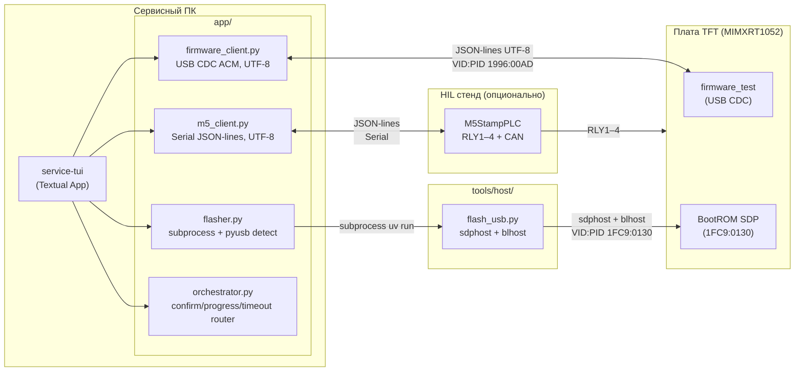
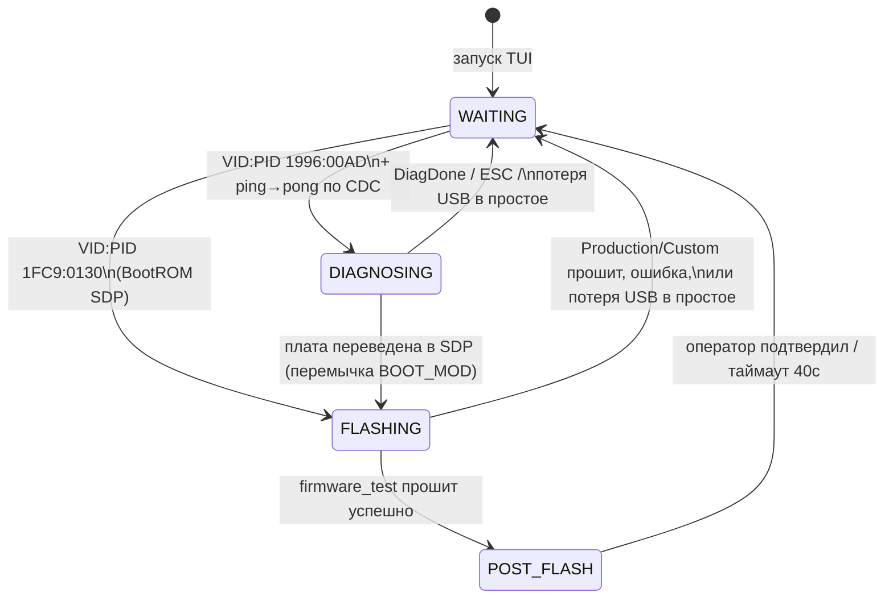
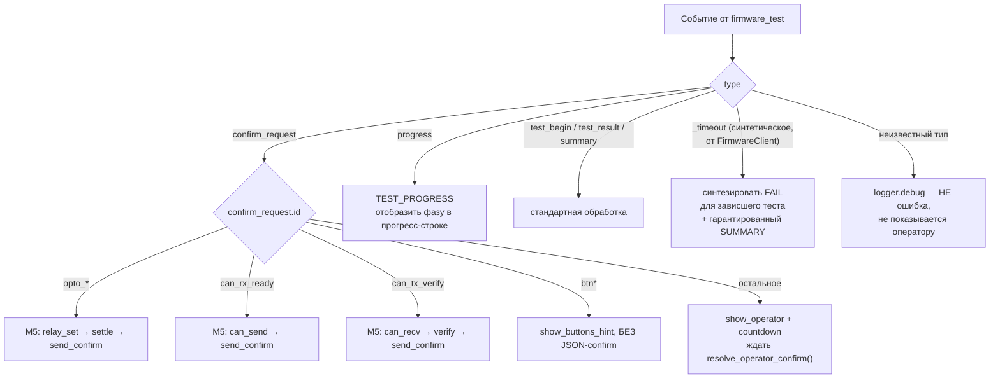
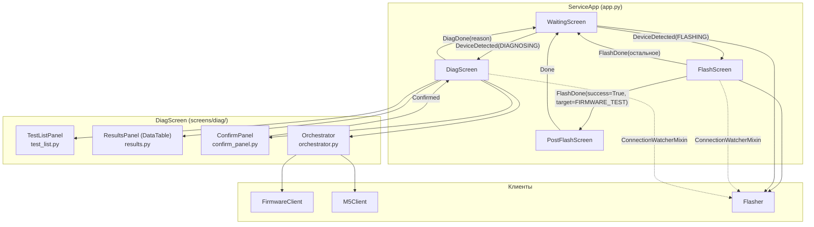
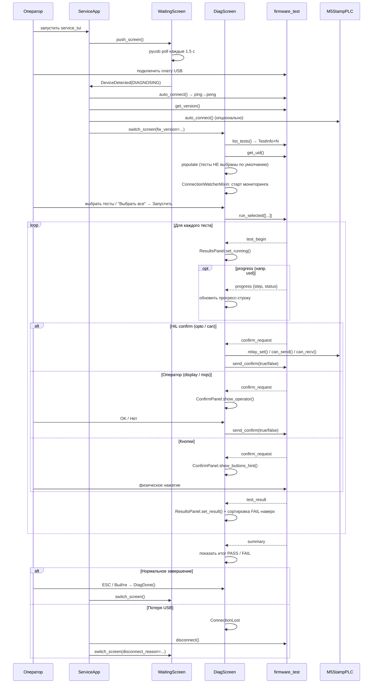

# service-tui — TUI сервисного инженера

TUI-приложение для диагностики и прошивки платы **MIMXRT1052CVJ5B** на сервисе.
Написано на Python + [Textual](https://textual.textualize.io/). Работает на Linux, macOS, Windows.

---

## Структура проекта

```bash
tools/production/
├── main.py                              ← точка входа (10 строк)
├── pyproject.toml                       ← зависимости uv
├── uv.lock
└── app/
    ├── app.py                           ← ServiceApp — роутинг экранов, жизненный цикл клиентов
    ├── app.tcss                         ← единый файл стилей для всех экранов
    ├── models.py                        ← все типы данных (dataclass/Enum)
    ├── firmware_client.py               ← async USB CDC клиент firmware_test (UTF-8)
    ├── m5_client.py                     ← async M5StampPLC клиент (Serial JSON-lines, UTF-8)
    ├── flasher.py                       ← subprocess-обёртка над tools/host/flash_usb.py
    ├── orchestrator.py                  ← маршрутизация confirm_request, progress, таймауты
    ├── widgets/
    │   ├── __init__.py
    │   └── app_frame.py                 ← AppFrame — общий адаптивный контейнер всех экранов
    └── screens/
        ├── __init__.py                  ← реэкспорт: WaitingScreen, FlashScreen, PostFlashScreen, DiagScreen
        ├── waiting.py                   ← WaitingScreen — ожидание USB, баннер причины возврата
        ├── flash.py                     ← FlashScreen — прошивка / chip erase
        ├── post_flash.py                ← PostFlashScreen — промпт смены BootMode после прошивки
        ├── connection_watcher.py        ← ConnectionWatcherMixin — мониторинг обрыва USB
        └── diag/
            ├── __init__.py              ← DiagScreen — координатор диагностики
            ├── test_list.py             ← TestListPanel — чекбоксы тестов, Выбрать/Снять все
            ├── results.py               ← ResultsPanel — DataTable результатов
            └── confirm_panel.py         ← ConfirmPanel — prompt оператора + countdown
```

---

## Концепция



> **Детект USB:** `Flasher.detect_sdp()`/`detect_cdc()` используют `pyusb` как основной метод (BootROM SDP не создаёт serial-порт на macOS и невидим через `pyserial.list_ports`), с fallback на `serial.tools.list_ports` для CDC.

---

## Состояния приложения

Состояние определяется автодетектом USB и меняется динамически без перезапуска TUI. При потере соединения сессия разрывается полностью — TUI не пытается восстановить прежнее состояние, а стартует заново с `WaitingScreen`.



### Режим A — Прошивка (FlashScreen)

Триггер: BootROM SDP `1FC9:0130` обнаружен через `pyusb`.

```bash
┌─ Прошивка платы ─────────────────────────────────┐
│  ⚡ BootROM SDP обнаружен                          │
│                                                    │
│  Что прошить?                                      │
│  ◉ firmware_test  (диагностическая прошивка)       │
│  ○ Production     (bootloader + tft_app)           │
│  ○ Кастомный бинарь...                             │
│                                                    │
│  [ ▶ Прошить ]  [ ⚠ Chip Erase ]  [ ✕ Выйти ]      │
│                                                    │
│  ████████████░░░░░░  ← без числового %             │
│  ┌────────────────────────────────────────────┐    │
│  │ ▶ Прошивка: firmware_test                  │    │
│  │ $ blhost -u 0x15A2,0x0073 -- write-memory… │    │
│  └────────────────────────────────────────────┘    │
└────────────────────────────────────────────────────┘
```

ProgressBar виден только во время активной операции (скрыт в простое), без числового `%` — только полоса и построчный лог в реальном времени.

### Промежуточный экран — PostFlashScreen

Показывается **только** после успешной прошивки `firmware_test` (не для Production/Custom — им этот шаг не нужен).

```bash
┌─ Прошивка завершена ──────────────────────────────┐
│  ✅ firmware_test успешно записан                  │
│                                                    │
│  Переведите плату в нормальный режим:              │
│  BOOT_MOD_1 → GND → Reset                         │
│                                                    │
│  [ ✓ Готово, перешёл ]   [ ✕ Выйти ]              │
│  Автопереход через: 40с                            │
└────────────────────────────────────────────────────┘
```

### Режим B — Диагностика (DiagScreen)

Триггер: CDC-порт `1996:00AD` виден + `ping→pong` прошёл.

```bash
┌─ Диагностика  fw:0.2.0  UID:A1B2C3D4E5F60011  M5: ✓ подключён ─┐
│  Тесты                     │  Результаты (DataTable)            │
│  [Выбрать все][Снять все]  │  Тест        HIL  Статус  Время    │
│  ☐ SDRAM 32 MB             │  microSD          ✗ FAIL  0.1с     │
│  ☐ QSPI Flash              │    no card detected (без обрезки)  │
│  ☐ microSD                 │  SDRAM 32 MB      ✓ PASS   1.8с    │
│  ☐ TFT Display             │  QSPI Flash       ✓ PASS   0.6с    │
│  ☐ CAN loopback  [HIL]     │  TFT Display      …  running       │
│  ☐ Оптовходы     [HIL]     │  Кнопки           pending          │
├─────────────────────────────────────────────────────────────────┤
│  [▶ Запустить выбранные] [▶▶ Все тесты] [✕ Выйти]               │
│  ████████░░░░  Тест: usd — mount: ok                            │
├─────────────────────────────────────────────────────────────────┤
│  ⚠  Экран залит красным цветом?                    28с          │
│  [ ✓ Да ]   [ ✗ Нет ]                                          │
└─────────────────────────────────────────────────────────────────┘
```

Ключевые отличия от ранних версий TUI:
- **Тесты изначально не выбраны** — сервисник выбирает явно, либо кнопками "Выбрать все"/"Снять все"
- **Результаты — `DataTable`**, не текстовые строки: сортировка FAIL-наверх (стабильная внутри группы по порядку реестра), FAIL-строка подсвечена красным фоном целиком, длинные `detail`-сообщения переносятся на несколько строк без обрезания (явная ширина колонок, см. раздел «Известные грабли Textual»)
- **`progress`-события** теста USD (`card_detect`, `mount`, `write`, `read_compare`) отображаются в прогресс-строке как текущая фаза
- HIL-тесты без M5StampPLC — серые, недоступны для выбора (постоянное состояние, не путается с временной блокировкой во время прогона)

---

## Обработка confirm_request

Маршрутизация реализована в `Orchestrator._handle_confirm()` по значению `confirm_request.id`. Помимо confirm, протокол v2 определяет `progress` — внутришаговые информационные события долгих тестов (сейчас только `usd`), не требующие ответа.



| `confirm_request.id`            | Кто отвечает                 | Реле M5 |
| ------------------------------- | ---------------------------- | ------- |
| `opto_in1_active` / `_inactive` | M5 авто                      | RLY3    |
| `opto_in2_active` / `_inactive` | M5 авто                      | RLY4    |
| `opto_rs_active` / `_inactive`  | M5 авто                      | RLY2    |
| `can_rx_ready`                  | M5 авто (CAN TX)             | —       |
| `can_tx_verify`                 | M5 авто (CAN RX)             | —       |
| `btn*`                          | физика, без JSON-ответа      | —       |
| всё остальное                   | оператор, prompt + countdown | —       |

**Гарантия таймаута:** `Orchestrator.run_tests()` всегда завершается ровно одним событием `SUMMARY` — настоящим от firmware или синтетическим (`aborted: true`), если чтение порта оборвалось по таймауту. Без этой гарантии зависший тест блокировал бы кнопки "Выйти" и повторного запуска навсегда (исторический баг, см. CHANGELOG).

---

## Мониторинг соединения и разрыв сессии

`ConnectionWatcherMixin` (`screens/connection_watcher.py`) подключается к `FlashScreen` и `DiagScreen`: каждые 1.5с проверяет, виден ли таргет на шине.

- **На `FlashScreen`** — проверка приостановлена во время активной прошивки/erase (обрыв обнаружит сам `flash_usb.py` subprocess).
- **На `DiagScreen`** — проверка приостановлена во время прогона тестов (обрыв надёжнее детектирует таймаут чтения порта внутри `Orchestrator`, не просто исчезновение устройства из списка).
- При срабатывании — `ConnectionLost` message → экран постит `FlashDone(success=False, target=None)` / `DiagDone(reason=...)` → `ServiceApp` разрывает сессию (`FirmwareClient.disconnect()`) и переключает на `WaitingScreen(disconnect_reason=...)`.
- `WaitingScreen` показывает причину возврата баннером на 4 секунды, затем продолжает обычный автодетект.

Архитектурное решение: **сессия никогда не восстанавливается** — после разрыва TUI не пытается определить, вернулась ли та же плата, просто стартует диагностику с нуля.

---

## AppFrame — общий каркас экранов

`widgets/app_frame.py` — единый контейнер, который оборачивает содержимое всех трёх основных экранов:

```css
AppFrame {
    width: 100%;
    height: 100%;
    max-width: 160;
    max-height: 50;
    border: heavy $primary;
}
```

Решает две задачи:
1. **Визуальная консистентность** — одна и та же рамка на всех экранах.
2. **Устраняет краш Textual 8.x** при mouse drag (`assert isinstance(content_widget.parent, Widget)`) — раньше `Screen` мог выступать `content_widget` напрямую; с `AppFrame` между `Screen` и контентом всегда есть валидный промежуточный `Widget`.

Адаптивный размер (`100%` с потолком `160×50`) — гарантирует, что элементы управления (кнопки, таблицы) никогда не обрезаются на маленьком терминале и не расползаются на огромном мониторе.

---

## Архитектура экранов



---

## Жизненный цикл диагностической сессии



---

## Конфигурация (`.env`)

```ini
# USB VID:PID — BootROM SDP (константы NXP, не менять)
BOOTROM_VID=1fc9
BOOTROM_PID=0130

# USB VID:PID — Flashloader (константы NXP, не менять)
FLASHLOADER_VID=15a2
FLASHLOADER_PID=0073

# USB VID:PID — firmware_test CDC (наше устройство)
SERVICE_CDC_VID=1996
SERVICE_CDC_PID=00ad

# Тип сборки firmware_test для прошивки (Debug | Release).
# Release временно нестабилен — по умолчанию Debug.
FIRMWARE_BUILD_TYPE=Debug

# Опционально: путь к директории лога TUI
# SERVICE_LOG_DIR=/tmp
```

---

## Версионирование firmware

`firmware_test` версионируется через CMake (`project(firmware_test VERSION X.Y.Z)`), генерирует `version.h` через `configure_file`. Команда протокола `get_version` (по аналогии с `get_uid`) запрашивается один раз при подключении в `ServiceApp._connect_and_diagnose()` и передаётся в `DiagScreen` параметром конструктора — версия не запрашивается повторно внутри самого экрана.

---

## Запуск

### Из монорепозитория (разработчик)

```bash
just host::service-setup   # установить зависимости tools/production/
just host::service-tui     # запустить TUI
```

### Standalone-бинарь (сервисник)

```bash
just host::service-build
# → tools/production/dist/service_tui
```

> Standalone-бинарь не включает `tools/host/` — для прошивки рядом нужен инициализированный `tools/host/` (`just host::setup-tools`), либо абсолютный путь в `_FLASH_USB_SCRIPT` (`flasher.py`).

---

## Рабочие процессы сервисника

### Диагностика (firmware_test уже прошит)

```bash
1. BOOT_MOD_1 → GND, сбросить плату
2. Подключить USB → DiagScreen
3. Выбрать тесты (по умолчанию ничего не выбрано) или "Выбрать все"
4. Запустить → ответить на интерактивные запросы
5. Получить итог; FAIL-тесты — наверху таблицы, detail виден полностью
```

### Перепрошивка firmware_test

```bash
1. BOOT_MOD_1 → 3V3, сбросить плату → FlashScreen
2. Выбрать firmware_test → Прошить
3. PostFlashScreen: BOOT_MOD_1 → GND, сбросить плату
4. Нажать "Готово" (или дождаться авто-перехода через 40с)
5. TUI автоматически попадает в DiagScreen при следующем подключении
```

### Chip Erase

```bash
1. Плата в SDP-режиме (BOOT_MOD_1 → 3V3)
2. FlashScreen → Chip Erase (~30 с)
3. После erase BootROM не загрузит прошивку — требуется перепрошить
```

---

## Зависимости

| Пакет           | Версия | Назначение                                            |
| --------------- | ------ | ----------------------------------------------------- |
| `textual`       | ≥ 0.80 | TUI фреймворк                                         |
| `pyserial`      | ≥ 3.5  | USB CDC ACM + M5 Serial                               |
| `pyusb`         | ≥ 1.0  | детект BootROM SDP (не виден через pyserial на macOS) |
| `python-dotenv` | ≥ 1.0  | загрузка `.env`                                       |
| `pyinstaller`   | ≥ 6.0  | сборка standalone-бинаря                              |

**Runtime-зависимость (не в `pyproject.toml`):** `flasher.py` вызывает `tools/host/flash_usb.py` через `uv run` — `tools/host/` должен быть инициализирован (`just host::setup-tools`).

---

## Известные грабли Textual 8.x (для тех, кто продолжит разработку)

Зафиксировано на практике — экономит время при будущих доработках:

- **`Screen.Message` не существует.** Вложенные сообщения экранов наследуются от `textual.message.Message` напрямую, не от несуществующего атрибута `Screen.Message`.
- **`self._running` — зарезервированное имя.** `MessagePump` (предок `Screen`) использует это поле для своего внутреннего message loop. Случайное совпадение имени тихо ломает логику без исключения — в `DiagScreen` переименовано в `_tests_running`.
- **`row.mount(child)` сразу после `self.mount(row)` бросает `MountError`** — `row` ещё не прикреплён к DOM. Решение: передавать детей в конструктор контейнера (`Horizontal(cb, label, classes=...)`) и монтировать одним `mount_all()`.
- **`CSS_PATH` резолвится относительно файла класса**, не относительно корня проекта — постоянно расходится при рефакторинге структуры. Решение: один `CSS_PATH` только на `ServiceApp`, все стили в едином `app.tcss`.
- **`table.add_columns(*labels)` не принимает `width=`.** Колонка получает ширину по умолчанию равную длине заголовка — длинный контент обрезается независимо от `height` строки. Нужно использовать `add_column(label, width=N)` по одной колонке.
- **`DataTable.sort(*columns, key=fn)` передаёт в `key()` кортеж значений ячеек** (для указанных `columns`), не `row_key` и не `(row_key, row_data)`. Сортировка по `test_id` напрямую невозможна без парсинга содержимого ячеек, которые сами полностью контролируем.
- **Нет публичного API для изменения высоты уже добавленной строки.** `update_cell()` меняет только содержимое. Если нужно изменить `height` (например, под более длинный текст) — единственный надёжный путь: `remove_row()` + `add_row(..., height=N)`.

---

## Логирование

```bash
tools/production/service_tui.log   ← по умолчанию
$SERVICE_LOG_DIR/service_tui.log   ← если задан в .env
```

Уровень: `DEBUG` для модулей приложения, `WARNING` для самого textual. TUI не пишет в stdout — Textual захватывает терминал.
