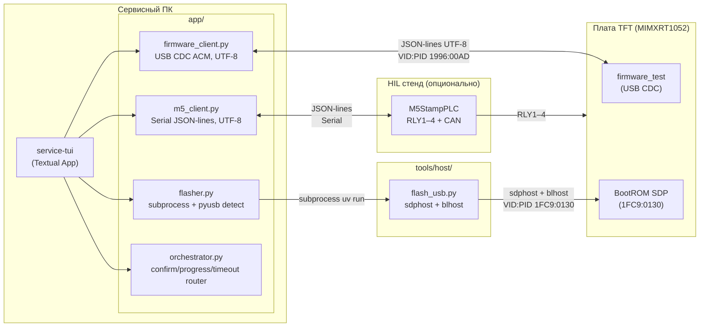
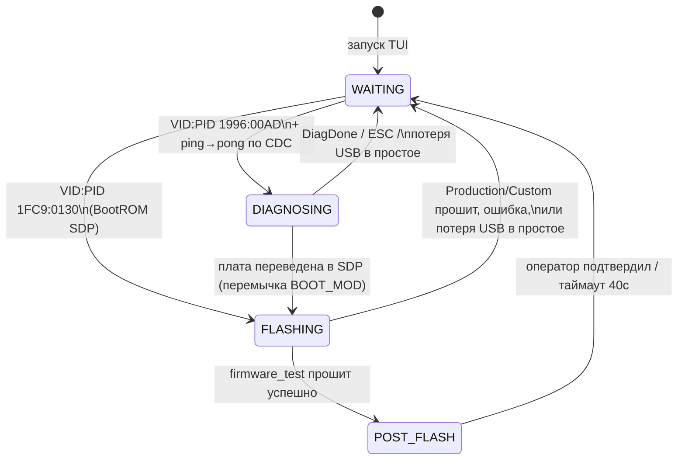
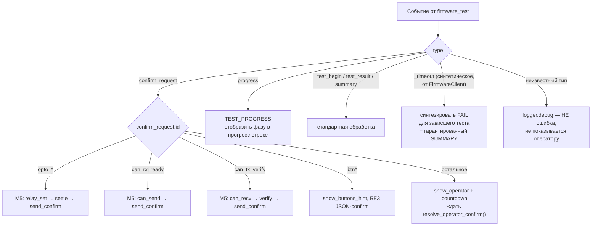
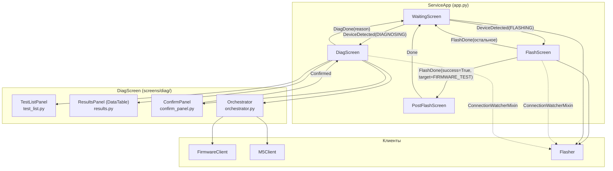
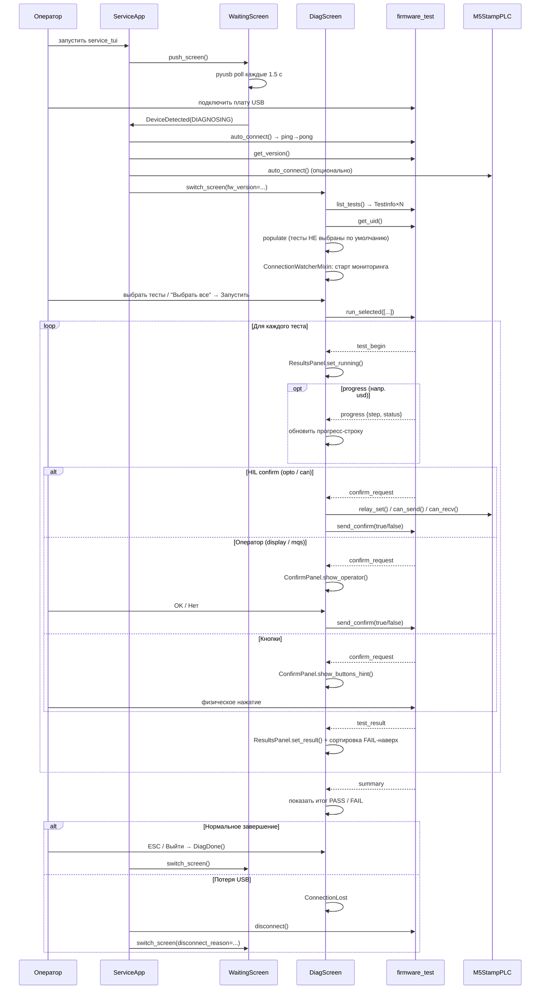

# service-tui — техническая архитектура

> Компонент: `tools/production/` — TUI сервисного инженера (диагностика и
> прошивка платы MIMXRT1052CVJ5B).
> Документ описывает внутреннее устройство: структуру модулей, протокол
> взаимодействия с firmware/M5, экранную архитектуру Textual, известные
> особенности фреймворка.
> Пользовательская документация (экраны, запуск, конфигурация,
> рабочие процессы сервисника) — в [README.md](README.md).

---

## 1. Структура проекта

```bash
tools/production/
├── main.py                              ← точка входа (10 строк)
├── pyproject.toml                       ← зависимости uv
├── uv.lock
├── custom_binaries/                     ← runtime, gitignored, создаётся автоматически
│                                          сырые (без FCB/IVT/DCD) бинарники для FlashScreen → «Другое»
└── app/
    ├── app.py                           ← ServiceApp — роутинг экранов, жизненный цикл клиентов
    ├── app.tcss                         ← единый файл стилей для всех экранов
    ├── models.py                        ← все типы данных (dataclass/Enum)
    ├── boot_art.py                      ← LOGO_ART — растеризованный логотип для WaitingScreen
    ├── firmware_client.py               ← async USB CDC клиент firmware_test (UTF-8)
    ├── m5_client.py                     ← async M5StampPLC клиент (Serial JSON-lines, UTF-8)
    ├── flasher.py                       ← subprocess-обёртка над tools/host/flash_usb.py
    ├── orchestrator.py                  ← маршрутизация confirm_request, progress, таймауты
    ├── widgets/
    │   ├── __init__.py
    │   └── app_frame.py                 ← AppFrame — общий адаптивный контейнер всех экранов
    └── screens/
        ├── __init__.py                  ← реэкспорт: WaitingScreen, FlashScreen, PostFlashScreen, DiagScreen
        ├── waiting.py                   ← WaitingScreen — ожидание USB, лого, версия, баннер причины возврата
        ├── flash.py                     ← FlashScreen — прошивка / chip erase
        ├── post_flash.py                ← PostFlashScreen — промпт смены BootMode после прошивки
        ├── connection_watcher.py        ← ConnectionWatcherMixin — мониторинг обрыва USB
        └── diag/
            ├── __init__.py              ← DiagScreen — координатор диагностики
            ├── test_list.py             ← TestListPanel — чекбоксы тестов, Выбрать/Снять все
            ├── results.py               ← ResultsPanel — DataTable результатов
            └── confirm_panel.py         ← ConfirmPanel — prompt оператора + countdown
```

---

## 2. Концепция



> **Детект USB:** `Flasher.detect_sdp()`/`detect_cdc()` используют `pyusb` как
> основной метод (BootROM SDP не создаёт serial-порт на macOS и невидим через
> `pyserial.list_ports`), с fallback на `serial.tools.list_ports` для CDC.
> M5StampPLC детектируется отдельно в `m5_client.py` тем же способом
> (`pyusb`, VID/PID из `.env` — см. раздел 5).

---

## 3. Диаграмма состояний приложения

Состояние определяется автодетектом USB и меняется динамически без
перезапуска TUI. При потере соединения сессия разрывается полностью — TUI не
пытается восстановить прежнее состояние, а стартует заново с `WaitingScreen`.



Состояния соответствуют `AppMode` в `models.py`; переключение экранов —
`ServiceApp.push_screen()`/`switch_screen()` в `app.py`, реагирующий на
сообщения `DeviceDetected`/`FlashDone`/`DiagDone`.

---

## 4. Обработка confirm_request

Маршрутизация реализована в `Orchestrator._handle_confirm()` по значению
`confirm_request.id`. Помимо confirm, протокол v2 определяет `progress` —
внутришаговые информационные события долгих тестов (сейчас только `usd`), не
требующие ответа.



| `confirm_request.id`            | Кто отвечает                 | Реле M5 |
| ------------------------------- | ---------------------------- | ------- |
| `opto_in1_active` / `_inactive` | M5 авто                      | RLY3    |
| `opto_in2_active` / `_inactive` | M5 авто                      | RLY4    |
| `opto_rs_active` / `_inactive`  | M5 авто                      | RLY2    |
| `can_rx_ready`                  | M5 авто (CAN TX)             | —       |
| `can_tx_verify`                 | M5 авто (CAN RX)             | —       |
| `btn*`                          | физика, без JSON-ответа      | —       |
| всё остальное                   | оператор, prompt + countdown | —       |

**Гарантия таймаута:** `Orchestrator.run_tests()` всегда завершается ровно
одним событием `SUMMARY` — настоящим от firmware или синтетическим
(`aborted: true`), если чтение порта оборвалось по таймауту. Без этой гарантии
зависший тест блокировал бы кнопки "Выйти" и повторного запуска навсегда
(исторический баг, см. `CHANGELOG.md`).

---

## 5. Протокол M5 agent (JSON-lines)

`m5_client.py` общается с `tools/hil/m5/agent.py` напрямую (не через
`tools/hil/` pytest-окружение — у HIL pytest свой собственный путь: порт берёт
из `.env` (`HIL_M5_PORT`) и не использует `M5Client`).

Актуальный формат ответа агента:

```json
{"ok": true, "id": 1, "data": [...]}
```

Значимые детали, зафиксированные по факту сверки с `agent.py` (`grep` по
обработчикам команд):

- Поле успеха — **`ok`** (bool), не `status`. Относится ко всем командам:
  `ping`, `relay_set`, `relay_get`, `can_send`, `can_recv`.
- Ключ канала реле в `relay_set`/`relay_get` — **`ch`**, не `relay`.
- VID/PID детекта M5StampPLC настраиваются через `.env`:
  `SERVICE_M5_VID`/`SERVICE_M5_PID` (см. README, раздел «Конфигурация»).
  Рантайм-режим агента (MicroPython) отличается от ROM-режима ESP32-S3 по
  PID — при детекте ориентироваться на `just host::m5-scan`, а не на
  документацию, если она когда-либо разойдётся с кодом.

**Важно на будущее:** документация (`HIL_BENCH.md`/`HIL_HOW_TO.md`) местами не
успевает за изменениями `agent.py`. При любых будущих изменениях протокола
агента (новые команды, смена формата ответа) — сверяться напрямую через
`grep` по `tools/hil/m5/agent.py`, а не полагаться только на документацию.

---

## 6. Мониторинг соединения и разрыв сессии

`ConnectionWatcherMixin` (`screens/connection_watcher.py`) подключается к
`FlashScreen` и `DiagScreen`: каждые 1.5с проверяет, виден ли таргет на шине.

- **На `FlashScreen`** — проверка приостановлена во время активной
  прошивки/erase (обрыв обнаружит сам `flash_usb.py` subprocess).
- **На `DiagScreen`** — проверка приостановлена во время прогона тестов
  (обрыв надёжнее детектирует таймаут чтения порта внутри `Orchestrator`, не
  просто исчезновение устройства из списка).
- При срабатывании — `ConnectionLost` message → экран постит
  `FlashDone(success=False, target=None)` / `DiagDone(reason=...)` →
  `ServiceApp` разрывает сессию (`FirmwareClient.disconnect()`) и переключает
  на `WaitingScreen(disconnect_reason=...)`. `FlashDone` в этой ветке не несёт
  `preset` — «липкий» выбор (см. §8) сохраняется отдельно, в момент нажатия
  «Загрузить», а не при завершении прошивки.
- `WaitingScreen` показывает причину возврата баннером на 4 секунды, затем
  продолжает обычный автодетект.

Архитектурное решение: **сессия никогда не восстанавливается** — после
разрыва TUI не пытается определить, вернулась ли та же плата, просто стартует
диагностику с нуля.

---

## 7. AppFrame — общий каркас экранов

`widgets/app_frame.py` — единый контейнер, который оборачивает содержимое
всех трёх основных экранов:

```css
AppFrame {
    width: 100%;
    height: 100%;
    max-width: 112;
    max-height: 35;
    border: heavy $primary;
}
```

Решает две задачи:
1. **Визуальная консистентность** — одна и та же рамка на всех экранах.
2. **Устраняет краш Textual 8.x** при mouse drag
   (`assert isinstance(content_widget.parent, Widget)`) — раньше `Screen` мог
   выступать `content_widget` напрямую; с `AppFrame` между `Screen` и
   контентом всегда есть валидный промежуточный `Widget`.

Адаптивный размер (`100%` с потолком `112×35`) — гарантирует, что элементы
управления (кнопки, таблицы) никогда не обрезаются на маленьком терминале и
не расползаются на огромном мониторе. Потолок подобран и подтверждён
визуально на скриншотах всех пяти экранов; нижняя граница по ширине
обоснована жёстко: `TestListPanel(width:38)` + `ResultsPanel(width:70)` рядом
на `DiagScreen` дают 108 + рамка = 110 — меньше сжимать уже нельзя.

---

## 8. Прошивка кастомных бинарников и «липкий» выбор (FlashPreset)

### 8.1 Проблема

Штатные HAB-образы (`firmware_test`/`bootloader`/`app`) собираются
`nxpimage` заранее (`just build::hab-*`) и всегда идут на плату с W25Q128 —
для них auto-config Flashloader (`configure-memory 0xC0000007` →
`0xF000000F`, см. `HOW_TO_FLASH.md`) достаточен. Для сторонних/легаси
бинарников (старые платы, W25Q256/512) это не так: auto-config Flashloader
не документирован как надёжный для 4-байтной адресации, а сами бинарники
приходят «сырыми» (код + таблица векторов, без FCB/IVT/DCD — тот же формат,
что `inputImageFile` в `hab_*.yaml` до сборки). Решение — собирать HAB
на лету и писать FCB явно, а не полагаться на auto-config.

### 8.2 Модели (`models.py`)

```python
class FcbVariant(str, Enum):
    W25Q128 = "w25q128"   # 3-байтная адресация — auto-config работал бы,
    W25Q512 = "w25q512"   # но пишем явно и здесь, для единообразия пути
    # W25Q64/W25Q256 сведены к этим двум случаям — см. обсуждение

@dataclass
class FlashPreset:
    target: FlashTarget = FlashTarget.FIRMWARE_TEST
    custom_bin_name: Optional[str] = None
    use_dcd: bool = False
    fcb_variant: FcbVariant = FcbVariant.W25Q128
```

`FlashPreset` — «липкий» выбор оператора, живёт в `ServiceApp._last_flash_preset`
(память процесса, не диск). Захватывается в `FlashScreen._on_flash_pressed()`
**в момент нажатия «Загрузить»**, не только при успехе — неудача чаще всего
про физическое соединение, а не про то, что выбор был неверным. Передаётся
в конструктор следующего `FlashScreen` через `FlashDone.preset` →
`ServiceApp._on_flash_done()`. Решает конкретную задачу: прошивка партии
одинаковых плат подряд — вставил, TUI уже подставила прошлый выбор файла/
памяти/DCD, нажал «Загрузить», вынул, вставил следующую.

Рассматривался отдельный режим «массовое программирование» (авто-прошивка
по факту детекта SDP, без нажатия кнопки на каждую плату) — отклонён:
в SDP/Flashloader-режиме нет способа прочитать UID платы, авто-старт без
подтверждения оператора убирает последний шанс заметить, что в руках не та
плата. Оставлена только «липкая» память выбора (этот раздел).

### 8.3 Конвейер сборки (`flasher.py`)

```
Flasher.flash(target=CUSTOM, bin_path, use_dcd, fcb_variant, progress_cb)
  └── _run_flash_custom()
        ├── _build_custom_hab(raw_bin, use_dcd, progress_cb)
        │     ├── генерирует temp .yaml в tools/host/hab/ (по образцу hab_bootloader_*.yaml:
        │     │     startAddress=0x60000000, ivtOffset=0x1000, initialLoadSize=0x2000,
        │     │     family=mimxrt1050, + DCDFilePath: ../dcd/dcd.bin если use_dcd)
        │     ├── uv run nxpimage hab export --force -c <yaml> -o <out>,
        │     │     cwd=tools/host/hab/ (обязательно — relative DCDFilePath
        │     │     резолвится от этой директории, как в build.just)
        │     └── стриминг stdout nxpimage в progress_cb (не только logger.debug —
        │           иначе во время сборки лог FlashScreen выглядит «зависшим»)
        └── flash_usb.py --bin-path <hab_bin> --fcb-path tools/host/dcd/{fcb_variant}_fdcb.bin
              (временный .yaml и собранный HAB-образ удаляются после прошивки)
```

`dcd/dcd.bin` — один и тот же файл независимо от проекта (SEMC/SDRAM-init не
зависит от того, что именно исполняется), поэтому просто константный путь,
без вариантов.

### 8.4 `flash_usb.py` — явная запись FCB вместо auto-config

```python
def write_fcb_explicit(fcb_path: Path) -> None:
    """write-memory 0x60000000 <fcb_path> — буквальная запись 512-байтного
    FCB-блоба (tag 'FCFB'), а не magic option word 0xF000000F.
    Обязателен для кастомных бинарей — auto-config Flashloader проверен
    только для W25Q128."""
```

Активируется флагом `--fcb-path` (только вместе с `--bin-path`). Штатный
`--firmware`-путь (три сборки из `BUILD_DIR`) не тронут: без `--fcb-path`
поведение идентично тому, что было до этой доработки.

Заодно увеличен таймаут `blhost` для `flash-erase-all` (chip erase) —
`-t 200000` вместо дефолтного: W25Q512 стирается заметно дольше W25Q128,
дефолтного таймаута `blhost` не хватало. `flash-erase-region` (стирание
пары секторов под FCB+HAB при обычной прошивке) не трогали — там масштаб
на порядки меньше, дефолта достаточно независимо от чипа.

### 8.5 UI (`flash.py`)

При выборе радиокнопки «Другое» появляется `Vertical#flash-custom-group`:
`Select` по содержимому `custom_binaries/` (пересканируется в `on_mount()`),
`Select` по `FcbVariant`, `Switch` DCD. Выбор любой ДРУГОЙ радиокнопки в том
же `RadioSet` автоматически скрывает группу — отдельного «Назад» не
потребовалось, это штатное поведение взаимоисключающего `RadioSet`.

`#flash-target-group` ограничена `max-height: 18` с собственным скроллом —
без этого разросшаяся custom-группа (два `Select` + `Switch`) на маленьком
терминале выталкивала `#flash-log` почти до нулевой высоты. `#flash-log`
дополнительно защищён `min-height: 6` — лог гарантированно виден даже в
худшем случае.

---

## 9. Архитектура экранов



---

## 10. Жизненный цикл диагностической сессии



---

## 11. Версионирование firmware

`firmware_test` версионируется через CMake
(`project(firmware_test VERSION X.Y.Z)`), генерирует `version.h` через
`configure_file`. Команда протокола `get_version` (по аналогии с `get_uid`)
запрашивается один раз при подключении в `ServiceApp._connect_and_diagnose()`
и передаётся в `DiagScreen` параметром конструктора — версия не запрашивается
повторно внутри самого экрана.

Версия самого TUI (`service_tool vX.Y.Z` на `WaitingScreen`) читается
отдельно — `waiting.py::_read_app_version()` парсит `[project].version` из
`pyproject.toml` напрямую через `tomllib` (stdlib). `importlib.metadata`
сознательно не используется — проект не ставится как пакет
(`tool.uv.package = false`), метаданных может не быть.

---

## 12. Логотип (`boot_art.py`)

`LOGO_ART` — Rich-markup строка (29×21 символов, цвета `#3ca0dc` для синей
части логотипа, `white` для тёмной, `grey37` для фоновых точек), полученная
одноразовой coverage-based растеризацией `logo.png` (300×300 RGBA) через
Pillow: разбор на сетку символов с компенсацией аспекта шрифта терминала
(`ASPECT = 0.5`), классификация фона/двух цветовых групп логотипа по каналам,
плотность символа на ячейку — по доле непрозрачных пикселей
(`.::+*#`/`.::+%@`).

Сам скрипт растеризации **не сохранён в репозитории** (использовался
разово в песочнице, не входит в `pyproject.toml` TUI — новых
runtime-зависимостей `boot_art.py` не добавляет). Если логотип компании
сменится — скрипт нужно будет написать заново; логика воспроизводима (см.
абзац выше).

---

## 13. Известные грабли Textual 8.x

Зафиксировано на практике — экономит время при будущих доработках:

- **`Screen.Message` не существует.** Вложенные сообщения экранов
  наследуются от `textual.message.Message` напрямую, не от несуществующего
  атрибута `Screen.Message`.
- **`self._running` — зарезервированное имя.** `MessagePump` (предок
  `Screen`) использует это поле для своего внутреннего message loop.
  Случайное совпадение имени тихо ломает логику без исключения — в
  `DiagScreen` переименовано в `_tests_running`.
- **`row.mount(child)` сразу после `self.mount(row)` бросает `MountError`** —
  `row` ещё не прикреплён к DOM. Решение: передавать детей в конструктор
  контейнера (`Horizontal(cb, label, classes=...)`) и монтировать одним
  `mount_all()`.
- **`CSS_PATH` резолвится относительно файла класса**, не относительно корня
  проекта — постоянно расходится при рефакторинге структуры. Решение: один
  `CSS_PATH` только на `ServiceApp`, все стили в едином `app.tcss`.
- **`table.add_columns(*labels)` не принимает `width=`.** Колонка получает
  ширину по умолчанию равную длине заголовка — длинный контент обрезается
  независимо от `height` строки. Нужно использовать `add_column(label,
  width=N)` по одной колонке.
- **`DataTable.sort(*columns, key=fn)` передаёт в `key()` кортеж значений
  ячеек** (для указанных `columns`), не `row_key` и не `(row_key, row_data)`.
  Сортировка по `test_id` напрямую невозможна без парсинга содержимого ячеек,
  которые сами полностью контролируем.
- **Нет публичного API для изменения высоты уже добавленной строки.**
  `update_cell()` меняет только содержимое. Если нужно изменить `height`
  (например, под более длинный текст) — единственный надёжный путь:
  `remove_row()` + `add_row(..., height=N)`.
- **Центровка текста внутри full-width виджета не решается `Center()`.**
  `Static`/`Label` без `text-align`, растянутый на всю ширину родителя,
  прижимает текст к левому краю — `Center()` вокруг такого виджета не
  помогает (центрировать нечего, ребёнок и так 100% ширины). Нужен
  `text-align: center` в CSS на самом элементе. Обратный случай — виджет с
  "естественной" (auto) шириной — центрируется именно через `Center()`.
  Важно не путать эти два случая (`#waiting-version` — первый случай,
  `#post-flash-title`/`#post-flash-instruction` — второй).

---

## Известные открытые вопросы

- **Release-сборка firmware нестабильна** (медленное мигание — подозрение на
  проблему с FCB/clock конфигурацией в Release HAB-образе) — TUI временно
  форсирует Debug через `FIRMWARE_BUILD_TYPE`.
- **`tools/shared/m5_agent.py`** — сознательно не делался: pytest
  HIL-окружение и TUI используют независимые M5-клиенты, признано правильным
  архитектурным решением, а не техдолгом.
- Пункты плана TUI «экспорт результатов в JSON с привязкой к UID» и
  «копирование UID с экрана» — отложены, не начаты.
- **Массовое программирование** — решено НЕ делать авто-прошивку по факту
  детекта SDP (см. §8.2); ограничились «липким» `FlashPreset`. Если в будущем
  понадобится полный батч-режим — потребуется отдельный предохранитель
  (задержка с отменой перед стартом), т.к. в SDP-режиме плату нельзя
  идентифицировать по UID.
- **Auto-config Flashloader для W25Q256/512 не проверялся напрямую** — решили
  не полагаться на него вообще, для кастомных бинарей FCB всегда пишется
  явно (`--fcb-path`, см. §8.4). Остаётся не до конца понятым, работает ли
  `configure-memory 0xF000000F` для этих чипов корректно в принципе — вопрос
  снят с повестки архитектурным решением, а не исследован до конца.
  