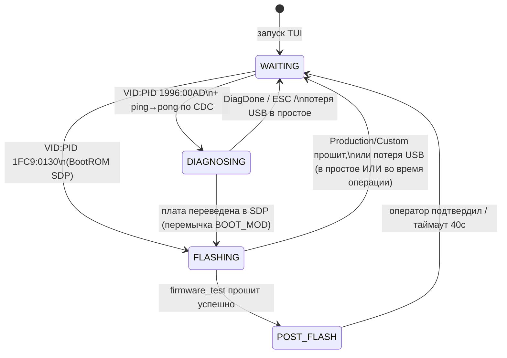
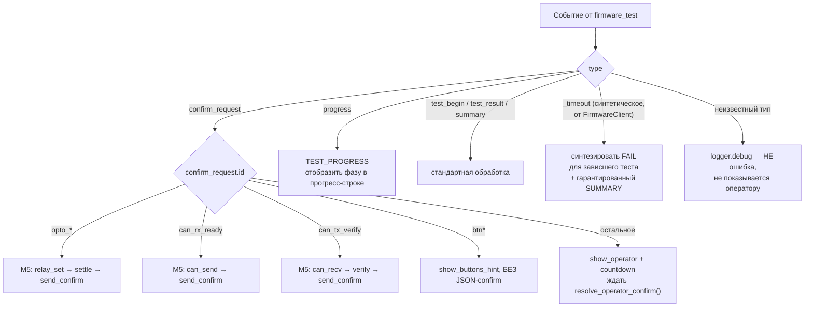
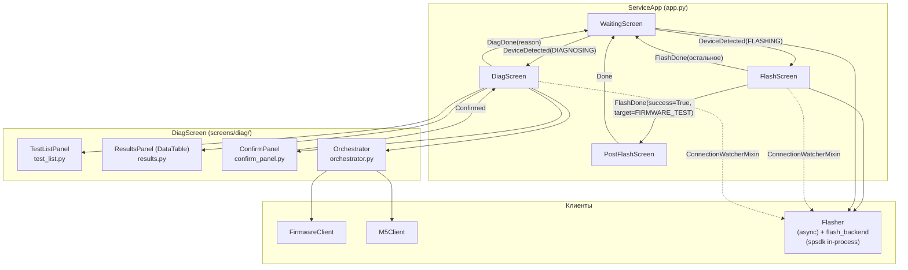

# service-tui — техническая архитектура

> Компонент: `tools/production/` — TUI сервисного инженера (диагностика и
> прошивка платы MIMXRT1052CVJ5B).
> Документ описывает внутреннее устройство: структуру модулей, протокол
> взаимодействия с firmware/M5, экранную архитектуру Textual, известные
> особенности фреймворка.
> Пользовательская документация (экраны, запуск, конфигурация,
> рабочие процессы сервисника) — в [README.md](../README.md).

---

## 1. Структура проекта

## 1. Структура проекта

```bash
tools/production/
├── main.py                              ← точка входа
├── pyproject.toml                       ← зависимости uv
├── dist/                                ← дистрибутивы программы (PyInstaller)
├── uv.lock
├── service_tui.spec                     ← PyInstaller spec
├── custom_binaries/                     ← runtime, создаётся автоматически;
│                                          сырые/готовые бинарники для FlashScreen → «Другое»
└── app/                                 ← implicit namespace package 
    │                                    
    │                                    
    ├── app.py                           ← ServiceApp — роутинг экранов, жизненный цикл клиентов
    ├── app.tcss                         ← единый файл стилей для всех экранов
    ├── models.py                        ← все типы данных (dataclass/Enum)
    ├── boot_art.py                      ← LOGO_ART — растеризованный логотип для WaitingScreen
    ├── firmware_client.py               ← async USB CDC клиент firmware_test
    ├── m5_client.py                     ← async M5StampPLC клиент
    ├── flash_backend.py                 ← spsdk 3.7.0 in-process: SDP, McuBoot, HabImage
    ├── flasher.py                       ← async-обёртка над flash_backend для Textual workers
    ├── usb_ports.py                     ← резолвер serial-портов по VID:PID
    ├── orchestrator.py                  ← маршрутизация confirm_request, progress, таймауты
    ├── widgets/
    │   ├── __init__.py
    │   └── app_frame.py                 ← AppFrame — общий адаптивный контейнер всех экранов
    └── screens/
        ├── __init__.py                  ← реэкспорт: WaitingScreen, FlashScreen, PostFlashScreen, DiagScreen
        ├── waiting.py                   ← WaitingScreen — ожидание USB, лого, версия, баннер, кнопка «Выйти»
        ├── flash.py                     ← FlashScreen — прошивка / chip erase
        ├── post_flash.py                ← PostFlashScreen — промпт смены BootMode после прошивки
        ├── connection_watcher.py        ← ConnectionWatcherMixin — мониторинг обрыва USB
        └── diag/
            ├── __init__.py              ← DiagScreen — координатор диагностики
            ├── test_list.py             ← TestListPanel — чекбоксы тестов, Выбрать/Снять все
            ├── results.py               ← ResultsPanel — DataTable результатов
            └── confirm_panel.py         ← ConfirmPanel — prompt оператора + countdown
```

---

## 2. Концепция

```mermaid
graph LR
    subgraph PC["Сервисный ПК"]
        TUI["service-tui\n(Textual App)"]
        subgraph app["app/"]
            FC["firmware_client.py\nUSB CDC ACM, UTF-8"]
            M5["m5_client.py\nSerial JSON-lines, UTF-8"]
            FL["flasher.py + flash_backend.py\nspsdk in-process: SDP/McuBoot/HabImage"]
            OR["orchestrator.py\nconfirm/progress/timeout router"]
        end
        TUI --> FC & M5 & FL & OR
    end

    subgraph Board["Плата TFT (MIMXRT1052)"]
        FW["firmware_test\n(USB CDC)"]
        ROM["BootROM SDP\n(1FC9:0130)"]
    end

    subgraph HIL["HIL стенд (опционально)"]
        M5HW["M5StampPLC\nRLY1–4 + CAN"]
    end

    FC   |"JSON-lines UTF-8\nVID:PID 1996:00AD"| FW
    FL   |"spsdk (libusbsio HID)\nVID:PID 1FC9:0130 / 15A2:0073"| ROM
    M5   |"JSON-lines\nSerial"| M5HW
    M5HW  -->|"RLY1–4"| Board
```

> **Детект USB:** `flash_backend.detect_sdp()`/`detect_cdc()` используют spsdk
> напрямую (`SdpUSBInterface.scan()` / `MbootUSBInterface.scan()`, HID-транспорт
> через `libusbsio`). CDC firmware_test и M5StampPLC резолвятся через
> `pyserial` (`usb_ports.py::resolve_serial_port()`, `m5_client.py`).

---

## 3. Диаграмма состояний приложения

Состояние определяется автодетектом USB и меняется динамически без
перезапуска TUI. При потере соединения сессия разрывается полностью — TUI не
пытается восстановить прежнее состояние, а стартует заново с `WaitingScreen`.



Состояния соответствуют `AppMode` в `models.py`; переключение экранов —
`ServiceApp.push_screen()`/`switch_screen()` в `app.py`, реагирующий на
сообщения `DeviceDetected`/`FlashDone`/`DiagDone`.

> **Важная деталь, не показанная на диаграмме**:
> `FLASHING --> WAITING` по стрелке «ошибка» срабатывает **только** при
> физическом обрыве USB (`FlashResult.connection_lost=True`). Логическая
> ошибка (файл не найден, битый custom-бинарь) — плата на месте, экран
> остаётся на `FLASHING` (нет перехода состояния вообще, поэтому на
> диаграмме это не отдельная стрелка). См. §6.

---

## 4. Обработка confirm_request

Маршрутизация реализована в `Orchestrator._handle_confirm()` по значению
`confirm_request.id`. Помимо confirm, протокол v2 определяет `progress` —
внутришаговые информационные события долгих тестов (сейчас только `usd`), не
требующие ответа.



| `confirm_request.id`            | Кто отвечает                 | Реле M5 |
| ------------------------------- | ---------------------------- | ------- |
| `opto_in1_active` / `_inactive` | M5 авто                      | RLY3    |
| `opto_in2_active` / `_inactive` | M5 авто                      | RLY4    |
| `opto_rs_active` / `_inactive`  | M5 авто                      | RLY2    |
| `can_rx_ready`                  | M5 авто (CAN TX)             | —       |
| `can_tx_verify`                 | M5 авто (CAN RX)             | —       |
| `btn*`                          | физика, без JSON-ответа      | —       |
| всё остальное                   | оператор, prompt + countdown | —       |

**Гарантия таймаута:** `Orchestrator.run_tests()` всегда завершается ровно
одним событием `SUMMARY` — настоящим от firmware или синтетическим
(`aborted: true`), если чтение порта оборвалось по таймауту.

---

## 5. Протокол M5 agent (JSON-lines)

`m5_client.py` общается с `tools/hil/m5/agent.py` напрямую (не через
`tools/hil/` pytest-окружение — у HIL pytest свой собственный путь: порт берёт
из `.env` (`HIL_M5_PORT`) и не использует `M5Client`).

Актуальный формат ответа агента:

```json
{"ok": true, "id": 1, "data": [...]}
```

Значимые детали, зафиксированные по факту сверки с `agent.py` (`grep` по
обработчикам команд):

- Поле успеха — **`ok`** (bool), не `status`. Относится ко всем командам:
  `ping`, `relay_set`, `relay_get`, `can_send`, `can_recv`.
- Ключ канала реле в `relay_set`/`relay_get` — **`ch`**, не `relay`.
- VID/PID детекта M5StampPLC настраиваются через `.env`:
  `SERVICE_M5_VID`/`SERVICE_M5_PID` (см. README, раздел «Конфигурация»).
  Рантайм-режим агента (MicroPython) отличается от ROM-режима ESP32-S3 по
  PID — при детекте ориентироваться на `just host::m5-scan`, а не на
  документацию, если она когда-либо разойдётся с кодом.

---

## 6. Мониторинг соединения и разрыв сессии

`ConnectionWatcherMixin` (`screens/connection_watcher.py`) подключается к
`FlashScreen` и `DiagScreen`: каждые 1.5с проверяет, виден ли таргет на шине.

- **На `FlashScreen`** — проверка приостановлена во время активной
  прошивки/erase (`self._flashing == True`).
- **На `DiagScreen`** — проверка приостановлена во время прогона тестов
  (обрыв надёжнее детектирует таймаут чтения порта внутри `Orchestrator`, не
  просто исчезновение устройства из списка).

**Три независимых механизма детекта обрыва**:

1. **`ConnectionWatcherMixin` в простое** — периодический опрос шины.
2. **`flash_backend.py` во время активной операции** — spsdk бросает
   `SPSDKConnectionError`/`SPSDKTimeoutError` (оба ловятся явным кортежем
   `_CONNECTION_LOST_EXCEPTIONS` — `SPSDKTimeoutError` НЕ наследует
   `SPSDKConnectionError`, оба - потомки `SPSDKError`
3. **Вариант B** — некоторые команды spsdk (`flash_erase_all`,
   `write_memory` и т.п.) при таймауте не бросают исключение, а тихо
   возвращают `False`. `_fail_command()` в этом случае сам проверяет
   `_sdp_still_present()`: плата пропала с шины → `ConnectionLostError`;
   плата на месте → обычная `FlashBackendError`.

Оба механизма 2 и 3 транслируются в `Flasher.flash()`/`erase_chip()` как
`FlashResult(ok: bool, connection_lost: bool)` — **не голый `bool`**. Это
принципиально для `FlashScreen`:

- `connection_lost=True` → `FlashDone(target=None, error_message=...)` →
  `ServiceApp` переключает на `WaitingScreen(disconnect_reason=...)`.
- `connection_lost=False` → **экран не покидает себя**.
  Плата физически на месте, сообщение об ошибке уже в `#flash-log`, кнопки
  разблокированы (`_set_busy(False)`) — оператор может поправить выбор
  (другой файл, другой вариант памяти) и повторить, не выдёргивая USB.

`WaitingScreen` показывает причину возврата баннером на 4 секунды, затем
продолжает обычный автодетект.

**Cессия никогда не восстанавливается** — после
разрыва TUI не пытается определить, вернулась ли та же плата, просто стартует
заново с нуля.

---

## 7. AppFrame — общий каркас экранов

`widgets/app_frame.py` — единый контейнер, который оборачивает содержимое
всех трёх основных экранов:

```css
AppFrame {
    width: 100%;
    height: 100%;
    max-width: 112;
    max-height: 35;
    border: heavy $primary;
}
```

Решает две задачи:
1. **Визуальная консистентность** — одна и та же рамка на всех экранах.
2. **Устраняет краш Textual 8.x** при mouse drag
   (`assert isinstance(content_widget.parent, Widget)`) — раньше `Screen` мог
   выступать `content_widget` напрямую; с `AppFrame` между `Screen` и
   контентом всегда есть валидный промежуточный `Widget`.

Адаптивный размер (`100%` с потолком `112×35`) — гарантирует, что элементы
управления (кнопки, таблицы) никогда не обрезаются на маленьком терминале и
не расползаются на огромном мониторе. Потолок подобран и подтверждён
визуально на скриншотах всех пяти экранов; нижняя граница по ширине
обоснована жёстко: `TestListPanel(width:38)` + `ResultsPanel(width:70)` рядом
на `DiagScreen` дают 108 + рамка = 110 — меньше сжимать уже нельзя.

---

## 8. Прошивка кастомных бинарников и «липкий» выбор (FlashPreset)

### 8.1 Проблема

Штатные HAB-образы (`firmware_test`/`bootloader`/`app`) собираются заранее
(`just build::hab-*`) и всегда идут на плату с W25Q128 — для них auto-config
Flashloader достаточен. Для сторонних/легаси бинарников (старые платы,
W25Q256/512) это не так: auto-config Flashloader не документирован как
надёжный для 4-байтной адресации, а сами бинарники приходят «сырыми» (код +
таблица векторов, без FCB/IVT/DCD) либо уже готовым HAB-образом — зависит от
источника. Решение — собирать HAB на лету (если нужно) и писать FCB явно, а
не полагаться на auto-config.

### 8.2 Модели (`models.py`)

```python
class FcbVariant(str, Enum):
    W25Q128 = "w25q128"   # 3-байтная адресация — auto-config работал бы,
    W25Q512 = "w25q512"   # но пишем явно и здесь, для единообразия пути
    # W25Q64/W25Q256 сведены к этим двум случаям — см. обсуждение

@dataclass
class FlashPreset:
    target: FlashTarget = FlashTarget.FIRMWARE_TEST
    custom_bin_name: Optional[str] = None
    use_dcd: bool = False
    fcb_variant: FcbVariant = FcbVariant.W25Q128
```

`FlashPreset` — «липкий» выбор оператора, живёт в `ServiceApp._last_flash_preset`
(память процесса, не диск). Захватывается в `FlashScreen._on_flash_pressed()`
**в момент нажатия «Загрузить»**, не только при успехе — неудача чаще всего
про физическое соединение, а не про то, что выбор был неверным. Передаётся
в конструктор следующего `FlashScreen` через `FlashDone.preset` →
`ServiceApp._on_flash_done()`. Решает конкретную задачу: прошивка партии
одинаковых плат подряд — вставил, TUI уже подставила прошлый выбор файла/
памяти/DCD, нажал «Загрузить», вынул, вставил следующую.

**Нужен ли DCD — implementation-defined, зависит от конкретного бинарника,
не от его формата (сырой/готовый HAB).** Правило «сырой → включить DCD,
готовый HAB → выключить» **неверно как общее правило**: например, в связке
`bootloader + tft_app` сам `bootloader` не требует DCD, а часть кастомных
бинарников (в т.ч. старый загрузчик, используемый на производстве) требует
DCD независимо от того, в каком виде получен файл. Оператор должен знать
по конкретному образу, инициализирует ли он SDRAM самостоятельно — TUI не
может определить это автоматически по содержимому файла.

### 8.3 Конвейер сборки (`flasher.py`)

```bash 
Flasher.flash(target=CUSTOM, bin_path, use_dcd, fcb_variant, progress_cb)
└── _flash_custom()
├── _build_custom_hab(raw_bin, use_dcd, progress_cb)
│     └── flash_backend.build_custom_hab() — in-process spsdk API:
│           Config (family=mimxrt1050, startAddress=0x60000000,
│           ivtOffset=0x1000, initialLoadSize=0x2000,
│           + DCDFilePath, если use_dcd) → HabImage.export()
└── _run_flash_op(flash_backend.flash, hab_bin, fcb_path=...)
временный HAB-образ удаляется после прошивки
(finally: shutil.rmtree(hab_bin.parent))
```

`dcd/dcd.bin` (`tools/host/dcd/dcd.bin`) — один и тот же файл независимо от
проекта (SEMC/SDRAM-init не зависит от того, что именно исполняется), простой
константный путь, без вариантов. Резолвится через `flash_backend._host_dcd_dir()`
— двухрежимный (dev/frozen), см. §14.

### 8.4 Явная запись FCB вместо auto-config

`flash_backend.py::write_fcb_explicit()` — `write_memory(0x60000000, fcb_bin)`,
буквальная запись 512-байтного FCB-блоба (tag `FCFB`), а не magic option word
`0xF000000F`. Обязателен для кастомных бинарей — auto-config Flashloader
проверен только для W25Q128 (см. §Известные открытые вопросы).

Штатный путь (`firmware_test`/`bootloader`/`app` из `build/<Type>/`) не
затрагивается — использует auto-config, как и раньше.

### 8.5 UI (`flash.py`)

При выборе радиокнопки «Другое» появляется `Vertical#flash-custom-group`:
`Select` по содержимому `custom_binaries/` (пересканируется в `on_mount()`),
`Select` по `FcbVariant`, `Switch` DCD. Выбор любой ДРУГОЙ радиокнопки в том
же `RadioSet` автоматически скрывает группу — отдельного «Назад» не
потребовалось, это штатное поведение взаимоисключающего `RadioSet`.

`#flash-target-group` ограничена `max-height: 18` с собственным скроллом —
без этого разросшаяся custom-группа (два `Select` + `Switch`) на маленьком
терминале выталкивала `#flash-log` почти до нулевой высоты. `#flash-log`
дополнительно защищён `min-height: 6` — лог гарантированно виден даже в
худшем случае.

**Троттлинг лога:** прогресс-бар обновляется на каждом
событии `FlashProgress`, но `#flash-log` для фазы `write` пишет только при
пересечении 10%-границы — без этого запись HAB-образа даёт ~135 строк в лог
на одну прошивку. Первая строка фазы (`"Запись <имя> (<размер> байт)"`) всегда
проходит; остальные фазы (`configure`/`erase`/`fcb`/`reset`/`error`) логируются
без троттлинга — их и так немного.

---

## 9. Архитектура экранов



---

## 10. Жизненный цикл диагностической сессии


---

## 11. Версионирование firmware и TUI

`firmware_test` версионируется через CMake
(`project(firmware_test VERSION X.Y.Z)`), генерирует `version.h` через
`configure_file`. Команда протокола `get_version` (по аналогии с `get_uid`)
запрашивается один раз при подключении в `ServiceApp._connect_and_diagnose()`
и передаётся в `DiagScreen` параметром конструктора — версия не запрашивается
повторно внутри самого экрана.

Версия самого TUI (`service_tool vX.Y.Z` на `WaitingScreen`) читается
отдельно — `waiting.py::_read_app_version()` парсит `[project].version` из
`pyproject.toml` напрямую через `tomllib` (stdlib). `importlib.metadata`
сознательно не используется — проект не ставится как пакет
(`tool.uv.package = false`), метаданных может не быть. Резолв
`Path(__file__).resolve().parents[2] / "pyproject.toml"` одинаково корректен
в dev и frozen (относительный от модуля, а не абсолютный) — при условии, что
`service_tui.spec` кладёт `pyproject.toml` в корень бандла (см. §14).

---

## 12. Логотип (`boot_art.py`)

`LOGO_ART` — Rich-markup строка (29×21 символов, цвета `#3ca0dc` для синей
части логотипа, `white` для тёмной, `grey37` для фоновых точек), полученная
одноразовой coverage-based растеризацией `logo.png` (300×300 RGBA) через
Pillow: разбор на сетку символов с компенсацией аспекта шрифта терминала
(`ASPECT = 0.5`), классификация фона/двух цветовых групп логотипа по каналам,
плотность символа на ячейку — по доле непрозрачных пикселей
(`.::+*#`/`.::+%@`).

Сам скрипт растеризации **не сохранён в репозитории** (использовался
разово в песочнице, не входит в `pyproject.toml` TUI — новых
runtime-зависимостей `boot_art.py` не добавляет). Если логотип компании
сменится — скрипт нужно будет написать заново; логика воспроизводима (см.
абзац выше).

---

## 13. Известные грабли Textual 8.x

Зафиксировано на практике — экономит время при будущих доработках:

- **`Screen.Message` не существует.** Вложенные сообщения экранов
  наследуются от `textual.message.Message` напрямую, не от несуществующего
  атрибута `Screen.Message`.
- **`self._running` — зарезервированное имя.** `MessagePump` (предок
  `Screen`) использует это поле для своего внутреннего message loop.
  Случайное совпадение имени тихо ломает логику без исключения — в
  `DiagScreen` переименовано в `_tests_running`.
- **`row.mount(child)` сразу после `self.mount(row)` бросает `MountError`** —
  `row` ещё не прикреплён к DOM. Решение: передавать детей в конструктор
  контейнера (`Horizontal(cb, label, classes=...)`) и монтировать одним
  `mount_all()`.
- **`CSS_PATH` резолвится относительно файла класса**, не относительно корня
  проекта — постоянно расходится при рефакторинге структуры. Решение: один
  `CSS_PATH` только на `ServiceApp`, все стили в едином `app.tcss`. Во frozen
  дополнительно требует, чтобы `app.tcss` физически лежал в бандле по тому же
  относительному пути (см. §14).
- **`table.add_columns(*labels)` не принимает `width=`.** Колонка получает
  ширину по умолчанию равную длине заголовка — длинный контент обрезается
  независимо от `height` строки. Нужно использовать `add_column(label,
  width=N)` по одной колонке.
- **`DataTable.sort(*columns, key=fn)` передаёт в `key()` кортеж значений
  ячеек** (для указанных `columns`), не `row_key` и не `(row_key, row_data)`.
  Сортировка по `test_id` напрямую невозможна без парсинга содержимого ячеек,
  которые сами полностью контролируем.
- **Нет публичного API для изменения высоты уже добавленной строки.**
  `update_cell()` меняет только содержимое. Если нужно изменить `height`
  (например, под более длинный текст) — единственный надёжный путь:
  `remove_row()` + `add_row(..., height=N)`.
- **Центровка текста внутри full-width виджета не решается `Center()`.**
  `Static`/`Label` без `text-align`, растянутый на всю ширину родителя,
  прижимает текст к левому краю — `Center()` вокруг такого виджета не
  помогает (центрировать нечего, ребёнок и так 100% ширины). Нужен
  `text-align: center` в CSS на самом элементе. Обратный случай — виджет с
  "естественной" (auto) шириной — центрируется именно через `Center()`.
  Важно не путать эти два случая (`#waiting-version` — первый случай,
  `#post-flash-title`/`#post-flash-instruction` — второй).

---

## 14. Упаковка

### 14.1 Структура бандла

```bash
service-tui-vX.Y.Z-<os>/
├── service_tui[.exe]
├── _internal/
│   ├── data/         ← dcd.bin, *_fdcb.bin, ivt_flashloader.bin, spsdk data
│   └── ...           ← рантайм PyInstaller, libusbsio (из Analysis)
├── firmware/
│   └── <Type>/firmware_test_hab.bin   ← копируется post-build
└── custom_binaries/  ← пустая, для оператора
```

Два разных механизма наполнения — не взаимозаменяемы:

- **`_internal/data/`** — через `datas` в `service_tui.spec`
  (`collect_data_files("spsdk")` + `tools/host/dcd/*.bin`). Резолвится в
  рантайме через `sys._MEIPASS` (для onedir `_MEIPASS` == `_internal/`).
- **`firmware/`** — PyInstaller `datas` физически не может положить файл
  вне `_internal/`, поэтому это отдельный **post-build copy-шаг** в
  `just host::package-tui` (не часть `.spec`), копирующий `build/<Type>/*_hab.bin`
  в бандл. Резолвится в рантайме через `Path(sys.executable).resolve().parent`
  (сиблинг exe, не `_MEIPASS`) — сознательный выбор: HAB-образы должны быть
  легко заменяемы без пересборки бандла.
- **`custom_binaries/`** — создаётся дважды, независимо: приложением само
  при первом запуске (`flasher.py::_resolve_custom_binaries_dir()`,
  `mkdir(exist_ok=True)`) и заодно явно в `package-tui` (`mkdir -p` перед
  финальным переименованием) — избыточно, но безвредно, бандл выглядит
  «полным» ещё до первого запуска.

### 14.2 Двухрежимный резолв путей (`flash_backend.py`)

Все функции, отдающие пути к data-файлам, различают dev/frozen:

| Функция                                                              | Dev                              | Frozen                                      |
| -------------------------------------------------------------------- | -------------------------------- | ------------------------------------------- |
| `firmware_hab_path()`                                                | `BUILD_DIR`/`build/<Type>/`      | `sys.executable.parent / "firmware"`        |
| `_host_dcd_dir()`                                                    | `tools/host/dcd/`                | `sys._MEIPASS / "data"`                     |
| `flashloader_bin_path()` / `real_dcd_bin_path()` / `fcb_blob_path()` | производные от `_host_dcd_dir()` |                                             |
| `_resolve_custom_binaries_dir()` (`flasher.py`)                      | рядом с `main.py`                | `sys.executable.parent / "custom_binaries"` |

`main.py::_setup_logging()` и `.env`-загрузка тоже различают режимы:
лог-файл во frozen пишется рядом с exe (не внутрь `_internal/`); `.env` во
frozen не подгружается вообще (frozen-сборка работает на fallback-константах
в коде, не полагаясь на файл, которого в бандле нет).

### 14.3 `service_tui.spec` — сборка (важные детали)

- **onedir, не onefile** — onefile ощутимо медленнее стартует (распаковка во
  временную директорию при каждом запуске).
- **`collect_data_files("spsdk")`** — обязателен, не перестраховка: ~380
  файлов (`data/devices/*/database.yaml` и т.п.), которые реально резолвит
  `HabImage`/`Config` для `family=mimxrt1050`.
- **`collect_dynamic_libs("libusbsio")`** — заберёт бинарники **всех**
  поддерживаемых платформ (`bin/osx_arm64/`, `bin/x64/`, `bin/linux_*` и
  т.д. — `rglob` без фильтра по текущей ОС). Не баг: сама `libusbsio.py`
  резолвит нужный файл в рантайме по `platform.system()`/`platform.machine()`,
  лишние платформы просто раздувают бандл. При необходимости можно
  отфильтровать под текущую ОС отдельно.
- **`hiddenimports=["app", "app.app", "app.screens", "app.widgets"]`** —
  явная подстраховка из-за отсутствия `__init__.py` в `app/` (см. §1).
  Современный PyInstaller обычно справляется и без этого через анализ
  импортов из `main.py`, но цена перестраховки нулевая.
- **`upx=False`** — сознательно, не дефолт PyInstaller: UPX-паковка вместе
  с нативными HID-либами (libusbsio) — известный источник проблем с
  загрузкой.

### 14.4 Известные грабли упаковки

- **Windows: `mv`/`rm -rf` в post-build шаге может упасть с
  `Permission denied`**, если целевая директория из предыдущей сборки ещё
  содержит заблокированный файл (например, `service_tui.exe` от прошлого
  запуска, не закрытый перед повторной упаковкой, либо антивирус временно
  удерживает хендл на свежесозданном `.exe`). Симптом: сообщение об ошибке
  показывает путь **вложенным** (`dist/service-tui-vX.Y.Z-windows/service_tui`)
  — это Unix-семантика `mv` в существующую директорию, сигнал, что `rm -rf`
  не до конца очистил цель. Лечится закрытием запущенного exe перед повторной
  упаковкой.
- **`just` + bash-shebang рецепты на Windows** — на некоторых машинах поиск
  `bash` через PATH может резолвиться в `C:\Windows\System32\bash.exe`
  (WSL-заглушка) вместо Git Bash, если WSL сконфигурирован некорректно —
  проявляется как `WSL (...) ERROR: execve(/bin/bash) failed`. Специфично
  для конкретной машины/PATH, не для рецепта — решается на уровне окружения
  (порядок PATH, состояние WSL), не в `Justfile`.

---

## Известные открытые вопросы

- **Release-сборка firmware нестабильна** : работает только с оптимизацией уровня O1
- **`tools/shared/m5_agent.py`** — сознательно не делался: pytest
  HIL-окружение и TUI используют независимые M5-клиенты, признано правильным
  архитектурным решением, а не техдолгом. (Устаревшая `just host::service-build`
  ссылается на несуществующий `tools/shared/` через `--add-data` — рецепт,
  скорее всего, нерабочий, кандидат на удаление в пользу `package-tui`.)
- Пункты плана TUI «экспорт результатов в JSON с привязкой к UID» и
  «копирование UID с экрана» — отложены, не начаты.
- **Массовое программирование** — решено НЕ делать авто-прошивку по факту
  детекта SDP (см. §8.2); ограничились «липким» `FlashPreset`. Если в будущем
  понадобится полный батч-режим — потребуется отдельный предохранитель
  (задержка с отменой перед стартом), т.к. в SDP-режиме плату нельзя
  идентифицировать по UID.
- **Auto-config Flashloader для W25Q256/512 не проверялся напрямую** — решили
  не полагаться на него вообще, для кастомных бинарей FCB всегда пишется
  явно (§8.4). Остаётся не до конца понятым, работает ли
  `configure-memory 0xF000000F` для этих чипов корректно в принципе — вопрос
  снят с повестки архитектурным решением, а не исследован до конца.
