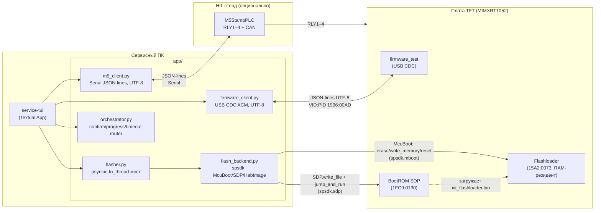
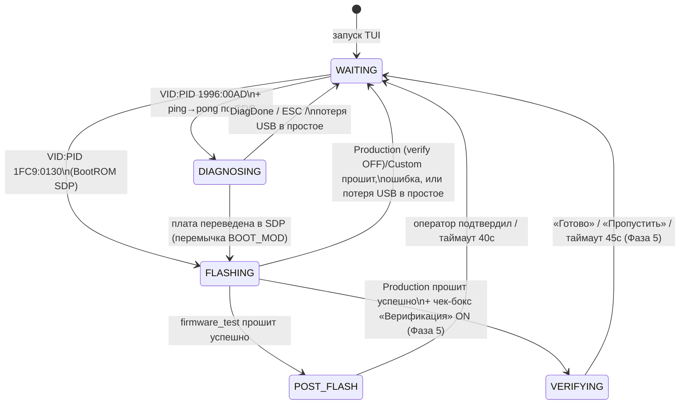
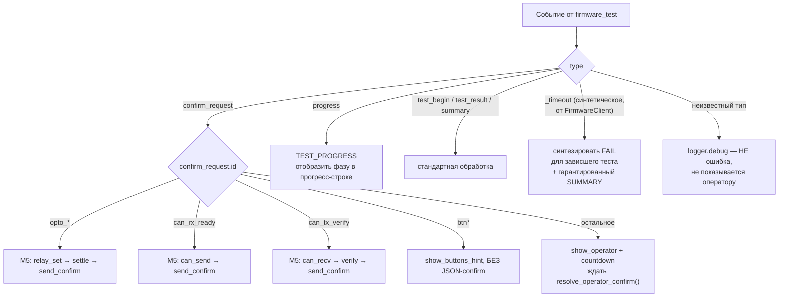
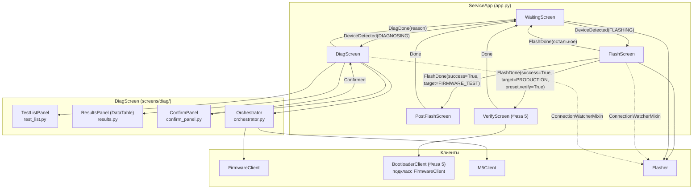
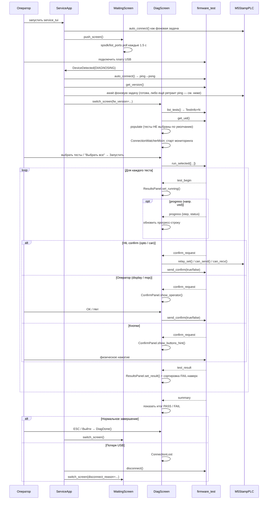

# service-tui — техническая архитектура

> Компонент: `tools/service_tui/` — TUI сервисного инженера (диагностика и
> прошивка платы MIMXRT1052CVJ5B).
> Документ описывает внутреннее устройство: структуру модулей, протокол
> взаимодействия с firmware/M5, экранную архитектуру Textual, известные
> особенности фреймворка.
> Пользовательская документация (экраны, запуск, конфигурация,
> рабочие процессы сервисника) — в [README.md](README.md).

---

## 1. Структура проекта

```bash
tools/service_tui/
├── main.py                              ← точка входа: логирование (Р12) + ServiceApp().run()
├── pyproject.toml                       ← зависимости uv (включая spsdk==3.7.0)
├── uv.lock
├── service_tui.spec                     ← PyInstaller spec (Фаза 5, onedir)
├── custom_binaries/                     ← runtime, gitignored, создаётся автоматически
│                                          сырые (без FCB/IVT/DCD) бинарники для FlashScreen → «Другое»
├── tests/
│   ├── test_flash_backend.py            ← unit-тесты flash_backend.py, включая Тир-0 readback (Фаза 5)
│   └── test_bootloader_client.py        ← unit-тесты BootloaderClient (фейковый serial, Фаза 5)
├── spike/                               ← Фаза 0, де-риск spsdk API (в релиз не идёт)
└── app/
    ├── app.py                           ← ServiceApp — роутинг экранов, жизненный цикл клиентов
    ├── app.tcss                         ← единый файл стилей для всех экранов
    ├── models.py                        ← все типы данных (dataclass/Enum)
    ├── boot_art.py                      ← LOGO_ART — растеризованный логотип для WaitingScreen
    ├── firmware_client.py               ← async USB CDC клиент firmware_test (UTF-8)
    ├── bootloader_client.py             ← async CDC клиент bootloader (Фаза 5) — тонкий подкласс
    │                                       FirmwareClient, добавляет get_smoke_status()/get_qspi_info()
    ├── m5_client.py                     ← async M5StampPLC клиент (Serial JSON-lines, UTF-8)
    ├── usb_ports.py                     ← resolve_serial_port() — резолв COM/tty по VID:PID (Р8)
    ├── flash_backend.py                 ← синхронное ядро прошивки: прямой spsdk API (McuBoot/SDP/HabImage),
    │                                       zero Textual/asyncio импортов, тестируется без event loop.
    │                                       Фаза 5: Тир-0 readback-верификация записи, всегда включена
    ├── flasher.py                       ← async-обёртка над flash_backend.py (asyncio.to_thread).
    │                                       Фаза 5: PRODUCTION = только bootloader, Release жёстко
    ├── orchestrator.py                  ← маршрутизация confirm_request, progress, таймауты
    ├── widgets/
    │   ├── __init__.py
    │   └── app_frame.py                 ← AppFrame — общий адаптивный контейнер всех экранов
    └── screens/
        ├── __init__.py                  ← реэкспорт: WaitingScreen, FlashScreen, PostFlashScreen,
        │                                    VerifyScreen, DiagScreen
        ├── waiting.py                   ← WaitingScreen — ожидание USB, лого, версия, баннер причины возврата
        ├── flash.py                     ← FlashScreen — прошивка / chip erase
        ├── post_flash.py                ← PostFlashScreen — промпт смены BootMode после прошивки firmware_test
        ├── verify.py                    ← VerifyScreen (Фаза 5) — Тир-1: живой smoke-test bootloader
        │                                    по CDC после серийной прошивки, по чек-боксу «Верификация»
        ├── connection_watcher.py        ← ConnectionWatcherMixin — мониторинг обрыва USB
        └── diag/
            ├── __init__.py              ← DiagScreen — координатор диагностики
            ├── test_list.py             ← TestListPanel — чекбоксы тестов, Выбрать/Снять все
            ├── results.py               ← ResultsPanel — DataTable результатов
            └── confirm_panel.py         ← ConfirmPanel — prompt оператора + countdown
```

> **Разделение dev-CLI / production-TUI:** `tools/host/flash_usb.py` (subprocess
> sdphost/blhost, используется just-рецептами `just host::flash*`) и
> `app/flash_backend.py` (прямой spsdk Python API) — две независимые
> реализации одной и той же логики прошивки. `flash_backend.py` — прямой
> порт `flash_usb.py` на spsdk API (см. заголовок модуля), но TUI больше не
> вызывает `flash_usb.py` ни субпроцессом, ни как библиотеку. `tools/host/`
> используется TUI только как источник статичных data-блобов
> (`tools/host/dcd/*.bin`) в dev-режиме — см. §8.

---

## 2. Концепция



> **Детект USB:** `Flasher.detect_sdp()`/`detect_cdc()` делегируют в
> `flash_backend.detect_sdp()`/`detect_cdc()` (Р7 — `spsdk`-сканеры
> `SdpUSBInterface.scan()`/`serial.tools.list_ports`, БЕЗ `pyusb`: BootROM
> SDP не создаёт serial-порт на macOS, но `spsdk` видит его нативно через
> HID/libusbsio без Zadig на Windows). `usb_ports.resolve_serial_port()`
> резолвит CDC-порты (firmware_test, M5) по VID:PID, а не по имени порта —
> имя не переносимо между перевтыкиваниями (см. Р8, `usb_ports.py`).
> M5StampPLC детектируется отдельно в `m5_client.py` (VID/PID из `.env` —
> см. раздел 5).
>
> **`flash_backend.py` не вызывает `tools/host/flash_usb.py`** ни
> субпроцессом, ни как библиотеку — это прямой порт той же логики на
> spsdk Python API (`McuBoot`/`SDP`/`HabImage` вместо `sdphost`/`blhost`/
> `nxpimage` CLI), провалидированный байт-в-байт на живом железе (Фаза 0).
> `flash_usb.py` остаётся независимым dev-CLI для `just host::flash*` —
> см. §8 (конвейер сборки) и §6.2 (обработка ошибок прошивки).

---

## 3. Диаграмма состояний приложения

Состояние определяется автодетектом USB и меняется динамически без
перезапуска TUI. При потере соединения сессия разрывается полностью — TUI не
пытается восстановить прежнее состояние, а стартует заново с `WaitingScreen`.



**VERIFYING (Фаза 5, bootloader `PLAN.md`)** — Тир-1: живая проверка
загрузчика по USB CDC (`BootloaderClient`, см. §16). Не идёт через обычный
`WaitingScreen`-автодетект (bootloader и firmware_test делят VID:PID, но у
bootloader нет `list_tests` — автодетект увёл бы в `DIAGNOSING` и там
завис бы) — отдельная ветка сразу из `FLASHING`, симметрично `POST_FLASH`.

Состояния соответствуют `AppMode` в `models.py`; переключение экранов —
`ServiceApp.push_screen()`/`switch_screen()` в `app.py`, реагирующий на
сообщения `DeviceDetected`/`FlashDone`/`DiagDone`.

---

## 4. Обработка confirm_request

Маршрутизация реализована в `Orchestrator._handle_confirm()` по значению
`confirm_request.id`. Помимо confirm, протокол v2 определяет `progress` —
внутришаговые информационные события долгих тестов (сейчас только `usd`), не
требующие ответа.



| `confirm_request.id`            | Кто отвечает                 | Реле M5 |
| ------------------------------- | ---------------------------- | ------- |
| `opto_in1_active` / `_inactive` | M5 авто                      | RLY3    |
| `opto_in2_active` / `_inactive` | M5 авто                      | RLY4    |
| `opto_rs_active` / `_inactive`  | M5 авто                      | RLY2    |
| `can_rx_ready`                  | M5 авто (CAN TX)             | —       |
| `can_tx_verify`                 | M5 авто (CAN RX)             | —       |
| `btn*`                          | физика, без JSON-ответа      | —       |
| всё остальное                   | оператор, prompt + countdown | —       |

**Гарантия таймаута:** `Orchestrator.run_tests()` всегда завершается ровно
одним событием `SUMMARY` — настоящим от firmware или синтетическим
(`aborted: true`), если чтение порта оборвалось по таймауту. Без этой гарантии
зависший тест блокировал бы кнопки "Выйти" и повторного запуска навсегда
(исторический баг, см. `CHANGELOG.md`).

---

## 5. Протокол M5 agent (JSON-lines)

`m5_client.py` общается с `tools/hil/m5/agent.py` напрямую (не через
`tools/hil/` pytest-окружение — у HIL pytest свой собственный путь: порт берёт
из `.env` (`HIL_M5_PORT`) и не использует `M5Client`).

Актуальный формат ответа агента:

```json
{"ok": true, "id": 1, "data": [...]}
```

Значимые детали, зафиксированные по факту сверки с `agent.py` (`grep` по
обработчикам команд):

- Поле успеха — **`ok`** (bool), не `status`. Относится ко всем командам:
  `ping`, `relay_set`, `relay_get`, `can_send`, `can_recv`.
- Ключ канала реле в `relay_set`/`relay_get` — **`ch`**, не `relay`.
- VID/PID детекта M5StampPLC настраиваются через `.env`:
  `SERVICE_M5_VID`/`SERVICE_M5_PID` (см. README, раздел «Конфигурация»).
  Рантайм-режим агента (MicroPython) отличается от ROM-режима ESP32-S3 по
  PID — при детекте ориентироваться на `just host::m5-scan`, а не на
  документацию, если она когда-либо разойдётся с кодом.

**Важно на будущее:** документация (`HIL_BENCH.md`/`HIL_HOW_TO.md`) местами не
успевает за изменениями `agent.py`. При любых будущих изменениях протокола
агента (новые команды, смена формата ответа) — сверяться напрямую через
`grep` по `tools/hil/m5/agent.py`, а не полагаться только на документацию.

**Протокол без корреляции запрос↔ответ — известный риск десинка.** Каждый
вызов `M5Client._send_recv()` пишет одну JSON-команду и читает ровно одну
строку ответа с фиксированным таймаутом (`_READLINE_TIMEOUT_S = 0.5`), без
ID запроса в сообщении. Если M5 не успел ответить в это окно (устройство и
так временами «тормозит» — см. заметку выше про boot-баннер MicroPython), а
ответ всё же приходит чуть позже, он остаётся непрочитанным в буфере порта.
Следующий вызов — уже ДРУГОЙ команды — читает этот протухший ответ вместо
своего. Конкретный воспроизведённый случай на живом стенде: `can_send()`
отвечает `{"ok": true}` (без `id`); если этот ответ протух и его подобрал
следующий `can_recv()`, `resp.get("ok") is True` — правда, а `resp["id"]` —
`KeyError`, роняющее `_run_worker` в `diag/__init__.py` («зависший» статус
CAN на экране, крах отдавал только `str(exc)` без traceback, что сильно
затруднило диагностику — теперь `exc_info=True`). Фикс — `reset_input_buffer()`
перед КАЖДОЙ командой в `_send_recv()` (не только один раз при открытии
порта): протухший ответ на предыдущую команду отбрасывается, следующий
`readline()` может прочитать только ответ на команду, которую мы вот-вот
отправим. Плюс defense-in-depth в `can_recv()` — не доверять форме ответа
только по `ok: true`, проверять наличие `id`/`data` явно. Если в будущем
протокол агента усложнится (несколько команд в полёте одновременно и т.п.),
этого узкого фикса будет недостаточно — понадобится настоящая корреляция
запрос↔ответ (ID в каждом сообщении).

---

## 6. Мониторинг соединения и разрыв сессии

### 6.1 Простой (`ConnectionWatcherMixin`)

`ConnectionWatcherMixin` (`screens/connection_watcher.py`) подключается к
`FlashScreen` и `DiagScreen`: каждые 1.5с проверяет, виден ли таргет на шине.

- **На `FlashScreen`** — проверка приостановлена во время активной
  прошивки/erase (обрыв в этом случае обнаруживает сам `flash_backend.py`,
  см. §6.2, — не watcher).
- **На `DiagScreen`** — проверка приостановлена во время прогона тестов
  (обрыв надёжнее детектирует таймаут чтения порта внутри `Orchestrator`, не
  просто исчезновение устройства из списка).
- При срабатывании — `ConnectionLost` message → экран постит
  `FlashDone(success=False, target=None)` / `DiagDone(reason=...)` →
  `ServiceApp` разрывает сессию (`FirmwareClient.disconnect()`) и переключает
  на `WaitingScreen(disconnect_reason=...)`. `FlashDone` в этой ветке не несёт
  `preset` — «липкий» выбор (см. §8) сохраняется отдельно, в момент нажатия
  «Загрузить», а не при завершении прошивки.
- `WaitingScreen` показывает причину возврата баннером на 4 секунды, затем
  продолжает обычный автодетект.

Архитектурное решение: **сессия никогда не восстанавливается** — после
разрыва TUI не пытается определить, вернулась ли та же плата, просто стартует
диагностику с нуля.

### 6.2 Во время активной операции (`FlashBackendError`, Фаза 4/4a)

Пока `FlashScreen._flashing == True`, watcher приглушён (§6.1) — обрыв в
этот момент обнаруживает сам `flash_backend.py` через иерархию исключений:

```
FlashBackendError                       (connection_lost: bool = False)
├── ConnectionLostError                 (connection_lost = True — обёртка
│                                         над SPSDKConnectionError/SPSDKTimeoutError)
├── DeviceNotFoundError                 (SDP не найден ДО начала операции)
├── FlashLoaderTimeoutError             (Flashloader не поднялся за 10с)
└── HabBuildError                       (сборка HAB не удалась, к USB не относится)
```

- **`_CONNECTION_LOST_EXCEPTIONS = (SPSDKConnectionError, SPSDKTimeoutError)`**
  — оба варианта прилетают на обрыве USB (`SPSDKTimeoutError` — потомок
  `SPSDKError`, но **не** `SPSDKConnectionError`; read-фаза после write может
  отдать голый таймаут вместо connection error). Ловятся кортежем на всех
  точках отказа: `load_flashloader`, `flash` (основная + `ram_only` ветки),
  `erase_chip`. **Р17:** до фикса эти 4 места безусловно поднимали
  `ConnectionLostError` на любое такое исключение, не проверяя, жива ли
  плата (в отличие от варианта B ниже, который проверяет) — одиночный сбой
  HID-записи (`bytes_written=-1`, реальный полевой пример: плата осталась на
  шине, `WaitingScreen` почти сразу переоткрывал `FlashScreen`, оператор не
  успевал прочитать причину) маскировался под полноценный обрыв сессии.
  Теперь все 4 места сначала проверяют присутствие — `_sdp_still_present()`
  для фаз ДО перехода на Flashloader (SDP-часть `load_flashloader()`,
  `ram_only`) или `_flashloader_still_present()` для фаз после (основной
  `McuBoot`-блок `flash()`/`erase_chip()`) — и при «плата на месте» поднимают
  обычный `FlashBackendError` вместо `ConnectionLostError`, что автоматически
  заводит их в тот же путь «остаёмся на FlashScreen», что и вариант B ниже —
  без изменений в `flasher.py`/UI.
- **Вариант B для команд, возвращающих `False` без исключения** (Р10,
  `_fail_command()`): `flash_erase_region`/`flash_erase_all`/`write_memory`
  иногда просто возвращают `False` вместо исключения (`McuBoot(iface)`
  создаётся с `cmd_exception=False` — дефолт spsdk, статус оседает в
  `status_code`, исключения нет). В этом случае `_fail_command()` выполняет
  быстрый `_flashloader_still_present()` (обёрнутый в `try/except` — любая
  ошибка самой проверки трактуется как «устройства нет», т.к. шина к этому
  моменту уже нестабильна): устройство пропало → `ConnectionLostError`,
  устройство на месте → обычный `FlashBackendError` с текстом ошибки
  операции + `mboot.status_string`. Проверка добавляется **только в
  error-путь**, на happy path не влияет.
  **Р13 (полевой баг, ~50/500 плат):** до фикса эта проверка звала
  `_sdp_still_present()` — сканировала BootROM SDP VID:PID, хотя к моменту
  вызова `_fail_command()` плата уже спрыгнула на Flashloader (другой
  VID:PID) внутри `load_flashloader()`. Проверка возвращала «нет»
  **всегда**, независимо от реального состояния платы — любой `False` от
  Flashloader-команды маскировался под обрыв USB. Одновременно
  `flash()`/`flash_erase_region` и `configure_flexspi()` (в обоих путях) не
  поднимали `iface.device.timeout` вообще — работали на spsdk-дефолте
  2000мс (`UsbDevice.__init__`), тогда как NXP MCUBootUtility использует
  50–2048с на те же команды. На части плат в поле реальный ответ не
  укладывался в 2с → тихий `NO_RESPONSE` → `False` → неверно
  классифицировался как «устройство пропало с шины». Фикс: единый
  `MCUBOOT_CMD_TIMEOUT_MS` выставляется сразу после `load_flashloader()`,
  до первой команды сессии (не только перед `flash_erase_all`, как было
  раньше); `_fail_command()` проверяет `detect_flashloader()`, не SDP.
- **`Flasher._run_flash_op()`** (`flasher.py`) конвертирует
  `FlashBackendError` обратно в `FlashResult(ok=False,
  connection_lost=exc.connection_lost)` + событие `FlashProgress(phase="error")`.
  Отдельный `except Exception` — safety net на любое непредвиденное
  исключение (гарантирует `ok=False` вместо зависших кнопок); `_format_error_message()`
  добавляет префикс «Соединение с платой потеряно» для `connection_lost=True`.
- **`FlashScreen`** различает результат (см. docstring `FlashDone`, §9):
  `connection_lost=True` → `WaitingScreen` (тот же маркер `target=None`, что
  и watcher-детект в простое, текст ошибки прокидывается через
  `FlashDone.error_message`); `connection_lost=False` → плата на месте,
  экран остаётся на `FlashScreen` (иначе `WaitingScreen` почти мгновенно
  переоткрывал бы `FlashScreen` заново и уничтожал `#flash-log` раньше, чем
  оператор успевал прочитать сообщение об ошибке).

USB-интерфейс из `load_flashloader()` закрывается в `finally`
(`_close_iface_quiet`) на любом исходе — защита от утечки HID-хэндла в
редком окне «интерфейс получен → USB выдернут → `McuBoot.__enter__` упал».

---

## 7. AppFrame — общий каркас экранов

`widgets/app_frame.py` — единый контейнер, который оборачивает содержимое
всех трёх основных экранов:

```css
AppFrame {
    width: 100%;
    height: 100%;
    max-width: 112;
    max-height: 35;
    border: heavy $primary;
}
```

Решает две задачи:
1. **Визуальная консистентность** — одна и та же рамка на всех экранах.
2. **Устраняет краш Textual 8.x** при mouse drag
   (`assert isinstance(content_widget.parent, Widget)`) — раньше `Screen` мог
   выступать `content_widget` напрямую; с `AppFrame` между `Screen` и
   контентом всегда есть валидный промежуточный `Widget`.

Адаптивный размер (`100%` с потолком `112×35`) — гарантирует, что элементы
управления (кнопки, таблицы) никогда не обрезаются на маленьком терминале и
не расползаются на огромном мониторе. Потолок подобран и подтверждён
визуально на скриншотах всех пяти экранов; нижняя граница по ширине
обоснована жёстко: `TestListPanel(width:38)` + `ResultsPanel(width:70)` рядом
на `DiagScreen` дают 108 + рамка = 110 — меньше сжимать уже нельзя.

---

## 8. Прошивка кастомных бинарников и «липкий» выбор (FlashPreset)

### 8.1 Проблема

Штатные HAB-образы (`firmware_test`/`bootloader`/`app`) собираются
`nxpimage` заранее (`just build::hab-*`) и всегда идут на плату с W25Q128 —
для них auto-config Flashloader (`configure-memory 0xC0000207` →
`0xF000000F`, см. `HOW_TO_FLASH.md`; до Р15 было `0xC0000007` — без
установки QE-бита, см. §8.4) достаточен. Для сторонних/легаси
бинарников (старые платы, W25Q256/512) это не так: auto-config Flashloader
не документирован как надёжный для 4-байтной адресации, а сами бинарники
приходят «сырыми» (код + таблица векторов, без FCB/IVT/DCD — тот же формат,
что `inputImageFile` в `hab_*.yaml` до сборки). Решение — собирать HAB
на лету и писать FCB явно, а не полагаться на auto-config.

### 8.2 Модели (`models.py`)

```python
class FcbVariant(str, Enum):
    W25Q128 = "w25q128"   # 3-байтная адресация — auto-config работал бы,
    W25Q512 = "w25q512"   # но пишем явно и здесь, для единообразия пути
    # W25Q64/W25Q256 сведены к этим двум случаям — см. обсуждение

@dataclass
class FlashPreset:
    target: FlashTarget = FlashTarget.FIRMWARE_TEST
    custom_bin_name: Optional[str] = None
    use_dcd: bool = False
    fcb_variant: FcbVariant = FcbVariant.W25Q128
    verify: bool = False   # Фаза 5 — Тир-1 при PRODUCTION, см. §16. OFF по
                           # умолчанию: массовая заливка партии не должна
                           # требовать смены BOOT_MOD на каждой плате
```

`FlashPreset` — «липкий» выбор оператора, живёт в `ServiceApp._last_flash_preset`
(память процесса, не диск). Захватывается в `FlashScreen._on_flash_pressed()`
**в момент нажатия «Загрузить»**, не только при успехе — неудача чаще всего
про физическое соединение, а не про то, что выбор был неверным. Передаётся
в конструктор следующего `FlashScreen` через `FlashDone.preset` →
`ServiceApp._on_flash_done()`. Решает конкретную задачу: прошивка партии
одинаковых плат подряд — вставил, TUI уже подставила прошлый выбор файла/
памяти/DCD, нажал «Загрузить», вынул, вставил следующую.

Рассматривался отдельный режим «массовое программирование» (авто-прошивка
по факту детекта SDP, без нажатия кнопки на каждую плату) — отклонён:
в SDP/Flashloader-режиме нет способа прочитать UID платы, авто-старт без
подтверждения оператора убирает последний шанс заметить, что в руках не та
плата. Оставлена только «липкая» память выбора (этот раздел).

### 8.3 Конвейер сборки — прямые вызовы spsdk (`flash_backend.py`)

Сборка HAB-образа и прошивка выполняются **in-process** через Python API
`spsdk` — никакого subprocess/CLI (`nxpimage`/`sdphost`/`blhost`), в отличие
от dev-CLI `tools/host/flash_usb.py`, который остаётся отдельной,
независимой реализацией на тех же CLI-утилитах (см. §1, врезка про
разделение dev-CLI/production-TUI).

```
Flasher.flash(target=CUSTOM, bin_path, use_dcd, fcb_variant, progress_cb)   [flasher.py]
  └── _flash_custom()                                          [flasher.py]
        ├── asyncio.to_thread(flash_backend.build_custom_hab, raw_bin, use_dcd)
        │     ├── _make_hab_config() — генерирует YAML с АБСОЛЮТНЫМИ путями
        │     │     во временном work_dir (tempfile.mkdtemp), + DCDFilePath
        │     │     на real_dcd_bin_path() если use_dcd
        │     ├── Config.create_from_file() + HabImage.get_validation_schemas_from_cfg()
        │     │     + cfg.check() — валидация конфига (spsdk.image.hab.hab_image)
        │     ├── HabImage.load_from_config(cfg).export() — сборка байт HAB-образа
        │     │     в памяти (та же логика, что nxpimage CLI, см. Фазу 0 — golden-тест
        │     │     byte-exact, test_build_custom_hab_bytes_match_golden)
        │     └── эмитит progress_cb(phase="hab_build", 0% → 100%)
        └── asyncio.to_thread(flash_backend.flash, hab_bin, fcb_path=fcb_blob_path(...))
              ├── load_flashloader() — SDP.write_file()+jump_and_run(), ждёт
              │     поднятия McuBoot (wait_for_flashloader, poll scan())
              └── with McuBoot(iface): configure_flexspi() → flash_erase_region()
                    → write_fcb_explicit(fcb_path) → write_memory(hab_bin)
                    → reset(reopen=False)
        (finally: shutil.rmtree(hab_bin.parent) — временная директория
         build_custom_hab() удаляется целиком, не только *.bin)
```

`dcd/dcd.bin` — один и тот же файл независимо от проекта (SEMC/SDRAM-init не
зависит от того, что именно исполняется), поэтому просто константный путь,
без вариантов. Пути к data-блобам (`dcd.bin`, `*_fdcb.bin`,
`ivt_flashloader.bin`) резолвятся двухрежимно (`_host_dcd_dir()`,
`flash_backend.py`): в dev — `tools/host/dcd/` (те же файлы, что использует
`flash_usb.py`, отслеживаются в git), в frozen-бандле —
`sys._MEIPASS/data` (см. §14).

### 8.4 Явная запись FCB вместо auto-config (`write_fcb_explicit`)

```python
def write_fcb_explicit(mboot: McuBoot, fcb_path: Path) -> None:
    """Пишет буквальный FCB-блоб (512 байт) в Flash[FLASH_BASE] (custom-бинари).

    См. flash_usb.py::write_fcb_explicit — nxpimage не кладёт FCB в HAB-образ,
    поэтому для произвольных чипов нужен явный блоб под конкретный memory chip.
    """
```

`mboot.write_memory(FLASH_BASE, data, mem_id=0)` — буквальная запись
512-байтного FCB-блоба (tag `FCFB`), а не magic option word `0xF000000F`
(`write_fcb_auto`, применяется только для штатных
`firmware_test`/`bootloader`/`app`, см. `flash()` в `flash_backend.py`:
параметр `fcb_path=None` → auto-config). Активируется передачей
`fcb_path` в `flash_backend.flash()` — путь без него не тронут: штатная
прошивка идёт через auto-config `write_fcb_auto`, как и раньше.

Таймаут HID-команд (`iface.device.timeout`) поднят до `MCUBOOT_CMD_TIMEOUT_MS
= 200_000` мс (эквивалент `blhost -t 200000`) на всю Flashloader-сессию
целиком — `configure_flexspi()`, `flash_erase_region`/`flash_erase_all`,
`write_fcb_*`, `write_memory`, выставляется сразу после `load_flashloader()`,
до первой команды. Изначально (Фаза 0) считалось, что `flash_erase_region`
(пара секторов под FCB+HAB) укладывается в spsdk-дефолт 2000мс независимо от
чипа и трогать его не нужно — на живом парке плат это оказалось не так
(Р13, ~50/500 плат из полевых логов не укладывались в 2с), см. §6.2.

После фикса выше hardware-тест на «отбракованной» плате показал НАСТОЯЩУЮ
причину сбоя вместо таймаута: `status: FlexSPINOR: Command Failure` (spsdk
`StatusCode` 20106 — дженерик-ошибка исполнения команды контроллером
FlexSPI, не специализированный `EraseSectorFail`/`EraseAllFail`). **Причина
всё ещё не найдена.** Первая гипотеза (commit FCB `0xF000000F` нужен ДО
erase, по аналогии с `boot_utility_log.txt` NXP MCUBootUtility) была
**проверена на железе и опровергнута**: `configure-memory(0xF000000F)`
оказался немедленной физической записью FCB во flash, а не безобидной
донастройкой контроллера — на НЕ стёртой области (любая ранее прошитая
плата) запись сразу проваливается со status 10203 «Memory Cumulative
Write», и это сломало ранее рабочую плату. Правка отменена. Полная
хронология и текст урока — в `flash_backend.py`, docstring, раздел «Р13,
ОПРОВЕРГНУТАЯ гипотеза».

**Р14 — переоценка после дополнительных данных.** AN12107 не описывает
FCB/configure-memory вообще (проверено, 0 совпадений по всему файлу).
Уточняющие вопросы дали решающие факты: (1) на тех же ~50 проблемных платах
падает и **обычная** прошивка firmware_test, не только erase/«Другое»; (2)
чип и ревизия платы — **та же**, что у 450 рабочих, не другая партия. Значит
дело не в конкретной flash-команде и не в чужеродном чипе — сбой проявляется
на случайном подмножестве физически идентичных плат независимо от того,
какая именно команда выполняется первой. Это картина маргинального
электрического контакта конкретного экземпляра (пайка/питание), проявляется
сильнее всего на erase (внутренняя подкачка напряжения NOR, самая
«тяжёлая» операция по току среди flash-команд), а не логической ошибки на
стороне хоста — программно починить плохую пайку нельзя, но можно дать
операции второй/третий шанс, если условие временное.

Фикс: `_run_flash_cmd()` — retry (`CMD_RETRY_ATTEMPTS = 3`,
`CMD_RETRY_DELAY_S = 0.5`с) вокруг каждой команды, реально трогающей
flash-чип (`configure_memory` в `configure_flexspi`/`write_fcb_auto`,
`write_memory` в `write_fcb_explicit`/основной записи HAB-образа,
`flash_erase_region`, `flash_erase_all`). Между попытками проверяется
`detect_flashloader()` — при реальном обрыве связи retry не имеет смысла,
сразу уходит в `ConnectionLostError`, как раньше. Если ошибка
детерминированная (плата физически неисправна), retry её не маскирует —
после исчерпания попыток `_fail_command()` получает управление с тем же
`mboot.status_string`, что и раньше, просто с пометкой «после N попыток».
Hardware-тест: retry НЕ помог (все 3 попытки — тот же 20106), гипотеза
«маргинальный контакт» опровергнута доп. фактами (MCUBootUtility на тех же
платах — 10/10; после одного её касания плата навсегда работает и у нас).
Retry оставлен как безвредная страховка.

**Р15 — найденная причина (QE-бит).** Пересчёт десятичных значений в логах
MCUBootUtility инструментом (не «на глаз», как в Р13 — тогда значение было
прочитано неверно, что увело диагностику в сторону на три раунда) показал:
их option word — `3221225991 = 0xC0000207`, наш был `0xC0000007`. Разница —
поле quad_mode_setting (биты [11:8]) = 2: flashloader при `configure-memory`
устанавливает **энергонезависимый** QE-бит (Quad Enable, Status Register 2
bit 1, формат Winbond) на самом чипе. Часть партий W25Q128 приходит с
завода с QE=0 — на них наш вариант оставлял чип в SPI-режиме при LUT,
настроенных на quad-команды → 20106 на любой операции. Один прогон
MCUBootUtility устанавливал QE=1 навсегда — отсюда «после их утилиты наша
начинает работать». Исправлено в `FLEXSPI_OPTION_VALUE` (`flash_backend.py`
+ `tools/host/flash_usb.py`), плюс явное обнуление второго option-слова —
полное зеркало последовательности NXP. Для чипов с уже установленным QE
повторная установка — no-op (статус-регистр, не массив памяти).

### 8.5 UI (`flash.py`)

При выборе радиокнопки «Другое» появляется `Vertical#flash-custom-group`:
`Select` по содержимому `custom_binaries/` (пересканируется в `on_mount()`),
`Select` по `FcbVariant`, `Switch` DCD. Выбор любой ДРУГОЙ радиокнопки в том
же `RadioSet` автоматически скрывает группу — отдельного «Назад» не
потребовалось, это штатное поведение взаимоисключающего `RadioSet`.

`#flash-target-group` ограничена `max-height: 18` с собственным скроллом —
без этого разросшаяся custom-группа (два `Select` + `Switch`) на маленьком
терминале выталкивала `#flash-log` почти до нулевой высоты. `#flash-log`
дополнительно защищён `min-height: 6` — лог гарантированно виден даже в
худшем случае.

---

## 9. Архитектура экранов



`VerifyScreen` намеренно **не** использует `ConnectionWatcherMixin` — та
логика предполагает уже установленное соединение, которое может разорваться,
а здесь наоборот: соединения ещё нет, экран сам поллит появление CDC (до
45с) и подключается, когда оператор физически переведёт плату в обычный
режим. См. §16.

---

## 10. Жизненный цикл диагностической сессии



M5 не детектится синхронно в момент перехода на диагностику — `ServiceApp._restart_m5_detection()` запускает `M5Client.auto_connect()` фоновой задачей (`asyncio.Task`) сразу при входе на `WaitingScreen` (включая `on_mount`), параллельно с поллингом целевой платы. `_connect_and_diagnose()` просто дожидается ту же задачу.

**«M5 не виден с первого запуска TUI»** (воспроизведено и подтверждено логами с живого стенда, macOS) — это не проблема детекта порта: `serial.tools.list_ports.comports()` находит M5 мгновенно, с первой попытки (`_AUTO_CONNECT_ATTEMPTS = 6` в `m5_client.py` — небольшой запас на случай реальной гонки в перечислении портов, не более). Ломается `M5Client.connect()` сразу после открытия порта: первый `ping` не получает ответ за `_READLINE_TIMEOUT_S`. Судя по всему, само открытие serial-порта хостом перезапускает MicroPython на M5 (типично для USB-CDC ESP32-S3), а `agent.py` (`tools/hil/m5/agent.py`) перед основным циклом делает I2C/AW9523/CAN init и только потом пишет `"READY"` — на живом стенде это заняло больше 2.5с (бюджет первой версии фикса), поэтому итоговый бюджет ретрая `ping` — `_CONNECT_PING_ATTEMPTS = 24` (~12с, `_CONNECT_PING_RETRY_DELAY_S = 0.5`). Если сырой (не-JSON) ответ всё-таки прилетает во время этого окна, `_send_recv()` логирует его первые 200 байт на INFO — обычно это MicroPython boot-баннер, полезно для калибровки, если бюджета опять не хватит на другом экземпляре стенда.

`just host::m5-*` с этой проблемой не сталкиваются: `m5-scan` вообще не открывает порт (чистое перечисление через `mpremote devs`), а `m5-repl`/`m5-cli`/etc используют `mpremote`, который переживает reset-on-connect за счёт своей протокольной логики поверх REPL — наш простой JSON-lines клиент такой логики не имеет, поэтому нужен явный retry.

**Побочный эффект и его фикс:** пока `connect()` ретраит `ping` (до ~12с в худшем случае), `WaitingScreen` уже физически детектировал плату, но `ServiceApp` ещё не переключил экран — на месте секунд на 10 виден статичный (не крутящийся) спиннер, что выглядит как зависание. Причина — `_poll_usb()` в `waiting.py` останавливал разом все таймеры экрана, включая спиннер, в момент детекта. Исправлено: `_stop_detect_polling()` останавливает только опрос USB и меняет подсказку на «Плата найдена, подключаемся...», спиннер продолжает крутиться до фактического `switch_screen()` (весь набор таймеров глушится только в `on_unmount()`).

**Регрессия и её фикс (детект целевой платы переставал работать целиком):** первая версия фонового детекта M5 заворачивала `_find_m5_port()`/`comports()`-скан в `loop.run_in_executor(...)` — то есть гоняла его в отдельном потоке. При этом `WaitingScreen._poll_usb()` в главном потоке параллельно дёргает `Flasher.detect_cdc()` → `resolve_serial_port()` → тот же `serial.tools.list_ports.comports()`. До фонового M5-детекта `comports()` вызывался только из одного потока за раз; с ним — сразу из двух. Нативное перечисление USB-устройств (`SetupDiGetClassDevs` на Windows и аналоги на других ОС) не гарантированно потокобезопасно при таком параллельном доступе — это вешало детект целевой платы целиком (`WaitingScreen` зависал навсегда, независимо от M5). Исправлено: `_find_m5_port()`/`_describe_visible_ports()` в `M5Client.auto_connect()` больше не уходят в executor — `comports()` сам по себе быстрый (мс), гонять его в отдельном потоке не было необходимости, а вот держать все вызовы `comports()` в одном потоке (главном, event loop) — обязательно. Открытие/чтение уже резолвленного M5-порта (`_open()`/`_cmd()`) по-прежнему в executor — это другой системный вызов (открытие конкретного файла/хендла, не сканирование дерева устройств), конфликта с `comports()` не даёт.

---

## 11. Версионирование firmware

`firmware_test` версионируется через CMake
(`project(firmware_test VERSION X.Y.Z)`), генерирует `version.h` через
`configure_file`. Команда протокола `get_version` (по аналогии с `get_uid`)
запрашивается один раз при подключении в `ServiceApp._connect_and_diagnose()`
и передаётся в `DiagScreen` параметром конструктора — версия не запрашивается
повторно внутри самого экрана.

Версия самого TUI (`service_tool vX.Y.Z` на `WaitingScreen`) читается
отдельно — `waiting.py::_read_app_version()` парсит `[project].version` из
`pyproject.toml` напрямую через `tomllib` (stdlib). `importlib.metadata`
сознательно не используется — проект не ставится как пакет
(`tool.uv.package = false`), метаданных может не быть.

---

## 12. Логотип (`boot_art.py`)

`LOGO_ART` — Rich-markup строка (29×21 символов, цвета `#3ca0dc` для синей
части логотипа, `white` для тёмной, `grey37` для фоновых точек), полученная
одноразовой coverage-based растеризацией `logo.png` (300×300 RGBA) через
Pillow: разбор на сетку символов с компенсацией аспекта шрифта терминала
(`ASPECT = 0.5`), классификация фона/двух цветовых групп логотипа по каналам,
плотность символа на ячейку — по доле непрозрачных пикселей
(`.::+*#`/`.::+%@`).

Сам скрипт растеризации **не сохранён в репозитории** (использовался
разово в песочнице, не входит в `pyproject.toml` TUI — новых
runtime-зависимостей `boot_art.py` не добавляет). Если логотип компании
сменится — скрипт нужно будет написать заново; логика воспроизводима (см.
абзац выше).

---

## 13. Известные грабли Textual 8.x

Зафиксировано на практике — экономит время при будущих доработках:

- **`Screen.Message` не существует.** Вложенные сообщения экранов
  наследуются от `textual.message.Message` напрямую, не от несуществующего
  атрибута `Screen.Message`.
- **`self._running` — зарезервированное имя.** `MessagePump` (предок
  `Screen`) использует это поле для своего внутреннего message loop.
  Случайное совпадение имени тихо ломает логику без исключения — в
  `DiagScreen` переименовано в `_tests_running`.
- **`row.mount(child)` сразу после `self.mount(row)` бросает `MountError`** —
  `row` ещё не прикреплён к DOM. Решение: передавать детей в конструктор
  контейнера (`Horizontal(cb, label, classes=...)`) и монтировать одним
  `mount_all()`.
- **`CSS_PATH` резолвится относительно файла класса**, не относительно корня
  проекта — постоянно расходится при рефакторинге структуры. Решение: один
  `CSS_PATH` только на `ServiceApp`, все стили в едином `app.tcss`.
- **`table.add_columns(*labels)` не принимает `width=`.** Колонка получает
  ширину по умолчанию равную длине заголовка — длинный контент обрезается
  независимо от `height` строки. Нужно использовать `add_column(label,
  width=N)` по одной колонке.
- **`DataTable.sort(*columns, key=fn)` передаёт в `key()` кортеж значений
  ячеек** (для указанных `columns`), не `row_key` и не `(row_key, row_data)`.
  Сортировка по `test_id` напрямую невозможна без парсинга содержимого ячеек,
  которые сами полностью контролируем.
- **Нет публичного API для изменения высоты уже добавленной строки.**
  `update_cell()` меняет только содержимое. Если нужно изменить `height`
  (например, под более длинный текст) — единственный надёжный путь:
  `remove_row()` + `add_row(..., height=N)`.
- **Центровка текста внутри full-width виджета не решается `Center()`.**
  `Static`/`Label` без `text-align`, растянутый на всю ширину родителя,
  прижимает текст к левому краю — `Center()` вокруг такого виджета не
  помогает (центрировать нечего, ребёнок и так 100% ширины). Нужен
  `text-align: center` в CSS на самом элементе. Обратный случай — виджет с
  "естественной" (auto) шириной — центрируется именно через `Center()`.
  Важно не путать эти два случая (`#waiting-version` — первый случай,
  `#post-flash-title`/`#post-flash-instruction` — второй).
- **`Log(auto_scroll=True)` не гарантирует автопрокрутку на каждой строке.**
  `Log.write_lines()` (`textual/widgets/_log.py`) читает
  `self.is_vertical_scroll_end` **до** добавления новой строки в буфер, не
  после, и скроллит только если снэпшот был `True`. Несколько `write_line()`
  подряд быстрее, чем успевает осесть layout между вызовами (характерно для
  событий `load_flashloader`/`configure`/`erase`-решения, летящих из
  фонового потока почти одновременно) — снэпшот устаревает, и часть строк
  проскакивает без скролла, хотя `auto_scroll=True` стоит. Медленные,
  троттлированные события (`write`-фаза) успевают осесть между вызовами —
  там штатно. Обходится принудительным `log.scroll_end(animate=False,
  immediate=True)` сразу после каждого `write_line()` в вызывающем коде
  (`FlashScreen._log()`) — не чинит `is_vertical_scroll_end`, а обходит его.

---

## 14. Упаковка PyInstaller и frozen-резолв путей (Фаза 5)

`service_tui.spec` собирает standalone-бандл (onedir — старт быстрее, чем
onefile с распаковкой во временную директорию на каждый запуск). Сборка —
через just-рецепт `just host::package-tui` (не `service-build`, см.
README «Запуск»): запускает PyInstaller, докладывает `firmware/<Type>/*_hab.bin`
из `BUILD_DIR`, переименовывает результат в `dist/service-tui-vX.Y.Z-<os>/`
(версия — из `pyproject.toml`).

Целевая структура бандла:

```
service-tui-vX.Y.Z-<os>/
├── service_tui[.exe]
├── _internal/
│   ├── data/         ← dcd.bin, *_fdcb.bin, ivt_flashloader.bin, spsdk data
│   └── ...           ← рантайм PyInstaller, libusbsio
├── firmware/
│   ├── Debug/firmware_test_hab.bin      ← firmware_test всегда Debug (см. ниже)
│   └── Release/bootloader_hab.bin       ← bootloader всегда Release, подписанный
│                                           (Фаза 5, bootloader PLAN.md — production
│                                           жёстко требует именно этот файл)
└── custom_binaries/  ← пустая, создаётся оператором/автоматически
```

**Гвард на `bootloader_hab.bin` (Фаза 5).** `just host::package-tui`
копирует `*_hab.bin` из `build/Debug/` и `build/Release/` по маске — до
Фазы 5 отсутствие Release-образа bootloader проходило незамеченным (просто
не копировался файл, которого никто ещё не требовал). После того как
`Flasher.PRODUCTION` стал жёстко резолвить `firmware/Release/bootloader_hab.bin`
(без фоллбэка на Debug — см. §16), молчаливое отсутствие стало тихой
runtime-бомбой: бандл собирается «успешно», но «Серийная прошивка» в нём
не работает. Рецепт теперь падает явно (`❌ Не найден .../Release/
bootloader_hab.bin`), если файла нет — симметрично уже существовавшей
проверке `found_debug` для firmware_test.

Каждый модуль, которому нужен путь к данным, сам решает dev vs frozen через
`getattr(sys, "frozen", False)` — единообразный паттерн по всему `app/`:

| Функция | Dev | Frozen |
| --- | --- | --- |
| `flash_backend._host_dcd_dir()` | `tools/host/dcd/` | `sys._MEIPASS/data` |
| `flash_backend.firmware_hab_path()` | `$BUILD_DIR/<Type>/*_hab.bin` (репо `build/`) | `<exe_dir>/firmware/<Type>/*_hab.bin` |
| `flasher._resolve_custom_binaries_dir()` | `tools/service_tui/custom_binaries/` | `<exe_dir>/custom_binaries/` (override — `SERVICE_CUSTOM_BINARIES_DIR`) |
| `waiting._read_app_version()` | `tools/service_tui/pyproject.toml` | тот же путь — `pyproject.toml` кладётся в `datas` спека (нужен для парсинга версии во frozen) |
| `main._setup_logging()` | рядом с `main.py` | рядом с исполняемым файлом (`sys.executable.parent`) |

`sys.executable` (не `sys._MEIPASS`) — единственный путь, одинаково
работающий и для onefile, и для onedir; `_MEIPASS` для onefile указывает на
временную распаковку, которая исчезает после выхода из процесса.

Нативный HID-транспорт (`libusbsio`, следствие Р7 — spsdk вместо pyusb)
означает, что `libusb-1.0.*`/Zadig в бандле **не нужны** ни на Windows, ни
на macOS — детект BootROM SDP и Flashloader работает из коробки.

`service_tui.spec` актуализирован и ужесточён:
`collect_data_files("spsdk")`, `collect_dynamic_libs("libusbsio")`, `datas`
для `tools/host/dcd/*.bin` (→ `data/` внутри `_internal`) и `pyproject.toml`.
Сборка падает с `FileNotFoundError` уже на этапе генерации спека, если в
`tools/host/dcd/` не хватает хотя бы одного из обязательных блобов —
несоответствие spec/факт, из-за которого ранее собранные и протестированные
на железе бандлы расходились с тем, что в репозитории, больше не может
проскочить незамеченным. `dist/` больше не коммитится в git (см.
`.gitignore`) — собранные бандлы это build-артефакты, не история репозитория.
Пересобрано и провалидировано на живом железе macOS + Windows после
актуализации spec (Гейт 5: детект SDP → прошивка `firmware_test` →
диагностика → выход).

---

## 15. Логирование (Р11/Р12, Фаза 4b)

`main.py::_setup_logging()`:

- Root-логгер по умолчанию — `INFO` (не `DEBUG`); файл —
  `service_tui.log` рядом с исполняемым файлом (или `$SERVICE_LOG_DIR`).
- `SERVICE_LOG_LEVEL=DEBUG` включает полный DEBUG, **включая** портянки
  `spsdk`/`libusbsio` (сырые HID TX/RX-пакеты — ~135 строк на одну
  прошивку).
- При любом другом значении (или отсутствии переменной) логгеры
  `spsdk`, `libusbsio`, `libusbsio.hidapi.dev`,
  `spsdk.mboot.protocol.bulk_protocol` принудительно приглушены до
  `WARNING`, независимо от уровня root — иначе диагностика `app.*`
  тонет в чужом протоколе.
- `textual` отдельно всегда на `WARNING`.

`FlashScreen._on_progress()` (Р11) троттлит **только** запись в
`#flash-log` для фазы `write`: событие логируется раз на каждые 10%
(`progress.percent // 10`), а не на каждый пакет `spsdk` (~135 →
~10 строк). Прогресс-бар при этом обновляется на **каждом** событии —
плавность не теряется, троттлинг влияет только на текстовый лог.

---

## 16. Верификация после серийной прошивки (Тир-0/Тир-1, Фаза 5)

Полный контекст решения (HAB-подпись bootloader тестовым ключом, CI,
обсуждённые trade-off'ы) — `firmware/bootloader/PLAN.md`, Фаза 5. Здесь —
только service-tui-специфичная реализация: `BootloaderClient`,
`VerifyScreen`, Тир-0 в `flash_backend.py`, и два бага, найденных в
`flasher.py` по пути.

### 16.1 Почему два уровня, а не один чек-бокс

После SDP-прошивки плата остаётся в режиме Flashloader — `mboot.reset()`
без физической смены `BOOT_MOD` вернёт её обратно в SDP, не запустит
свежезалитый образ. Любая проверка «плата реально ожила» стоит одного
ручного тоггла пина на плату, не секунд на CDC-обмен. Отсюда разделение:

| Тир | Что проверяет | Стоимость оператору | Включение |
| --- | --- | --- | --- |
| Тир-0 | Байты во Flash совпадают с записанным образом (readback + sha256) | Ноль — автоматически, для ЛЮБОЙ прошивки | Всегда, `verify_readback=True` |
| Тир-1 | Загрузчик реально грузится и отвечает (SDRAM smoke + QSPI-чип) | Один тоггл `BOOT_MOD` на плату | Чек-бокс «Верификация» на `FlashScreen`, OFF по умолчанию — сценарий A (bootloader-only, платы уходят в кучу) не должен требовать тоггла на каждую |

### 16.2 Тир-0 — `flash_backend._verify_written()`

Внутри `flash()`, между `write_memory()` и `reset()`: читает записанный
диапазон обратно (`mboot.read_memory`) и сравнивает `sha256` с исходными
байтами образа — не побайтово (короче для текста ошибки, не зависит от
чанкинга spsdk). Несовпадение/короткое чтение → `FlashVerifyError`
(подкласс `FlashBackendError`, `connection_lost=False` — логическая
ошибка, плата на месте, экран не уходит на `WaitingScreen`). НЕ
оборачивается в `_run_flash_cmd()` (retry, Р14) — это чтение, не команда с
состоянием «выполнена/не выполнена»; любой сбой читается как провал
верификации напрямую.

`verify_readback: bool = True` — единый дефолт для **всех** целей
(`firmware_test`/`PRODUCTION`/`CUSTOM`), не только production: readback
дёшев (обычный `read_memory`, без смены `BOOT_MOD`) и одинаково полезен
везде, гейтить его отдельным флагом сочли ненужным усложнением.

### 16.3 Тир-1 — `BootloaderClient`

Тонкий подкласс `FirmwareClient` (`app/bootloader_client.py`) — транспорт,
`ping()`, `get_version()` наследуются как есть (bootloader и firmware_test
делят один JSON-lines протокол и VID:PID намеренно). Добавляет:

- `get_smoke_status() -> Optional[bool]` — фильтрует `status`-эвенты именно
  на `smoke_pass`/`smoke_fail`, пропуская мимо `waiting_for_sd`/`installing`
  (тот же тип события, другой смысл).
- `get_qspi_info() -> Optional[dict]` — `chip`/`mfr`/`cap_byte`/`size_mb`/`pass`
  as-is с прошивки.
- Общий приватный `_query_event(cmd, match, timeout_s)` — тем же
  read-loop-паттерном, что уже использует `ping()` в `FirmwareClient`.

**`None` — не провал, а «неизвестно».** Прошивка (`protocol_send_smoke_status`/
`protocol_send_qspi_info`) отвечает **только если результат уже закэширован**
на раннем `main()` — иначе молчит совсем. Таймаут (`_SMOKE_TIMEOUT_S`/
`_QSPI_TIMEOUT_S = 3.0`с) трактуется как «нет ответа», не «провалено» —
`VerifyScreen` рисует такие пункты как `⚠`, не `❌` (см. §16.4).

`connect()` переопределён только ради текста ошибки («Загрузчик не
отвечает…» вместо «firmware_test не отвечает…») — в QC-контексте важно не
путать оператора, что именно проверяется.

### 16.4 `VerifyScreen`

Показывается вместо `WaitingScreen` сразу после успешной `PRODUCTION`-
прошивки, если `preset.verify == True` (см. `app.py::_on_flash_done`).
Поток: промпт `BOOT_MOD_1 → GND → Reset` → поллинг `Flasher.detect_cdc()`
раз в секунду (до `_BOOT_WAIT_TIMEOUT_S = 45`с) → на детекте —
`BootloaderClient.auto_connect()` с ретраем на самой функции (порт может
быть виден в `comports()`, но ещё не готов к открытию сразу после
энумерации — тот же класс гонки, что уже описан в §10 для M5) → запрос
`get_version()`/`get_smoke_status()`/`get_qspi_info()` → рендер отчёта.

Итоговый вердикт («✅ Верификация пройдена») требует **все три** пункта
успешными (версия получена, smoke `True`, qspi `pass: true`) — частичный
успех или `None` по любому пункту даёт общий ❌ с построчной детализацией,
что именно не ответило/провалилось. Кнопка «⏭ Пропустить проверку»
доступна всё время ожидания; после отчёта (успешного или по таймауту)
меняет подпись на «✓ Готово» — после результата уже нечего пропускать.

**Сознательно не через `WaitingScreen`-автодетект.** Bootloader и
firmware_test делят VID:PID — если пустить проверку через общий
`_poll_usb()`, он определит режим как `DIAGNOSING` и уведёт в `DiagScreen`,
которая ждёт `list_tests`/`run_selected` (их у bootloader нет). Поэтому
`VerifyScreen` — отдельная, самодостаточная ветка сразу из `FlashScreen`
(см. диаграмму состояний §3).

### 16.5 Два бага, найденные в `flasher.py` по пути

1. **`PRODUCTION` затирал только что записанный bootloader.** Старый код
   шил bootloader И app **по одному и тому же адресу** `FLASH_BASE`
   (0x60000000) — наследие монолитной пре-bootloader эпохи. Для Direct-XIP
   в принципе неверно: tft_app должен идти в Slot A/Б, другим механизмом
   подписи (imgtool, не HAB). tft_app ещё не реализован — production сужен
   до **сценария A** (только загрузчик); правильный бандл (сценарий B) —
   будущая работа вместе с реальным tft_app, см.
   `docs/mimxrt1052/UPDATE_FLOW.md` §5, §7.
2. **`PRODUCTION` мог тихо взять unsigned Debug-образ.** Путь резолвился
   через `_FIRMWARE_BUILD_TYPE` — ту же переменную окружения, что
   переключает Debug/Release **только для диагностической прошивки**
   (дефолт `"Debug"`, см. `README.md` §«Конфигурация»). Без явного
   `FIRMWARE_BUILD_TYPE=Release` в окружении серийная прошивка залила бы
   `build/Debug/bootloader_hab.bin` — unsigned, Debug HAB-конфиг сознательно
   не подписывается. Исправлено: `PRODUCTION` резолвит `Release` жёстко
   (`flash_backend.firmware_hab_path("bootloader", "Release")`), в обход
   переменной окружения.

### 16.6 Аппаратная верификация

Полный UI-цикл пройден на реальной плате: регрессия существующих потоков
(firmware_test/custom/erase не задеты) → Тир-0 незаметно проходит на
обычных прошивках (новая строка «Верификация записи: OK» в
`#flash-log`) → `PRODUCTION` OFF грузит только bootloader → `PRODUCTION`
ON → `VerifyScreen` → живой отчёт pass/pass/pass → `WaitingScreen`; отдельно
проверены кнопка «Пропустить» и ветка таймаута; «липкий» `FlashPreset`
переносит состояние чек-бокса на следующую плату. Подпись HAB-образа
подтверждена независимо от TUI — прямым чтением IVT с чипа через SWD
(`pyocd commander ... read32 0x60001000 32`, поле `csf` ненулевое).

Host-тесты: `uv run pytest tests/` — **76/76** (было 68; +8
`test_bootloader_client.py`, обновлены/добавлены тесты Тир-0 в
`test_flash_backend.py`).

### 16.7 Известное ограничение (не исправлено, задокументировано)

Загрузчик, оставленный подключённым **после** успешной верификации (минуя
`WaitingScreen`, оператор не отключил плату), будет неправильно
маршрутизирован при следующем автодетекте — см. §16.4 выше про причину
(общий VID:PID, нет `list_tests`). На практике не мешает: в сценарии A
плата снимается со стенда сразу после прошивки/верификации, не остаётся
подключённой к TUI. Актуальным станет при появлении сценария B.

---

## Известные открытые вопросы

- ~~Grep-зачистка устаревших docstring-упоминаний `flash_usb.py`/
  `subprocess`~~ — перепроверено при правках Фазы 5 (bootloader
  `PLAN.md`): `app/flash.py` уже чист, упоминание в `flasher.py` — легитимная
  история провенанса (Фаза 2), не ошибка. Закрыто.
- **Release-сборка firmware нестабильна** (медленное мигание — подозрение на
  проблему с FCB/clock конфигурацией в Release HAB-образе) — TUI временно
  форсирует Debug через `FIRMWARE_BUILD_TYPE`.
- **`tools/shared/m5_agent.py`** — сознательно не делался: pytest
  HIL-окружение и TUI используют независимые M5-клиенты, признано правильным
  архитектурным решением, а не техдолгом.
- Пункты плана TUI «экспорт результатов в JSON с привязкой к UID» и
  «копирование UID с экрана» — отложены, не начаты.
- **POST-1 (циклический прогон неинтерактивных тестов на DiagScreen)** —
  сознательно отложен на пост-релиз, не начат.
- **Массовое программирование** — решено НЕ делать авто-прошивку по факту
  детекта SDP (см. §8.2); ограничились «липким» `FlashPreset`. Если в будущем
  понадобится полный батч-режим — потребуется отдельный предохранитель
  (задержка с отменой перед стартом), т.к. в SDP-режиме плату нельзя
  идентифицировать по UID. Связанное ограничение v1 (О3) — предполагается
  ровно одна плата на столе одновременно (см. README).
- **Auto-config Flashloader для W25Q256/512 не проверялся напрямую** — решили
  не полагаться на него вообще, для кастомных бинарей FCB всегда пишется
  явно (параметр `fcb_path` в `flash_backend.flash()`, см. §8.4). Остаётся не
  до конца понятым, работает ли `configure-memory 0xF000000F` для этих
  чипов корректно в принципе — вопрос снят с повестки архитектурным
  решением, а не исследован до конца.
  